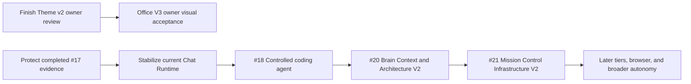

# TOBI Roadmap

This roadmap uses evidence and dependency order rather than a single Jarvis percentage. Awakening Tier 1 is now evidence-based; later Evolution tiers are not yet an authoritative whole-product score.

## Current Baseline

The platform already has persistent memory, backend-enforced Chat/Agent modes, grounded tools, persisted Agent runs and recovery, Deep Research, direct project-resource inventory/read/search, real project/task operations, a full-machine terminal, configurable model routing, Premium readers, fully re-verified Awakening evidence, integrations, MCP/A2A, Performance Doctor, a broad Mission Control UI, scheduled jobs, and Telegram access.

The next phase should turn those systems into one coherent and defensible assistant rather than adding disconnected surfaces.

## Recommended Sequence

### 1. Close active UI work

Finish the owner review for queue #13 before broad changes to Chat, Ability, Office, or shared theme components. Record final status in the queue.

### 2. Stabilize Chat Runtime v2

Queue #16 is delivered: Chat/Agent is a backend capability contract, Terminal is part of Agent, Deep Research is a capability, and project context is automatic. The next work is operational: complete staged runtime-v2 rollout, measure routing/context/tool reliability, retain checkpoint/recovery compatibility, and remove legacy orchestration only after acceptance targets hold.

Do not build a second execution system for queue #18; consume these runtime, tool, approval, trace, and recovery contracts.

### 3. Protect completed Awakening (#17)

Tier 1 is fully re-verified with nine evidence-backed abilities. Preserve the hardened gates: adapter readiness plus fresh successful connector tests, Google OAuth before verified read access, successful workflow receipts, reviewed sensitive memory, fair per-chat sweep cursors, owner-token DB leases, durable deferred retries, and shared persona evidence. Reuse this evidence-contract pattern for later tiers.

### 4. Accept Office V3 (#15)

Office V3 v1 is delivered as a flagged replacement that reuses mission APIs, SSE, Phaser, and Conductor confirmation. Complete owner visual acceptance across desktop/mobile/theme modes before removing the legacy fallback. Future Office work should link Project resources rather than adding an Office upload system.

### 5. Execute the queued Agent -> Brain -> MC sequence

1. **#18 TOBI Coding Agent:** deliver the controlled self-development workflow and establish the coding-worker contracts.
2. **#20 Brain Context & Architecture V2:** build typed, quality-gated owner context and repository-backed Architecture after #18 is accepted.
3. **#21 Mission Control Infrastructure V2:** reconcile #18/#20, then make MC the authoritative durable runtime, policy, tool, context, trace, and shared-state control plane.

Do not implement these three items in parallel. #20 consumes and changes owner-context contracts used by #18, while #21 intentionally consolidates both into shared runtime ownership.

## Platform Hardening Track

These tasks are not represented well by a visual feature queue but are required for reliable growth:

1. Add authentication or a trusted-network boundary to Mission Control; remove reliance on a public URL as the only gate.
2. Replace the default API key fallback in `api/server.py` with a required secure configuration.
3. Split `api/dashboard.py` into domain routers without changing endpoint behavior; continue the frontend API-domain extraction already started.
4. Document and migrate the legacy `projects` model toward Project v2 ownership.
5. Add browser and integration regression coverage for Chat -> runtime -> Conductor -> recovery/confirmation, project resources, vault/integrations, and Agent terminal behavior.
6. Add schema migration/version tracking instead of relying only on scattered `CREATE TABLE` and additive column checks.
7. Define one skills source of truth and extend the Awakening evidence service pattern to later tiers.

## Jarvis Pillars: Next Milestones

| Pillar | Strong foundation | Next milestone |
|---|---|---|
| Understand the owner | Brain, semantic retrieval, lessons, conversations, project resources | Preference/habit learning with review, confidence, provenance, and proactive recall |
| Perform real work | Chat/Agent policy, Conductor tools, persisted runs, Project v2, integrations, MCP, terminal | Controlled coding agent, reusable workflows, then browser automation and desktop control |
| Remain available | Mission Control, Telegram, CLI, scheduler, health/usage | Hardened personal-PC service, event-driven observation, voice, and context-aware alerts |

## Queue Coordination

| Pair | Parallel safety |
|---|---|
| Chat Runtime stabilization + #18 coding agent | Sequential unless #18 only consumes stable runtime contracts; both touch tools, approvals, runs, terminal, and traces |
| #18 coding agent + #20 Brain/Architecture V2 | Sequential by queue contract; both touch Agent context, repository understanding, artifacts, and Architecture |
| #20 Brain/Architecture V2 + #21 MC Infrastructure V2 | Strictly sequential; #21 must reconcile and consume #20's context contracts rather than inventing another memory layer |
| Any of #18/#20/#21 in parallel | Unsafe; shared ownership includes Chat/Agent, Conductor, tools, Brain, Hermes, policy, migrations, traces, and MC frontend state |
| #15 Office V3 + Chat runtime work | Possible with strict Office/frontend ownership and no shared mission/runtime API rewrite |
| Theme v2 owner review + shared Chat/Office UI | High collision risk in tokens, shell, and shared components; assign file ownership |
| Any feature + `api/dashboard.py` decomposition | Unsafe unless domain files and endpoint compatibility are locked first |

## Completion Rules

A roadmap item is complete only when:

- behavior is implemented, not represented only by a label or status badge;
- API and persistent-state contracts are documented;
- security and approval behavior is explicit;
- configuration-dependent states show `setup needed` rather than fake success;
- focused automated tests and a Mission Control smoke path pass;
- queue status and current docs are updated in the same delivery.
