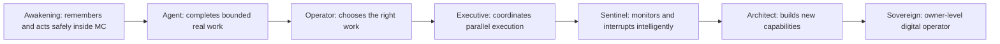
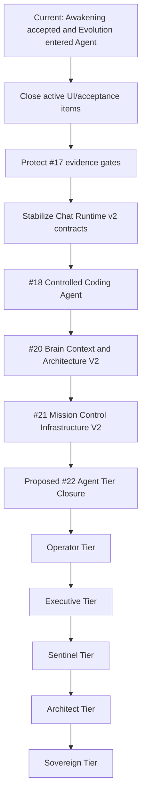
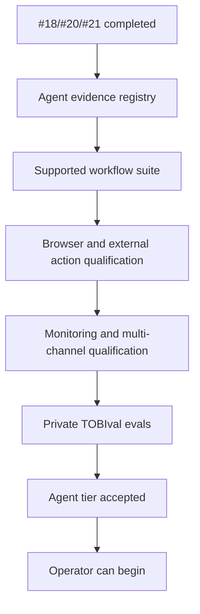
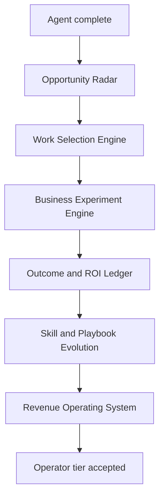

# TOBI Roadmap

This roadmap uses evidence and dependency order rather than a single Jarvis percentage. Awakening Tier 1 is evidence-based. Later Evolution tiers still need the same evidence-gated treatment before they should be treated as authoritative product status.

## Current Baseline

TOBI has moved past the "UI shell" stage. The platform already has persistent memory, backend-enforced Chat/Agent modes, grounded Conductor tools, persisted Agent runs and recovery, Deep Research, direct project-resource inventory/read/search, real project/task operations, full-machine terminal control, configurable model routing, Premium readers, fully re-verified Awakening evidence, integrations, MCP/A2A, Performance Doctor, Mission Control, scheduled jobs, Telegram access, and Office V3.

The next phase is not about adding more disconnected surfaces. The next phase is to make Mission Control the main operating infrastructure: one control plane for tools, policy, memory, runs, approvals, traces, coding workflows, and owner intelligence.

## Strategic Orientation

TOBI's tier progression should be judged by what the system can reliably do, not by optimistic capability labels.

The main distinction:

- **Agent tier** means TOBI can execute supported workflows and reach a verified result or structured recovery.
- **Operator tier** means TOBI can decide which work is worth doing, choose the right pattern, run experiments, measure outcomes, and improve the playbook.

Do not enter Operator just because TOBI has tools. Operator requires judgment, prioritization, and outcome selection.

## Recommended Sequence

### 1. Close active acceptance work

Finish owner review for queue #13 and owner visual acceptance for Office V3 (#15) before broad shared UI rewrites. Record final status in the queue. Office V3 should keep linking Project resources rather than creating a separate Office upload/data system.

### 2. Protect completed Awakening (#17)

Tier 1 is complete because it is evidence-based: real Brain data, successful workflow receipts, connector readiness, fresh connector tests, reviewed sensitive memory, durable sweep behavior, and shared persona evidence. Preserve this pattern. Later tiers must not go back to hardcoded "done" status.

### 3. Stabilize Chat Runtime v2

Queue #16 is delivered: Chat/Agent is a backend capability contract, Terminal is part of Agent, Deep Research is a capability, and project context is automatic. The next work is operational: measure routing/context/tool reliability, keep same-run recovery compatible, and remove legacy orchestration only after acceptance targets hold.

Do not build a second execution system for queue #18. The coding agent should consume existing runtime, tool, approval, trace, action receipt, and recovery contracts.

### 4. Execute the queued Agent -> Brain -> MC sequence

1. **#18 TOBI Coding Agent:** deliver controlled self-development for the MC repository: isolated worktrees, managed Hermes worker, GitHub branch/PR flow, protected merge/deploy approval, rollback, Developer page, audit, releases, and storage controls.
2. **#20 Brain Context & Architecture V2:** turn Brain into a typed, quality-gated owner intelligence layer; add behavior-aware Chat/Agent context, influence traces, reviewable migration, and secure repository-backed Architecture V2.
3. **#21 Mission Control Infrastructure V2:** make MC the authoritative control plane for durable runs, central policy, typed tools, owner intelligence, Hermes adapters, unified traces, shared live state, and recovery.

Do not implement these three items in parallel. #20 consumes and changes owner-context contracts used by #18, while #21 intentionally consolidates #18 and #20 into shared runtime ownership.

## Proposed #22: Agent Tier Closure

After #18, #20, and #21, TOBI should have the infrastructure for Agent tier. That still is not enough to honestly declare Agent tier complete.

Add a follow-up queue item:

**#22 Agent Tier Closure / Evidence Qualification**

Purpose: replace static Agent-tier assumptions with the same evidence-gated standard used for Awakening.

Required proof:

1. **Evidence-based Agent registry:** Agent abilities return `active`, `partial`, `setup_needed`, or `inactive` from real workflow evidence, not hardcoded detectors.
2. **Supported workflow receipts:** at least 3-5 valuable workflows complete with durable run history, action receipts, artifacts, and recovery states.
3. **Browser/external action pack:** deterministic Playwright-first workflows for web inspection, form interaction, screenshots, downloads, and safe publishing where configured.
4. **Monitoring and multi-channel pack:** useful event monitoring plus channel-aware owner notification through configured surfaces.
5. **Private TOBIval eval suite:** golden cases for coding, research, project work, browser work, connector reads, recovery, and hallucination resistance.
6. **Reliability gate:** supported workflows either complete or reach structured recovery; retry/reconnect must not duplicate side effects.

Agent tier is complete only when TOBI can do bounded real work repeatedly and visibly. If it only has infrastructure but no proven workflows, it is still "Agent foundation", not "Agent complete".

## Operator Tier Direction

Operator tier starts after Agent Closure. The goal changes from execution to judgment.

Operator should answer:

- What work is worth doing now?
- Which pattern or playbook should be used?
- What is the expected value, cost, risk, and time?
- What experiment should be run first?
- What result proves the work mattered?
- What did TOBI learn, and how should the playbook improve?

Recommended Operator roadmap:

Operator acceptance gates:

1. TOBI proposes candidate work from project state, market signals, revenue data, owner goals, and unresolved opportunities.
2. TOBI scores work by expected value, evidence, cost, risk, urgency, owner fit, and reversibility.
3. TOBI can run small business experiments end to end with explicit owner approval for external commitments.
4. TOBI tracks outcomes, revenue, effort, and failure reasons.
5. TOBI updates playbooks from verified outcomes, not from vague self-reflection.
6. TOBI can recommend stopping, continuing, or changing strategy based on evidence.

## Later Tiers

| Tier | Product meaning | Primary unlock | Do not start until |
|---|---|---|---|
| **Agent** | Completes bounded digital work | Controlled execution, browser actions, typed memory, durable runtime, evidence registry | #18/#20/#21 plus Agent Closure |
| **Operator** | Chooses valuable work | Opportunity scoring, business experiments, ROI ledger, adaptive playbooks | Agent workflows are reliable |
| **Executive** | Coordinates multiple workstreams | Parallel bounded workers, portfolio scheduler, cross-project resource allocation | Operator can pick and measure work |
| **Sentinel** | Watches and interrupts intelligently | Event-driven monitoring, anomaly detection, context-aware alerts | Executive workflows are stable |
| **Architect** | Builds new capabilities | Self-integration, capability-gap detection, controlled full dev loop | Sentinel can observe system needs safely |
| **Sovereign** | Owner-level digital operator | Mind model, any supported digital task, revenue engine, self-improvement loop | Architect proves safe self-expansion |

Sovereign is not a feature item. It is the cumulative result of reliable memory, reliable action, reliable judgment, safe autonomy, and compounding self-improvement.

## Platform Hardening Track

These tasks are not represented well by a visual feature queue but are required for reliable growth:

1. Add authentication or a trusted-network boundary to Mission Control; remove reliance on a public URL as the only gate.
2. Replace the default API key fallback in `api/server.py` with required secure configuration.
3. Split `api/dashboard.py` into domain routers without changing endpoint behavior; continue the frontend API-domain extraction already started.
4. Document and migrate the legacy `projects` model toward Project v2 ownership.
5. Add browser and integration regression coverage for Chat -> runtime -> Conductor -> recovery/confirmation, project resources, vault/integrations, and Agent terminal behavior.
6. Add schema migration/version tracking instead of relying only on scattered `CREATE TABLE` and additive column checks.
7. Define one skills source of truth across curated Ability metadata, repository skills, Hermes skills, MCP tools, and future Agent-tier capabilities.
8. Extend evidence-based Evolution beyond Awakening.
9. Add unified traces/evals before increasing autonomy.

## Jarvis Pillars: Next Milestones

| Pillar | Strong foundation | Next milestone |
|---|---|---|
| Understand the owner | Brain, semantic retrieval, lessons, conversations, project resources, Awakening evidence | Typed owner intelligence with provenance, confidence, influence chips, feedback, and task-specific retrieval |
| Perform real work | Chat/Agent policy, Conductor tools, persisted runs, Project v2, integrations, MCP, terminal | Controlled coding agent, durable runtime, evidence-qualified workflows, browser automation |
| Remain available | Mission Control, Telegram, CLI, scheduler, health/usage | Event-driven monitoring, multi-channel alerts, context-aware interruption, hardened personal-PC service |
| Choose the right work | CEO loop, projects, tasks, research, performance data | Operator opportunity scoring, business experiments, ROI ledger, playbook evolution |

## Queue Coordination

| Pair | Parallel safety |
|---|---|
| Chat Runtime stabilization + #18 coding agent | Sequential unless #18 only consumes stable runtime contracts; both touch tools, approvals, runs, terminal, and traces |
| #18 coding agent + #20 Brain/Architecture V2 | Sequential by queue contract; both touch Agent context, repository understanding, artifacts, and Architecture |
| #20 Brain/Architecture V2 + #21 MC Infrastructure V2 | Strictly sequential; #21 must reconcile and consume #20's context contracts rather than inventing another memory layer |
| Any of #18/#20/#21 in parallel | Unsafe; shared ownership includes Chat/Agent, Conductor, tools, Brain, Hermes, policy, migrations, traces, and MC frontend state |
| #21 + proposed #22 Agent Closure | Sequential; #22 should validate #21's runtime instead of building a parallel qualification system |
| Proposed #22 + Operator work | Unsafe; Operator needs the Agent evidence results as input |
| #15 Office V3 + Chat runtime work | Possible with strict Office/frontend ownership and no shared mission/runtime API rewrite |
| Theme v2 owner review + shared Chat/Office UI | High collision risk in tokens, shell, and shared components; assign file ownership |
| Any feature + `api/dashboard.py` decomposition | Unsafe unless domain files and endpoint compatibility are locked first |

## Completion Rules

A roadmap item is complete only when:

- behavior is implemented, not represented only by a label or status badge;
- API and persistent-state contracts are documented;
- security and approval behavior is explicit;
- configuration-dependent states show `setup_needed` rather than fake success;
- real workflows produce durable evidence: run history, receipts, artifacts, traces, or eval results;
- focused automated tests and a Mission Control smoke path pass;
- queue status and current docs are updated in the same delivery.

