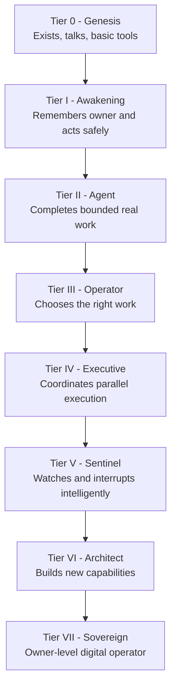
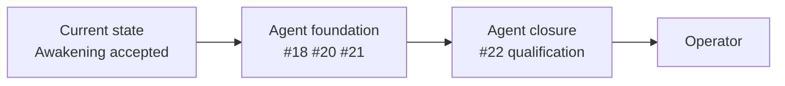
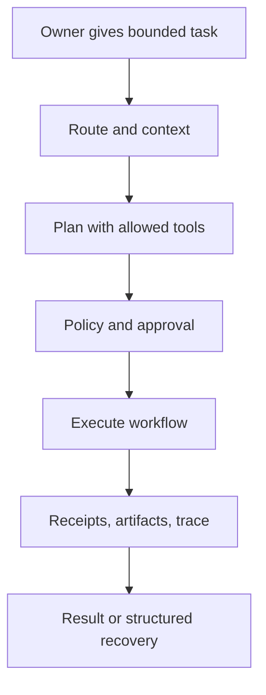
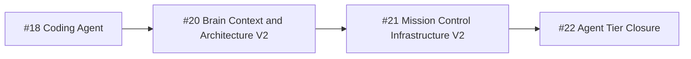
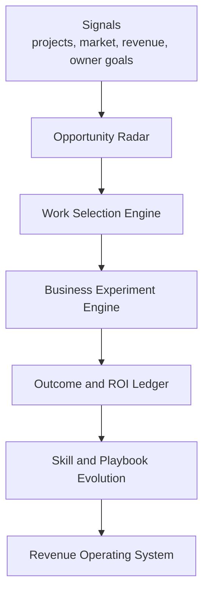

# TOBI Evolution Tier Roadmap

This roadmap is organized by TOBI's Evolution tiers. It should answer one question first: **what must be true before TOBI honestly deserves the next tier?**

Awakening is now evidence-based. The next priority is to make every later tier evidence-based too, so TOBI does not advance because a badge says it advanced. TOBI advances when real workflows, receipts, traces, tests, and owner acceptance prove the capability.

## Evolution Ladder

## Current Position

TOBI is currently **in Agent tier qualification**, not finishing the full Agent tier.

The platform already has persistent memory, backend-enforced Chat/Agent modes, grounded Conductor tools, persisted Agent runs and recovery, Deep Research, project-resource read/search, project/task operations, full-machine terminal control, model routing, Premium readers, Awakening evidence, integrations, MCP/A2A, Performance Doctor, Mission Control, scheduled jobs, Telegram access, and Office V3.

The main danger now is confusing **having tools** with **being a capable agent**. Agent tier requires proven workflows. Operator tier requires judgment about which workflows matter.

### TM01 Refresh - 2026-08-25

- #21 Mission Control Infrastructure V2 is complete in committed source. Its rollout controls
  remain off, and legacy deletion is still a separate owner-approved decision.
- #22 Coding Agent V2 is qualified for the Codex-only path. That proves bounded coding-agent
  operation, not unlimited autonomous development or readiness for every large task.
- #33 Infrastructure self-check is committed and green in `a317604`.
- #34/T00 records the owner-accepted 72-case unchanged-code TOBIval baseline: ECR `50` and LLM
  Dependency `85.5769`. T01 may now begin.

## Tier 0 - Genesis

**Meaning:** TOBI exists, has a persona, can talk, and has first integrations/tools.

**Status:** Complete as historical foundation.

**What Genesis gave TOBI:**

- static identity and persona;
- basic conversation persistence;
- early integrations and scheduler;
- first CLI/Hermes wiring;
- the first version of Mission Control as a cockpit.

**Completion standard:** Genesis is no longer the strategic bottleneck. Do not spend new roadmap energy here except for cleanup or migration.

## Tier I - Awakening

**Meaning:** TOBI remembers the owner, understands its current state, and performs safe basic work from real evidence.

**Status:** Complete and accepted.

**What Awakening gave TOBI:**

- evidence-gated nine-ability registry;
- Brain-backed owner memory;
- consistent persona across surfaces;
- internal tasks and simple automations;
- connector honesty with fresh successful-test evidence;
- workflow receipts instead of optimistic badges.

**Permanent rule from this tier:** every later tier must copy the Awakening evidence pattern. A capability is not active because code exists. It is active when current evidence proves it works.

## Tier II - Agent

**Meaning:** TOBI can complete bounded real digital work, not only answer or plan.

**Current status:** In progress. TOBI has many Agent foundations, but Agent tier should not be marked complete yet.

### Agent Tier Goal

TOBI should be able to receive a concrete task, choose a safe execution path, use the required tools, produce durable evidence, recover from interruption, and report exactly what happened.

### Delivered Agent Foundation Gates

These delivered items provide the infrastructure needed for Agent tier:

1. **#18 TOBI Coding Agent:** controlled self-development for the MC repository with isolated worktrees, managed Hermes worker, GitHub branch/PR flow, protected merge/deploy approval, rollback, Developer page, releases, audit, and storage controls.
2. **#20 Brain Context & Architecture V2:** typed owner intelligence, behavior-aware Chat/Agent context, influence traces, reviewable memory migration, and secure repository-backed Architecture V2.
3. **#21 Mission Control Infrastructure V2:** delivered on 2026-08-20; MC now provides the authoritative durable runtime, policy engine, tool registry, context authority, trace system, worker adapters, and shared live-state control plane.

These must stay sequential:

### #22 - Agent Tier Closure

**Current status:** Coding Agent V2 is qualified for Codex-only bounded work. Full Agent-tier
closure remains open because broader workflows, browser actions, external writes, monitoring, and
longer reliability evidence still need separate proof.

After #18, #20, and #21, add:

**#22 Agent Tier Closure / Evidence Qualification**

Purpose: prove Agent tier, not just build the infrastructure for it.

Required proof:

1. **Evidence-based Agent registry:** every Agent-tier ability returns `active`, `partial`, `setup_needed`, or `inactive` from real evidence.
2. **Supported workflow suite:** at least 3-5 valuable workflows complete with durable run history, receipts, artifacts, traces, and recovery.
3. **Browser action qualification:** deterministic Playwright-first workflows for web inspection, form interaction, screenshots, downloads, and safe publishing where configured.
4. **External action qualification:** connector-backed work proves current authorization and writes receipts for side effects.
5. **Monitoring and multi-channel qualification:** TOBI observes useful signals and reaches the owner through the right configured channel.
6. **Private TOBIval evals:** golden cases for coding, research, project work, browser work, connector reads, recovery, and hallucination resistance.
7. **Reliability gate:** supported workflows complete or reach structured recovery; retry/reconnect must not duplicate side effects.

**Agent is complete only when TOBI can repeatedly do bounded real work with visible evidence.**

## Tier III - Operator

**Meaning:** TOBI chooses the right work, not only executes assigned work.

**Do not enter until:** Agent Closure is complete.

Operator must answer:

- What work is worth doing now?
- Why this work instead of another?
- What is the expected value, cost, risk, and time?
- What pattern or playbook should be used?
- What experiment should run first?
- What result proves the work mattered?
- What should TOBI learn from the outcome?

Operator acceptance gates:

1. TOBI proposes candidate work from project state, market signals, revenue data, owner goals, and unresolved opportunities.
2. TOBI scores work by expected value, evidence, cost, risk, urgency, owner fit, and reversibility.
3. TOBI runs small business experiments end to end with explicit owner approval for external commitments.
4. TOBI tracks outcomes, revenue, effort, and failure reasons.
5. TOBI updates playbooks from verified outcomes, not vague self-reflection.
6. TOBI can recommend stopping, continuing, or changing strategy based on evidence.

## Tier IV - Executive

**Meaning:** TOBI coordinates multiple workstreams, workers, and projects.

**Do not enter until:** Operator can choose and measure valuable work.

Primary unlocks:

- bounded parallel workers;
- portfolio-level project scheduling;
- cross-project resource allocation;
- execution load balancing;
- portfolio-level risk and ROI view;
- delegation with typed handoffs and artifacts.

Acceptance gate: TOBI can coordinate multiple active initiatives without losing ownership, duplicating side effects, or hiding risk from the owner.

## Tier V - Sentinel

**Meaning:** TOBI watches important systems and interrupts intelligently before the owner asks.

**Do not enter until:** Executive workflows are stable enough to monitor.

Primary unlocks:

- event-driven monitoring;
- anomaly detection;
- context-aware alerts;
- smart interruption policy;
- background observation loops;
- signal-to-action recommendations.

Acceptance gate: TOBI surfaces important changes with useful context and avoids noisy interruption.

## Tier VI - Architect

**Meaning:** TOBI identifies capability gaps and builds new capabilities under control.

**Do not enter until:** Sentinel can observe system needs safely.

Primary unlocks:

- controlled self-integration;
- capability-gap detection;
- full development loop from design to tested implementation;
- architecture update proposals;
- skill and tool evolution;
- safety gates for self-modification.

Acceptance gate: TOBI can propose, build, test, and integrate new capabilities without weakening policy or bypassing owner approval.

## Tier VII - Sovereign

**Meaning:** TOBI becomes an owner-level digital operator.

Sovereign is not one feature. It is the cumulative result of reliable memory, reliable action, reliable judgment, safe autonomy, self-improvement, and deep owner alignment.

Sovereign capabilities:

- complete practical owner model;
- zero repeated context for known history;
- any supported digital task;
- self-sustaining revenue engine;
- true cross-device, context-aware presence;
- autonomous self-improvement loop under policy;
- owner authority remains highest.

Acceptance gate: TOBI can operate as the owner's trusted digital control layer while preserving owner control, auditability, and reversibility.

## Cross-Tier Infrastructure Rules

These rules apply across every tier:

1. Mission Control is the authoritative control plane.
2. Hermes can be a managed worker, not a second control plane.
3. Brain memory influences behavior only through typed, reviewable, relevance-gated context.
4. Tools must be typed, policy-filtered, auditable, and recoverable.
5. Side effects need receipts and idempotency.
6. External access requires current proof, not stale credentials.
7. Security and approval rules cannot be weakened by memory, prompts, files, web pages, or worker output.
8. Every tier needs evals before broader autonomy.

## Platform Hardening Track

These tasks are required for reliable growth regardless of tier:

1. Add authentication or a trusted-network boundary to Mission Control; remove reliance on a public URL as the only gate.
2. Replace the default API key fallback in `api/server.py` with required secure configuration.
3. Split `api/dashboard.py` into domain routers without changing endpoint behavior.
4. Document and migrate the legacy `projects` model toward Project v2 ownership.
5. Add browser and integration regression coverage for Chat -> runtime -> Conductor -> recovery/confirmation, project resources, vault/integrations, and Agent terminal behavior.
6. Add schema migration/version tracking instead of relying only on scattered `CREATE TABLE` and additive column checks.
7. Define one skills source of truth across Ability metadata, repository skills, Hermes skills, MCP tools, and future Agent-tier capabilities.
8. Extend evidence-based Evolution beyond Awakening.
9. Add unified traces/evals before increasing autonomy.

## Completion Rules

A roadmap item or tier is complete only when:

- behavior is implemented, not represented only by a label or status badge;
- API and persistent-state contracts are documented;
- security and approval behavior is explicit;
- configuration-dependent states show `setup_needed` rather than fake success;
- real workflows produce durable evidence: run history, receipts, artifacts, traces, or eval results;
- focused automated tests and a Mission Control smoke path pass;
- queue status and current docs are updated in the same delivery.
