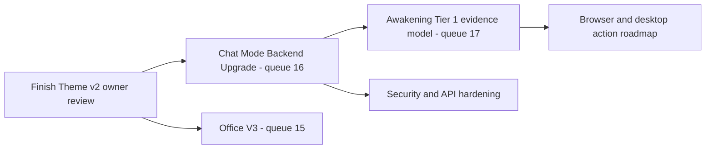

# TOBI Roadmap

This roadmap uses evidence and dependency order rather than a single Jarvis percentage. The current Evolution percentage is based on an outdated detector and must not be used as the delivery score.

## Current Baseline

The platform already has persistent memory, grounded conversational tools, real project/task operations, a full-machine terminal, configurable model routing, Premium readers, a read-only Hermes skill dashboard, integrations, MCP/A2A, a broad Mission Control UI, scheduled jobs, and Telegram access.

The next phase should turn those systems into one coherent and defensible assistant rather than adding disconnected surfaces.

## Recommended Sequence

### 1. Close active UI work

Finish the owner review for queue #13 before broad changes to Chat, Ability, Office, or shared theme components. Record final status in the queue.

### 2. Centralize Chat modes (#16)

Replace frontend-only mode labels with a backend mode and capability contract. Keep Chat as the default, make Agent the execution surface, merge Terminal into Agent, move Deep Research to a capability toggle, and inject project context automatically.

This should become the policy layer used by the Conductor, terminal, tools, approvals, message metadata, and UI.

### 3. Make Awakening evidence-based (#17)

After mode/tool contracts stabilize, replace the stale Tier 1 registry with nine evidence-backed abilities. Evolution and Ability should read the same status service. `partial` and `setup_needed` must remain distinct from `active`.

### 4. Upgrade Office independently (#15)

Office V3 can proceed after Theme v2 settles if its worker owns Office-specific frontend files and does not rewrite shared agent/mission contracts. It must continue using the existing mission APIs, event stream, and Conductor rather than creating a parallel backend.

## Platform Hardening Track

These tasks are not represented well by a visual feature queue but are required for reliable growth:

1. Add authentication or a trusted-network boundary to Mission Control; remove reliance on a public URL as the only gate.
2. Replace the default API key fallback in `api/server.py` with a required secure configuration.
3. Split `api/dashboard.py` into domain routers without changing endpoint behavior.
4. Document and migrate the legacy `projects` model toward Project v2 ownership.
5. Add API and browser regression coverage for Chat -> Conductor -> action confirmation, project resources, vault/integrations, and terminal mode.
6. Add schema migration/version tracking instead of relying only on scattered `CREATE TABLE` and additive column checks.
7. Define one skills source of truth and one evolution evidence service.

## Jarvis Pillars: Next Milestones

| Pillar | Strong foundation | Next milestone |
|---|---|---|
| Understand the owner | Brain, semantic retrieval, lessons, conversations, project resources | Preference/habit learning with review, confidence, provenance, and proactive recall |
| Perform real work | Conductor tools, Project v2, integrations, MCP, terminal | Central mode policy, reusable workflows, then browser automation and desktop control |
| Remain available | Mission Control, Telegram, CLI, scheduler, health/usage | Hardened personal-PC service, event-driven observation, voice, and context-aware alerts |

## Queue Coordination

| Pair | Parallel safety |
|---|---|
| Premium Ability follow-ups + #16 Chat modes | Unsafe if both change Chat streaming, readers, attachments, model selection, or tool behavior |
| #16 Chat modes + #17 Awakening | Sequential; Awakening evidence should consume the new mode/capability contract |
| #15 Office V3 + #16 Chat modes | Possible only with strict frontend file ownership and no shared agent/mission API rewrite |
| Any feature + API decomposition | Unsafe unless domain files and endpoint compatibility are locked first |

## Completion Rules

A roadmap item is complete only when:

- behavior is implemented, not represented only by a label or status badge;
- API and persistent-state contracts are documented;
- security and approval behavior is explicit;
- configuration-dependent states show `setup needed` rather than fake success;
- focused automated tests and a Mission Control smoke path pass;
- queue status and current docs are updated in the same delivery.
