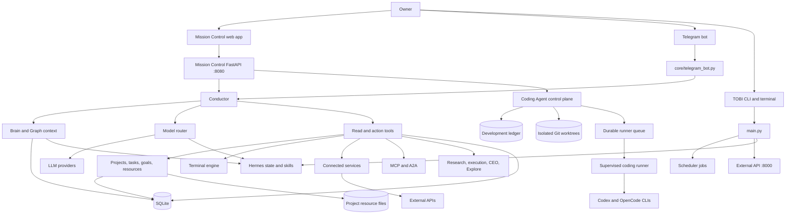
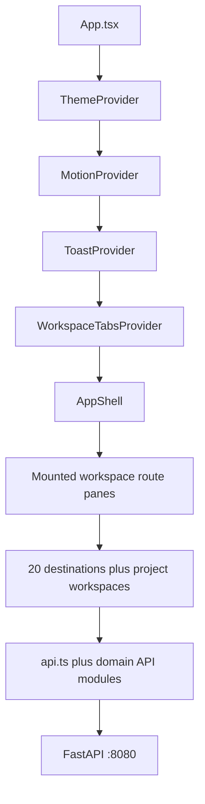
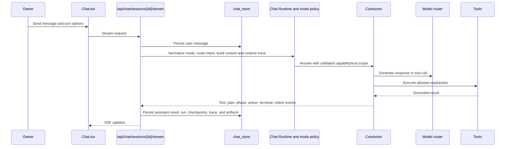

# TOBI Architecture

> Current architecture snapshot: 2026-07-16. Code and tests remain authoritative. Configuration-dependent external services were not called during this update.

## System Context

## Runtime Topology

`main.py` is the primary process entry point.

| Command | Behavior |
|---|---|
| `start` | Initializes data, syncs persona/skills, handles vault startup, launches both APIs, Telegram polling, and scheduler |
| `api` | Launches port 8000 and 8080 services without the Telegram/scheduler daemon loop |
| `bot` | Runs Telegram polling only |
| `research` | Runs a research cycle and can send proposals through Telegram |
| `execute` | Runs the business project executor |
| `ceo` | Runs the portfolio review and notification path |
| `status` | Prints database-backed status |
| `test` | Runs configured connection checks; may contact external services |
| `terminal` | Starts the interactive Conductor/terminal REPL |
| `hermes` | Passes remaining arguments to the Hermes executable and logs the invocation |

In `start` mode, the process launches:

- `api.server:app` on `API_PORT` (default 8000);
- `api.dashboard:app` on `DASHBOARD_PORT` (default 8080);
- Telegram polling;
- the `schedule` loop;
- a Codespaces-only helper that attempts to publish the dashboard port.

The Coding Agent goal loop runs with the application lifecycle. External Codex/OpenCode work can run locally for development or through `core.coding_runner_service` as a separate systemd-supervised process. Service mode communicates through durable SQLite jobs/events and encrypted profile-specific credential envelopes; it does not execute external CLIs inside FastAPI.

The scheduler currently registers daily reports, six-hour execution, two-minute task reminders, weekly research/reflection, Brain sweep/decay, Graph sync, Storage scans, Explore refresh jobs, and a first-of-month CEO review.

## Backend Subsystems

| Subsystem | Primary files | Responsibility | Current notes |
|---|---|---|---|
| Process orchestration | `main.py` | Startup, services, Telegram, scheduled jobs, CLI commands | One process coordinates several threads and async loops |
| Mission Control API | `api/dashboard.py` | UI APIs, SSE, static React host, MCP mount | 6,536 lines and 259 route handlers; largest change-collision point |
| External/legacy API | `api/server.py` | Small API-key-protected project/task/revenue API | Separate contract and default-key risk |
| Conductor | `core/conductor.py` | Conversation routing, grounded tool loop, permissions, confirmations, action log | Shared by MC Chat and significant Telegram paths; now exposes direct project-resource inventory/read/search and safe-read route widening |
| Chat mode/runtime | `core/chat_modes.py`, `chat_runtime.py`, `chat_runtime_contracts.py`, `tool_registry.py` | Normalization, capability boundaries, intent routing, typed tools, telemetry, recovery contracts | Runtime v2 is flag-controlled; route scopes focus tool choice, while mode denial and risk policy remain authoritative |
| MC Runtime V2 foundation | `core/runtime/contracts.py`, `event_store.py`, `projections.py`, `rebuild.py` | Shared validated contracts, append-only ordered events, redaction, and deterministic current-state rebuilds | Dormant through T02; no live surface writes or executes through it yet |
| Agent runs/artifacts | `core/agent_runs.py`, `core/chat_store.py` | Persisted runs, checkpoints, recovery commands, action links, artifacts, message metadata | Exact action checkpoints and elapsed time survive reload; run commands resume the original run |
| Coding Agent control plane | `core/coding_agent.py`, `coding_loop.py`, `coding_contracts.py`, `coding_assessment.py`, `coding_quality.py`, `coding_learning.py` | Goal assessment, bounded sprints, worktree workflow, checkpoints, quality gates, independent review, and evidence-backed learning | Explicit worker/reviewer profiles; high-risk scopes require owner approval; worker changes occur only at checkpoints |
| Coding workers and runner | `core/coding_workers.py`, `coding_runner.py`, `coding_runner_service.py` | MC Native/Codex/OpenCode adapters, native-session resume, process isolation, durable service queue, output events, cancellation, and runner health | Production service uses a separate systemd process and encrypted one-secret job envelopes |
| Deep Research/network guard | `core/deep_research.py`, `core/net_guard.py` | Research planning, source fetch/synthesis, source fencing, SSRF protection | Per-turn capability, not a main Chat mode |
| Model router | `core/model_router.py` | Provider catalog, fallback, streaming, vision, usage logging | Nine provider types/config entries including local/custom |
| Chat persistence | `core/chat_store.py` | Sessions, messages, forking, compaction, and cross-session message search | Premium Chat and bridged conversation history can be searched for episodic recall |
| Attachments/readers | `core/attachments.py`, `premium_readers.py`, `youtube_reader.py`, `model_capabilities.py` | Text/PDF extraction, YouTube transcript context, image routing, capability checks | Context caps, up to four images, two YouTube URLs, optional transcript dependency, rollback flag |
| Brain | `core/brain.py`, `core/embeddings.py` | Durable owner memory, retrieval, review, conflict/version handling | Fastembed optional; keyword fallback; sweeps use per-chat cursors, an owner-bound DB lease, and durable deferred retries |
| Awakening | `core/awakening.py` | Nine evidence-gated Tier-1 abilities and setup/evidence output | Uses active Brain memories, fresh connector-test evidence, tool contracts, and successful workflow receipts |
| Knowledge graph | `core/graph_engine.py` | Graph sync, edges, search, retrieval, communities, layout | Includes internal records and supported external mirrors |
| Project management | `core/database.py`, `core/pm_resources.py`, `core/pm_reminders.py` | Project v2 data, files/links, extraction/RAG, reminders | Coexists with legacy business project tables; resource inventory/read/search is available to Conductor |
| Terminal | `core/terminal_engine.py` | Risk classification, approval modes, command execution, jobs, package/tool registry | Full-machine shell with hard denylist and kill-switch |
| Vault | `core/vault.py` | Encrypted secrets, profiles, sessions, auto-unlock, audit | Sensitive API operations use a vault-session header |
| Integrations | `core/integrations.py`, `core/integrations_registry.py` | Notion, GitHub, Google, Vercel, Supabase capability checks and adapters | Connection state is configuration-dependent |
| MCP/A2A | `core/mcp_server.py`, `mcp_client.py`, `mcp_security.py`, `mcp_tunnel.py`, `a2a.py` | Inbound/outbound agent tooling and policy | MCP mount has its own auth, scopes, rate limits, approvals, and logs |
| Office V3/missions | `core/office.py`, `core/office_stream.py`, `core/office_artifacts.py` | Agent/workflow execution, streamed mission state, local artifacts/activity, confirmed Office actions | Flagged V3 React shell reuses Phaser/SSE; legacy Office remains a zero-data-loss fallback |
| Business engines | `core/research_engine.py`, `project_executor.py`, `ceo_loop.py` | Niche research, task execution, portfolio review | Legacy but active capability |
| Explore | `core/explore.py` | News/models/tools/social collection and digest | Scheduler-backed and source-configurable |
| Storage/usage | `core/storage_scan.py`, `usage.py`, `usage_meter.py` | Storage attribution, LLM usage/cost, plans, budgets | Writes feature snapshots and usage records |
| Performance Doctor | `core/performance_doctor.py` | Graphify-assisted architecture/performance scoring, findings, trends, task creation | Quick mode is deterministic; Deep mode adds bounded model synthesis |
| Hermes bridge | `main.py`, `core/hermes_sync.py`, `core/hermes_skills.py`, Brain mirror paths | Persona/skill sync, read-only repository skill metadata, memory mirror, model-routing push | Multiple one-way paths, not a unified state owner |

## Frontend Architecture

Mission Control is a React 18 + TypeScript + Vite application under `dashboard/src/`.

Key ownership:

- `App.tsx` defines route composition and lazy-loading boundaries.
- `AppShell.tsx` owns sidebar, global header, tab strip, mobile navigation, and system menu.
- `WorkspaceTabsContext.tsx` owns the five-tab model, persistence, focus/close/reorder, and dynamic project tab identity.
- `api.ts` remains the compatibility barrel/common client; larger domains are being split into `api.tasks.ts`, `api.pm.ts`, `api.brain.ts`, `api.abilities.ts`, `api.office.ts`, and `api.performance.ts` over shared `apiCore.ts`.
- `ThemeProvider`, `themeTokens.ts`, and `index.css` own the token-driven theme system.
- `MotionProvider` and `components/motion/` own global motion levels and primitives.
- Page components own domain presentation; project subviews are split under `components/project/`.

Heavy Graph, Office, Storage, News, and Project workspace code is lazy-loaded to reduce the main bundle.

## Primary Data Flows

### Mission Control Chat

Current turn options include Chat/Agent mode, Deep Research, attachments, premium-reader context, web search, review policy, connectors, and automatic project context. Mode is a backend contract: Chat cannot invoke terminal tools, while Agent owns tool and terminal execution. Legacy mode values are normalized for saved-conversation compatibility. Agent runs persist steps and recovery state; completed process traces are expandable after reload.

Runtime route scopes are optimization hints, not security permissions. A known read-only tool may be admitted during a turn when deterministic routing was too narrow; unknown or acting tools remain denied outside the route scope, and Chat mode/terminal denial plus action-risk approval are still enforced server-side. The Chat gateway no longer turns a direct-route empty prediction into an explicit empty allowlist.

### Conductor Action

1. The model selects a registered tool and arguments.
2. Read tools execute and return live data.
3. Ordinary act tools use static low/medium/high risk metadata.
4. Terminal commands use `terminal_engine.gate()` and its Plan/Ask/Accept/Auto policy.
5. Required approvals return a pending action to Chat or Telegram.
6. Approval executes the saved action; rejection closes it without mutation.
7. Proposals, execution, failures, and rejection are recorded in `tobi_actions`.

### Project Resource

1. Metadata is stored in `pm_resources` and folders in `pm_folders`.
2. Uploaded files are written below `<DB directory>/projects/{project_id}/resources/` with traversal checks and a size limit.
3. Supported text/PDF/document/link content is extracted and chunked.
4. Embeddings use fastembed when available, with keyword fallback.
5. Resource chunks support project search and Conductor grounding.
6. Resource records are synchronized into the knowledge graph and Storage accounting.
7. Conductor can list a project's resource inventory, read one extracted-text resource by fuzzy name or ID, or search resource chunks. Returned resource text is explicitly marked untrusted; binary resources return metadata rather than fabricated text.

### Integration Secret

1. The owner unlocks the Genesis vault in Mission Control.
2. Secrets are encrypted at rest by `core/vault.py` and selected values are injected into process environment memory.
3. `integrations_registry` maps credentials to adapters and distinguishes setup success from verified read access.
4. Explicit connection tests write `test_status` and `last_tested_at`; credential rotation or import resets stale proof to `untested`.
5. Awakening counts External Read only when the adapter is ready and the successful-test evidence is fresh (24-hour default). Google also requires completed OAuth.
6. List/status APIs return metadata, not secret values. Reveal requires the stronger vault flow.

## Persistence Model

Tables are created across the central schema and feature-local additive initializers. They fall into these ownership families:

| Family | Representative tables |
|---|---|
| Legacy business | `projects`, `tasks`, `revenue`, `lessons`, `strategy`, `reports`, `conversations` |
| Task workflow | `task_activity`, `task_owner_inputs` |
| Ability/Office | `skills`, `skill_metrics`, `skill_versions`, `skill_proposals`, `agents`, `missions`, `mission_steps`, `workflows`, `office_artifacts`, `office_activity`, `office_pending_payloads` |
| Project v2 | `pm_projects`, `pm_goals`, `pm_resources`, `pm_resource_chunks`, `pm_folders`, `pm_task_deps`, `pm_goal_tasks`, `pm_activity` |
| Brain/Graph | `brain_*`, including `brain_sweep_cursors`, `brain_sweep_lease`, and `brain_sweep_failures`; `graph_*` |
| Chat/actions/terminal | `chat_sessions`, `chat_messages`, `chat_artifacts`, `chat_turns`, `chat_turn_events`, `agent_runs`, `agent_run_steps`, `agent_run_actions`, `tobi_actions`, `terminal_jobs`, `installed_tools` |
| Vault/integrations | `vault_*`, `owner_settings` |
| MCP/A2A | `mcp_*`, `a2a_agents` |
| Explore/analytics | `explore_*`, `storage_snapshots`, `llm_usage`, `llm_prices`, `llm_plans`, `usage_budget` |
| Evolution/performance | `evolution_snapshots`, `performance_snapshots` |
| Developer/Coding Agent | `development_*`, `coding_sessions`, `coding_stages`, `coding_worker_*`, `coding_checkpoints`, `coding_assessments`, `development_sprints`, `coding_runner_*`, `coding_learning_records`, `coding_playbooks`, releases and deployments |
| MC Runtime V2 | `mc_run_events`, `mc_change_events`, `mc_runtime_projections`, `mc_system_entities`, `mc_system_edges` |

Schema initialization is additive. `core/database.py` creates the main families; several feature modules create their own tables lazily. Chat Runtime and MC Runtime V2 record scoped versions in `schema_migrations`, but there is no repository-wide migration authority covering every subsystem. Runtime V2 event tables reject updates and deletes at the database layer; current-state rows are derived and may be deleted then rebuilt from history.

## Provider and Integration Boundaries

### LLM providers

The router catalog currently includes Anthropic, GLM/Z.ai, OpenAI, OpenRouter, Gemini, Grok, Codex, Ollama, and custom OpenAI-compatible endpoints. Model selection follows explicit model -> task override -> default -> legacy environment fallback, then configured fallback behavior.

Every claim about actual model availability depends on current keys/tokens and provider configuration.

### Connected services

| Adapter | Implemented code paths |
|---|---|
| Notion | Test, search/read page content, create page, append content |
| GitHub | Test, repositories, files/tree/branches/readme, issues, commits, pulls, issue creation |
| Google | OAuth, token refresh/revoke, Drive list/read/download/export, Gmail list/read, Calendar list |
| Vercel | Test and deployment reads |
| Supabase | Test, table query, row insert |

The docs do not assert that any adapter is connected. Mission Control status and an explicit owner-triggered test are the evidence sources.

## Security Boundaries

Implemented controls:

- encrypted vault values with audit and session-gated sensitive operations;
- MCP bearer/OAuth scopes, rate limiting, tool permissions, approvals, and call logs;
- Conductor action risk tiers and confirmation records;
- Terminal hard denylist, mode/risk matrix, kill-switch, timeouts, output limits, and secret redaction;
- project resource path traversal checks and file-size constraints;
- DNS-pinned outbound URL validation, redirect revalidation, private/metadata-address denial, and response-size limits for Deep Research and readable-link ingestion;
- source/transcript fencing that labels web and premium-reader content as untrusted model evidence;
- server-side mode and review-policy enforcement before tool invocation;
- API-key dependency on the smaller port-8000 API.

Material limitations:

- most Mission Control APIs on port 8080 have no general user authentication;
- CORS is configured with wildcard origins on both FastAPI apps;
- `api/server.py` has a default fallback API key if none is configured;
- Codespaces startup can publish the dashboard port publicly;
- external web/project content can reach model context and must be treated as untrusted;
- integration behavior is not isolated in a separate worker or sandbox;
- terminal safety is policy-based, not OS-level containment.

## Architectural Debt and Change Hazards

1. `api/dashboard.py` combines static hosting, request models, domain logic, SSE, and hundreds of routes.
2. Legacy business projects and Project v2 coexist and share parts of `tasks`.
3. Chat Runtime v2 coexists with legacy Conductor behavior behind rollback flags; ownership is improved but not fully decomposed.
4. Tier-1 Evolution is evidence-based, while later tiers still use legacy capability definitions.
5. Ability metadata, repository skills, and Hermes skills do not have one proven source of truth.
6. Hermes integration is distributed across startup, Brain, and model routing.
7. The dashboard and external API have different security models and overlapping concepts.
8. Fifteen focused scripts now cover critical Chat, security, Awakening, project-resource, Office, terminal, storage, readers, and performance paths, but broad browser/integration coverage remains limited.
9. The generated Graphify index is 85 commits behind this snapshot and must be refreshed before using exact graph claims.

These are current facts, not instructions to refactor them during unrelated feature work. Preserve endpoint and data compatibility unless a dedicated migration plan explicitly owns the change.
