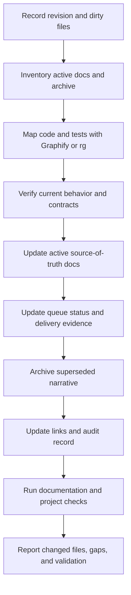

# UPDATE DOCS TM01

## Purpose

`UPDATE DOCS TM01` is TOBI's agent-neutral documentation refresh protocol. Any
agent can run it: Codex, Claude Code, OpenCode, Cursor, DeepSeek, or another
worker. It refreshes the repository documentation so a new agent can understand
the current system without trusting stale plans or old handover notes.

`TM01` is the protocol name, not a queue item and not a code version.

## Trigger

Run this protocol when the owner says:

- `UPDATE DOCS TM01`
- `Do the UPDATE DOCS TM01`
- `Update all TOBI docs using TM01`

Treat a casual request to update one named document as a narrow edit, not a
full TM01 refresh. If the owner says only “update docs” and the intended scope
is unclear, ask whether they mean the full TM01 refresh before moving files.

## Authority Order

When sources disagree, use this order and update lower sources to match:

1. Executable code, database/schema definitions, and passing tests.
2. Current documents indexed by [`README.md`](README.md).
3. [`feature-idea-queue/QUEUE.md`](feature-idea-queue/QUEUE.md) and its delivery log.
4. Feature plans and handover documents, which preserve intent and history.
5. [`archive/`](archive/), which is historical only.

Never make code look consistent with a stale document. Record the code/docs
drift as an unresolved gap and create a follow-up task when code is wrong.

## Scope And Exclusions

### Include

Inventory tracked documentation across the `tobi` checkout, including:

- root `README.md`, `CLAUDE.md`, setup and operations guides;
- `docs/` current references, architecture diagrams/guides, security notes,
  acceptance notes, queue files, feature plans, and handovers;
- documented API routes, schemas, commands, tests, integrations, policies,
  runtime states, and user-facing workflows.

### Exclude by default

Do not read or rewrite these as canonical documentation:

- `.git/`, `.tobi/`, `.hermes/`, `venv/`, `node_modules/`, build output,
  caches, logs, generated Graphify files, screenshots, and attachments;
- `SOUL.md`, `hermes_skills/`, and agent skill instructions, because they are
  runtime or policy inputs rather than ordinary docs;
- original feature-plan bodies, unless the owner explicitly asks to revise the
  plan itself.

Preserve unrelated dirty worktree changes. Never use reset, checkout, or a
bulk overwrite to make the documentation pass look clean.

## Graphify-First Navigation

1. Record the current Git revision and worktree status.
2. Check `graphify-out/` freshness against the current revision. Use Graphify
   queries/path output when available to locate routes, services, schemas,
   tests, and UI surfaces.
3. Treat Graphify as a map, never as proof. If it is missing, stale, or the
   command is unavailable, use `rg --files` and targeted source/test reads.
4. Verify every important claim against current code and tests before writing
   it into an active document.

## TM01 Workflow



### A. Establish the baseline

Record:

- checkout path, branch, `HEAD`, and whether `HEAD` matches the remote;
- dirty files before the refresh;
- `.claude/CURRENT_WORK.md` purpose, non-goals, and gate;
- the date of this refresh and the agent performing it.

Do not claim a clean worktree if unrelated changes already exist.

### B. Read the current system map

Read in this order:

1. `docs/README.md`
2. `docs/02_CURRENT_STATE.md`
3. `docs/ARCHITECTURE.md`
4. `docs/MISSION_CONTROL.md`
5. `docs/RUNTIME_V2.md`
6. `docs/DEVELOPMENT.md`
7. `docs/03_ROADMAP.md`
8. `docs/feature-idea-queue/QUEUE.md`

Then inspect only the code, schema, routes, UI components, tests, and commits
needed to verify claims in those documents. Follow linked domain documents as
needed; do not dump the entire repository into the model context.

### C. Update active documents

Update a document when code or tests changed its:

- user-visible capability or route;
- API, schema, persistence owner, or event contract;
- security, permission, approval, or integration boundary;
- local setup, command, test, migration, or deployment behavior;
- known limitation, metric, queue dependency, or rollout state.

Every changed current-state document must state its verification date. Use
plain language, exact paths, exact commands, and honest `setup_needed`,
`partial`, `blocked`, or `not verified` labels. Never turn code presence into a
claim that an integration works.

### D. Update the queue and delivery record

- Update `QUEUE.md` only when current code, tests, and owner acceptance prove a
  status change.
- Update `QUEUE_DELIVERY_LOG.md` with the evidence, commit, verification, and
  unresolved limitations when a delivered item changes.
- Preserve the original plan body and its historical decisions.
- Keep dependency and parallel-work warnings accurate.
- Never mark work complete because a plan exists or because a UI label exists.

### E. Archive safely

Move a document to `docs/archive/<category>/` only when it is superseded,
duplicated, historical-only, or actively misleading. Before moving it:

1. Confirm that current docs contain the useful replacement.
2. Search the repository for links and references.
3. Update links or leave a short redirect when a stable old path matters.
4. Preserve the original content and add the old path, new path, date, and
   reason to `DOCUMENTATION_AUDIT.md` and the archive map.

Do not delete a document merely because it is old. Delete only an exact
duplicate when the audit records what was preserved and where.

Never archive original feature plans, acceptance evidence, or handovers just
because implementation changed. Archive them only when their historical role
is clear and the current source-of-truth replacement is linked.

## Required Checks

Run checks appropriate to the changed scope:

```powershell
Set-Location -LiteralPath 'D:\[PERSONAL PROJECT FILES]\TOBI\tobi'
git diff --check
python scripts/gate.py
```

Also verify, when available:

- changed links and paths resolve;
- no secret, token, vault value, or private payload entered a document;
- every active document moved or changed is listed in the audit;
- no archived document is linked as current authority;
- a changed UI/API claim still has its focused test or browser evidence;
- the worktree changes are limited to the requested docs and deliberate
  archive moves.

If the active gate cannot run because of the environment, report the exact
command and blocker. Do not weaken the gate or call the refresh complete.

## Completion Standard

TM01 is complete only when:

- the current docs describe the code and tests as they exist now;
- `docs/README.md` lists every active source-of-truth document;
- stale active duplicates are archived or explicitly marked historical;
- queue status, delivery evidence, and dependency notes agree;
- `DOCUMENTATION_AUDIT.md` records changed and archived files;
- validation results and unresolved code/docs gaps are reported;
- unrelated user or agent changes remain untouched.

## Agent Handoff Format

Every agent running TM01 must report:

| Field | Required content |
|---|---|
| Scope | Full checkout or explicitly narrowed scope |
| Evidence date | Date and revision inspected |
| Updated | Active documents changed and why |
| Archived | Old path, new path, and reason; `none` if none |
| Queue | Rows changed and evidence; `unchanged` if none |
| Gaps | Code/docs mismatches that need a separate implementation task |
| Checks | Exact commands and pass/fail/blocker result |
| Git | Commit/push status; never claim either without evidence |

The agent must end with a short owner decision: what the owner can do next and
what remains blocked.

## Safety Rules

- Do not interact with Supabase or Vercel.
- Do not expose secrets or copy raw private payloads into docs.
- Do not modify source code during a docs-only TM01 run unless the owner
  explicitly expands the scope.
- Do not let a feature plan override current code and passing tests.
- Do not run unrelated migrations, production actions, or broad installers.
- Do not commit or push unrelated dirty worktree changes.
