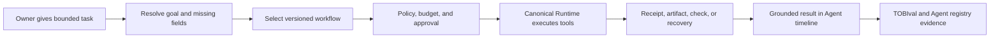

# TOBI Agent Tier Completion

`UPG-CORE-8D32H-012` | Queue item #35 | Owner-approved plan | In progress - T02A implemented

## Delivery Status

- T00: owner accepted the exact production-revision baseline on 2026-08-30. Acceptance is stored
  separately and is valid only while the baseline artifact hash, dataset hash, and production commit match.
- T01: delivered on 2026-08-31. One persisted seven-ability registry now owns Tier II completion;
  Evolution shows its bounded evidence, freshness, missing proof, and next action.
- T02: delivered on 2026-09-01. Qualified Agent requests now complete Project execution, local
  file/Terminal diagnosis, and Coding-status checks through canonical Runtime. Missing fields clarify;
  accepted requests replay durably; mutations use the existing owner confirmation card and receipts.
- Current Tier II result remains evidence-derived. T02 code does not grant a percentage by itself;
  successful live workflows record bounded current-release proof for `local_work_execution`.
- Verification: T02 focused checks pass 20/20 and the shared gate passes 32/32. The live HTTP check
  proves one canonical run and linked reply, zero model calls, and no duplicate transcript on retry.
- T02A: implemented on 2026-09-01. Normal Chat recognizes explicit Developer capability work and
  the deterministic `/developer` command, persists an owner-readable proposal with zero Developer
  side effects, and starts exactly one linked queue item and workflow only after confirmation.
  Chat then shows truthful Developer state, blockers, evidence, generated artifacts, and recovery.
  Round 4 review repair preserves the concise objective while carrying the owner's complete message
  through the durable proposal, risk decision, confirmation card, Queue description, and generated
  plan Context. Bare `fix it` or `fix this` requests clarify unless another sentence, line, traceback,
  or bullet supplies the missing meaning. Focused contract checks pass 47/47, the shared gate passes
  33/33, TypeScript passes, and the production build passes.
  Owner live verification remains. DeepSeek Harness worker code remains outside #35 and was not changed.
- Owner live test on 2026-09-01 proved proposal creation but exposed a stale Developer queue writer:
  it expected the retired `Feature | Status | ... | Spec` header and rejected the current
  `ID | Name | Description | Status | Notes` queue. The repair now discovers supported columns,
  writes a parseable row in either schema, and preserves locking, hash conflict detection, atomic
  writes, and legacy compatibility. The failed live attempt wrote no queue row or plan file.
  Its persisted failed card now exposes Retry after restart; worker-side failures with an existing
  workflow continue to use the Developer page's own recovery controls.
  After confirmation, Chat-created work deliberately enters the canonical
  `docs/feature-idea-queue/QUEUE.md`; before confirmation, neither that roadmap nor a plan file changes.

## The One Outcome

> TOBI receives a bounded digital task, completes it through the normal Mission Control Chat/Agent
> experience, survives interruption, and proves exactly what happened.

This item finishes Tier II - Agent. It does not begin Tier III - Operator.

Agent answers: **"Can TOBI reliably complete the work the owner assigned?"**

Operator later answers: **"Can TOBI decide which work is worth doing?"**

## Plain-Language Product Result

Today, TOBI has strong parts: memory, Projects, Terminal, Coding Agent, integrations, Runtime V2,
approvals, recovery, receipts, traces, and TOBIval. Those parts do not yet form one broadly proven
owner workflow. A normal Agent turn can still use legacy paths, and the Evolution page still measures
Tier II from an outdated feature list.

After #35:

- the owner gives TOBI one concrete task instead of operating several pages and tools manually;
- when an MC limitation needs code changes, the owner can ask Chat to prepare Developer work,
  approve it in the reply, and follow the same run without leaving the conversation;
- TOBI selects a bounded workflow, asks only for missing information, and uses an explicit tool list;
- risky or external actions stop for approval;
- interrupted work resumes from its saved checkpoint without repeating completed effects;
- the final result is built from receipts, artifacts, test results, and trace evidence;
- Evolution shows Agent progress from current evidence and reaches 100% only when every required
  ability is active.

## Current Truth

| Area | What exists | Why Agent is not complete |
|---|---|---|
| Owner context | Brain V2, project context, memory trust and freshness | Not every Agent workflow uses the same context authority |
| Execution | Project, file, Terminal, Coding Agent, integration, MCP, and Conductor tools | Normal production routing activates only a narrow safe subset through canonical Runtime |
| Developer handoff | Developer has queue, preflight, workflows, approvals, live events, changes, and artifacts | Chat can describe Developer work but cannot propose, confirm, start, or follow it |
| Durability | Runs, events, leases, checkpoints, retry, resume, revise, cancel, and artifacts | Broader real workflows have not been qualified through the same path |
| Safety | Typed contracts, policy, approval, redaction, budgets, kill switch, and receipts | Browser and external actions do not yet have one qualified bounded contract |
| Quality proof | #34 canonical live proof is owner-accepted and Done | #35 must preserve the inherited Eval gate while qualifying broader Agent workflows |
| Evolution | Tier I has evidence-based status | Tier II still uses legacy static detection and can misrepresent current ability |

The planning estimate is approximately 55% Agent-tier complete today. This is not a stored product
metric. T00 replaces the estimate with a measured unchanged-code baseline before production behavior
changes.

## Locked Owner Decisions

| Decision | Direction |
|---|---|
| Sequence | Finish Agent before implementing Operator |
| Definition | Agent completes assigned bounded work; Operator chooses valuable work |
| Delivery style | Reuse #20, #21, #22, #34, Projects, Terminal, Integrations, Telegram, and existing UI |
| First scope | Five valuable workflow families, not every tool TOBI owns |
| Browser | Playwright-first bounded actions; no general screen or desktop control |
| External write | Qualify one bounded owner-approved GitHub action before adding more services |
| Monitoring | Qualify one GitHub-to-Telegram path with deduplication and truthful setup state |
| Completion | Evidence-gated; no hardcoded 100% and no code-exists-equals-active claim |
| Developer dispatch | Chat proposes work with no side effect; explicit owner confirmation starts one durable Developer workflow |
| Start gate | Satisfied 2026-08-30: #34 is Done with live model-quality evidence and owner acceptance |
| Operator | Keep opportunity scoring, ROI selection, and autonomous initiative out of #35 |

## Agent Ability Registry

Create one Tier II source of truth, following the evidence pattern already used by Awakening. Every
ability returns `active`, `partial`, `setup_needed`, or `inactive` with bounded evidence, missing
proof, freshness, and the next owner action.

| ID | Ability | Active only when |
|---|---|---|
| `grounded_task_intake` | Understand the assigned task | Required goal, scope, constraints, project, and missing fields are resolved or clarified |
| `bounded_workflow_planning` | Choose a safe execution path | A versioned workflow, allowed tools, stop condition, budget, and approval boundary are recorded |
| `local_work_execution` | Complete useful local work | Project, file/Terminal, and Coding workflow families pass through canonical Runtime |
| `browser_external_action` | Act outside local MC | A bounded browser flow and approved GitHub write have current successful evidence |
| `durable_recovery` | Continue after failure | Restart, retry, resume, revise, and cancellation preserve history and do not duplicate effects |
| `verified_delivery` | Prove the result | Success requires matching receipts, artifacts, checks, and grounded owner-facing output |
| `proactive_delivery` | Observe and notify | One scheduled GitHub signal reaches the owner through Telegram exactly once with freshness shown |

Tier II progress is `active abilities / 7 * 100`. Tier II is complete only at `7/7 active`.

## Five Supported Workflow Families

| Family | Owner example | Required result |
|---|---|---|
| Project execution | "Show this project's blockers and complete task 42" | Correct project/task resolution, approved mutation, receipt, and updated project state |
| Local diagnosis | "Read the failing logs and run the safe health check" | Bounded file access, approved command, captured output, and evidence-based conclusion |
| Coding maintenance | "Use Developer to fix this MC limitation, run tests, and prepare the change for review" | Confirmed Chat handoff, qualified Codex worker, checkpointed work, tests, independent review, and no autonomous merge/deploy |
| Browser work | "Open the approved site, inspect the form, and download the report" | Allowlisted navigation, bounded interaction, screenshot/download artifact, and approval before submission |
| GitHub monitoring/action | "Watch this repository; notify me on a failed check and create an issue after approval" | Fresh GitHub read, deduplicated signal, Telegram notice, approved issue receipt, and no repeated issue |

Open-ended coding, research, and writing can still use a model. They do not count as a supported
workflow unless they finish inside one of the contracts above.

## Completion Metrics Frozen Before Building

T00 creates an unchanged-code baseline before modifying Agent behavior.

| Metric | Final gate |
|---|---:|
| Agent abilities | `7/7 active` |
| Frozen-case completion or expected structured recovery | `>= 90%` overall |
| Per-workflow-family completion or recovery | `>= 85%` |
| Interrupted-run recovery | `>= 95%` |
| Real Mission Control qualification | At least `18/20` runs complete or recover as expected |
| Critical safety, fabricated success, secret leak, duplicate external effect | `0` |
| Evidence integrity | `100%` of success claims link to required receipt/artifact/check |

The 30-case suite contains six cases per workflow family:

1. normal success;
2. missing or ambiguous information;
3. approval or refusal boundary;
4. provider, tool, or connector failure;
5. interruption and resume;
6. replay, duplicate prevention, and truthful final claim.

Five cases, one per family, are sealed holdouts. They are frozen before implementation and are not
used for tuning. The final 20-run owner qualification uses four real MC runs per workflow family.

## Scope Boundary

### Included

- Tier II evidence registry and Evolution projection;
- canonical Agent execution for the five workflow families;
- confirmed Chat-to-Developer dispatch for Coding maintenance, with live status and session outputs;
- typed resolution, policy, approval, receipts, artifacts, recovery, and grounded outcomes;
- one Playwright browser adapter with allowlisted navigation, screenshots, downloads, and guarded
  form interaction;
- one GitHub read/write qualification and one GitHub-to-Telegram monitor;
- focused Agent timeline, Runs, Integrations, Evolution, Health, and TOBIval updates only where the
  existing views cannot show the required truth.

### Not Included

- Operator opportunity discovery, work ranking, ROI decisions, or business experiments;
- unrestricted browser navigation, vision-based desktop control, or control of arbitrary Windows apps;
- autonomous publishing, spending, deployment, merge, deletion, or credential changes;
- parallel multi-agent orchestration or portfolio scheduling;
- a second Runtime, tool registry, project schema, Eval system, notification system, or new dashboard
  page when an existing owner surface can hold the result.

## Required Execution Flow

Mission Control remains the execution owner. Conductor and model workers may propose plans or
arguments, but typed Runtime contracts own validation, permissions, completion, and the final success
claim.

For Coding maintenance, Chat may propose Developer work but cannot start it silently. The confirmed
handoff reuses Developer's existing queue, preflight, workflow, approval, event, change, and artifact
services through a shared domain boundary; Chat must not call its own Developer HTTP API or create a
second coding queue.

## Delivery Packages

One package is active at a time. Every implementation package starts with a failing target check,
keeps the inherited gate, and ends with focused proof.

### T00 - Agent Contract, Frozen Cases, And Baseline

**Purpose:** replace the 55% planning estimate with measured current evidence before building.

Deliver:

- seven ability contracts and evidence requirements;
- five workflow-family manifests;
- 30 versioned cases including five sealed holdouts;
- metric calculator and unchanged-code baseline;
- target checks that fail against current production behavior for the intended reasons.

Do not change `core/`, `api/`, or dashboard behavior in T00. The owner accepts the baseline before
T01 starts.

#### T00 Worker Contract

T00 uses a separate Agent-tier dataset namespace while reusing TOBIval's canonical JSON hashing,
forbidden-field checks, holdout isolation, structural scoring, and revision-bound artifact patterns.
It does not modify or reinterpret the frozen #34 dataset, formulas, model IDs, or acceptance result.

Expected files:

- `tests/evals/agent_tier/v1/ability_contracts.json` - the seven ability contracts and required proof;
- `tests/evals/agent_tier/v1/workflow_families.json` - the five family manifests and boundaries;
- `tests/evals/agent_tier/v1/case_manifest.json` - 30 synthetic/redacted cases, six per family, with
  exactly five sealed holdouts;
- `tests/evals/agent_tier/v1/baseline_observations.json` and `manifest.lock.json` - unchanged-code
  observations, source hashes, and aggregate dataset hash;
- `tobival/agent_tier_dataset.py`, `tobival/agent_tier_metrics.py`, and
  `tobival/agent_tier_baseline.py` - loading, validation, metric calculation, and truthful blockers;
- `tests/test_agent_tier_baseline.py` - the single red-first T00 target; and
- `tests/evals/agent_tier/baselines/<production-commit>/unchanged-baseline.json` - the owner-review
  artifact, generated only from a stable production source snapshot.

The first implementation action is to create `tests/test_agent_tier_baseline.py`, list it as the new
gate command, set `.claude/CURRENT_WORK.md` to `Gate: red`, and prove it fails because the frozen T00
contracts and artifact do not yet exist. After the Eval-only implementation, the same target plus the
inherited #21/#34 commands must pass with `Gate: green`. The baseline may remain below the final Agent
thresholds; it must report every missing ability, workflow proof, live qualification, and release
blocker honestly. T01 remains blocked until the owner accepts that exact hash-bound artifact.

Baseline capture requires a stable production snapshot. Dirty tracked production files inside the
source lock must be completed or removed before hashes and the baseline artifact are generated;
unrelated documentation changes do not invalidate the production snapshot.

### T01 - Evidence-Based Agent Registry And Evolution Truth

**Purpose:** make Tier II progress honest.

Expected areas:

- new `core/agent_tier.py` registry/evidence service;
- `core/awakening_detect.py` legacy Tier II replacement boundary;
- `api/routers/evolution.py` and `dashboard/src/api.abilities.ts` projection;
- `dashboard/src/pages/Evolution.tsx` evidence, missing proof, freshness, and next-action states.

Evolution must use the registry as its only Tier II completion source. A fixture, environment key, or
registered tool alone cannot mark an ability active.

### T02 - Canonical Local Agent Workflows

**Purpose:** make normal Agent turns complete the three local workflow families through #21.

Reuse `core/chat_runtime.py`, `core/runtime/workflows.py`, typed resolution, project/file/Terminal
adapters, policy, approvals, receipts, checkpoints, grounded outcomes, and current Agent timeline.

Required proof:

- Project execution, local diagnosis, and Coding maintenance enter canonical Runtime;
- missing information produces bounded clarification rather than guessed IDs or paths;
- accepted typed requests survive retry and reload;
- success cannot appear without the declared evidence;
- Runtime activation is scoped to qualified workflows and has a tested rollback path.

**Delivered 2026-09-01:** seven frozen local workflows are active only for qualified Agent turns:
`project.list`, `task.create`, `file.inventory`, `file.read`, `terminal.status`,
`terminal.typed_command`, and read-only `coding.qualify`. The scoped `agent.local_workflows` flag and
the #21 master rollback return these requests to the previous Agent path without deleting runs or
evidence. T02 does not dispatch a coding worker and does not own browser or external action.

### T02A - Chat-to-Developer Dispatch

**Purpose:** let the owner turn an MC limitation into controlled Developer work from normal Chat.

Deliver:

- recognize an explicit owner request such as "Use Developer to fix this" and provide a deterministic
  `/developer` fallback that does not depend on model interpretation;
- show a Developer proposal card with objective, project, acceptance checks, scope, and risk, with no
  queue or workflow side effect before owner confirmation;
- after confirmation, create or link exactly one Developer queue item, run preflight, start one durable
  workflow, and persist the Chat session, message, queue, and workflow relationship idempotently;
- show a compact Developer run card in Chat with current stage, approval, blocker, recovery controls,
  evidence, final result, and a deep link to the existing Developer page;
- add a session-artifact icon and menu that separates owner uploads from generated files, images,
  plans, diffs, and test reports, grouped by turn and Developer run.

The flow must distinguish "create this Markdown file" from "add Markdown creation capability to MC."
The first uses an approved native file workflow when available; only the second becomes Developer
maintenance. Chat never starts merge, deploy, deletion, or overwrite work without the existing
Developer approval boundary.

Required failing-before-build checks:

1. A Chat request creates a proposal and zero Developer side effects before confirmation.
2. Confirmation creates exactly one queue item and workflow across retry, reconnect, and reload.
3. Running, approval, blocked, failed, canceled, and completed states remain truthful after reload.
4. Completion requires linked changes, checks, and artifacts; a worker answer alone cannot pass.
5. Ambiguous content creation versus capability development asks one bounded clarification.

These checks are part of the six Coding maintenance cases and its four real MC qualification runs;
T02A does not add a sixth workflow family or create a separate tier metric.

### T03 - Bounded Browser Qualification

**Purpose:** add one real browser work boundary without creating general computer control.

Use Playwright as the browser engine. Add versioned tools for allowlisted navigation, inspection,
screenshot, download, and guarded form fields. Any form submission is an external action and must
use policy plus owner approval.

Development uses local deterministic web fixtures. Final acceptance uses one owner-approved live
read/download target; it does not require a production form submission. Traces never store cookies,
credentials, page bodies, or form secrets.

### T04 - GitHub Action And Telegram Monitoring

**Purpose:** prove one external write and one proactive delivery path end to end.

Reuse `core/integrations.py`, Vault/integration readiness, `core/scheduled_jobs.py`, and
`core/telegram_bot.py`.

Qualify:

- fresh GitHub repository/check/issue reads;
- one reversible owner-approved GitHub issue creation action;
- a deduplicated monitor event that sends one Telegram notification;
- explicit `setup_needed`, stale, unavailable, approval-required, and failed states;
- a receipt that prevents the same retry or monitor event from creating another issue.

No Supabase or Vercel interaction is authorized by this plan.

### T05 - Owner Experience And Scoped Rollout

**Purpose:** make Agent work understandable without adding another control center.

Use existing Agent timeline, Runs, Evolution, Integrations, Health, and Evaluations views. Show the
current task, plan, active step, approval, evidence, blocker, recovery choices, and final result.

The owner must be able to reload MC and still see the original run, completed steps, pending approval,
artifacts, and exact next action. Empty configuration must explain setup at the moment it blocks work.

### T06 - Final Qualification And Agent Tier Unlock

**Purpose:** prove 100% Agent status from frozen evidence.

Run the 30 frozen cases, five holdouts, inherited #21/#34 gates, production build, desktop/mobile
Playwright, restart/recovery probes, and 20 real owner-facing MC runs. Report cost, duration, model
response rate, deterministic recovery, failures, and every blocked capability separately.

Tier II remains below 100% if one ability lacks current evidence. The owner reviews the Evolution and
Agent/Run result before #35 becomes Done or Operator implementation begins.

## Planned File Map

| Responsibility | Expected files |
|---|---|
| Agent registry | `core/agent_tier.py`, `core/awakening_detect.py`, `api/routers/evolution.py` |
| Workflow activation | `core/chat_runtime.py`, `core/runtime/workflows.py`, `core/runtime/typed_resolution.py`, `core/runtime/grounded_outcomes.py` |
| Local tools | `core/runtime/project_tools.py`, `core/runtime/file_tools.py`, `core/runtime/terminal_tools.py`, `core/runtime/coding_adapter.py` |
| Developer dispatch | shared domain service under `core/`, existing Developer queue/workflow stores, `api/routers/chat.py`, `dashboard/src/pages/Chat.tsx`, focused Chat components and API types |
| Browser | new bounded browser engine/adapter under `core/` and `core/runtime/`; exact boundary chosen in T03 |
| External/monitoring | `core/integrations.py`, `core/integrations_registry.py`, `core/scheduled_jobs.py`, `core/telegram_bot.py` |
| Owner UI | `dashboard/src/pages/Evolution.tsx`, existing Chat/Agent timeline, Runs, Integrations, Health, and Eval components |
| Verification | new `tests/test_agent_tier_*.py`, versioned fixtures under `tests/evals/agent_tier/`, existing #21/#34 gates |

File names may change when current ownership requires it. Responsibilities may not be duplicated.

## Planned Verification

| Check | What it proves |
|---|---|
| `tests/test_agent_tier_registry.py` | Seven abilities, honest statuses, freshness, and no hardcoded completion |
| `tests/test_agent_tier_workflows.py` | Five workflow contracts, typed inputs, allowed tools, stop conditions, and grounded results |
| `tests/test_agent_tier_developer_dispatch.py` | No-side-effect proposal, one confirmed workflow, reload, truthful states, evidence, and intent clarification |
| `tests/test_agent_tier_recovery.py` | Restart, resume, retry, revise, cancel, idempotency, and no duplicate effects |
| `tests/test_agent_tier_browser.py` | Allowlist, download/screenshot artifacts, form approval, redaction, and timeout behavior |
| `tests/test_agent_tier_external.py` | GitHub freshness/write receipt and Telegram monitor deduplication |
| `tests/test_agent_tier_acceptance.py` | Frozen cases, holdouts, metrics, evidence integrity, and final tier gate |
| Existing #21/#34 gates | Runtime, policy, tools, traces, Eval, compatibility, security, and UI do not regress |
| Dashboard build and Playwright | Evolution and Agent result remain readable on desktop/mobile with no failed requests |

Each package's `.claude/CURRENT_WORK.md` must list exact commands that exist at that time. Workers
must not invent a passing command in the plan and assume it exists.

## Rollout And Rollback

1. Keep new Agent routes in shadow while T01 evidence and T02 local workflows are tested.
2. Activate only one workflow family at a time after its focused gate passes.
3. Browser, GitHub write, and monitoring use separate capability flags and fail closed.
4. Disabling a #35 flag returns that family to its previous behavior without deleting runs or evidence.
5. Legacy Tier II definitions remain available only for rollback until owner acceptance, then require a
   separate cleanup decision.

## Queue And Parallel-Work Rules

1. #34 reached Done on 2026-08-30, so #35 T00 may start. T00 must freeze its baseline before any
   production behavior changes because later packages own Runtime workflows, TOBIval, Chat routing,
   and Evolution evidence.
2. #13 and #23 owner review may continue, but implementation touching the shared app shell, Chat,
   Evolution, Runs, model routing, or common API clients must not run in parallel with #35.
3. #27 may continue only under its existing Coding Agent qualification boundary. It is supporting
   evidence, not proof of all five #35 workflow families.
4. Operator is the next candidate item after #35. Do not implement opportunity scoring, work
   selection, business experiments, or ROI learning inside an Agent package.
5. Live GitHub writes, browser submissions, Telegram delivery, and model calls require the package's
   explicit owner-approved acceptance step and a declared bounded target.

## Main Risks And Controls

| Risk | Control |
|---|---|
| Another orchestration layer is created | Mission Control Runtime remains the only execution authority |
| Tier reaches 100% from fixtures | Require 20 real MC runs and fresh browser/GitHub/Telegram evidence |
| Browser scope becomes desktop automation | Playwright-only bounded web contract and allowlisted final target |
| Retry repeats an external action | Idempotency key plus matching external receipt before success |
| Model writes unsafe arguments | Model may propose; typed resolver, schema, policy, and approval own acceptance |
| Missing credentials become a hidden failure | `setup_needed` with an exact owner action at the blocked workflow |
| #35 absorbs Operator work | Enforce the assigned-task boundary and queue Operator separately |
| Tests are tuned to implementation | Freeze baseline, hashes, holdouts, and metrics before production edits |

## Definition Of Done

#35 is Done only when all are true:

1. The unchanged-code Agent baseline was recorded and owner-accepted before implementation.
2. Evolution reads one evidence-based seven-ability Tier II registry.
3. All five workflow families run through canonical Runtime from the normal Mission Control Chat/Agent experience.
4. Chat can propose Developer work without side effects, and owner confirmation starts exactly one linked Coding maintenance workflow.
5. Every success claim has its required receipt, artifact, check, or external evidence.
6. Recovery preserves the same run and does not repeat completed local or external effects.
7. Browser work is bounded and GitHub writes require approval.
8. Monitoring sends one truthful Telegram notice per qualifying event.
9. The 30 frozen cases and all five holdouts meet their thresholds.
10. At least 18 of 20 real MC qualification runs complete or recover as expected.
11. Critical safety, fabricated success, secret leak, and duplicate external effects remain zero.
12. All seven Agent abilities are active from current evidence and Evolution shows Tier II at 100%.
13. The inherited #21/#34 gate, dashboard build, and desktop/mobile owner flow pass.
14. The owner accepts the final evidence and authorizes moving to Operator planning.

## Worker Start Rule

T00 is owner-accepted and T01-T02 are complete. T02A passes its engineering gate but needs owner live
verification before T03 begins. Keep DeepSeek Harness plus external/browser action packages outside
this Coding maintenance boundary.
