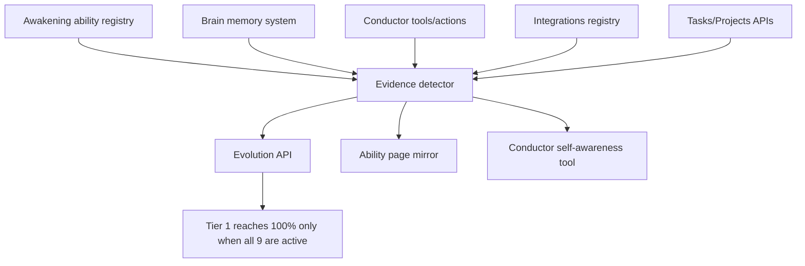
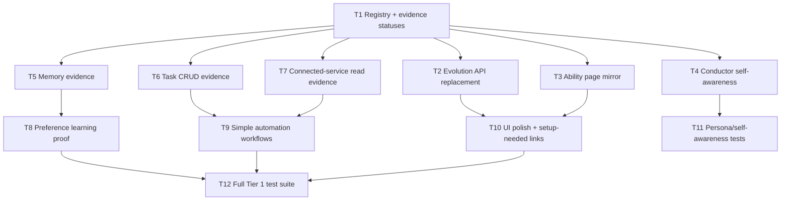

# Awakening Tier 1 Completion Plan

## Mission

Complete **Tier 1 - Awakening** to 100% by making TOBI genuinely capable of remembering the owner, maintaining its identity, reporting its evolution honestly, managing internal MC tasks, reading connected services, and running simple predefined workflows.

This is a **gap-fill release**, not a rewrite. Reuse existing MC infrastructure wherever it already works: Brain, Conductor, Actions, Integrations, Evolution, Ability, Tasks, Projects, Genesis Vault, and chat/Telegram surfaces.

Do **not** implement unsafe full-terminal or unrestricted desktop control here. Those belong to TOBI CLI / Agent-tier work.

## Locked Owner Decisions

| Decision | Chosen Direction |
|---|---|
| Tier 1 success | Evolution page shows Awakening 100% from real evidence |
| Scope style | Gap-fill existing abilities, do not rebuild from scratch |
| Priority | Basic real-world action gets the most attention |
| Setup surface | All owner configuration happens inside existing MC pages |
| Release shape | One practical release |
| Memory | Auto-learn with review/edit/delete controls |
| Persona | Consistent but practical British butler, not theatrical at the cost of usefulness |
| Evolution source | Evidence-based registry |
| Task scope | Full MC task CRUD |
| External reads | All connected services that are safely configured in MC |
| Missing config | Show setup-needed state, do not fail silently |
| Sensitive memory | Requires owner review before becoming active evidence |
| Data model | Additive only |
| Rollout | Evidence gated; never hardcode 100% |

## Current MC Status Summary

| ID | Ability | Current Status | Main Gap |
|---|---|---:|---|
| A1 | Owner Profile Memory | Partial / mostly built | Brain exists, but Tier 1 needs explicit profile evidence and UI proof |
| A2 | Conversation Memory | Partial / mostly built | Need distilled decisions/facts evidence, not transcript storage |
| A3 | Preference Learning | Partial | Need repeated-behavior preference extraction and reviewable evidence |
| B1 | Consistent Persona | Mostly built | Need tests across MC chat, Telegram, and action replies |
| B2 | Contextual Self-Awareness | Partial | Need accurate capability/limit/tier reporting |
| B3 | Evolution Tracking | Mismatch | Current Tier 1 definition is outdated and must be replaced with the 9 abilities |
| C1 | Internal Task Management | Mostly built | Need full CRUD proof through TOBI/Conductor and UI/API |
| C2 | External Read Access | Partial | Need normalized connected-service read status and setup-needed behavior |
| C3 | Simple Automation | Partial | Need packaged workflows: conversation-to-task, save note, repo summary |

## Architecture



### Central Principle

Create one source of truth for Awakening status. Do not let Evolution, Ability, Conductor, or UI pages each invent their own completion logic.

Recommended helper:

`core/awakening.py`

Responsibilities:

- Define all 9 Tier 1 abilities.
- Define completion criteria for each ability.
- Inspect existing DB/config/code evidence.
- Return status: `active`, `partial`, `setup_needed`, `inactive`.
- Return evidence text and links/actions for MC UI.
- Expose a compact tier report for Conductor.

If the worker decides a separate helper is too invasive, keeping the helper inside `api/dashboard.py` is acceptable for v1, but the registry must still be centralized.

## Tier 1 Ability Schema

Use this backend shape for each ability response:

```ts
type AwakeningAbilityStatus = "active" | "partial" | "setup_needed" | "inactive";

type AwakeningAbility = {
  id: string;
  category: "persistent_memory" | "identity_personality" | "basic_real_world_action";
  name: string;
  short_name: string;
  description: string;
  status: AwakeningAbilityStatus;
  evidence: string[];
  missing: string[];
  setup_actions: Array<{
    label: string;
    route: string;
  }>;
  risk: "low" | "medium" | "high";
};
```

Ability IDs:

| ID | Name |
|---|---|
| `owner_profile_memory` | Owner Profile Memory |
| `conversation_memory` | Conversation Memory |
| `preference_learning` | Preference Learning |
| `consistent_persona` | Consistent Persona |
| `contextual_self_awareness` | Contextual Self-Awareness |
| `evolution_tracking` | Evolution Tracking |
| `internal_task_management` | Task Management (Internal) |
| `external_read_access` | External Read Access |
| `simple_automation` | Simple Automation |

## Evidence Criteria

| ID | Active Criteria |
|---|---|
| `owner_profile_memory` | Brain has owner identity/profile/preference/goal/work/habit categories; owner can review/edit/delete; Conductor uses profile context in replies |
| `conversation_memory` | Conversation-derived facts/decisions are distilled into Brain memories; recall works across sessions; no full transcript dump is counted |
| `preference_learning` | Repeated owner behavior or explicit choices generate reviewable preference memories; preference examples are visible |
| `consistent_persona` | MC chat, Telegram, and action/confirmation replies use the same practical British butler persona |
| `contextual_self_awareness` | TOBI can report current tier, active abilities, missing abilities, limitations, and setup-needed items honestly |
| `evolution_tracking` | Evolution API/UI uses the new 9-ability Awakening registry and only reaches 100% from active evidence |
| `internal_task_management` | TOBI can create, read, update, complete, assign, and delete MC tasks with risk-based confirmation |
| `external_read_access` | Configured read-safe connectors can be queried; unconfigured connectors show setup-needed in MC |
| `simple_automation` | Three predefined workflows work: create task from conversation, save note, summarize GitHub repo |

## Implementation Task Graph



## Implementation Tasks

| ID | Goal | Depends On | Likely Files | Acceptance Criteria | Risk |
|---|---|---|---|---|---|
| T1 | Create centralized Awakening registry/evidence detector | None | `core/awakening.py`, `api/dashboard.py` | 9 ability objects returned with status/evidence/missing/setup actions | High |
| T2 | Replace outdated Tier 1 Evolution definition | T1 | `api/dashboard.py` | `/api/evolution` shows new 9 Awakening abilities and correct progress | High |
| T3 | Mirror Tier 1 on Ability page without separate logic | T1 | `dashboard/src/pages/Ability.tsx`, `dashboard/src/api.ts` | Ability page can show live Awakening status/evidence | Medium |
| T4 | Add TOBI self-awareness read tool | T1 | `core/conductor.py` | Asking TOBI about tier/capabilities/limits gives grounded status | Medium |
| T5 | Add memory evidence checks | T1 | `core/brain.py`, Brain APIs, `api/dashboard.py` | Owner profile and conversation memory can become active from real Brain data | Medium |
| T6 | Complete task CRUD through Conductor | T1 | `core/conductor.py`, task APIs | Create/read/update/complete/assign/delete tasks work; delete confirms | High |
| T7 | Normalize connected-service read status | T1 | `core/integrations.py`, `core/integrations_registry.py`, Integrations page | Connected reads work; missing providers show setup-needed | High |
| T8 | Add preference learning proof | T5 | `core/brain.py`, `core/conductor.py` | Repeated choices create reviewable preference memories | Medium |
| T9 | Add simple automation workflows | T6, T7 | `core/conductor.py`, Actions page | Conversation-to-task, save note, summarize repo workflows work and log actions | High |
| T10 | Update Evolution UI for 9 abilities | T2 | `dashboard/src/pages/Evolution.tsx`, `dashboard/src/api.ts` | Evolution page shows 3 categories and 9 evidence cards cleanly | Medium |
| T11 | Add persona/self-awareness tests | T4 | tests | MC chat, Telegram-safe behavior, and action replies preserve persona and honesty | Low |
| T12 | Add focused full-tier tests + docs | T1-T11 | tests, `docs/02_CURRENT_STATE.md` | All 9 criteria have tests or smoke checks; docs reflect true status | Medium |

## Backend Details

### Evolution API

Current `api/dashboard.py` Tier 1 definition is outdated. Replace only Tier 1 with the new user-approved 9 abilities. Preserve other tiers unless a direct mismatch breaks UI.

Rules:

- Genesis/Tier 0 should remain stable.
- Tier 1 completion is `active_count === 9`.
- `progress_pct` is based only on active abilities.
- `partial` and `setup_needed` do not count as active.
- Keep `missing_in_current_tier`, but include richer `missing` and `setup_actions` fields when possible.

### Brain / Memory

Reuse Brain categories:

- `identity`
- `preferences`
- `psychology`
- `relationships`
- `goals`
- `work`
- `habits`
- `health`

Do not create a duplicate memory system.

Add only small helpers if needed:

- profile summary helper
- conversation-distilled facts check
- preference evidence helper
- sensitive-memory review check

Memory UX acceptance:

- Owner can review/edit/delete important memories.
- Sensitive memories require review.
- TOBI can answer "what do you remember about me?" from Brain, not from hardcoded text.

### Conductor Tools

Existing Conductor has read tools, act tools, action logging, and risk tiers. Extend carefully.

Add or refine:

| Tool | Type | Risk | Purpose |
|---|---|---:|---|
| `awakening_status` | read | read | Report Tier 1 status, missing items, setup-needed items |
| `update_task` | act | medium | Edit task title/description/status/priority/owner fields |
| `save_note` | act | low/medium | Save note to Brain or project resource; Notion write requires confirmation |
| `summarize_repo` | read/workflow | read | Read GitHub repo info/issues/commits and return summary |
| `create_task_from_conversation` | workflow | low | Distill current conversation into one or more MC tasks |

Do not remove existing tools unless tests prove they are duplicated and unused.

### Integrations

External read access should use configured connectors only.

Initial read-safe providers:

- GitHub
- Notion
- Google/Drive if already wired; otherwise setup-needed
- Other existing connectors only if their read operation is safe and already configured

Important owner rule:

- Do not interact with Supabase or Vercel unless the owner explicitly confirms for that task. For this plan, workers may show their setup/read capability status in MC, but must not call live Supabase or Vercel APIs during implementation/testing without confirmation.

### Simple Automations

Implement as predefined workflow helpers, not open-ended autonomy.

| Workflow | Input | Output | Safety |
|---|---|---|---|
| Conversation to task | Current chat/session + owner instruction | MC task(s) in selected project | Low risk if creating only |
| Save note | Owner text or conversation summary | Brain memory or project resource; optional Notion page | External Notion write requires confirmation |
| Summarize repo | GitHub repo `owner/name` | Summary artifact/message with issues/commits/repo info | Read-only |

All workflows must write to `tobi_actions` or existing action/activity logs.

## Frontend Plan

### Evolution Page

Update Tier 1 display:

- Category A: Persistent Memory
- Category B: Identity & Personality
- Category C: Basic Real-World Action

Each ability card should show:

- active/partial/setup-needed/inactive state
- short evidence list
- missing item list
- setup button linking to Brain, Integrations, Tasks, Actions, or Settings as appropriate

### Ability Page

Keep existing Ability page style, but add an Awakening status section or mirror card. Do not duplicate the source of truth.

### Brain Page

Only add minimal links/indicators if missing:

- owner profile memory evidence
- conversation memory review
- preference memory review
- sensitive review queue

### Integrations Page

Show connected-service read readiness:

- connected
- missing key/config
- read unsupported
- write requires confirmation

### Actions Page

Ensure simple automation workflows produce visible logs.

## Security And Privacy

| Risk | Mitigation |
|---|---|
| Sensitive owner facts saved automatically | Review before active evidence |
| Prompt injection from connected services | Treat external content as untrusted source text; do not execute instructions from it |
| Unsafe external writes | Confirm Notion writes; avoid broad write actions |
| Accidental task deletion | High-risk confirmation for delete |
| Fake completion | Evidence detector only; no hardcoded 100% |
| Leaking secrets | Never display raw vault values or API keys |
| Supabase/Vercel accidental access | Do not call live APIs without explicit owner confirmation |

## Testing Plan

Backend tests:

- Awakening registry returns exactly 9 Tier 1 abilities.
- Each ability can be `active`, `partial`, `setup_needed`, or `inactive`.
- Tier 1 progress reaches 100 only when all 9 are active.
- Missing connector returns setup-needed, not failure.
- Sensitive memory does not activate until reviewed.
- Task CRUD through Conductor works against isolated DB.
- Delete task requires high-risk confirmation.
- Simple workflows log actions.

Frontend tests / smoke:

- Evolution page renders 9 abilities under 3 categories.
- Ability page mirrors status without stale hardcoded abilities.
- Integrations page shows setup-needed states.
- Actions page shows automation logs.

Manual acceptance prompts:

- "Tobi, what tier are you currently in and what is missing?"
- "Remember my preferred coding style is concise diffs."
- "What do you remember about my work style?"
- "Create a task from this conversation."
- "Summarize GitHub repo owner/name."

## Rollback Plan

- Keep all DB changes additive.
- If Evolution breaks, revert Tier 1 registry wiring and restore previous `_TIER_DEFINITIONS`.
- If Conductor workflow tools misbehave, remove them from `ACT_TOOLS`/`READ_TOOLS` while keeping helper code.
- If UI breaks, keep backend active and hide the new Ability/Evolution evidence sections.
- Never delete Brain, task, project, action, or integration records during rollback.

## Files Likely To Change

| Area | Files |
|---|---|
| Evolution backend | `tobi/api/dashboard.py`, possibly `tobi/core/awakening.py` |
| Brain evidence | `tobi/core/brain.py`, Brain API sections in `dashboard.py` |
| Conductor tools | `tobi/core/conductor.py` |
| Integrations | `tobi/core/integrations.py`, `tobi/core/integrations_registry.py` |
| Frontend API types | `tobi/dashboard/src/api.ts` |
| Evolution UI | `tobi/dashboard/src/pages/Evolution.tsx` |
| Ability UI | `tobi/dashboard/src/pages/Ability.tsx` |
| Brain/Integrations/Actions UI | `tobi/dashboard/src/pages/Brain.tsx`, `Integrations.tsx`, `Actions.tsx` if needed |
| Tests | existing backend/frontend test folders |
| Docs | `tobi/docs/02_CURRENT_STATE.md`, this queue plan |

## Parallel Work Conflict Warning

Avoid implementing this at the same time as:

- Chat Mode Backend Upgrade
- TOBI CLI
- Conductor tool registry/action changes
- Brain rewrite or memory schema work
- Evolution/Ability UI redesign
- Integrations/Vault refactor

If parallel work is unavoidable, split ownership:

- One session owns `core/conductor.py`.
- One session owns `api/dashboard.py` Evolution.
- One session owns frontend pages.
- Do not let two sessions edit the same file concurrently.

## Final Acceptance

Tier 1 is complete only when:

1. Evolution shows Awakening 9/9 active and 100%.
2. TOBI can honestly report its current tier, active abilities, missing items, and limits.
3. Owner memory, conversation memory, and preference learning are reviewable and controllable in MC.
4. Persona stays consistent across MC chat, Telegram, and actions.
5. TOBI can perform full internal MC task CRUD with confirmation for risky changes.
6. Connected-service read access works or shows setup-needed.
7. The three predefined simple automations work and are logged.
8. Focused tests and smoke checks pass.
