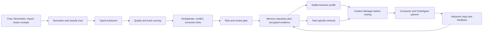
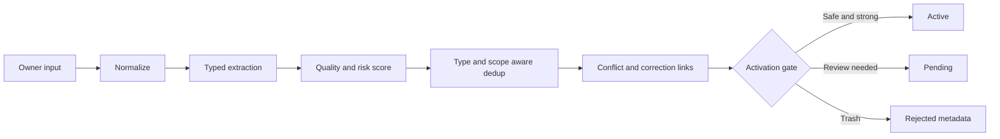
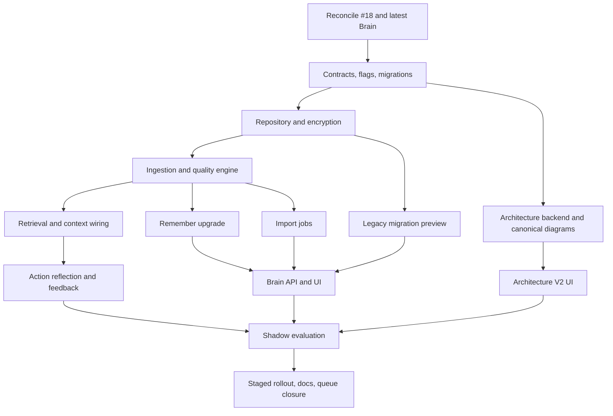

# Brain Context & Architecture V2 Plan

## Queue Contract

| Field | Decision |
|---|---|
| Queue item | `#20` |
| Delivery order | Start only after queue item `#18` is accepted and merged |
| Scope | Brain memory/context V2 plus Architecture page V2 |
| Runtime rollout | Feature flags and shadow evaluation before activation |
| Compatibility | Preserve existing Brain APIs, saved memories, and chat behavior during migration |
| Worker constraint | Reconcile the latest `main` and item `#18` before editing shared Brain/context files |

This plan turns Brain from a mostly raw memory store into a typed, quality-gated behavior layer for Chat and Agent. It also replaces the hardcoded Architecture view with a secure, repository-backed Mermaid viewer for the overall TOBI and Mission Control architectures.

Use these independent flags:

- `brain.v2_enabled`
- `brain.v2_shadow`
- `architecture.v2_enabled`

Do not remove the legacy runtime until the V2 release gates have passed and rollback has been exercised.

## Current-State Audit

| Node | Current behavior | V2 gap |
|---|---|---|
| Brain storage | Memories contain schema/content/confidence/source/status/context and embeddings | No typed behavioral contract, evidence boundary, quality dimensions, or scoped precedence |
| Remember | Classifies then stores mostly raw text | Needs extraction, distillation, risk review, correction links, and trash rejection |
| Import | Synchronous chunking/dedup followed by active writes | Needs resumable dry-run jobs, candidate triage, encryption, and bounded workers |
| Dedup/conflict | Similarity-based merge/conflict routing exists | Needs type/scope-aware decisions, explicit supersession, and durable evidence links |
| Context | Regex-gated profile summary is injected broadly | Needs relevance budgets, staged retrieval, provenance, trust, and influence visibility |
| Brain UI | Supports core memory browsing/management | Needs quality dashboard, import review, evidence editing, cleanup proposals, and influence tracing |
| Architecture UI | Hardcoded React `ZONES` diagram | Needs canonical repo diagrams, validated Mermaid rendering, version history, guide text, and exports |

## Research Basis

The implementation should use these as design references, not dependencies:

- [MemGPT: virtual context management](https://arxiv.org/abs/2310.08560)
- [Generative Agents: reflection and memory retrieval](https://arxiv.org/abs/2304.03442)
- [CoALA: explicit agent memory architecture](https://arxiv.org/abs/2309.02427)
- [Mem0: scalable long-term memory](https://arxiv.org/abs/2504.19413)
- [LongMemEval: long-term memory evaluation](https://arxiv.org/abs/2410.10813)
- [MemMachine: memory lifecycle and control](https://arxiv.org/abs/2604.04853)
- [Mermaid configuration schema](https://mermaid.js.org/config/schema-docs/config)

## Target System Graph

## Memory V2 Contracts

### Candidate contract

Create a validated `MemoryCandidate` contract with these fields:

| Group | Fields |
|---|---|
| Meaning | `distilled_text`, `memory_type`, `behavior_implication`, `tags` |
| Scope | `scope_type`, `scope_key` |
| Authority | `authority`, `explicitness`, `confidence` |
| Quality | `durability`, `actionability`, `specificity`, `source_strength`, `novelty`, `future_usefulness`, `quality_score` |
| Usage | `suggested_usage` |
| Evidence | `evidence_excerpt`, `source_ref`, `trust` |
| Protection | `sensitive` |

No unvalidated dictionary may cross extraction, repository, context, or API boundaries.

### Core memory types

Use a fixed type enum and flexible tags:

- `fact`
- `identity`
- `preference`
- `correction`
- `behavior_rule`
- `workflow_standard`
- `frustration_trigger`
- `decision`
- `project_context`
- `relationship`

Existing owner-facing categories remain supported as tags or compatibility labels. They must not become a second competing type system.

### Quality score

| Dimension | Weight |
|---|---:|
| Durability | 22 |
| Actionability | 22 |
| Specificity | 16 |
| Source strength | 16 |
| Novelty | 12 |
| Future usefulness | 12 |

Quality gates:

1. Score below `35`: reject the content and retain only non-sensitive rejection metadata for evaluation.
2. Score `35-69`: save as `pending` for owner review.
3. Score at least `70`, confidence at least `0.85`, explicit, non-sensitive, and conflict-free: activate automatically.
4. Inferred memories remain pending until owner approval or two independent corroborating observations reach confidence `0.85`.
5. Sensitive memories and hard behavioral rules always require approval.
6. Corrections create explicit `supersedes` links; they do not silently overwrite history.
7. Untrusted/imported evidence cannot directly create active hard rules.
8. Evidence excerpts are limited to 320 characters. Store references instead of full source copies whenever possible.

### Behavior semantics

- Soft preferences influence tone, defaults, planning, and presentation.
- Hard rules apply only when explicit and approved.
- Memory may shape a plan or tool parameters but can never grant permissions or weaken a safety check.
- Emotional or frustrated wording is not stored verbatim by default. Distill the reusable lesson, label the source, and discard non-actionable noise.
- Global memory applies across TOBI. Scoped memory may target a project, connector, workflow, or surface.

## Data Model

Keep `brain_memories` readable and add additive migrations for:

| Table | Purpose |
|---|---|
| `brain_memory_v2` | Typed memory fields, scores, lifecycle, scope, authority, and compatibility reference |
| `brain_memory_evidence` | Minimal evidence excerpt, source reference, trust, provenance, and timestamps |
| `brain_memory_links` | `supersedes`, `supports`, `conflicts_with`, `derived_from`, and related-memory edges |
| `brain_memory_tags` | Flexible searchable tags without enum churn |
| `brain_memory_feedback` | Useful, irrelevant, or wrong feedback tied to a turn and influence event |
| `brain_ingestion_jobs` | Resumable import job state, progress, errors, and cancellation |
| `brain_ingestion_candidates` | Dry-run candidate payloads and bulk triage decisions |
| `brain_cleanup_proposals` | Owner-reviewed archive/merge/delete recommendations |
| `brain_secure_payloads` | Vault-encrypted sensitive evidence and protected fields |
| `architecture_diagram_drafts` | Non-canonical #18-generated diagram proposals awaiting normal review |

Use the existing vault through a public, purpose-bound encryption helper using AES-GCM. Do not reach into vault internals from Brain. When the vault is locked, sensitive memory is redacted in the UI and excluded from LLM context.

Owner deletion permanently purges the selected memory and its protected payload. Archive is a separate reversible lifecycle action. Enable SQLite secure deletion and expose an owner-confirmed maintenance vacuum, while clearly documenting that external backups may retain historical bytes.

## Ingestion Pipeline

### Remember flow

### Import flow

- V1 accepts `TXT`, `MD`, and `JSON` only.
- Maximum upload is 10 MiB and 2 million normalized characters.
- Import is always dry-run first.
- Normalize and chunk at approximately 3,500 characters with structure-aware boundaries.
- Run one bounded background worker per job with persisted checkpoints.
- Support status, streaming progress, cancellation, retry, and resume after restart.
- Use a cheap structured-output model first, with at most one stronger compatible escalation for malformed extraction.
- Auto-activate only safe candidates. Queue sensitive, conflicting, inferred, and hard-rule candidates.
- Bulk approve/reject is allowed, but exceptions must remain individually editable.
- Uploads require an unlocked vault, use encrypted temporary storage, and are deleted after commit/cancel or within 24 hours.

Retain existing similarity defaults as initial tuning points: merge at `0.88` and conflict at `0.62`. A match must also have compatible type and scope before merge or conflict automation.

## Retrieval And Context Policy

Use two retrieval stages:

1. **Stable behavior profile:** cached, versioned, maximum 800 tokens, containing only active high-authority identity, hard rules, and durable preferences.
2. **Task-specific retrieval:** query-dependent memories selected by semantic relevance, scope, authority, quality, confidence, recency, and usefulness feedback.

Default task-specific limits:

| Mode | Maximum memories | Maximum memory tokens |
|---|---:|---:|
| Chat | 6 | 1,200 |
| Agent | 10 | 2,400 |

Ranking weights:

| Signal | Weight |
|---|---:|
| Semantic relevance | 35 |
| Scope match | 20 |
| Authority | 15 |
| Quality | 10 |
| Confidence | 10 |
| Recency | 5 |
| Usefulness feedback | 5 |

Precedence must be centralized:

1. Safety and permissions
2. Current explicit owner instruction
3. Scoped approved hard rule
4. Global approved hard rule
5. Scoped soft preference
6. Global soft preference

Uncertain memories must be labeled or hedged, not presented as fact. Files, imports, connectors, tool output, and web content are untrusted evidence and cannot issue instructions to the runtime.

Every non-conversation memory used in a response must produce an owner-visible context chip. The expanded chip shows the memory, scope, confidence, influence, evidence label, and feedback controls: `Useful`, `Irrelevant`, and `Wrong`.

Action outcomes may create reflection candidates, but they go through the same quality/risk gates and never become active solely because a tool succeeded.

## API Plan

Preserve `/api/brain/*` and route it through a compatibility repository. Add:

- `POST /api/brain/v2/remember`
- `POST /api/brain/v2/import-jobs`
- `GET /api/brain/v2/import-jobs/{job_id}`
- `GET /api/brain/v2/import-jobs/{job_id}/events`
- `POST /api/brain/v2/import-jobs/{job_id}/commands`
- `POST /api/brain/v2/import-jobs/{job_id}/candidates/approve`
- `POST /api/brain/v2/import-jobs/{job_id}/candidates/reject`
- `GET /api/brain/v2/memories/{memory_id}`
- `GET /api/brain/v2/memories/{memory_id}/influence`
- `POST /api/brain/v2/cleanup/preview`
- `POST /api/brain/v2/cleanup/apply`
- `DELETE /api/brain/v2/memories/{memory_id}/purge`

Commands include `cancel`, `retry`, and `resume`; all mutation requests use validated contracts and idempotency keys where replay is possible.

## Brain UI/UX

Build these views within the existing Mission Control design system:

- **Brain home:** quality/review dashboard with active, pending, conflicted, aging, sensitive, and rejected counts.
- **Memory library:** filters for type, tag, scope, status, confidence, quality, and sensitivity.
- **Import wizard:** upload, dry-run progress, grouped candidate review, exceptions, commit, cancel, and resume states.
- **Memory detail drawer:** all fields, including evidence, are owner-editable; edits create version history.
- **Cleanup center:** recommends merges, archives, revalidation, and deletion; no destructive proposal applies without confirmation.
- **Influence trace:** shows where and why a memory affected Chat or Agent.
- **Ask Brain:** grounded inspector that answers from Brain data and exposes the supporting memory records.
- **Notifications:** in-app badge and digest for pending or conflicted candidates.

Do not expose raw model JSON. Keep technical provenance in expandable details.

## Architecture V2

### Canonical sources

Store reviewed diagrams as strict Mermaid flowcharts:

- `docs/architecture/diagrams/overall-tobi.mmd`
- `docs/architecture/diagrams/mission-control.mmd`

The repository files are canonical. `architecture_diagram_drafts` contains proposals only. Queue item `#18` may generate a draft patch, but it cannot publish or overwrite canonical diagrams automatically.

### Backend

Add allowlisted read-only routes for:

- diagram list and metadata;
- current diagram content;
- recent Git-backed versions;
- a selected historical version;
- draft list and detail.

Reject arbitrary paths and revisions. Enforce repository-root resolution and file-size limits.

### Rendering security

- Dynamically import Mermaid only on the Architecture page.
- Permit the `flowchart` syntax subset only in V1.
- Reject directives, raw HTML, links, callbacks, JavaScript URLs, and oversized diagrams.
- Use Mermaid `securityLevel: strict` and sanitize rendered SVG before insertion/export.
- Validate canonical diagrams in CI using the same policy as the runtime.

### Architecture UI

- Tabs: `Overall TOBI` and `Mission Control` only.
- Render a responsive, full-width diagram with stable zoom, pan, reset, and fit controls.
- Pair each diagram with a plain-language architecture guide.
- Clicking a node highlights its incoming/outgoing flow and opens the corresponding guide section.
- Show current and recent Git versions.
- Provide `Copy Mermaid` and sanitized `Export SVG` actions.
- V1 has no manual diagram editor.

## Implementation DAG

## Worker Task Breakdown

| ID | Goal | Depends on | Likely ownership | Acceptance criteria | Risk |
|---|---|---|---|---|---|
| T00 | Reconcile item #18 and current Brain code before implementation | #18 accepted | Brain, context, docs | Worker records current APIs/tables, resolves shared-file differences, and updates this plan only when verified behavior changed | High |
| T01 | Add typed contracts, feature flags, and additive migrations | T00 | Brain models, config, database | Legacy data remains readable; migration is idempotent; flags default off | High |
| T02 | Implement repository boundaries and vault-backed sensitive fields | T01 | Brain repository, vault public API | Sensitive content is encrypted, redacted while locked, and inaccessible through compatibility leaks | High |
| T03 | Build typed extraction, quality, trust, dedup, conflict, and activation gates | T02 | Brain services | Golden candidates receive deterministic statuses and validated scores/links | High |
| T04 | Route Remember through V2 while preserving legacy response shape | T03 | Brain API/service | Explicit safe memories activate; risky/inferred content queues; flag rollback restores legacy path | Medium |
| T05 | Build resumable dry-run import jobs and candidate triage | T03 | Brain jobs/API | TXT/MD/JSON imports resume after restart, never activate before dry-run, and clean encrypted temp data | High |
| T06 | Build legacy reclassification preview and owner-approved migration | T02 | Migration service/UI | No legacy row changes without preview/approval; corrections and duplicates are visible | High |
| T07 | Implement behavior profile, task retrieval, budgets, trust boundaries, and precedence | T03 | Context manager, conductor/chat runtime | Irrelevant memory stays out; hard rules never weaken permissions; context remains within budgets | High |
| T08 | Add action-reflection candidates, influence traces, and usefulness feedback | T07 | Agent/action history, Brain | Side-effect receipts generate pending candidates only; feedback updates ranking without deleting evidence | Medium |
| T09 | Deliver Brain V2 APIs and management UI | T04,T05,T06 | Dashboard API, Mission Control frontend | Owner can inspect/edit/review/clean up memories; all loading/error/locked-vault states work | High |
| T10 | Add secure architecture routes, canonical diagrams, validator, and #18 draft contract | T01 | Architecture backend/docs | Only allowlisted current/recent diagrams load; unsafe Mermaid fails closed; drafts cannot publish | High |
| T11 | Deliver Architecture V2 UI | T10 | Mission Control frontend | Both diagrams render responsively with guide, flow highlight, history, copy, and SVG export | Medium |
| T12 | Run Brain shadow evaluation and full acceptance suite | T08,T09,T11 | Tests/telemetry | Release thresholds pass with no legacy or security regression | High |
| T13 | Stage activation, document operations/rollback, and close queue item | T12 | Config/docs/queue | Chat then Agent rollout completes; flags are proven rollback controls; queue evidence is linked | Medium |

## File-To-Task Map

Exact paths must be confirmed against `main` after item #18. Expected ownership:

| Surface | Tasks |
|---|---|
| Brain core/repository and database migrations | T01-T06 |
| Context manager, conductor, Chat/Agent runtime | T07-T08 |
| Mission Control Brain API routes | T04-T06,T09 |
| Mission Control Brain frontend components/state | T09 |
| Action history/receipts | T08 |
| Architecture API and source validator | T10 |
| `docs/architecture/diagrams/*.mmd` | T10 |
| Mission Control Architecture page/components | T11 |
| Brain, context, security, API, UI, and Mermaid tests | T03-T12 |
| Architecture/Brain operating docs and queue evidence | T13 |

## Migration Plan

1. Snapshot the local database and record current Brain counts/statuses.
2. Apply additive schema migrations; do not rewrite `brain_memories` in place.
3. Backfill compatibility references and deterministic fields that require no model inference.
4. Run V2 extraction over legacy content in dry-run mode.
5. Present grouped reclassification, duplicate, conflict, and sensitive-content decisions to the owner.
6. Apply only approved batches with a migration ledger and resumable checkpoints.
7. Keep legacy rows and API behavior available throughout rollout.
8. After acceptance, retain compatibility reads until a separate deletion plan is approved.

Recommended legacy mappings:

| Legacy condition | V2 action |
|---|---|
| Active explicit owner fact/preference, no conflict | Candidate for active after quality validation |
| Inferred or weakly sourced memory | Pending |
| Duplicate with same type/scope | Propose merge and preserve evidence links |
| Contradictory content | Conflicted; require owner decision |
| Sensitive content | Encrypt and require owner review |
| Low-quality conversational noise | Reject/archive proposal, never silent deletion |

## Testing And Release Gates

Create a golden set of at least 60 examples covering trash, facts, preferences, corrections, frustration, duplicates, conflicts, inference, sensitive data, and prompt injection.

Required release thresholds:

| Metric | Gate |
|---|---:|
| Reviewed candidate precision | At least 90% |
| Active-memory trash rate | At most 5% |
| Retrieval usefulness | At least 85% |
| Correction update plus abstention accuracy | At least 90% |
| Cached context construction p95 | At most 300 ms |
| Memory-caused context token increase | At most 20% |
| Prompt-injection, secret, or permission failures | 0 |

Required suites:

- Unit: contracts, scoring, activation gates, links, ranking, precedence, redaction, deletion, and Mermaid validation.
- Repository/migration: idempotency, rollback, legacy reads, approved batches, resume after interruption, and vault lock/unlock.
- API: validation, authorization boundaries, job commands, compatibility responses, purge confirmation, and path/revision allowlists.
- Context: Chat/Agent budgets, scoped/global rules, corrections, uncertainty, context chips, and permission invariants.
- Import: every supported format, size limits, malformed input, cancellation, retry, restart, temp cleanup, and model escalation.
- Agent integration: action reflection candidates, influence records, and feedback.
- Security: prompt injection from imports/evidence, secret leakage, locked vault, path traversal, unsafe Mermaid, SVG sanitization, and arbitrary Git revision denial.
- UI: Brain dashboard/library/wizard/drawer, Architecture tabs/history/export, accessibility, and mobile layout.
- Build/regression: existing Brain, Chat, Agent, dashboard, and frontend build suites.

## Rollout And Rollback

1. Capture baseline metrics and a database backup.
2. Deploy additive schema and `brain.v2_shadow=true`, with V2 writes disabled.
3. Compare V1/V2 extraction, activation, retrieval, latency, and token use without influencing responses.
4. Enable V2 Remember and import review for the owner only.
5. Run and approve legacy migration batches.
6. Enable V2 context in Chat; require seven consecutive accepted local evaluation runs.
7. Enable V2 context and action reflection in Agent after Chat remains stable.
8. Roll out Architecture V2 independently after its security and visual tests pass.

Rollback:

- Disable `brain.v2_enabled` to restore legacy reads/context while retaining additive V2 records.
- Disable `architecture.v2_enabled` to restore the current hardcoded Architecture page.
- Never delete legacy memories or canonical diagrams as part of rollback.
- Restore the database snapshot only for migration corruption, not normal feature rollback.

## Risks And Mitigations

| Risk | Mitigation |
|---|---|
| Item #18 edits the same Brain/context/architecture surfaces | Hard dependency T00; do not run both implementations in parallel |
| Incorrect memory changes behavior | Pending gates, influence trace, explicit precedence, correction links, flags |
| Memory prompt injection | Untrusted evidence boundary; structured fields; no instruction execution from sources |
| Sensitive owner data leaks | Vault encryption, locked-state exclusion, minimal evidence, redaction tests |
| Migration damages history | Additive schema, dry-run, owner approval, ledger, backup, compatibility reads |
| Context latency/token growth | Cached stable profile, strict budgets, two-stage retrieval, measured gates |
| Import jobs block API or duplicate work | Bounded worker, checkpoints, idempotent commands, persisted candidate IDs |
| Mermaid XSS or file access | Strict subset, sanitization, allowlisted paths/revisions, runtime and CI validation |
| Architecture becomes stale | Canonical repo ownership, plain guide, #18 draft workflow, review checklist |
| Hard delete expectations conflict with backups | Clear purge semantics and backup caveat; archive remains separate |

## Assumptions And Non-Goals

- Item #18 is completed and accepted before this work begins.
- V1 targets Mission Control Chat and Agent, not every TOBI surface.
- Existing embedding/model providers remain available; no new vector database is required.
- Import V1 excludes PDF, DOCX, images, audio, websites, and connector-wide ingestion.
- Architecture V1 is a viewer, not a diagram editor.
- Chat-history encryption is outside this item; only Brain-sensitive payloads are covered.
- No Supabase or Vercel interaction is required.
- Canonical architecture changes use the normal repository review path.

## Definition Of Done

Queue item `#20` is complete only when:

1. Item #18 reconciliation is documented.
2. V2 contracts and additive migrations are deployed with flags off by default.
3. Remember/import/migration/context workflows satisfy their acceptance criteria.
4. The owner can inspect, edit, approve, reject, clean up, and trace memory influence in Mission Control.
5. Chat and Agent use measured, budgeted, permission-safe memory context.
6. Overall TOBI and Mission Control canonical diagrams render safely with guide/history/export features.
7. All release thresholds and regression suites pass.
8. Rollback is exercised successfully.
9. Architecture/Brain operating docs and `QUEUE.md` are updated with verification evidence.

