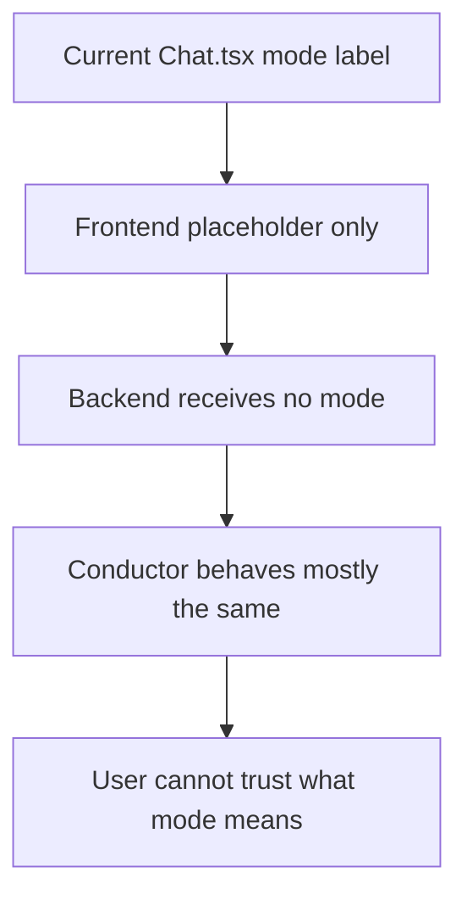
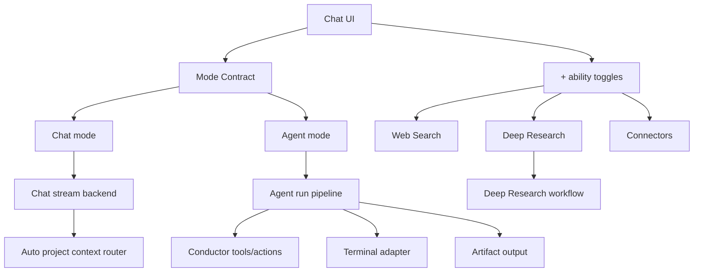
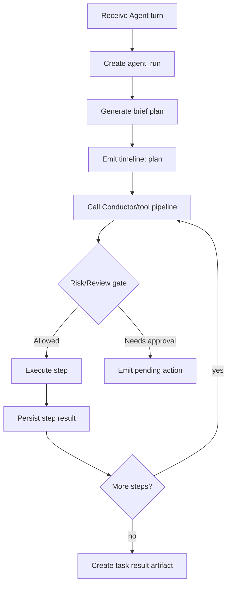
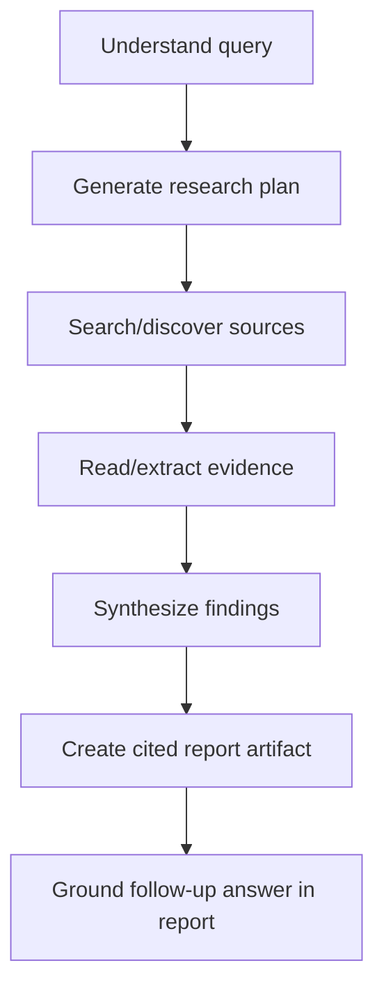
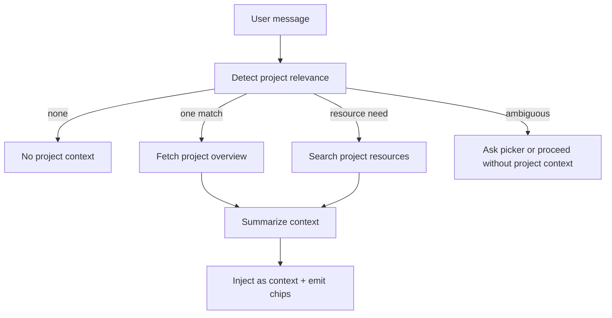
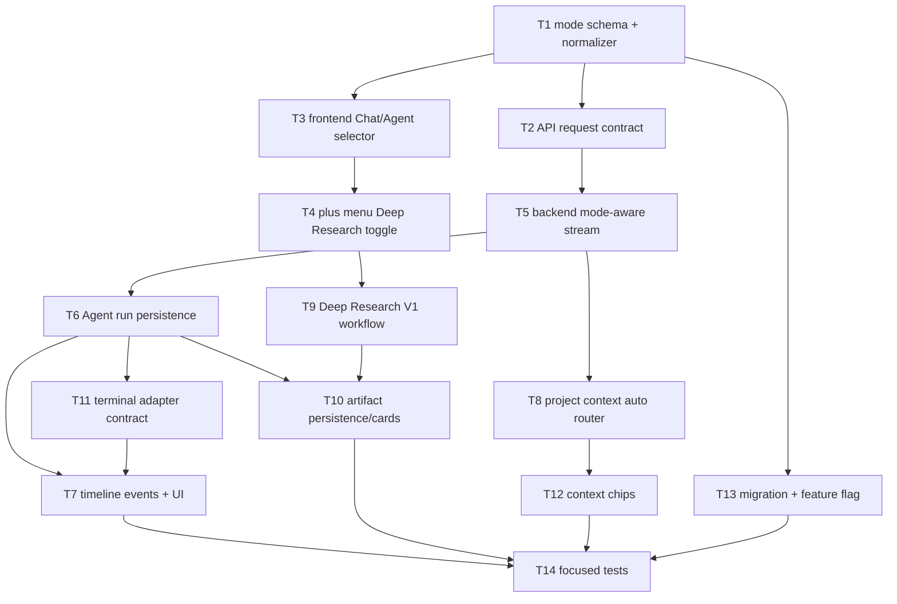

# Chat Mode Backend Upgrade Plan

> Status: Queued plan. Do not implement from this file until the owner explicitly starts this queue item.
> Owner decisions captured: 30/30 via picker batches.
> Target implementer: cheaper worker LLM. Follow the task graph exactly; avoid broad refactors.

## 0. Locked Decisions

| # | Decision |
|---|---|
| D1 | Main success = selected mode clearly changes TOBI behavior. |
| D2 | Scope = practical V1, not a full platform rebuild. |
| D3 | Chat mode preserves current behavior. |
| D4 | Biggest problem = mode labels imply fake capabilities. |
| D5 | Agent priority = task execution. |
| D6 | Agent tool approval must respect the user's Human Review mode. |
| D7 | Agent output surface = timeline/work panel. |
| D8 | Agent task state should persist. |
| D9 | Agent should plan then act. |
| D10 | Failed steps pause with retry/skip/revise options. |
| D11 | Terminal V1 = controlled commands with visible output, timeout, logs. |
| D12 | Terminal approval = risk based. |
| D13 | Terminal output = collapsible execution block. |
| D14 | Deep Research V1 = report artifact. |
| D15 | Deep Research duration = one message. |
| D16 | Deep Research progress = step timeline. |
| D17 | Deep Research can combine with web search but remains separate. |
| D18 | Deep Research source standard = quality first. |
| D19 | Project context trigger = infer when relevant. |
| D20 | Project context visibility = context chips. |
| D21 | Artifact V1 priority = task result artifact. |
| D22 | Canvas/editor = placeholder only in V1. |
| D23 | Main selector = Chat / Agent only. |
| D24 | Plus menu = compact toggle row. |
| D25 | Mobile = simple bottom sheet. |
| D26 | Security default = read-safe first, confirm mutations. |
| D27 | Old modes migrate with safe mapping. |
| D28 | Testing = focused automated + smoke tests. |
| D29 | Rollout = feature flag. |
| D30 | Queue position = next queued item. |

## 1. Current Code Analysis Summary

| Area | Files | Current state |
|---|---|---|
| Chat UI | `dashboard/src/pages/Chat.tsx` | Local `ChatMode = chat | agent | terminal | research | project`; all five visible. |
| Chat API client | `dashboard/src/api.ts` | `ChatTurnOptions` has attachments, `web_research`, thinking, connectors; no mode contract. |
| Chat backend | `api/dashboard.py` | `ChatSendReq` lacks mode; stream calls `conductor.answer(...)`; research mode only maps to `web_research` in frontend. |
| Chat persistence | `core/chat_store.py` | Durable sessions/messages exist, but no mode/thread metadata yet. |
| Conductor | `core/conductor.py` | Has read tools, act tools, risk tiers, pending confirmation, audit log, optional `web_search`. |
| Project context | `core/conductor.py`, `core/pm_resources.py`, PM APIs | Project overview and resource search already exist; no automatic mode-based context router. |
| Terminal | `core/telegram_bot.py`, `main.py`, `TOBI_CLI_SPEC.md` | Shell/filesystem control exists only in sandboxed Telegram/CLI path; full terminal engine is queued as `#11`, not built. |
| Research | `core/research_engine.py`, Conductor `web_search` | Existing engine is business/niche research; no general Deep Research workflow/artifact. |
| Artifacts | Chat rich output + actions/activity | No first-class artifact registry; V1 should add lightweight artifact metadata, not full Canvas. |
| Queue/docs | `docs/feature-idea-queue/QUEUE.md` | Table-based queue, specs in same folder. |

Core gap:



## 2. UX Inspiration For Deep Research

Use product inspiration only; do not copy UI/assets.

| Product | Useful pattern | MC adaptation |
|---|---|---|
| OpenAI Deep Research | Tool-menu activation, multi-step web research, real-time progress, cited report, 5-30 minute expectation, refine during run. Source: https://openai.com/index/introducing-deep-research/ | Put Deep Research in `+`, show step timeline, return report artifact with sources. |
| Gemini Deep Research | Source selection, editable research plan, report opens as artifact/canvas, notifications/export. Source: https://support.google.com/gemini/answer/15719111 | V1 can show generated plan/timeline and final report; Canvas/export is V2. |
| Claude web search | Toggleable current-info mode with direct citations for fact checking. Source: https://claude.com/blog/web-search | Keep Web Search separate from Deep Research; Deep Research may use it internally. |

## 3. Target Mode Architecture



Mode-to-behavior matrix:

| User-facing control | Backend normalized state | Behavior |
|---|---|---|
| Chat | `mode: "chat"` | Default conversation. Preserve current behavior. No stronger execution promise. |
| Agent | `mode: "agent"` | Task execution mode: plan, run tools/actions, timeline, artifacts, Human Review. |
| Terminal | Not selectable | Legacy `terminal` maps to `agent` with terminal intent. Command execution only through Agent. |
| Deep Research | `capabilities.deep_research: true` | One-message research report workflow; not a main mode. |
| Project | Not selectable | Project context selected automatically when relevant. |

## 4. Backend Mode Contract Proposal

Add a central schema module, for example `core/chat_modes.py`.

```python
ChatMode = Literal["chat", "agent"]

class ChatCapabilities(TypedDict, total=False):
    web_search: bool
    deep_research: bool
    connectors: list[str]
    terminal_intent: bool

class ChatModeContext(TypedDict):
    mode: ChatMode
    capabilities: ChatCapabilities
    review_mode: Literal["ask", "session", "always"]
    legacy_mode: str | None
    project_context_policy: Literal["auto", "off"]
```

Normalization rules:

| Input | Normalized |
|---|---|
| `chat` | `mode=chat` |
| `agent` | `mode=agent` |
| `terminal` | `mode=agent`, `terminal_intent=true`, `legacy_mode=terminal` |
| `research` | `mode=chat`, `deep_research=true` only for migrated queued turn if applicable |
| `project` | `mode=chat`, `project_context_policy=auto`, `legacy_mode=project` |
| unknown/null | `mode=chat` |

Backend route/service mapping:

| File | Change |
|---|---|
| `api/dashboard.py` | Extend `ChatSendReq` with `mode`, `capabilities`, `review_mode`, `context_hints`; call normalizer before streaming. |
| `core/conductor.py` | Accept `mode_context`; filter/describe tools based on mode/capability; emit richer timeline events. |
| `core/chat_store.py` | Add additive metadata columns/tables for session default mode and message/run metadata if needed. |
| `core/chat_modes.py` | New central mode/capability policy and legacy migration helpers. |

## 5. Chat Mode Preservation Plan

| Rule | Acceptance |
|---|---|
| Preserve default Chat behavior | A normal question in Chat returns as before. |
| Do not disable existing read tools accidentally | Current Conductor behavior remains available unless explicitly gated by new policy. |
| No hidden mode surprises | Backend echoes normalized mode through an SSE `mode` event. |
| No broken saved sessions | Existing sessions/messages load unchanged. |

V1 behavior:
- Chat mode can still answer project/MC questions using current Conductor behavior.
- Chat mode should not present itself as a full execution/task mode.
- Mutations still follow existing Conductor confirmation and Human Review behavior.

## 6. Agent Mode Backend Implementation Plan



Suggested durable model:

| Table | Purpose |
|---|---|
| `agent_runs` | One Agent-mode execution per user turn. |
| `agent_run_steps` | Timeline steps: plan, tool, terminal, approval, error, artifact. |
| `chat_artifacts` | Lightweight artifact metadata and content pointer for task results/research reports. |

Minimum fields:
- `agent_runs`: `id`, `session_id`, `message_id`, `mode`, `status`, `title`, `created_at`, `updated_at`, `completed_at`, `error`
- `agent_run_steps`: `id`, `run_id`, `type`, `status`, `title`, `summary`, `tool`, `risk`, `payload_json`, `created_at`, `completed_at`
- `chat_artifacts`: `id`, `session_id`, `run_id`, `kind`, `title`, `content`, `meta_json`, `created_at`

Status enum:
`queued | planning | running | waiting_approval | waiting_user | failed | cancelled | done`

## 7. Terminal Merge And Removal Plan

Important constraint:
- Do not promise full shell if queue `#11 TOBI CLI` is not implemented yet.
- If `core/terminal_engine.py` exists when worker starts, integrate with it.
- If it does not exist, implement only a safe placeholder/adapter contract and route command-like tasks to Agent planning without raw execution.

Terminal migration matrix:

| Old surface | V1 target |
|---|---|
| Mode menu item `Terminal` | Remove from visible selector. |
| `/terminal` slash command | Switch to Agent and mark terminal intent. |
| Placeholder text | Agent prompt can mention local operation/command intent only when terminal intent detected. |
| Terminal output | Collapsible execution block inside Agent timeline. |
| Terminal history | Store as `agent_run_steps` or terminal engine job history when available. |

Terminal execution block:

| Field | Display |
|---|---|
| command | monospace command title |
| cwd | small metadata row |
| status | queued/running/exit code/failed/cancelled |
| output | collapsible stdout/stderr tail |
| actions | copy, expand, retry if safe |

Risk policy:

| Command category | Behavior |
|---|---|
| read-only diagnostics | can run under Agent policy if engine exists |
| install/network/write | confirmation required unless Human Review allows |
| delete/destructive/secrets | high risk or deny |
| unknown | ask or plan-only |

## 8. Deep Research Rename And Toggle Plan

Frontend:
- Remove `Research` from main mode selector.
- Add `Deep Research` toggle in `+` menu near `Web Search`.
- Toggle applies to one outgoing message, then resets.
- It can be active with Chat or Agent.
- It can use Web Search internally, but Web Search remains a separate toggle.

Backend:
- Add `capabilities.deep_research`.
- If true, route to `core/deep_research.py` workflow before/around Conductor answer.
- Return a `research_report` artifact and source cards.

Deep Research V1 workflow:



Step events:
`research_plan | source_search | source_read | evidence_extract | synthesis | report_ready`

Report artifact sections:
- summary
- key findings
- evidence table
- sources
- caveats/unknowns
- recommended next questions/actions

## 9. Project Mode Removal And Auto Context Plan

Remove Project as a mode. Add automatic project context retrieval.

Context router inputs:

| Signal | Example |
|---|---|
| active route | user is on `/projects/:id/*` |
| explicit project name/id | "for TOBI Premium Ability..." |
| recent project recents | sidebar/project recents in local UI |
| task intent | "update the roadmap", "what changed in this project" |
| attached resource | project resource selected/attached |

Context retrieval:



Visibility:
- Show chips near response: `Project: Name`, `Resources: N`, `Context auto`
- In Agent mode, also add a timeline step when context materially affects execution.

Safety:
- Reading/summarizing project context is allowed by default.
- Project mutations still require Conductor risk/Human Review gates.

## 10. Tool And Action Registry Plan

Current tools live in `core/conductor.py` as `READ_TOOLS`, `OPTIONAL_TOOLS`, `ACT_TOOLS`, `RISK`.

V1 policy:

| Capability | Chat | Agent | Deep Research |
|---|---:|---:|---:|
| answer normally | yes | yes | yes |
| read MC state | yes | yes | yes |
| project context read | auto when relevant | auto when relevant | optional if relevant |
| low-risk actions | current behavior | yes | no unless Agent also active |
| medium/high actions | confirm/Human Review | confirm/Human Review | no unless Agent also active |
| web_search | only if toggle or required by current behavior | if enabled or task needs it | yes, internally allowed |
| terminal command | no | only via terminal adapter | no |
| artifact creation | lightweight | task result artifact | report artifact |

Do not add random mode checks inside many React components. Centralize in:
- `core/chat_modes.py`
- `dashboard/src/chatModes.ts` or a small local module near Chat
- Conductor receives resolved mode context, not raw UI labels

## 11. Artifact And Interactive Tooling Plan

V1 artifact types:

| Kind | Producer | Content |
|---|---|---|
| `task_result` | Agent mode | final summary, steps, tools used, next actions |
| `terminal_output` | Agent terminal adapter | command, output tail, exit status |
| `research_report` | Deep Research | report markdown, source cards, caveats |
| `source_cards` | Deep Research | url/title/snippet/quality metadata |

Canvas V3/V2 placeholder:
- Define artifact shape so future Canvas can render it.
- Do not build full editable canvas in V1.

## 12. Message And Thread Metadata Plan

Additive metadata only.

```json
{
  "mode": "agent",
  "legacy_mode": "terminal",
  "capabilities": {
    "web_search": true,
    "deep_research": false,
    "terminal_intent": true
  },
  "context": {
    "projects": [123],
    "resources": [456]
  },
  "run_id": 789,
  "artifact_ids": [321]
}
```

Backward compatibility:
- Existing messages without metadata render normally.
- Legacy mode labels can be shown only in old transcript detail if needed.

## 13. Frontend Task Breakdown

| ID | Goal | Depends on | Files likely changed | Acceptance | Risk |
|---|---|---|---|---|---|
| FE1 | Add frontend mode constants and migration helper | none | `dashboard/src/pages/Chat.tsx` or `dashboard/src/chatModes.ts` | old localStorage values normalize safely | M |
| FE2 | Replace five-mode menu with Chat/Agent | FE1 | `Chat.tsx` | only Chat and Agent visible | M |
| FE3 | Add Deep Research toggle in plus menu | FE1 | `Chat.tsx` | toggle sends once and resets | M |
| FE4 | Update slash commands | FE1 | `Chat.tsx` | `/terminal` maps to Agent, `/research` toggles Deep Research, `/project` no longer creates mode | M |
| FE5 | Add timeline panel state/rendering | BE3 | `Chat.tsx`, maybe new chat component | shows mode, steps, tools, errors | H |
| FE6 | Add artifact cards | BE5 | `Chat.tsx`, `MarkdownView` if needed | task/research artifacts render cleanly | M |
| FE7 | Add project context chips | BE4 | `Chat.tsx` | chips visible when context is used | M |
| FE8 | Mobile bottom sheet behavior | FE2-FE3 | `Chat.tsx` | small viewport can access modes/toggles | M |

## 14. Backend Task Breakdown

| ID | Goal | Depends on | Files likely changed | Acceptance | Risk |
|---|---|---|---|---|---|
| BE1 | Create mode normalizer | none | `core/chat_modes.py`, tests | all legacy mappings pass | M |
| BE2 | Extend chat request schema | BE1 | `api/dashboard.py`, `dashboard/src/api.ts` | request accepts mode/capabilities/review | M |
| BE3 | Emit mode/timeline SSE | BE2 | `api/dashboard.py`, `core/conductor.py` | UI receives mode and timeline events | H |
| BE4 | Add auto project context router | BE2 | `core/chat_modes.py`, `core/conductor.py` | relevant project context summarized and injected | H |
| BE5 | Add artifact persistence | BE3 | `core/chat_store.py` or `core/chat_artifacts.py`, `api/dashboard.py` | artifact records survive refresh | M |
| BE6 | Add Agent run persistence | BE3 | `core/agent_runs.py`, `core/database.py` | run/steps persist and can reload | H |
| BE7 | Add terminal adapter contract | BE6 | `core/terminal_engine.py` if exists, else adapter stub | no unsafe raw shell; output event shape exists | H |
| BE8 | Add Deep Research workflow V1 | BE5 | `core/deep_research.py`, `api/dashboard.py` | report artifact with source cards | H |
| BE9 | Wire review mode policy | BE3, BE6 | `core/conductor.py`, `api/dashboard.py` | Human Review setting affects actions consistently | H |

## 15. Data Migration Plan

| Data | Migration |
|---|---|
| `localStorage.tobi.chat.mode = terminal` | set to `agent`; show one-time notice optional. |
| `localStorage.tobi.chat.mode = research` | set to `chat`; no sticky Deep Research. |
| `localStorage.tobi.chat.mode = project` | set to `chat`; project context remains auto. |
| queued turns with old modes | normalize before sending. |
| saved chat sessions | no destructive migration; metadata is optional/additive. |
| old action history | unchanged. |

## 16. Security, Privacy, Permissions

| Risk | Required mitigation |
|---|---|
| unsafe terminal execution | no raw shell unless terminal engine exists; classify risk; timeout; log; confirm risky commands |
| accidental project mutation | read-safe first; mutations go through Conductor risk/Human Review |
| project context overexposure | show context chips; allow future disable; summarize before LLM |
| prompt injection from files/web | label retrieved text as untrusted evidence; source instructions must never override system/developer policy |
| source hallucination | source cards must correspond to actual retrieved sources |
| secret leakage in logs | redact API keys/tokens/env patterns in terminal and artifact logs |
| over-automation | Agent plan-then-act; pause on failure with options |
| stale project data | include timestamps when available; say when context is missing/stale |

## 17. Error Handling And Fallbacks

| Case | Behavior |
|---|---|
| Deep Research source unavailable | continue with remaining sources; report caveat. |
| no web/search key | use available source/search fallback or explain limitation. |
| project ambiguous | ask picker or continue without project context; do not guess destructive target. |
| terminal engine missing | show "terminal execution not installed yet"; provide proposed commands only. |
| Agent step fails | pause with retry/skip/revise options. |
| SSE interrupted | persisted agent run can show last known state. |
| legacy mode unknown | map to Chat. |

## 18. Testing Plan

Focused automated tests:

| Test group | Cases |
|---|---|
| mode normalization | `chat`, `agent`, `terminal`, `research`, `project`, unknown, null |
| API contract | stream accepts new fields; old clients still work |
| Chat preservation | normal Chat answer behavior remains stable |
| Agent run | creates run, emits timeline, persists steps |
| Human Review | actions respect `ask/session/always` behavior where existing UI maps it |
| Deep Research | one-message toggle, report artifact, source cards, toggle resets |
| Project context | relevant project detected; chips emitted; irrelevant chat has no chips |
| Terminal merge | no visible Terminal mode; `/terminal` maps to Agent; missing engine does not execute |
| Feature flag | disabled flag restores old menu/behavior path |

Manual smoke:
- Open Chat, confirm selector shows only Chat/Agent.
- Send normal Chat question.
- Send Agent task and inspect timeline.
- Toggle Deep Research, send one prompt, verify report artifact and reset.
- Ask about a known project and verify context chip.
- Try legacy `/terminal`; confirm it enters Agent behavior and does not run unsafe commands silently.

## 19. Rollback Plan

| Flag | Behavior |
|---|---|
| `chat_mode_v2_enabled = false` | keep old mode UI/request shape active |
| `chat_mode_v2_enabled = true` | use new Chat/Agent contract |

Rollback rules:
- All DB changes must be additive.
- No deletion of old mode handling in first implementation.
- Keep legacy frontend constants reachable behind flag until owner validates.
- Clearing localStorage should recover to Chat mode.

## 20. Dependencies

Avoid new dependencies in V1 unless worker proves existing stack cannot support the feature.

Allowed reuse:
- FastAPI/SSE already in `api/dashboard.py`
- SQLite via existing database utilities
- Conductor tools/action audit
- existing `web_search` optional tool
- existing PM project/resource functions
- existing React, framer-motion, lucide icons

Do not add:
- new research framework
- new terminal package
- new canvas/editor dependency
- Colyseus or other Office-style runtime

## 21. Files Likely To Change

High probability:
- `dashboard/src/pages/Chat.tsx`
- `dashboard/src/api.ts`
- `api/dashboard.py`
- `core/conductor.py`
- `core/chat_store.py`
- new `core/chat_modes.py`
- new `core/agent_runs.py`
- new `core/deep_research.py`
- tests under `tests/`

Possible:
- `core/database.py`
- `core/pm_resources.py`
- `dashboard/src/components/chat/*`
- `dashboard/src/components/chat/MarkdownView.tsx`
- `docs/02_CURRENT_STATE.md` after implementation

Do not touch unless explicitly needed:
- Supabase/Vercel integrations
- Office V3 code
- Theme v2 token system
- unrelated project/resource UI

## 22. Risks And Assumptions

| Risk | Mitigation |
|---|---|
| Conflicts with Theme v2/Chat UI edits | Do not run parallel worker on `Chat.tsx` without coordination. |
| Conflicts with TOBI CLI `#11` | Terminal adapter must detect/reuse terminal engine if present; do not duplicate full terminal engine. |
| Backend scope grows too large | Ship practical V1: central contract, menu cleanup, Agent run skeleton, Deep Research V1, project chips. |
| Worker hardcodes mode checks everywhere | Use central `chat_modes` policy and frontend constants. |
| Deep Research becomes slow/expensive | V1 source count/time limits; quality-first; surface progress and caveats. |
| Old conversations break | Additive metadata only; legacy modes normalize at send time. |

Assumptions:
- Existing Conductor remains the primary tool/action execution layer.
- Existing web search tool is enough for V1 Deep Research source discovery.
- Full terminal engine may still be unbuilt when this starts.
- Owner prefers practical visible improvement over a huge hidden rewrite.

## 23. Final Implementation Task Graph



## 24. Worker Instructions

Implementation order:
1. Add normalizer and tests first.
2. Add API contract while preserving old clients.
3. Update UI selector and `+` menu.
4. Add Agent run/timeline skeleton.
5. Add project context chips.
6. Add Deep Research V1 workflow/report.
7. Add terminal adapter only as far as existing terminal engine safely supports.
8. Add migration/feature flag.
9. Run focused tests and frontend build.

Stop conditions:
- If terminal execution requires inventing a full terminal engine, stop and report that queue `#11` must ship first.
- If `Chat.tsx` has large conflicting changes from another worker, stop and ask for coordination.
- If mode changes threaten current Chat behavior, keep feature flag off by default and report.

## 25. Final Queued Task Plan

Queue title:
**Chat Mode Backend Upgrade** - real Chat/Agent behavior, Terminal merge, Deep Research toggle

Queue status:
Queued

Queue notes:
Turns chat modes from frontend labels into a backend mode/capability contract. Main selector becomes Chat/Agent; Terminal merges into Agent; Research becomes one-message Deep Research toggle; Project context becomes automatic. High conflict risk with Premium Chat, TOBI CLI, Office V3, Theme v2, and Conductor/tool registry work.

