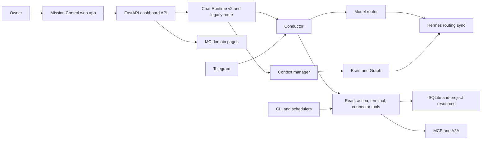
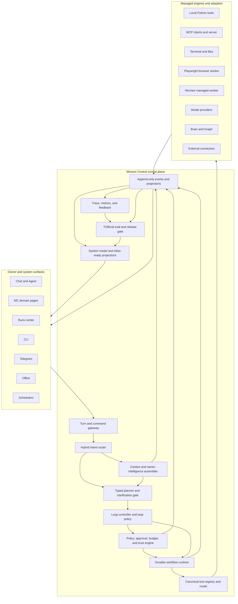
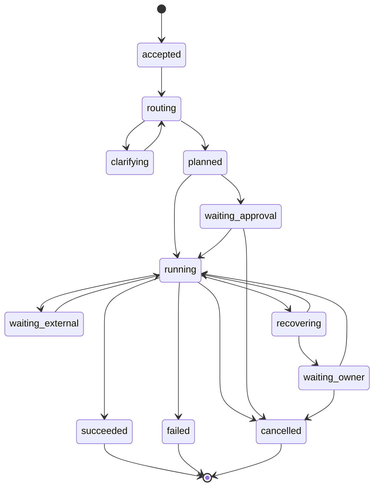
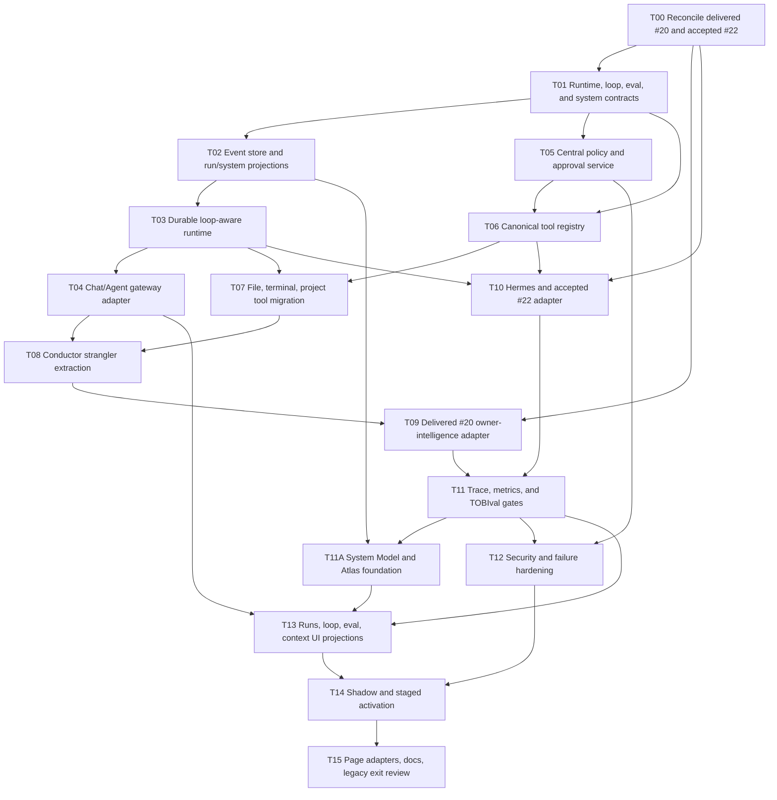

# Mission Control Infrastructure V2 Plan

## Queue Contract

| Field | Decision |
|---|---|
| Queue item | `#21` |
| Status | In progress; T00-T04 and T05 Runs 1-3 delivered, T05 closure pending owner acceptance |
| Delivered dependency | `#20` Brain V2 is delivered; T00 must reconcile this plan with its actual contracts, migrations, context behavior, and rollback path |
| Start gate | Satisfied 2026-08-01 by `#22` Codex-only V2 qualification (`e9bc5fe`); other workers remain locked until separately qualified |
| Deployment confidence | The `#22` 24-hour/72-hour VPS soak remains a deployment confidence gate, not a source-development blocker for `#21` unless the owner explicitly promotes it to one |
| Primary outcome | Make Mission Control the authoritative, reliable control plane for TOBI |
| First usable release | Reliable Chat/Agent runtime with durable runs, typed tools, policy, and traceability |
| Migration style | Incremental strangler migration behind per-domain flags |
| Deployment posture | Local-first on the owner's Windows/D-drive environment; managed services remain optional |
| Worker model | Small sequential packages; one implementation worker at a time |
| Compatibility | Preserve existing conversations, actions, runs, tools, pages, Telegram, CLI, Office, and schedulers through adapters |
| Planning boundary | Implement one bounded T-package at a time; never submit the full program as one Developer runtime job |

This plan consolidates TOBI around Mission Control (MC). MC becomes the owner of run state, policy, approvals, tools, context, audit, observability, and shared UI projections. Hermes remains useful as a managed execution engine, but it must not become a second control plane.

Before implementation, reconcile this plan against the delivered or accepted state of:

- [Brain Context & Architecture V2](BRAIN_CONTEXT_ARCHITECTURE_V2_PLAN.md) (`#20`, delivered and authoritative)
- [TOBI Coding Agent V2](TOBI_CODING_AGENT_V2_PLAN.md) (`#22`, implementation delivered; acceptance still open)
- [Coding Agent V2 completion acceptance](TOBI_CODING_AGENT_V2_COMPLETION_ACCEPTANCE_2026-07-22.md) (ten-run matrix plus owner browser acceptance)
- [TOBI Coding Agent / Controlled Self-Development System](TOBI_CODING_AGENT_SELF_DEVELOPMENT_PLAN.md) (`#18`, historical compatibility source)
- [Current TOBI architecture](../ARCHITECTURE.md)
- [Current Mission Control guide](../MISSION_CONTROL.md)

Do not begin `#21` while `#22` acceptance remains open. T00 must map the delivered `#20` and accepted `#22` contracts into one owner per shared API, table, event, runtime, context, policy, and frontend projection before implementation packages start. Never run `#21` workers in parallel with corrective `#22` work that touches the same contracts, migrations, durable execution, tool policy, Brain context, Hermes adapters, observability, or Developer state.

## 1. Outcome And Non-Goals

### 1.1 Required outcome

MC must be able to:

1. accept an owner request from Chat, Agent, a page action, CLI, Telegram, Office, or a scheduler;
2. classify the request with deterministic rules before model planning;
3. assemble only relevant owner, project, system, and conversation context;
4. select tools from a filtered, typed registry;
5. enforce permissions, approvals, budgets, and trust boundaries centrally;
6. execute short or long workflows with persisted checkpoints and idempotency;
7. stream one ordered run history to every relevant MC page;
8. recover the same run after failure, restart, disconnect, or owner intervention;
9. produce grounded answers and action receipts from actual evidence;
10. learn from verified outcomes and explicit owner feedback without silently changing safety policy.

### 1.2 V1 non-goals

- multi-tenant SaaS hosting;
- replacing SQLite before measured contention requires it;
- forcing every internal call through a network MCP server;
- adopting Temporal, Trigger.dev, or Inngest before the local durable runtime is proven insufficient;
- unrestricted autonomous computer control;
- arbitrary multi-agent swarms;
- removing legacy Chat, Conductor, `agent_runs`, or `tobi_actions` during the first release;
- rebuilding the frontend design system;
- changing Supabase or Vercel.

## 2. Graphify-Guided Current-State Audit

Graphify is a navigation index only. The graph snapshot used by the original plan predates delivered `#20` and the `#22` completion implementation. T00 must refresh or verify focused graph paths against current `main`, then reconcile every material conclusion against live source, migrations, tests, and accepted runtime evidence.



| Node | Current truth | V2 gap |
|---|---|---|
| FastAPI boundary | `api/dashboard.py` owns a very large set of routes, SSE, static hosting, and orchestration glue | High collision risk; HTTP concerns and domain services are not consistently separated |
| Conductor | `core/conductor.py` owns classification, prompts, tool catalog behavior, execution, permissions, confirmations, action logging, and surface-specific behavior | God-module blast radius; policy and tool behavior are difficult to evolve independently |
| Chat Runtime v2 | Typed turn/tool/error contracts, context manifests, telemetry, bounded workers, runtime flags, and recovery routes exist | It coexists with legacy orchestration; contracts are incomplete as a platform-wide runtime |
| Agent runs | `agent_runs` and steps persist Chat Agent history and same-run recovery | Not yet the universal durable workflow state for page actions, coding workflows, Office, CLI, or schedulers |
| Actions | `tobi_actions` stores proposals and outcomes | Action history and run history are related but separate; no canonical append-only event stream |
| Tool registry | Typed `ToolSpec` validation exists for the Chat runtime | Tool metadata, MCP tools, Conductor functions, terminal capabilities, and page commands still have multiple ownership paths |
| Context | A `ContextManifest` and token budgets exist | Owner intelligence is not consistently applied to routing, planning, tool choice, and final response across all surfaces |
| Brain and Graph | Delivered `#20` makes Brain V2 authoritative while retaining legacy compatibility; Graph exposes typed relationships and provenance | MC V2 must consume the delivered contracts rather than inventing a second memory schema, and must project context influence into runs and eval evidence |
| Hermes | Startup, persona/skills, memory, and model routing have several one-way sync paths | No single synchronization contract; split-brain behavior is possible |
| MCP/A2A | Inbound/outbound tools, scopes, approvals, audits, and discovery exist | MCP is not yet the canonical tool description shared by local tools, pages, and the runtime |
| MC pages | Rich domain pages exist and each has useful local state | Cross-page actions, run progress, recovery, and audit are not projected from one shared live state |
| Observability | Usage, actions, runtime events, performance doctor, and page-specific status exist | No unified trace joins request, context, route, model, tool, approval, artifact, cost, and owner feedback |
| Evals | Strong feature-specific test suites exist | No required behavioral gate for tool choice, context quality, workflow recovery, or hallucination resistance |
| Security | Vault, mode denial, terminal gates, MCP scopes, SSRF guards, and prompt boundaries exist | Policy is distributed; excessive agency, cross-surface permissions, budgets, and untrusted evidence need one authority |

### 2.1 Existing assets to preserve

- `core/chat_runtime.py` and `core/chat_runtime_contracts.py` as the seed for the shared runtime contracts;
- `core/tool_registry.py` as a migration source, not a second permanent registry;
- `core/context_manager.py` as the first manifest builder;
- `core/agent_runs.py` and `tobi_actions` as compatibility data sources;
- current mode enforcement, terminal safety, vault, network guard, MCP security, artifact storage, and SSE behavior;
- all saved conversations and message metadata;
- existing page APIs until domain adapters are proven;
- rollback flags already used by Chat and feature pages.

## 3. Research Decisions

Use the following primary/official references as design inputs, not automatic dependency choices:

| Topic | Reference | Decision for TOBI |
|---|---|---|
| Durable execution | [Temporal](https://docs.temporal.io/), [Trigger.dev](https://trigger.dev/docs), [Inngest](https://www.inngest.com/docs) | Build a small local durable state machine first. Re-evaluate managed execution only for multi-host, high-volume, or operationally demanding workloads. |
| Tool interoperability | [MCP architecture](https://modelcontextprotocol.io/docs/learn/architecture), [MCP authorization](https://modelcontextprotocol.io/specification/2025-06-18/basic/authorization) | Make one canonical tool contract MCP-compatible while allowing direct in-process local invocation. |
| Agent runtimes | [LangGraph persistence](https://docs.langchain.com/oss/python/langgraph/persistence), [Google ADK](https://google.github.io/adk-docs/), [OpenAI Agents SDK](https://openai.github.io/openai-agents-python/), [AutoGen Core](https://microsoft.github.io/autogen/stable/user-guide/core-user-guide/index.html) | Borrow checkpoints, typed handoffs, sessions, guardrails, and traces. Avoid framework lock-in and unrestricted agent teams. |
| Agent memory | [Letta memory](https://docs.letta.com/guides/agents/memory), [Mem0 memory types](https://docs.mem0.ai/core-concepts/memory-types), [LlamaIndex memory](https://docs.llamaindex.ai/en/stable/module_guides/deploying/agents/memory/) | Use relevance-gated typed memory with provenance and certainty; do not inject the full profile every turn. |
| Browser/computer action | [Playwright](https://playwright.dev/docs/intro), [E2B](https://e2b.dev/docs), [Browser Use](https://docs.browser-use.com/) | Use deterministic Playwright workflows first. Keep E2B optional for isolated risky jobs and Browser Use optional for adaptive sites. |
| Observability/evals | [OpenTelemetry](https://opentelemetry.io/docs/concepts/), [Phoenix](https://arize.com/docs/phoenix), [Braintrust](https://www.braintrust.dev/docs), [LangSmith](https://docs.langchain.com/langsmith/home) | Emit OpenTelemetry-compatible local traces first. Keep vendor exporters optional; use MC as the owner-facing trace UI. |
| LLM security | [OWASP Top 10 for LLM Applications](https://genai.owasp.org/llm-top-10/) | Treat prompt injection, sensitive disclosure, excessive agency, supply-chain tools, and unbounded consumption as release gates. |

### 3.1 Durable-runtime decision gate

Stay on the local runtime while all are true:

- one owner and one primary MC deployment;
- SQLite remains healthy under concurrency tests;
- workflows can recover after process restart;
- local scheduling and workers meet latency targets;
- no cross-region or always-on worker requirement exists.

Open a separate architecture decision record before adopting a managed service. The ADR must compare operational burden, Windows/local support, D-drive data placement, offline behavior, lock-in, cost, secrets, migration complexity, and rollback.

## 4. Locked Product Decisions

The 60-question intake is summarized below. Workers must not reopen these choices unless current code makes one impossible.

| Area | Locked decision |
|---|---|
| Authority | MC is the authoritative control plane |
| Migration | Incremental strangler migration |
| Success priority | Action reliability first |
| Scope | All MC pages eventually; reliable Chat/Agent core first |
| Conductor | Thin compatibility facade after migration |
| Backend structure | Shared core services plus staged page adapters |
| Queue order | Reconcile delivered `#20`; begin only after `#22` passes the ten-run local matrix and owner browser acceptance |
| Other surfaces | Telegram, CLI, Office, and schedulers use compatibility adapters initially |
| Deployment | Local-first hybrid |
| Ownership | Single-owner, future-ready data and API contracts |
| Runtime | Local durable runtime first |
| Loop control | Persisted turn-, goal-, time-, and future proactive-loop recipes/policies; goal-based is the Developer default |
| Developer loop choice | MC suggests the safest compatible loop with reason; owner may make a policy-valid override |
| Proactive autonomy | Disabled by default until owner, policy, TOBIval, budget, approval, and explanation gates pass |
| Delivery semantics | At-least-once execution with idempotency |
| Approvals | Risk-based approvals |
| Recovery | Runs resumable indefinitely; safe steps auto-resume after restart |
| Retry | Bounded retry, then same-run recovery card |
| Tool contract | MCP-style canonical contract; direct local invocation allowed |
| First tool domains | Files, terminal, and projects |
| Discovery | Filtered registry, not an all-tools prompt |
| Policy | One central policy engine |
| Results | Typed result plus durable action receipt |
| Routing | Deterministic rules, then structured planner |
| Missing capability | Offer setup or a safe alternative |
| Owner intelligence | Influences routing through final response |
| Certainty | `known`, `inferred`, `contradicted`, or `stale` |
| Learning | Explicit feedback plus verified outcomes |
| Corrections | Supersede immediately while retaining history |
| Context visibility | Context chips plus expandable manifest |
| Memory use | Relevance-gated |
| Hermes | Managed engine component |
| Sync authority | MC-authoritative selective sync; MC wins conflicts |
| Multi-agent | Orchestrator with bounded workers |
| Handoffs | Typed task and artifact handoffs |
| Isolation | Local isolation first; E2B optional |
| Browser | Deterministic Playwright first |
| External commitments | Require approval before execution |
| Browser evidence | Trace plus key screenshots |
| Telemetry | OpenTelemetry-compatible events plus MC local UI |
| Trace UX | Concise by default, expandable details |
| Retention | Full trace 90 days, then redacted summary |
| Evals | Local-first TOBIval release and autonomy regression gates |
| Dataset | Golden cases plus real production failures |
| Reliability target | At least 95% supported-workflow completion or structured recovery |
| Trust | Label by source class; trust never grants instruction authority |
| Credentials | Vault-brokered, purpose-bound access |
| Budgets | Per-run hard limits |
| Run UI | Global Runs center plus contextual page views |
| Frontend state | Shared live projections across pages |
| Failure UX | Actionable recovery cards |
| System model | Separate evidence-backed System Graph; delivered `#20` Brain Graph remains owner/project/resource knowledge authority |
| Living Atlas | Foundation only in `#21`; full visual page and advanced animation are deferred |
| Schema | Additive shared runtime tables |
| History | Append-only events plus projections |
| Rollback | Per-domain feature flags |
| Services | Targeted managed services allowed only after an ADR |
| Delivery packages | Small sequential worker packages |
| Docs | Update after each accepted phase |
| Build order | Runtime, then tools, then owner intelligence |
| Activation | Shadow mode, then staged defaults |

## 5. Target Architecture



### 5.1 Domain ownership

| Domain | Sole responsibility | Must not own |
|---|---|---|
| Turn gateway | Request validation, identity/surface, idempotency, SSE/reconnect | Tool logic, prompts, persistence SQL |
| Intent router | Deterministic classification, confidence, candidate capabilities | Tool execution or owner memory retrieval |
| Context service | Context manifests, relevance, certainty, provenance, token budgets | Permission decisions or action execution |
| Planner | Typed plans, dependencies, clarification needs, expected artifacts | Direct side effects |
| Loop controller | Loop recipe selection, trigger handling, stop conditions, attempt/runtime/cost envelopes, and recovery progression | Tool permissions, model-specific prompting, or bypassing runtime state |
| Loop policy | Persisted effective loop limits, required approvals/evals, allowed tools, and owner override record | Executing steps or silently increasing autonomy |
| Policy engine | Mode/surface capability, risk, approval, credential, budget, isolation decisions | UI rendering or model prose |
| Workflow runtime | State transitions, leases, checkpoints, retries, cancellation, resume, and execution of persisted loop policies | Tool implementations, loop selection, or provider-specific parsing |
| Tool registry/router | Canonical schemas, discovery, validation, invocation adapter selection | Owner-facing response composition |
| Event store | Append-only durable facts with sequence numbers | Business decisions |
| Run projection service | Current run/page views derived from events | Mutable source-of-truth history |
| Trace service | Timings, cost, redaction, trace joins, and feedback | Execution authority or release decisions |
| TOBIval eval gate | Local-first eval cases, runs, findings, scoring, release gates, and autonomy regression decisions | Runtime execution or rewriting evidence |
| System model/projection service | Typed TOBI entities/edges, capability evidence, limitations, risks, changes, and Atlas-ready read projections | Owner memory, workflow authority, or a full visualization page |
| Response composer | Grounded owner-facing result from evidence and receipts | New actions or hidden tool calls |
| Surface adapters | Translate Chat/page/CLI/Telegram requests and render events | Duplicated policy or orchestration |

### 5.2 Conductor end state

Keep in `Conductor`:

- stable `answer(...)` compatibility entry point;
- surface normalization for old callers;
- shared butler persona reference until the response composer owns it;
- translation from legacy callbacks/events to the new gateway;
- one feature flag selecting legacy or V2 behavior.

Move out:

| Current concern | Target owner |
|---|---|
| intent classification | `intent_router` |
| prompt/tool catalog construction | `planner` plus filtered `tool_registry` |
| tool argument parsing/repair | typed model adapter plus `tool_router` |
| mode and risk permissions | `policy_engine` |
| approval creation/resolution | `approval_service` |
| action execution | `workflow_runtime` plus `tool_router` |
| action logging | `event_store` plus compatibility projector |
| Brain/profile assembly | `context_service` |
| provider fallback | `model_adapter` |
| final grounding/persona | `response_composer` |
| Telegram-specific limitations | Telegram surface policy |

The migration must delegate one concern at a time. Do not rewrite `conductor.py` in one worker task.

## 6. Core Contracts

Use validated dataclasses or Pydantic models consistently. No unvalidated dictionary may cross a domain boundary.

### 6.1 Run and plan contracts

```text
RunRequest
  request_id, surface, owner_id, session_id, mode, message, attachments,
  capability_toggles, selected_project, client_timestamp, budget_profile

RouteDecision
  route_class, intent, confidence, candidate_capabilities, clarification,
  context_requirements, planner_required, reasons

ExecutionPlan
  plan_id, run_id, objective, assumptions, steps[], expected_artifacts,
  approval_points, completion_predicate, budget

PlanStep
  step_id, kind, tool_name, arguments, depends_on[], risk, timeout,
  retry_policy, idempotency_key, required_capabilities, output_contract

RunEvent
  event_id, run_id, sequence, event_type, stage, timestamp, actor,
  redacted_payload, trace_id, parent_span_id
```

### 6.2 Canonical tool contract

```text
ToolSpec
  name, namespace, version, description, input_schema, output_schema,
  side_effect_class, risk, allowed_modes, allowed_surfaces,
  required_permissions, required_integrations, credential_purpose,
  timeout, retry_policy, idempotency_policy, isolation,
  cost_hint, audit_policy, availability_probe, adapter

ToolCall
  call_id, run_id, step_id, tool_ref, validated_arguments,
  idempotency_key, approval_id, deadline

ToolResult
  status, typed_output, evidence_refs, artifact_refs, receipt_id,
  retryable, error, timing, cost

ActionReceipt
  receipt_id, run_id, step_id, tool_ref, target, effect_summary,
  before_ref, after_ref, external_ref, approval_ref, timestamp
```

MCP export/import is an adapter around `ToolSpec`; it is not a parallel registry. Local tools can execute in process after the same validation and policy checks.

### 6.3 Context and certainty contract

Each context item must contain:

- `source_type`: conversation, owner_memory, project, system_state, connector, web, file, tool_result;
- `trust_class`: owner_direct, system_verified, connector_verified, derived, untrusted_content;
- `certainty`: known, inferred, contradicted, stale;
- `relevance_score`, `token_cost`, `version`, `retrieved_at`, and optional expiry;
- `instruction_authority`: always false for files, web, connector content, tool output, and imported text;
- `owner_visible_label` and provenance reference.

### 6.4 Loop, eval, and system-model contracts

```text
LoopRecipe
  recipe_id, version, name, loop_type, trigger, objective, stop_condition,
  max_attempts, max_runtime, max_cost, allowed_tools, approval_gates,
  required_evals, recovery_policy, evidence_required

LoopPolicy
  policy_id, version, recipe_id, owner_override, loop_type, trigger, objective,
  stop_condition, max_attempts, max_runtime, max_cost, allowed_tools,
  approval_gates, required_evals, recovery_policy, evidence_required,
  policy_decision_id, enabled

EvalCase
  eval_case_id, version, category, objective, input_fixture, expected_behavior,
  required_evidence, scorer, threshold, release_gate, autonomy_gate

EvalRun
  eval_run_id, eval_case_id, run_id, trace_id, status, score, threshold,
  tool_call_refs, policy_decision_refs, context_manifest_ref,
  receipt_refs, artifact_refs, finding_refs, started_at, completed_at

EvalFinding
  finding_id, eval_run_id, defect_ref, category, severity, summary,
  evidence_refs, remediation_owner, status

SystemEntity
  entity_id, entity_type, canonical_key, name, status, version,
  owner_domain, source_ref, metadata, observed_at

SystemEdge
  edge_id, from_entity_id, edge_type, to_entity_id, evidence_refs,
  confidence, valid_from, valid_to
```

`entity_type` is limited initially to subsystem, component, capability, tool, loop, run, eval, policy, integration, limitation, risk, decision, and queue item. Contracts are additive and versioned; delivered `#20` Brain contracts remain the authority for owner/project/resource knowledge.

## 7. Durable Execution

### 7.1 State machine



### 7.2 Runtime rules

1. Persist the run and `accepted` event before performing work.
2. Claim runnable steps with an expiring owner-token lease.
3. Delivery is at least once; every side-effecting step requires an idempotency strategy.
4. Retry only declared retryable failures with bounded exponential backoff and jitter.
5. After retry exhaustion, retain the same `run_id` and present recovery commands.
6. Safe, idempotent steps may auto-resume after restart; risky or externally visible steps require receipt reconciliation or owner review.
7. Cancellation is cooperative, persisted, and checked before/after every model or tool boundary.
8. Completed receipts are immutable. A retry cannot repeat a completed side effect.
9. Run budgets hard-stop further work and return a structured recovery state.
10. Long model, reader, terminal, and browser work use dedicated bounded executors or managed subprocesses.

### 7.3 Recovery commands

- `resume`
- `retry_step`
- `skip_step` only when the plan declares the step optional
- `revise_plan`
- `provide_input`
- `approve`
- `reject`
- `cancel`

Every command uses optimistic versioning so two pages cannot mutate the same run state inconsistently.

### 7.4 First-class loop control

Loops are persisted runtime strategies, not prompt templates:

| Loop type | Use | Default posture |
|---|---|---|
| Turn-based | Owner-guided conversation, planning, ambiguous work, and risky work that needs frequent clarification | Advance one bounded turn at a time and return control to the owner |
| Goal-based | Developer Queue implementation and other work with an explicit outcome, evidence criteria, and durable checkpoints | Default Developer execution loop; continue until the stop condition, policy gate, budget, or recovery state is reached |
| Time-based | Scheduled checks, monitoring, Health, Storage, News, and integration maintenance | Run only from an approved schedule with bounded work per tick |
| Proactive | Future system-initiated autonomy based on observed state or opportunities | Disabled by default until policy, eval, budget, explanation, and owner-approval gates pass |

Every executable loop uses a versioned `LoopRecipe` and an effective `LoopPolicy` snapshot containing:

- `loop_type`
- `trigger`
- `objective`
- `stop_condition`
- `max_attempts`
- `max_runtime`
- `max_cost`
- `allowed_tools`
- `approval_gates`
- `required_evals`
- `recovery_policy`
- `evidence_required`

The Loop Controller evaluates trigger eligibility, starts or advances the canonical run, checks stop/budget/evidence conditions before each iteration, and emits ordered loop events. The Workflow Runtime remains responsible for durable state, leases, checkpoints, idempotency, and step execution.

For Developer/Queue execution, MC suggests the safest suitable loop with a concise reason. The owner may override the suggestion only within policy. The chosen `loop_recipe_id`, recipe version, effective limits, owner override, and policy decision are persisted on the run before work begins; loop choice must never exist only in model prompt text.

## 8. Tool And MCP Standardization

### 8.1 First migration wave

| Domain | Initial tools | Reason |
|---|---|---|
| Files | list, read, search, preview, write proposal | High reuse and clear schemas |
| Terminal | command proposal, execute, job status, cancel | Highest safety/recovery need |
| Projects | list/get project, create/update task, resource search | Core owner workflow and existing grounding issues |

Second wave: Brain, integrations, GitHub/Notion, Office, browser, coding-agent tools, and schedulers.

### 8.2 Discovery and policy sequence

```mermaid
flowchart LR
  Intent["Route decision"] --> Filter["Filter by mode, surface, project, integration, availability"]
  Filter --> Rank["Rank by deterministic fit and owner preferences"]
  Rank --> Plan["Structured planner sees only short candidate specs"]
  Plan --> Validate["Schema validation"]
  Validate --> Policy["Central policy decision"]
  Policy --> Approve["Approval when required"]
  Approve --> Invoke["Local, MCP, terminal, browser, or Hermes adapter"]
  Invoke --> Receipt["Typed result, evidence, artifacts, receipt"]
```



Never advertise the entire tool catalog to a model. Denied tools must be both absent from planning context and rejected server-side.

MC pages consume the same command gateway as Chat/Agent. MCP server and client adapters expose or import approved registry entries; page code must not bypass policy by calling tool functions directly.

## 9. Brain And Graph Owner Intelligence

This plan consumes the typed memory output of `#20`; it must not invent a second memory schema.

### 9.1 Influence stages

| Stage | Allowed influence | Required evidence |
|---|---|---|
| Routing | preferred workflow, usual project, communication pattern | active relevant memory with scope and provenance |
| Planning | constraints, quality standards, risk tolerance, working style | approved rules/preferences; current instruction wins |
| Tool choice | preferred connector/tool, prior verified success/failure | tool availability plus outcome history |
| Execution | harmless defaults and reversible parameters | confidence threshold and policy allowance |
| Final response | tone, detail, evidence format, next action | response preference plus actual run evidence |

### 9.2 Guardrails

- Current explicit owner instruction overrides memory.
- Memory never grants permission, supplies a secret, or weakens a safety check.
- Only relevant memories enter the manifest; no full-owner-profile injection.
- Inferences are labeled and cannot become hard rules without the owner-review gate defined by delivered `#20`.
- Contradicted items are excluded from action defaults and surfaced for review.
- Corrections supersede immediately while history remains auditable.
- Graph paths can support relevance and provenance, but cannot create instruction authority.
- Every non-conversation source used appears as a context chip with an expandable manifest.
- Feedback records whether context was useful, irrelevant, or wrong and updates ranking only after verified outcomes.

## 10. Hermes As A Managed Engine

### 10.1 Hermes keeps

- execution skills that are useful and demonstrably reliable;
- accepted coding-worker behavior and evidence contracts from `#22`, with `#18` retained only for compatibility;
- compatible model/provider execution where MC delegates a bounded task;
- read-only repository skill discovery;
- optional isolated worker processes.

### 10.2 MC owns

- owner/session identity;
- run, plan, checkpoint, and artifact state;
- canonical tool registry;
- policy, approval, budget, and credentials;
- Brain/Graph context selection;
- final response and owner-visible history;
- retries, cancellation, recovery, audit, and evaluation.

### 10.3 Sync protocol

Create versioned `HermesCapabilityManifest` and `HermesExecutionRequest/Result` contracts. Sync only allowlisted skills, model routing hints, and capability metadata. Record source version, checksum, sync direction, status, and conflict.

Rules:

1. MC is authoritative and wins conflicts.
2. Hermes cannot directly mutate MC memory, policy, approvals, queue, or run state.
3. Results return as untrusted typed evidence plus artifacts.
4. A failed sync does not block MC Chat; the capability is marked unavailable.
5. Legacy direct Hermes paths become read-only or compatibility adapters before removal.

## 11. Agent Runtime And Multi-Agent Boundaries

Borrow these patterns:

- LangGraph: checkpointed state and explicit interrupts;
- Google ADK: sessions, artifacts, callbacks, and evaluable workflows;
- OpenAI Agents SDK: typed handoffs, guardrails, and trace spans;
- AutoGen Core: event-driven bounded workers and message contracts;
- Codex-style workflows: isolated workspaces, explicit plans, staged verification, and owner review.

Do not adopt:

- an additional framework as MC's source of truth;
- open-ended agent-to-agent chat;
- recursive delegation without a hard depth limit;
- workers with shared mutable state;
- worker access to vault credentials or approval authority.

V1 supports one orchestrator and bounded specialist workers. A handoff contains a typed objective, allowed tools, context manifest references, budget, deadline, expected artifact schema, and completion predicate. The orchestrator validates every returned artifact before continuing.

## 12. Real Computer And Web Action

### 12.1 Browser V1

- Use Playwright with declared, deterministic workflows.
- Persist action trace, URL transitions, selector/action summaries, console errors, downloads, and key screenshots.
- Require approval before purchase, submit, publish, send, delete, or any externally visible commitment.
- Re-check policy after redirects and before final submission.
- Treat page content as untrusted; page text cannot change the task or call tools.
- Store browser profiles and downloaded artifacts in scoped D-drive runtime directories with retention rules.

### 12.2 Isolation ladder

| Risk | Execution boundary |
|---|---|
| Read-only local task | Bounded in-process or subprocess adapter |
| Local file/code mutation | Approved workspace plus path allowlist and snapshot |
| Untrusted dependency or risky code | Local container/sandbox when available |
| Stronger remote isolation need | Optional E2B adapter after an ADR |
| Highly adaptive website | Optional Browser Use planner while Playwright remains the executor/policy boundary |

## 13. Observability, Evals, And Retention

### 13.1 Unified trace

Every trace must join:

- request and surface;
- route decision and confidence;
- context manifest IDs, token counts, certainty, and cache state;
- planner/model attempts, provider/model, latency, tokens, and estimated cost;
- step transitions, queue/worker wait, tool validation, tool duration, and result;
- approvals, policy decisions, retries, recovery, and cancellation;
- evidence, receipts, artifacts, final outcome, and owner feedback.

Use OpenTelemetry-compatible trace/span IDs. Store redacted local events first; exporters are optional adapters. MC is the default owner-facing view.

### 13.2 Observability stack choice

| Option | Strength | Cost/risk for TOBI | V2 decision |
|---|---|---|---|
| OpenTelemetry | Vendor-neutral trace, metric, and log contracts | Requires TOBI to build useful local projections and redaction | Required compatibility layer and internal trace IDs |
| Phoenix | Strong local/open-source LLM tracing and evaluation | Adds another service and storage surface | Optional local exporter after core traces stabilize |
| Braintrust | Managed eval datasets, experiments, and scoring | External service, cost, and sensitive-data review | Optional eval exporter only; never required for runtime |
| LangSmith | Mature LangChain/LangGraph tracing and eval workflows | Vendor coupling and less value without LangChain runtime | Do not adopt as the source of truth; optional adapter only if later justified |

No external exporter may receive owner content, secrets, raw files, or full prompts by default. Export is opt-in, redacted, and controlled from MC.

### 13.3 Local-first TOBIval release and autonomy gates

`TOBIval` is MC's local-first evaluation infrastructure. Cases, fixtures, scorers, findings, and gate decisions remain runnable without an external service. Optional exporters may mirror redacted results, but MC owns the authoritative case, run, finding, release, and autonomy status.

| Required category | Minimum proof |
|---|---|
| Final answer quality | The response satisfies the request, reports uncertainty honestly, and grounds material claims in evidence or receipts |
| Tool trajectory | The expected route and filtered tool sequence is selected, unnecessary calls are avoided, and clarification occurs when required |
| Policy and approval correctness | Denied tools never execute; approvals are requested, resolved, and re-checked at the correct boundary |
| Recovery and idempotency | Injected failures resume the same run and loop without duplicating completed side effects |
| Brain context relevance | Relevant delivered `#20` context is included with provenance; irrelevant, stale, contradicted, or sensitive context is excluded |
| Hallucination resistance | Untrusted files, web, connectors, and tool output cannot override instructions; action success is never fabricated |
| Connector freshness | Connector-derived claims include source and freshness evidence; stale or unavailable connectors produce a bounded gap or recovery state |
| Coding workflow qualification | Accepted `#22` Goal-to-Queue, preflight, agent, checkpoint, review, and evidence invariants remain qualified |
| Concurrency and durability | Ten simultaneous runs keep attribution, event sequence, projections, leases, and database integrity |
| Cost and budget | Attempt, runtime, token, tool, storage, and cost limits stop work deterministically |
| Compatibility | Saved chats, legacy events, coding history, and old surface adapters continue working |

Required TOBIval suites are release gates for affected domains and autonomy gates for loop behavior. A phase cannot activate by default while a required eval is failing, missing, stale beyond its declared window, or below threshold. Autonomy cannot increase when any required eval regresses; the effective loop policy must retain or reduce autonomy until the regression is resolved and the gate reruns successfully.

Add reviewed real failures to the local regression dataset with sensitive content removed. Every failed gate creates an actionable `EvalFinding` with severity, evidence, affected capability/release, remediation owner, and status.

### 13.4 Eval evidence and projections

Every eval case and run must link, when applicable, to:

- canonical `run_id` and OpenTelemetry-compatible `trace_id`;
- ordered tool calls and typed results;
- versioned policy and approval decisions;
- the exact context manifest;
- receipts and artifacts used as evidence;
- the failed finding or source defect that created the case.

Eval projections expose the latest required-gate state by release, capability, tool, loop recipe, model/provider, connector, and coding workflow. Projection rebuild must reproduce the same gate outcome from immutable events and referenced evidence.

### 13.5 Retention

- Full redacted run events and traces: 90 days by default.
- After 90 days: retain summary, outcome, metrics, receipts, approval record, and artifact references according to domain retention.
- Secrets, raw credentials, sensitive prompt bodies, and unnecessary file content never enter telemetry.
- Owner can inspect retention usage and trigger eligible cleanup from Storage/Health.

## 14. Security And Autonomy Policy

### 14.1 Central policy inputs

- authenticated owner/session and surface;
- mode and requested capability;
- tool risk and side-effect class;
- target resource/project;
- trust/certainty of arguments;
- integration and credential purpose;
- approval state;
- run budgets and cumulative cost;
- isolation requirement;
- current system health and kill switches.

### 14.2 Mandatory controls

1. Untrusted content is data, never instructions.
2. Every tool call is schema-validated after model output and before policy.
3. Vault issues purpose-bound credential access to adapters; models and workers never receive raw credentials.
4. Destructive, external, financial, publishing, sending, deployment, and permission-changing actions require approval.
5. File and terminal tools enforce path/command boundaries independently of the model.
6. Network tools retain SSRF, redirect, DNS/IP, content-size, and timeout guards.
7. Tool packages and MCP servers require allowlisting, provenance, version pinning, and capability review.
8. Logs redact secrets and sensitive content before persistence and export.
9. Per-run model calls, tool calls, elapsed time, tokens, cost, downloads, and storage have hard limits.
10. Global and per-domain kill switches stop new work without corrupting persisted runs.

### 14.3 No premature proactive autonomy

Proactive loops remain disabled by default. MC may enable a specific proactive `LoopRecipe` only when all are true:

1. the owner explicitly approves that version of the recipe;
2. central policy permits its trigger, tools, target, and execution boundary;
3. the required TOBIval baseline passes without regression;
4. attempt, runtime, model/tool, cost, download, and storage budgets are persisted;
5. every external, destructive, publishing, financial, permission-changing, deployment, or otherwise material side effect remains approval-gated;
6. Runs and Atlas-ready system projections can explain the trigger, context, policy, actions, evidence, outcome, and recovery path.

Recipe edits invalidate prior proactive approval and require policy/eval requalification. A kill switch or eval regression prevents new proactive runs without corrupting already-persisted history.

## 15. UI And Shared State

### 15.1 Global Runs center

Add a `/runs` operational page with:

- active, waiting, failed, completed, and cancelled filters;
- objective, source surface, mode, current step, elapsed time, budget, and owner attention state;
- concise milestone timeline with expandable technical trace;
- context chips, approvals, tool calls, receipts, artifacts, and model escalation notices;
- loop type/recipe, effective limits, stop condition, and required eval status;
- same-run Resume, Retry step, Skip, Revise, Approve/Reject, and Cancel controls;
- links back to the originating Chat, Project, Office mission, Developer workflow, or task.

### 15.2 Contextual projections

Chat, Projects, Office, Developer, Actions, Tasks, Health, and Architecture should show a filtered projection of the same run/event data, not separate workflow truth. Loop, eval, trace, context, recovery, capability, and evidence links use the same projection identity.

Use one frontend run store keyed by `run_id`. It consumes ordered snapshots/events, deduplicates by sequence, reconnects from the last sequence, and invalidates domain queries after relevant receipts.

### 15.3 Page changes

| Page | V2 change |
|---|---|
| Chat | Preserve current timeline; use canonical run events, context manifest, and recovery commands |
| Actions | Project action receipts and approvals from run events; keep legacy history visible |
| Projects/Tasks | Show related runs, live changes, and receipts; route mutations through command gateway |
| Office | Adapt missions and actions to shared runs after Chat stabilizes |
| Developer | Adapt accepted `#22` coding workflows to shared runtime contracts; suggest a safest suitable loop with reason, allow a policy-bounded owner override, and show the persisted recipe/eval state |
| Brain/Graph | Show which memories/paths influenced a run and collect feedback |
| Health/Performance | Runtime latency, failure class, queue depth, worker saturation, cost, loop health, and TOBIval gate status |
| Architecture | Update Mermaid diagrams and domain ownership after each accepted phase; link capabilities and limitations to evidence-backed system entities |

Do not create nested cards or expose raw traces by default. Recovery cards must state what failed, what completed, whether retry is safe, and what each command will do.

`#21` is not a full frontend redesign. Its required frontend foundation is limited to:

- the Runs Center;
- one shared live frontend store/projection client;
- actionable recovery and approval cards;
- an expandable trace/context viewer;
- an eval status panel;
- a loop selector in Developer with suggestion reason and persisted selection state;
- capability/evidence links;
- Atlas-ready APIs and projections.

Defer the full Living Atlas page, an advanced animated system graph, and an architecture visual-delta timeline to a later queue item. Existing page structure, theme tokens, components, and responsive conventions remain the default.

### 15.4 System Model / Living Atlas Foundation

MC maintains a separate System Graph over these entity types:

- subsystem;
- component;
- capability;
- tool;
- loop;
- run;
- eval;
- policy;
- integration;
- limitation;
- risk;
- decision;
- queue item.

Boundaries:

- **Brain Graph** is the delivered `#20` graph for owner memory, project knowledge, resources, and their provenance.
- **System Graph** models TOBI architecture, capabilities, runtime relationships, evidence, limitations, risks, policy, decisions, and change events.
- **Living Atlas** is a future owner-facing visual layer over the System Graph, traces, evals, risks, and changes.

`#21` builds only the typed entities/edges, evidence and limitation records, change-event ingestion, deterministic projections, and read APIs required by a future Atlas page. It must not duplicate Brain memories, infer unsupported capability status, or scope the deferred Atlas visualization into this implementation.

## 16. Data Model And Compatibility

### 16.1 Additive tables

| Table | Purpose |
|---|---|
| `mc_runs` | Canonical workflow identity, objective, status, version, source, budget, and legacy links |
| `mc_run_steps` | Typed plan steps, dependencies, lease, attempts, status, and idempotency |
| `mc_run_events` | Append-only ordered events and redacted payloads |
| `mc_run_commands` | Owner/system recovery and control commands with optimistic version |
| `mc_run_artifacts` | Artifact metadata and scoped storage references |
| `mc_run_approvals` | Risk decision, request, response, expiry, and authentication evidence |
| `mc_loop_recipes` | Versioned loop type, trigger, objective, stop, budget, tool, approval, eval, recovery, and evidence contract |
| `mc_loop_runs` | Canonical run-to-recipe version, effective policy snapshot, trigger, iteration state, stop reason, and owner override |
| `mc_action_receipts` | Immutable side-effect evidence and reconciliation status |
| `mc_idempotency` | Request/tool effect keys and completed result references |
| `mc_policy_decisions` | Inputs, rule version, result, and redacted reason |
| `mc_context_manifests` | Versioned context selection metadata and provenance references |
| `mc_runtime_projections` | Rebuildable current views for UI and adapters |
| `mc_owner_feedback` | Run/route/context/tool/result feedback and verified learning state |
| `mc_capability_sync` | Hermes/MCP capability manifest versions, checksums, and status |
| `mc_eval_cases` | Versioned local golden/real-failure fixtures, expected behavior, scorers, thresholds, and required release/autonomy gates |
| `mc_eval_runs` | Case/run/trace links, tool/policy/context/evidence references, scores, status, and gate result |
| `mc_eval_findings` | Actionable failed-eval findings linked to defects, evidence, affected capability/release, remediation, and lifecycle |
| `mc_system_entities` | Versioned typed subsystem, component, capability, tool, loop, run, eval, policy, integration, limitation, risk, decision, and queue-item records |
| `mc_system_edges` | Typed evidence-backed relationships between System Graph entities |
| `mc_capability_evidence` | Capability status evidence from runs, evals, tools, integrations, receipts, and accepted owner decisions |
| `mc_limitations` | Known limitation, scope, severity, evidence, mitigation, owner-visible status, and supersession |
| `mc_change_events` | Append-only accepted architecture/capability/policy/risk changes used to rebuild Atlas-ready projections |

Use the existing schema migration ledger. Add indexes for run status/time, event `(run_id, sequence)`, runnable steps, idempotency key, approval state, trace ID, loop recipe/version/status, eval case/category/gate status, system entity type/key, edge endpoints/type, and change-event sequence. Do not duplicate delivered `#20` Brain tables; System Graph records reference Brain/context provenance by stable IDs where required.

### 16.2 Legacy migration

- Do not rewrite or delete `agent_runs`, `agent_run_steps`, `tobi_actions`, chat messages, Office missions, coding workflows, or artifacts.
- New V2 runs may store `legacy_run_id`, `legacy_action_id`, and source-domain references.
- Compatibility projectors continue writing legacy status/events where old UI/API behavior requires it.
- Historical records appear in the Runs center through read adapters; migrate only when a reversible, verified mapping exists.
- Existing Chat endpoints and SSE event names remain additive facades until all clients use the gateway.
- A schema migration failure must leave the legacy runtime usable.

## 17. Public API Direction

Keep existing APIs and add a stable runtime namespace:

| Method and route | Purpose |
|---|---|
| `POST /api/runtime/runs` | Create an idempotent run from any surface |
| `GET /api/runtime/runs` | Filtered owner run list |
| `GET /api/runtime/runs/{run_id}` | Current projection and available commands |
| `GET /api/runtime/runs/{run_id}/events` | Ordered event page or SSE resume from sequence |
| `POST /api/runtime/runs/{run_id}/commands` | Resume/retry/skip/revise/input/approve/reject/cancel |
| `GET /api/runtime/runs/{run_id}/trace` | Redacted expandable trace |
| `GET /api/runtime/runs/{run_id}/artifacts` | Scoped artifact metadata |
| `GET /api/runtime/loops` | Policy-filtered loop recipes and effective availability |
| `POST /api/runtime/loops/suggest` | Safest compatible loop suggestion, reason, blockers, and owner-overridable choices |
| `GET /api/runtime/tools` | Policy-filtered capability discovery for UI/admin use |
| `GET /api/runtime/health` | Workers, leases, queue, projections, and event-store health |
| `GET /api/runtime/evals` | Current TOBIval release/autonomy gate status and actionable findings |
| `GET /api/runtime/evals/{eval_run_id}` | Case, trace, context, tool/policy, evidence, score, and finding projection |
| `GET /api/runtime/system/entities` | Filtered Atlas-ready System Graph entity projection |
| `GET /api/runtime/system/edges` | Evidence-backed Atlas-ready System Graph relationships |

All mutations require `request_id` or `client_command_id`. Run creation accepts an approved `loop_recipe_id`/version or a policy-valid suggestion selection and persists the effective `LoopPolicy` snapshot. SSE events carry `run_id`, monotonic sequence, event type, stage, timestamp, and redacted payload.

## 18. Implementation DAG



## 19. Worker Task Packages

Each task is a separate, reviewable package. A worker must stop after its acceptance criteria, update the plan's implementation log, and hand off verification evidence.

| ID | Goal and ownership | Depends on | Likely files | Acceptance criteria | Risk |
|---|---|---|---|---|---|
| T00 | Confirm `#22` local/browser acceptance, then reconcile current `main`, delivered `#20`, accepted `#22`, Graphify, docs, migrations, and tests. Produce a drift/ownership matrix; no runtime change. | `#22` ten-run matrix and owner browser acceptance | Graphify output, this plan, `#20/#22` plans and acceptance evidence, architecture docs | Every overlapping service/table/API has one declared owner; delivered contracts and rollback paths are mapped; stale assumptions are amended before code | Medium |
| T01 | Add typed runtime contracts, error taxonomy, capability/risk enums, per-domain flags, `LoopRecipe`, `LoopPolicy`, eval contracts, and `SystemEntity/SystemEdge` contracts. | T00 | New `core/runtime/` contracts/config; database migrations | Contracts validate at every boundary; recipe/eval/system versions are explicit; old callers compile/run unchanged | Medium |
| T02 | Add append-only event store, sequence allocation, run and System Model projections, redaction, and deterministic rebuild commands. | T01 | Runtime event/projection modules, system-model projector, DB init/migrations | Concurrent events remain ordered; run and System Graph projection rebuilds yield identical current state | High |
| T03 | Add durable state machine, leases, checkpoints, retry, cancellation, commands, budgets, idempotency, Loop Controller, and persisted loop-policy execution. | T02 | Runtime engine/repository/worker/loop modules | Restart recovery and duplicate-delivery tests prove no repeated side effects; stop conditions and effective loop limits are enforced from persisted state | High |
| T04 | Adapt MC Chat/Agent request and SSE routes to the gateway in shadow then on mode. | T03 | Chat runtime, dashboard route extraction, chat tests | Existing sessions/events remain readable; same-run recovery and first acknowledgement targets pass | High |
| T05 | Centralize mode/surface/tool risk, approvals, credentials, trust, isolation, and budget decisions. | T01 | Policy/approval modules, vault public adapter, mode compatibility | Denied actions fail server-side; every policy decision is versioned and auditable | High |
| T06 | Build canonical MCP-compatible registry, filtered discovery, schema validation, availability, and adapters. | T01, T05 | Tool registry/router, MCP client/server adapters, Conductor compatibility | No duplicate catalog authority; invalid args never reach tools; full catalog is never advertised | High |
| T07 | Migrate file, terminal, and project tools with receipts and idempotency. | T03, T06 | Terminal, attachments/files, PM tools, tests | Read and action golden cases use typed contracts; retry cannot duplicate mutation | High |
| T08 | Extract router, planner, context call, execution, and response composition from Conductor one concern at a time. | T04, T07 | Conductor, new runtime services, Telegram adapter tests | `conductor.answer()` is a thin facade; legacy and V2 golden outputs remain compatible | High |
| T09 | Connect delivered `#20` typed owner intelligence and Brain Graph provenance to route/plan/tool/response stages without duplicating its schema. | T00, T08 | Context service, delivered Brain/Graph adapters, response composer | Relevant memory changes expected behavior; irrelevant/stale/sensitive memory does not leak or control actions; context influence is visible in trace/eval evidence | High |
| T10 | Add versioned Hermes capability sync and adapt accepted `#22` Goal/Queue/agent/checkpoint/evidence workflows to shared runs without giving Hermes authority. | T00, T03, T06 | Hermes sync/skills, coding-agent adapters, Developer compatibility, CLI compatibility | MC remains authoritative; unavailable workers yield structured recovery; accepted `#22` invariants and coding history remain unified and readable | High |
| T11 | Add OTel-compatible traces, local-first TOBIval cases/runs/findings, golden/real-failure datasets, and release/autonomy-gate runner. | T09, T10 | Telemetry/eval modules, usage, performance doctor | Final-answer, tool-trajectory, policy, recovery, Brain context, hallucination, connector-freshness, and coding-workflow gates are queryable; regression blocks activation or autonomy increase | Medium |
| T11A | Build the System Model/Living Atlas foundation: typed entities/edges, capability evidence, limitations, risks, change events, deterministic projections, and read APIs. Do not build the full Atlas page. | T02, T11 | System-model contracts/repository/projector/API tests | Core subsystems, capabilities, tools, loops, evals, policies, integrations, risks, limitations, decisions, and queue items have evidence-backed projections usable by a future Atlas page | Medium |
| T12 | Run threat model and harden injection, secrets, supply chain, agency, budgets, network, paths, and redaction. | T05, T11 | Policy, vault adapter, net guard, terminal, MCP security, tests | Security failure-injection suite passes; no raw secret or untrusted instruction crosses boundary | High |
| T13 | Build the frontend foundation only: Runs Center, shared projection client/store, recovery cards, trace/context viewer, eval panel, Developer loop selector, capability/evidence links, and Atlas-ready projection clients. | T04, T11, T11A | New Runs page/store, `api.ts` domain module, Developer/Chat/Actions/Health adapters | Two pages show one consistent run/loop/eval/trace/recovery state; loop selection persists; reconnect resumes by sequence; no full Atlas page or broad redesign is introduced | Medium |
| T14 | Shadow compare legacy/V2 routes, manifests, policies, latency, and outcomes; activate direct Chat, reads, actions, then Agent. | T12, T13 | Flags, shadow comparator, eval reports, owner settings | Gates pass seven consecutive local test runs per stage; rollback flag is exercised | High |
| T15 | Adapt remaining Projects, Office, CLI, Telegram, and schedulers; update docs and decide legacy retirement separately. | T14 | Domain adapters, docs, tests | All surfaces use shared contracts or documented adapters; no legacy deletion without owner-approved exit review | High |

## 20. Phased Delivery And File Map

### 20.1 Required phase sequence

| Phase | Scope | Tasks | Exit gate |
|---|---|---|---|
| Phase 0 - Acceptance, reconciliation, and current-state map | Confirm the `#22` ten-run/browser gate, reconcile delivered `#20` and accepted `#22`, refresh Graphify, verify live ownership and contracts | T00 | `#22` start gate passed; drift/ownership matrix accepted; no unresolved shared-table or shared-API owner |
| Phase 1 - Domain boundaries and Conductor decomposition | Contracts, flags, dependency rules, and extraction sequence | T01 | Domain contracts pass tests; legacy behavior unchanged |
| Phase 2 - Durable run/loop/checkpoint foundation | Event store, run/system projections, persisted loop policy, runtime, leases, retries, idempotency, and Chat gateway | T02-T04 | Restart/retry/reconnect tests prove same-run recovery without duplicate effects; loop limits and stop conditions are enforced |
| Phase 3 - Tool router and MCP standardization | Central policy, canonical registry, and first tool migrations | T05-T07 | Files/terminal/projects pass typed contract, permission, receipt, and idempotency suites |
| Phase 4 - Brain/Graph owner intelligence | Conductor extraction and delivered `#20` context integration | T08-T09 | Golden cases prove relevant owner intelligence changes behavior safely without duplicating Brain contracts |
| Phase 5 - Observability, TOBIval, System Model, and security | Hermes/accepted-`#22` adapter, unified traces, release/autonomy gates, Atlas foundation, and threat hardening | T10-T12 including T11A | Required eval/security suites pass; system projections rebuild deterministically; telemetry contains no restricted data |
| Phase 6 - MC frontend foundation and docs | Runs Center, loop/eval/context projections, shared state, shadow rollout, staged activation, and current docs | T13-T14 | Cross-page run/loop/eval/trace/recovery state is consistent; staged defaults and rollback are demonstrated |
| Phase 7 - Remaining adapters | Projects, Office, CLI, Telegram, schedulers, and legacy exit review | T15 | All surfaces use shared contracts or documented adapters; owner separately approves legacy retirement |

Never overlap Phase 2-5 workers on shared runtime contracts or migrations. A later phase may begin only when the prior phase's exit gate and documentation update are accepted.

### 20.2 File-to-task map

This is a likely map, not permission for broad edits. T00 must revise it after `#22` acceptance and reconciliation with delivered `#20`.

| Area | Existing files to inspect | Primary tasks |
|---|---|---|
| API | `api/dashboard.py` and extracted route modules | T04, T13, T15 |
| Chat runtime | `core/chat_runtime.py`, `chat_runtime_contracts.py`, `context_manager.py`, `agent_runs.py` | T01-T04, T09 |
| Loop control | Accepted `#22` runtime/queue services plus new shared loop contracts/controller/repository | T01-T03, T10 |
| Conductor | `core/conductor.py`, `core/chat_modes.py` | T05, T06, T08 |
| Tools | `core/tool_registry.py`, terminal, PM, attachments, integrations modules | T06, T07, T12 |
| Models | `core/model_router.py`, usage modules | T08, T11 |
| Brain/Graph | Delivered `#20` contracts/modules plus compatibility adapters; do not create a second schema | T09 |
| System Model | New system entity/edge/evidence/limitation/change-event repository and projection modules | T01, T02, T11A |
| Evals | New local TOBIval case/run/finding and release/autonomy-gate modules; existing performance/usage evidence | T01, T11 |
| Hermes/Coding | `core/hermes_sync.py`, `core/hermes_skills.py`, `main.py`, accepted `#22` modules and historical `#18` compatibility | T10, T15 |
| MCP/A2A | `core/mcp_server.py`, `mcp_client.py`, `mcp_security.py`, `a2a.py` | T06, T12 |
| Persistence | database initialization and schema migration helpers | T01-T03, T11, T11A |
| Frontend | `dashboard/src/api.ts`, domain API modules, Runs, Developer, Chat, Actions, Health, Office, Project | T13, T15 |
| Docs | `docs/ARCHITECTURE.md`, `MISSION_CONTROL.md`, API/data/testing/security docs | T00, T15 and every accepted phase |

## 21. Verification Plan

### 21.1 Unit and contract tests

- contract validation and version compatibility;
- state transition legality and optimistic versions;
- event ordering, redaction, and projection rebuild;
- loop recipe/policy validation, selection, persisted override, stop condition, and hard-limit enforcement;
- tool schema, policy filtering, and availability;
- context relevance, certainty, precedence, and budget;
- TOBIval case/run/finding linkage, scorer thresholds, release gates, and autonomy-regression gates;
- System Model entity/edge validation, capability-evidence rules, and deterministic projection rebuild;
- error taxonomy and owner-safe recovery options;
- idempotency and receipt reconciliation;
- Hermes/MCP adapter contract tests.

### 21.2 Integration and failure tests

- process restart at every workflow state;
- worker lease expiry and reclaim;
- provider timeout, malformed output, rate limit, and partial stream;
- hanging file/web reader and terminal job;
- tool validation and execution failure;
- approval expiry, rejection, and conflicting commands;
- client disconnect and SSE reconnect from sequence;
- SQLite contention with at least ten simultaneous runs;
- duplicate request/call delivery;
- unavailable Hermes, MCP server, connector, and browser;
- stale project/memory context;
- stale connector evidence and failed connector-freshness eval;
- loop stop-condition, attempt, runtime, and cost exhaustion;
- proactive loop request while recipe approval, policy, budget, eval, or explanation gates are missing;
- TOBIval regression blocking staged activation and autonomy increase;
- System Model rebuild from change events and missing/contradictory capability evidence;
- prompt injection in files, web, connectors, tool output, and artifacts.

### 21.3 Performance targets

- first run acknowledgement under 500 ms;
- cached orchestration overhead under 200 ms and uncached under 500 ms before provider/tool work;
- normal Chat first token under 2 seconds under normal provider conditions;
- simple read/action median under 8 seconds;
- no unbounded executor or worker growth;
- no duplicated side effect after retry, restart, reconnect, or escalation;
- at least 95% supported-workflow completion or structured recovery;
- 100% of injected failures produce a typed failure/recovery state.

### 21.4 Frontend verification

- TypeScript and production build;
- Playwright desktop and mobile flows for Runs, Chat recovery, approvals, context, traces, artifacts, eval status, and Developer loop selection;
- no layout overlap or table/card overflow;
- reduced-motion behavior;
- reconnect and cross-page run/loop/eval/trace/recovery consistency;
- capability/evidence links resolve to Atlas-ready projections without requiring a full Atlas page;
- screenshot evidence for owner acceptance.

## 22. Rollout And Rollback

Use independent flags:

- `runtime.v2_events`
- `runtime.v2_execution`
- `runtime.v2_tools`
- `runtime.v2_policy`
- `runtime.v2_context`
- `runtime.v2_hermes`
- `runtime.v2_ui`
- per-surface adapter flags.

Rollout order:

1. event/trace mirroring only;
2. shadow route and context comparison with no shadow side effects;
3. direct Chat responses;
4. read-only tools;
5. reversible local actions;
6. approval-gated actions;
7. full Agent workflows;
8. accepted `#22` coding workflows and Hermes;
9. remaining MC pages and non-MC surfaces.

Rollback means disabling the affected domain flag. Additive tables remain readable; legacy APIs, conversations, actions, and runs continue to work. Never roll back by deleting V2 data or rewriting history. Before each default activation, create and verify a local database backup and exercise the rollback path.

The `#22` 24-hour/72-hour VPS soak remains a deployment confidence gate for continuous coding operation. It does not block `#21` source development after the ten-run local matrix and owner browser acceptance pass unless the owner explicitly changes that gate. It may still block production deployment or an autonomy increase for affected loop recipes.

## 23. Risks And Mitigations

| Risk | Mitigation |
|---|---|
| Delivered `#20`, accepted `#22`, and `#21` ownership collision | `#22` acceptance start gate, strict worker serialization, and T00 ownership mapping for every shared contract/table/API |
| New platform becomes another god module | Enforce domain boundaries and dependency direction in tests |
| Dual-write drift | Prefer append-only events plus compatibility projectors; add reconciliation reports |
| SQLite contention | WAL/busy timeout, short transactions, bounded workers, concurrency tests, later ADR if measured |
| At-least-once duplicates effects | Mandatory idempotency and immutable receipts for every side-effecting tool |
| Model still chooses wrong tools | Deterministic narrowing, filtered specs, structured planner, golden eval gate |
| Memory over-personalizes or leaks | Relevance/certainty gates, current instruction precedence, visible manifest, feedback |
| Hermes split brain | MC authority, versioned capability sync, no direct state mutation |
| Prompt injection | Structural untrusted-data envelopes, no instruction authority, policy re-check before effects |
| Trace leaks sensitive data | Redaction before persistence/export, metadata-first retention, security tests |
| UI and backend disagree | One event/projection model and sequence-based frontend store |
| Proactive autonomy activates before proof | Disabled by default; recipe approval, policy, budgets, required TOBIval gates, side-effect approvals, and explainable projections are mandatory |
| Brain Graph and System Graph drift or overlap | Keep `#20` owner/project/resource knowledge authoritative; System Graph references provenance and owns only architecture/capability/runtime relationships |
| Eval gate becomes decorative | Persist gate decisions and findings; block release or autonomy increases server-side when required cases regress |
| Migration stalls indefinitely | Small packages, measurable exit gates, per-domain flags, no premature legacy deletion |
| Managed-service lock-in | Local interface first; optional adapters only after ADR |

## 24. Completion Gates

`#21` is complete only when all are true:

1. MC is the proven authority for new Chat/Agent runs, policy, approvals, tools, context, and trace.
2. `conductor.answer()` is a thin compatibility facade with no duplicate orchestration authority.
3. File, terminal, and project tools use one canonical typed registry and central policy.
4. Long-running Agent workflows survive restart and resume the same run.
5. Retry/reconnect cannot duplicate a completed side effect.
6. Versioned loop recipes and effective loop policies are persisted, selected with an owner-visible reason, and enforced for trigger, stop, attempt, runtime, cost, tools, approvals, evals, recovery, and evidence.
7. Proactive loops remain disabled unless every owner, policy, budget, eval, side-effect approval, and explanation gate is satisfied.
8. Relevant approved owner intelligence from delivered `#20` measurably changes route/plan/tool/response behavior, while irrelevant or unsafe memory does not.
9. Hermes and accepted `#22` workers execute only bounded typed requests and cannot mutate authoritative MC state.
10. Runs and contextual pages show one consistent run, loop, eval, trace, context, and recovery history.
11. Required local-first TOBIval security and behavioral evals pass, including the 95% supported-workflow target; autonomy cannot increase on regression.
12. Every failed required eval creates an actionable finding linked to its run/trace, tools, policy decisions, context manifest, evidence, and source defect when relevant.
13. System entities and evidence-backed projections exist for core subsystems, components, capabilities, tools, loops, evals, policies, integrations, risks, limitations, decisions, and queue items.
14. The Living Atlas foundation exposes deterministic, Atlas-ready entities, edges, capability evidence, limitations, risks, and change projections usable by a future Atlas page.
15. Shadow/staged activation and per-domain rollback are both demonstrated.
16. Existing conversations, actions, Agent runs, Office history, and `#18/#22` coding history remain readable.
17. Architecture, Mission Control, API/data, testing, security, and operator docs match the delivered system.

## 25. Worker Runbook

For every task package:

1. Read this task, its dependencies, and the latest implementation log only.
2. Use Graphify first, verify the graph against current `main`, and inspect only the relevant nodes/files.
3. Confirm no other worker is editing the same contracts, migrations, or shared runtime files.
4. Add the smallest additive migration and compatibility adapter needed.
5. Implement one domain owner; do not duplicate legacy logic in a new permanent location.
6. Add unit, integration, failure-injection, security, and compatibility tests proportional to the task.
7. Run focused tests first, then the declared regression set and frontend build when applicable.
8. Record schema/API/flag changes and exact verification in this plan's implementation log.
9. Update current-state docs only after behavior is accepted.
10. Stop and report an actionable blocker when a locked decision cannot be met; do not silently redesign the architecture.

## 26. Implementation Log

Planning state only. Add one dated row after each accepted worker package.

| Date | Task | Commit | Verification | Status/notes |
|---|---|---|---|---|
| 2026-07-14 | Planning and queue entry | N/A | Markdown/link/table checks | Queued; no implementation |
| 2026-07-24 | Direction reconciliation | N/A | Target-file diff, dependency/link, heading, table, and whitespace checks | Planning only; reconciles delivered `#20`, gates start on `#22` acceptance, and adds Loop, TOBIval, and Living Atlas foundation |
| 2026-08-01 | T00 | `e9bc5fe` plus T00 closeout docs | #22 qualified Queue evidence; current writer re-check for the three deferred coding tables | Complete; every shared table/API has a declared owner, and remaining direct coding writes are assigned to T10 compatibility work |
| 2026-08-01 | T01 | T01 delivery commit | Red import test; runtime contracts, owner flags, Chat runtime, Conductor final guard, and mode enforcement all green | Complete; validated versioned contracts and seven fail-closed flags added with no persistence migration or live runtime switch |
| 2026-08-01 | T02 | T02 delivery commit | Red import test; 21/21 event-store checks; T01 contracts, Chat runtime, Conductor final guard, and mode enforcement green; enforced gate green | Complete; five additive local tables, database-level append-only guards, concurrent sequence allocation, pre-persistence redaction, and deterministic run/System rebuilds added with no live runtime switch |
| 2026-08-03 | T03 Run 1 | T03 Run 1 delivery commit | Red import test; 24/24 repository checks; T01/T02, Chat, Conductor, mode, and Storage regressions green; enforced gate green | T03 in progress; canonical runs, validated plans, immutable effective loop policies, secret redaction, and legal version-checked state changes persist locally with no live runtime switch |
| 2026-08-03 | T03 Run 2 | T03 Run 2 delivery commit | Red import test; 19/19 lease/checkpoint checks; T01/T02/T03 Run 1, Coding Agent V2, Chat, Conductor, mode, and Storage regressions green; enforced gate green | T03 in progress; exclusive expiring step leases, token/epoch stale-worker fencing, and append-only redacted restart checkpoints persist locally with no live runtime switch |
| 2026-08-03 | T03 Run 3A | T03 Run 3A delivery commit | Red import test; 17/17 failure-control checks; T01/T02/T03 Runs 1-2, Chat, Conductor, mode, and Storage regressions green; enforced gate green | T03 in progress; migration 004, bounded persisted retry schedules, typed redacted failures, one-way recovery commands, and same-run cancellation fencing persist locally with no live runtime switch |
| 2026-08-03 | T03 Run 3B | T03 Run 3B delivery commit | Red import test; 16/16 loop-control checks; T01/T02/T03 Runs 1-3A, Coding Agent V2, Chat, Conductor, mode, and Storage regressions green; enforced gate green | T03 in progress; migration 005, immutable iteration history, lower-wins hard budgets across eight dimensions, exact-once usage aggregation, evidence-backed loop completion, and deterministic limit recovery persist locally with no live runtime switch |
| 2026-08-03 | T03 Run 4 | T03 Run 4 delivery commit | Red import test; 20/20 action-receipt checks; T01/T02/T03 Runs 1-3B, Coding Agent V2, Chat, Conductor, mode, and Storage regressions green; enforced gate green | Complete; migration 006, one-winner action reservations, immutable receipts, completed replay, changed-content conflicts, and applied/not-applied/unknown crash reconciliation persist locally with no live runtime switch |
| 2026-08-03 | T04 Run 1 | T04 Run 1 delivery commit | Red import test; 14/14 gateway checks; repository, owner flags, Chat unit/route, Conductor, mode, and Storage regressions green; enforced gate 8/8 green | T04 in progress; a dormant gateway now derives fail-closed rollout state, persists sanitized idempotent Chat/Agent shadow requests, and mirrors ordered redacted observations under disabled policies with no live route switch |
| 2026-08-03 | T04 Run 2 | T04 Run 2 delivery commit | Red route test; 9/9 route checks; 17/17 gateway checks; repository, event-store, owner flags, Chat unit/route, Conductor, mode, and Storage regressions green; enforced gate 10/10 green | T04 in progress; Chat and Agent now perform bounded canonical shadow acceptance before legacy execution, mirror lifecycle observations without changing browser SSE, link legacy Agent runs for same-run recovery, and keep both rollout flags off by default |
| 2026-08-04 | T04 Run 3 | T04 Run 3 delivery commit | Red missing-route test; 11/11 replay checks; T04 Runs 1-2, event-store, repository, owner flags, Chat unit/route, Conductor, mode, and Storage regressions green; enforced gate 11/11 green | T04 in progress; a stable runtime SSE route now provides session-scoped, flag-gated, bounded, redacted replay and live tailing from `after`/`Last-Event-ID` without changing existing Chat SSE or default-off flags |
| 2026-08-04 | T04 Run 4A | T04 Run 4A delivery commit | Red missing-flag test; 12/12 activation checks; T04 Runs 1-3, event-store, repository, owner flags, Chat unit/route, Conductor, mode, and Storage regressions green; enforced gate green | T04 in progress; separate default-off Chat/Agent gates and an internal route-ready signal now control enabled compatibility policy persistence, while retries retain their original persisted mode and the unchanged live route remains shadow-only |
| 2026-08-04 | T04 Run 4B | T04 Run 4B delivery commit | Red live-cutover test; 12/12 live direct-Chat checks; T02-T04 runtime, Chat, Conductor, mode, Storage, and UI regressions green; enforced gate green | T04 complete; plain-text direct Chat now uses one canonical leased response run only when every default-off gate passes, completed duplicates replay the privately linked response, failures recover without raw provider errors, and one Chat flag rolls new work back while attachments, read/tool Chat, and Agent remain shadow/legacy |
| 2026-08-06 | T05 Run 1 | T05 Run 1 delivery commit | Red missing-contract test; 17/17 policy checks; T01-T04 runtime, owner flags, terminal, mode, Vault, Conductor, Chat, and Storage regressions green; enforced gate green | T05 in progress; migration 007, typed deterministic allow/approval/deny decisions, mandatory approval for material actions, fail-closed authority facts, immutable redacted policy history, fabricated-result rejection, replay, and atomic ordered events are delivered with `runtime.v2_policy` still off and no live caller changes |
| 2026-08-08 | T05 Run 2 | T05 Run 2 delivery commit | Red missing-module test; 15/15 approval checks; contracts, policy, event-store, repository, control, owner flags, terminal, mode, Conductor, Chat, live gateway, and Storage regressions green; enforced gate green | T05 in progress; migration 008, immutable approval identities, one-winner authenticated decisions, safe expiry, atomic run pause/cancel events, and action-bound evidence return to central policy are delivered with `runtime.v2_policy` still off, no tool execution, and no live caller changes |
| 2026-08-08 | T05 Run 3 | T05 Run 3 delivery commit | Red missing-contract test; 8/8 policy-fact checks; contracts, policy, approvals, owner flags, Vault, integration reasons, Chat modes, terminal, mode enforcement, Conductor, Storage, and compile regressions green; enforced gate green | T05 Runs 1-3 are technically delivered; metadata-only Vault readiness reports truthful fail-closed states, normalized Chat/Terminal modes preserve or tighten central policy, and plan or unknown Terminal modes deny. `runtime.v2_policy` remains off with no live caller, schema, tool execution, or external-service change; T05 closure awaits owner acceptance |
