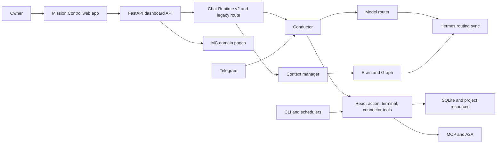
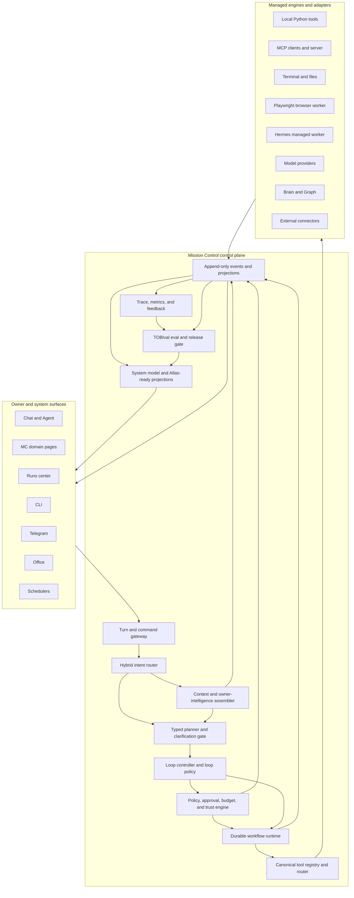
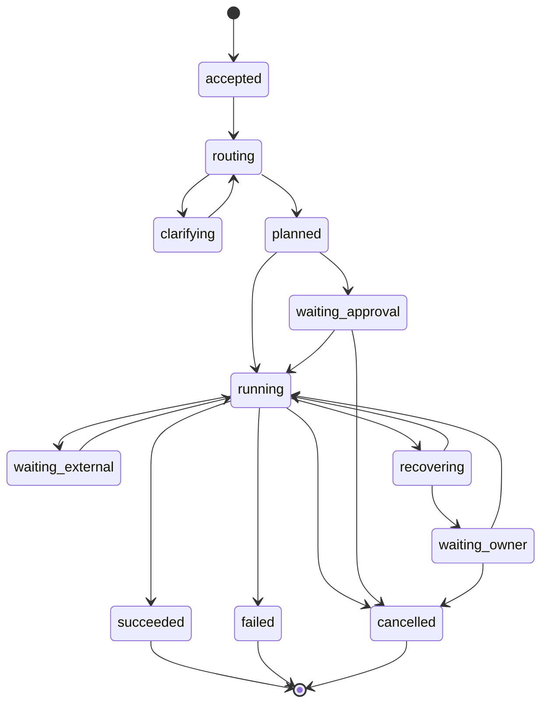
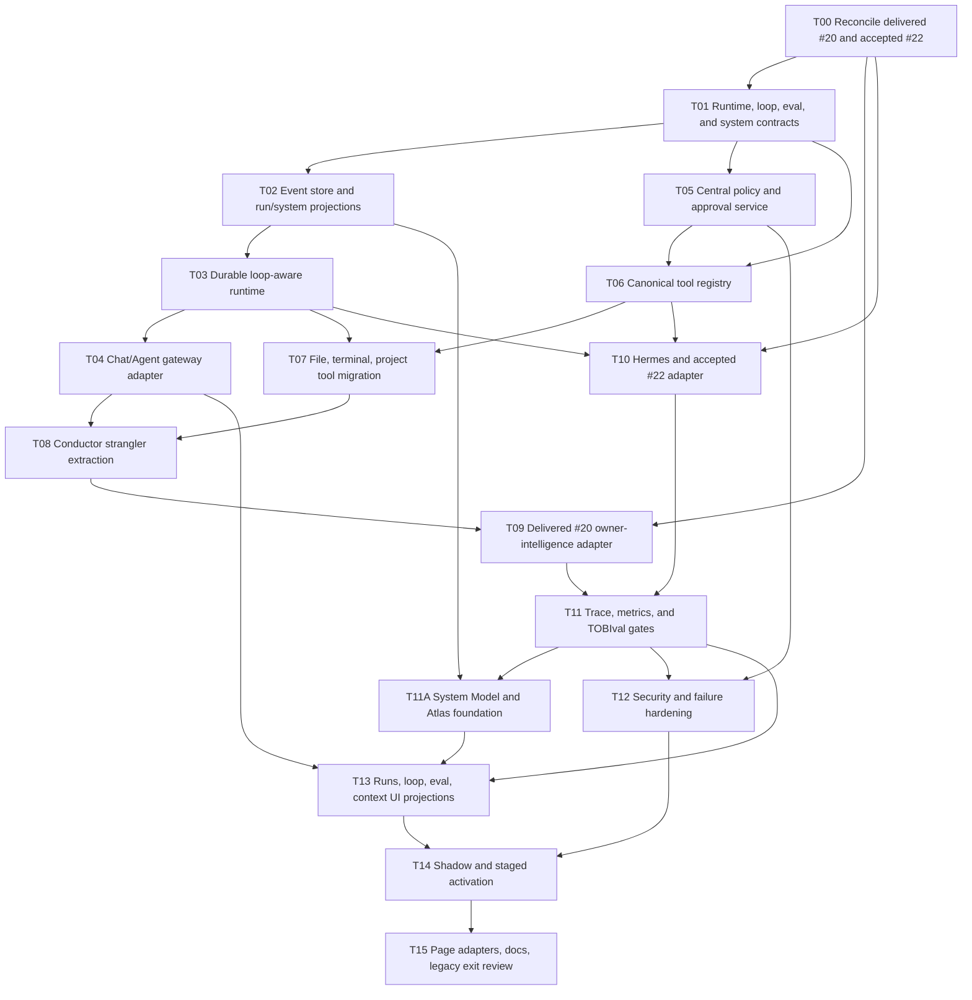

# Mission Control Infrastructure V2 Plan

## Queue Contract

| Field | Decision |
|---|---|
| Queue item | `#21` |
| Status | In progress; T00-T09 complete; T10 Runs 1-2 delivered; Run 3 active |
| Delivered dependency | `#20` Brain V2 is delivered; T00 must reconcile this plan with its actual contracts, migrations, context behavior, and rollback path |
| Start gate | Satisfied 2026-08-01 by `#22` Codex-only V2 qualification (`e9bc5fe`); other workers remain locked until separately qualified |
| Deployment confidence | The `#22` 24-hour/72-hour VPS soak remains a deployment confidence gate, not a source-development blocker for `#21` unless the owner explicitly promotes it to one |
| Primary outcome | Make Mission Control the authoritative, reliable control plane for TOBI |
| First usable release | Reliable Chat/Agent runtime with durable runs, typed tools, policy, and traceability |
| Migration style | Incremental strangler migration behind per-domain flags |
| Deployment posture | Local-first on the owner's Windows/D-drive environment; managed services remain optional |
| Worker model | Small sequential packages; one implementation worker at a time |
| Compatibility | Preserve existing conversations, actions, runs, tools, pages, Telegram, CLI, Office, and schedulers through adapters |
| Planning boundary | Implement one bounded T-package at a time; never submit the full program as one Developer runtime job |

This plan consolidates TOBI around Mission Control (MC). MC becomes the owner of run state, policy, approvals, tools, context, audit, observability, and shared UI projections. Hermes remains useful as a managed execution engine, but it must not become a second control plane.

Before implementation, reconcile this plan against the delivered or accepted state of:

- [Brain Context & Architecture V2](BRAIN_CONTEXT_ARCHITECTURE_V2_PLAN.md) (`#20`, delivered and authoritative)
- [TOBI Coding Agent V2](TOBI_CODING_AGENT_V2_PLAN.md) (`#22`, implementation delivered; acceptance still open)
- [Coding Agent V2 completion acceptance](TOBI_CODING_AGENT_V2_COMPLETION_ACCEPTANCE_2026-07-22.md) (ten-run matrix plus owner browser acceptance)
- [TOBI Coding Agent / Controlled Self-Development System](TOBI_CODING_AGENT_SELF_DEVELOPMENT_PLAN.md) (`#18`, historical compatibility source)
- [Current TOBI architecture](../ARCHITECTURE.md)
- [Current Mission Control guide](../MISSION_CONTROL.md)

Do not begin `#21` while `#22` acceptance remains open. T00 must map the delivered `#20` and accepted `#22` contracts into one owner per shared API, table, event, runtime, context, policy, and frontend projection before implementation packages start. Never run `#21` workers in parallel with corrective `#22` work that touches the same contracts, migrations, durable execution, tool policy, Brain context, Hermes adapters, observability, or Developer state.

## 1. Outcome And Non-Goals

### 1.1 Required outcome

MC must be able to:

1. accept an owner request from Chat, Agent, a page action, CLI, Telegram, Office, or a scheduler;
2. classify the request with deterministic rules before model planning;
3. assemble only relevant owner, project, system, and conversation context;
4. select tools from a filtered, typed registry;
5. enforce permissions, approvals, budgets, and trust boundaries centrally;
6. execute short or long workflows with persisted checkpoints and idempotency;
7. stream one ordered run history to every relevant MC page;
8. recover the same run after failure, restart, disconnect, or owner intervention;
9. produce grounded answers and action receipts from actual evidence;
10. learn from verified outcomes and explicit owner feedback without silently changing safety policy.

### 1.2 V1 non-goals

- multi-tenant SaaS hosting;
- replacing SQLite before measured contention requires it;
- forcing every internal call through a network MCP server;
- adopting Temporal, Trigger.dev, or Inngest before the local durable runtime is proven insufficient;
- unrestricted autonomous computer control;
- arbitrary multi-agent swarms;
- removing legacy Chat, Conductor, `agent_runs`, or `tobi_actions` during the first release;
- rebuilding the frontend design system;
- changing Supabase or Vercel.

## 2. Graphify-Guided Current-State Audit

Graphify is a navigation index only. The graph snapshot used by the original plan predates delivered `#20` and the `#22` completion implementation. T00 must refresh or verify focused graph paths against current `main`, then reconcile every material conclusion against live source, migrations, tests, and accepted runtime evidence.



| Node | Current truth | V2 gap |
|---|---|---|
| FastAPI boundary | `api/dashboard.py` owns a very large set of routes, SSE, static hosting, and orchestration glue | High collision risk; HTTP concerns and domain services are not consistently separated |
| Conductor | `core/conductor.py` owns classification, prompts, tool catalog behavior, execution, permissions, confirmations, action logging, and surface-specific behavior | God-module blast radius; policy and tool behavior are difficult to evolve independently |
| Chat Runtime v2 | Typed turn/tool/error contracts, context manifests, telemetry, bounded workers, runtime flags, and recovery routes exist | It coexists with legacy orchestration; contracts are incomplete as a platform-wide runtime |
| Agent runs | `agent_runs` and steps persist Chat Agent history and same-run recovery | Not yet the universal durable workflow state for page actions, coding workflows, Office, CLI, or schedulers |
| Actions | `tobi_actions` stores proposals and outcomes | Action history and run history are related but separate; no canonical append-only event stream |
| Tool registry | Typed `ToolSpec` validation exists for the Chat runtime | Tool metadata, MCP tools, Conductor functions, terminal capabilities, and page commands still have multiple ownership paths |
| Context | A `ContextManifest` and token budgets exist | Owner intelligence is not consistently applied to routing, planning, tool choice, and final response across all surfaces |
| Brain and Graph | Delivered `#20` makes Brain V2 authoritative while retaining legacy compatibility; Graph exposes typed relationships and provenance | MC V2 must consume the delivered contracts rather than inventing a second memory schema, and must project context influence into runs and eval evidence |
| Hermes | Startup, persona/skills, memory, and model routing have several one-way sync paths | No single synchronization contract; split-brain behavior is possible |
| MCP/A2A | Inbound/outbound tools, scopes, approvals, audits, and discovery exist | MCP is not yet the canonical tool description shared by local tools, pages, and the runtime |
| MC pages | Rich domain pages exist and each has useful local state | Cross-page actions, run progress, recovery, and audit are not projected from one shared live state |
| Observability | Usage, actions, runtime events, performance doctor, and page-specific status exist | No unified trace joins request, context, route, model, tool, approval, artifact, cost, and owner feedback |
| Evals | Strong feature-specific test suites exist | No required behavioral gate for tool choice, context quality, workflow recovery, or hallucination resistance |
| Security | Vault, mode denial, terminal gates, MCP scopes, SSRF guards, and prompt boundaries exist | Policy is distributed; excessive agency, cross-surface permissions, budgets, and untrusted evidence need one authority |

### 2.1 Existing assets to preserve

- `core/chat_runtime.py` and `core/chat_runtime_contracts.py` as the seed for the shared runtime contracts;
- `core/tool_registry.py` as a migration source, not a second permanent registry;
- `core/context_manager.py` as the first manifest builder;
- `core/agent_runs.py` and `tobi_actions` as compatibility data sources;
- current mode enforcement, terminal safety, vault, network guard, MCP security, artifact storage, and SSE behavior;
- all saved conversations and message metadata;
- existing page APIs until domain adapters are proven;
- rollback flags already used by Chat and feature pages.

## 3. Research Decisions

Use the following primary/official references as design inputs, not automatic dependency choices:

| Topic | Reference | Decision for TOBI |
|---|---|---|
| Durable execution | [Temporal](https://docs.temporal.io/), [Trigger.dev](https://trigger.dev/docs), [Inngest](https://www.inngest.com/docs) | Build a small local durable state machine first. Re-evaluate managed execution only for multi-host, high-volume, or operationally demanding workloads. |
| Tool interoperability | [MCP architecture](https://modelcontextprotocol.io/docs/learn/architecture), [MCP authorization](https://modelcontextprotocol.io/specification/2025-06-18/basic/authorization) | Make one canonical tool contract MCP-compatible while allowing direct in-process local invocation. |
| Agent runtimes | [LangGraph persistence](https://docs.langchain.com/oss/python/langgraph/persistence), [Google ADK](https://google.github.io/adk-docs/), [OpenAI Agents SDK](https://openai.github.io/openai-agents-python/), [AutoGen Core](https://microsoft.github.io/autogen/stable/user-guide/core-user-guide/index.html) | Borrow checkpoints, typed handoffs, sessions, guardrails, and traces. Avoid framework lock-in and unrestricted agent teams. |
| Agent memory | [Letta memory](https://docs.letta.com/guides/agents/memory), [Mem0 memory types](https://docs.mem0.ai/core-concepts/memory-types), [LlamaIndex memory](https://docs.llamaindex.ai/en/stable/module_guides/deploying/agents/memory/) | Use relevance-gated typed memory with provenance and certainty; do not inject the full profile every turn. |
| Browser/computer action | [Playwright](https://playwright.dev/docs/intro), [E2B](https://e2b.dev/docs), [Browser Use](https://docs.browser-use.com/) | Use deterministic Playwright workflows first. Keep E2B optional for isolated risky jobs and Browser Use optional for adaptive sites. |
| Observability/evals | [OpenTelemetry](https://opentelemetry.io/docs/concepts/), [Phoenix](https://arize.com/docs/phoenix), [Braintrust](https://www.braintrust.dev/docs), [LangSmith](https://docs.langchain.com/langsmith/home) | Emit OpenTelemetry-compatible local traces first. Keep vendor exporters optional; use MC as the owner-facing trace UI. |
| LLM security | [OWASP Top 10 for LLM Applications](https://genai.owasp.org/llm-top-10/) | Treat prompt injection, sensitive disclosure, excessive agency, supply-chain tools, and unbounded consumption as release gates. |

### 3.1 Durable-runtime decision gate

Stay on the local runtime while all are true:

- one owner and one primary MC deployment;
- SQLite remains healthy under concurrency tests;
- workflows can recover after process restart;
- local scheduling and workers meet latency targets;
- no cross-region or always-on worker requirement exists.

Open a separate architecture decision record before adopting a managed service. The ADR must compare operational burden, Windows/local support, D-drive data placement, offline behavior, lock-in, cost, secrets, migration complexity, and rollback.

## 4. Locked Product Decisions

The 60-question intake is summarized below. Workers must not reopen these choices unless current code makes one impossible.

| Area | Locked decision |
|---|---|
| Authority | MC is the authoritative control plane |
| Migration | Incremental strangler migration |
| Success priority | Action reliability first |
| Scope | All MC pages eventually; reliable Chat/Agent core first |
| Conductor | Thin compatibility facade after migration |
| Backend structure | Shared core services plus staged page adapters |
| Queue order | Reconcile delivered `#20`; begin only after `#22` passes the ten-run local matrix and owner browser acceptance |
| Other surfaces | Telegram, CLI, Office, and schedulers use compatibility adapters initially |
| Deployment | Local-first hybrid |
| Ownership | Single-owner, future-ready data and API contracts |
| Runtime | Local durable runtime first |
| Loop control | Persisted turn-, goal-, time-, and future proactive-loop recipes/policies; goal-based is the Developer default |
| Developer loop choice | MC suggests the safest compatible loop with reason; owner may make a policy-valid override |
| Proactive autonomy | Disabled by default until owner, policy, TOBIval, budget, approval, and explanation gates pass |
| Delivery semantics | At-least-once execution with idempotency |
| Approvals | Risk-based approvals |
| Recovery | Runs resumable indefinitely; safe steps auto-resume after restart |
| Retry | Bounded retry, then same-run recovery card |
| Tool contract | MCP-style canonical contract; direct local invocation allowed |
| First tool domains | Files, terminal, and projects |
| Discovery | Filtered registry, not an all-tools prompt |
| Policy | One central policy engine |
| Results | Typed result plus durable action receipt |
| Routing | Deterministic rules, then structured planner |
| Missing capability | Offer setup or a safe alternative |
| Owner intelligence | Influences routing through final response |
| Certainty | `known`, `inferred`, `contradicted`, or `stale` |
| Learning | Explicit feedback plus verified outcomes |
| Corrections | Supersede immediately while retaining history |
| Context visibility | Context chips plus expandable manifest |
| Memory use | Relevance-gated |
| Hermes | Managed engine component |
| Sync authority | MC-authoritative selective sync; MC wins conflicts |
| Multi-agent | Orchestrator with bounded workers |
| Handoffs | Typed task and artifact handoffs |
| Isolation | Local isolation first; E2B optional |
| Browser | Deterministic Playwright first |
| External commitments | Require approval before execution |
| Browser evidence | Trace plus key screenshots |
| Telemetry | OpenTelemetry-compatible events plus MC local UI |
| Trace UX | Concise by default, expandable details |
| Retention | Full trace 90 days, then redacted summary |
| Evals | Local-first TOBIval release and autonomy regression gates |
| Dataset | Golden cases plus real production failures |
| Reliability target | At least 95% supported-workflow completion or structured recovery |
| Trust | Label by source class; trust never grants instruction authority |
| Credentials | Vault-brokered, purpose-bound access |
| Budgets | Per-run hard limits |
| Run UI | Global Runs center plus contextual page views |
| Frontend state | Shared live projections across pages |
| Failure UX | Actionable recovery cards |
| System model | Separate evidence-backed System Graph; delivered `#20` Brain Graph remains owner/project/resource knowledge authority |
| Living Atlas | Foundation only in `#21`; full visual page and advanced animation are deferred |
| Schema | Additive shared runtime tables |
| History | Append-only events plus projections |
| Rollback | Per-domain feature flags |
| Services | Targeted managed services allowed only after an ADR |
| Delivery packages | Small sequential worker packages |
| Docs | Update after each accepted phase |
| Build order | Runtime, then tools, then owner intelligence |
| Activation | Shadow mode, then staged defaults |

## 5. Target Architecture



### 5.1 Domain ownership

| Domain | Sole responsibility | Must not own |
|---|---|---|
| Turn gateway | Request validation, identity/surface, idempotency, SSE/reconnect | Tool logic, prompts, persistence SQL |
| Intent router | Deterministic classification, confidence, candidate capabilities | Tool execution or owner memory retrieval |
| Context service | Context manifests, relevance, certainty, provenance, token budgets | Permission decisions or action execution |
| Planner | Typed plans, dependencies, clarification needs, expected artifacts | Direct side effects |
| Loop controller | Loop recipe selection, trigger handling, stop conditions, attempt/runtime/cost envelopes, and recovery progression | Tool permissions, model-specific prompting, or bypassing runtime state |
| Loop policy | Persisted effective loop limits, required approvals/evals, allowed tools, and owner override record | Executing steps or silently increasing autonomy |
| Policy engine | Mode/surface capability, risk, approval, credential, budget, isolation decisions | UI rendering or model prose |
| Workflow runtime | State transitions, leases, checkpoints, retries, cancellation, resume, and execution of persisted loop policies | Tool implementations, loop selection, or provider-specific parsing |
| Tool registry/router | Canonical schemas, discovery, validation, invocation adapter selection | Owner-facing response composition |
| Event store | Append-only durable facts with sequence numbers | Business decisions |
| Run projection service | Current run/page views derived from events | Mutable source-of-truth history |
| Trace service | Timings, cost, redaction, trace joins, and feedback | Execution authority or release decisions |
| TOBIval eval gate | Local-first eval cases, runs, findings, scoring, release gates, and autonomy regression decisions | Runtime execution or rewriting evidence |
| System model/projection service | Typed TOBI entities/edges, capability evidence, limitations, risks, changes, and Atlas-ready read projections | Owner memory, workflow authority, or a full visualization page |
| Response composer | Grounded owner-facing result from evidence and receipts | New actions or hidden tool calls |
| Surface adapters | Translate Chat/page/CLI/Telegram requests and render events | Duplicated policy or orchestration |

### 5.2 Conductor end state

Keep in `Conductor`:

- stable `answer(...)` compatibility entry point;
- surface normalization for old callers;
- shared butler persona reference until the response composer owns it;
- translation from legacy callbacks/events to the new gateway;
- one feature flag selecting legacy or V2 behavior.

Move out:

| Current concern | Target owner |
|---|---|
| intent classification | `intent_router` |
| prompt/tool catalog construction | `planner` plus filtered `tool_registry` |
| tool argument parsing/repair | typed model adapter plus `tool_router` |
| mode and risk permissions | `policy_engine` |
| approval creation/resolution | `approval_service` |
| action execution | `workflow_runtime` plus `tool_router` |
| action logging | `event_store` plus compatibility projector |
| Brain/profile assembly | `context_service` |
| provider fallback | `model_adapter` |
| final grounding/persona | `response_composer` |
| Telegram-specific limitations | Telegram surface policy |

The migration must delegate one concern at a time. Do not rewrite `conductor.py` in one worker task.

## 6. Core Contracts

Use validated dataclasses or Pydantic models consistently. No unvalidated dictionary may cross a domain boundary.

### 6.1 Run and plan contracts

```text
RunRequest
  request_id, surface, owner_id, session_id, mode, message, attachments,
  capability_toggles, selected_project, client_timestamp, budget_profile

RouteDecision
  route_class, intent, confidence, candidate_capabilities, clarification,
  context_requirements, planner_required, reasons

ExecutionPlan
  plan_id, run_id, objective, assumptions, steps[], expected_artifacts,
  approval_points, completion_predicate, budget

PlanStep
  step_id, kind, tool_name, arguments, depends_on[], risk, timeout,
  retry_policy, idempotency_key, required_capabilities, output_contract

RunEvent
  event_id, run_id, sequence, event_type, stage, timestamp, actor,
  redacted_payload, trace_id, parent_span_id
```

### 6.2 Canonical tool contract

```text
ToolSpec
  name, namespace, version, description, input_schema, output_schema,
  side_effect_class, risk, allowed_modes, allowed_surfaces,
  required_permissions, required_integrations, credential_purpose,
  timeout, retry_policy, idempotency_policy, isolation,
  cost_hint, audit_policy, availability_probe, adapter

ToolCall
  call_id, run_id, step_id, tool_ref, validated_arguments,
  idempotency_key, approval_id, deadline

ToolResult
  status, typed_output, evidence_refs, artifact_refs, receipt_id,
  retryable, error, timing, cost

ActionReceipt
  receipt_id, run_id, step_id, tool_ref, target, effect_summary,
  before_ref, after_ref, external_ref, approval_ref, timestamp
```

MCP export/import is an adapter around `ToolSpec`; it is not a parallel registry. Local tools can execute in process after the same validation and policy checks.

### 6.3 Context and certainty contract

Each context item must contain:

- `source_type`: conversation, owner_memory, project, system_state, connector, web, file, tool_result;
- `trust_class`: owner_direct, system_verified, connector_verified, derived, untrusted_content;
- `certainty`: known, inferred, contradicted, stale;
- `relevance_score`, `token_cost`, `version`, `retrieved_at`, and optional expiry;
- `instruction_authority`: always false for files, web, connector content, tool output, and imported text;
- `owner_visible_label` and provenance reference.

### 6.4 Loop, eval, and system-model contracts

```text
LoopRecipe
  recipe_id, version, name, loop_type, trigger, objective, stop_condition,
  max_attempts, max_runtime, max_cost, allowed_tools, approval_gates,
  required_evals, recovery_policy, evidence_required

LoopPolicy
  policy_id, version, recipe_id, owner_override, loop_type, trigger, objective,
  stop_condition, max_attempts, max_runtime, max_cost, allowed_tools,
  approval_gates, required_evals, recovery_policy, evidence_required,
  policy_decision_id, enabled

EvalCase
  eval_case_id, version, category, objective, input_fixture, expected_behavior,
  required_evidence, scorer, threshold, release_gate, autonomy_gate

EvalRun
  eval_run_id, eval_case_id, run_id, trace_id, status, score, threshold,
  tool_call_refs, policy_decision_refs, context_manifest_ref,
  receipt_refs, artifact_refs, finding_refs, started_at, completed_at

EvalFinding
  finding_id, eval_run_id, defect_ref, category, severity, summary,
  evidence_refs, remediation_owner, status

SystemEntity
  entity_id, entity_type, canonical_key, name, status, version,
  owner_domain, source_ref, metadata, observed_at

SystemEdge
  edge_id, from_entity_id, edge_type, to_entity_id, evidence_refs,
  confidence, valid_from, valid_to
```

`entity_type` is limited initially to subsystem, component, capability, tool, loop, run, eval, policy, integration, limitation, risk, decision, and queue item. Contracts are additive and versioned; delivered `#20` Brain contracts remain the authority for owner/project/resource knowledge.

## 7. Durable Execution

### 7.1 State machine



### 7.2 Runtime rules

1. Persist the run and `accepted` event before performing work.
2. Claim runnable steps with an expiring owner-token lease.
3. Delivery is at least once; every side-effecting step requires an idempotency strategy.
4. Retry only declared retryable failures with bounded exponential backoff and jitter.
5. After retry exhaustion, retain the same `run_id` and present recovery commands.
6. Safe, idempotent steps may auto-resume after restart; risky or externally visible steps require receipt reconciliation or owner review.
7. Cancellation is cooperative, persisted, and checked before/after every model or tool boundary.
8. Completed receipts are immutable. A retry cannot repeat a completed side effect.
9. Run budgets hard-stop further work and return a structured recovery state.
10. Long model, reader, terminal, and browser work use dedicated bounded executors or managed subprocesses.

### 7.3 Recovery commands

- `resume`
- `retry_step`
- `skip_step` only when the plan declares the step optional
- `revise_plan`
- `provide_input`
- `approve`
- `reject`
- `cancel`

Every command uses optimistic versioning so two pages cannot mutate the same run state inconsistently.

### 7.4 First-class loop control

Loops are persisted runtime strategies, not prompt templates:

| Loop type | Use | Default posture |
|---|---|---|
| Turn-based | Owner-guided conversation, planning, ambiguous work, and risky work that needs frequent clarification | Advance one bounded turn at a time and return control to the owner |
| Goal-based | Developer Queue implementation and other work with an explicit outcome, evidence criteria, and durable checkpoints | Default Developer execution loop; continue until the stop condition, policy gate, budget, or recovery state is reached |
| Time-based | Scheduled checks, monitoring, Health, Storage, News, and integration maintenance | Run only from an approved schedule with bounded work per tick |
| Proactive | Future system-initiated autonomy based on observed state or opportunities | Disabled by default until policy, eval, budget, explanation, and owner-approval gates pass |

Every executable loop uses a versioned `LoopRecipe` and an effective `LoopPolicy` snapshot containing:

- `loop_type`
- `trigger`
- `objective`
- `stop_condition`
- `max_attempts`
- `max_runtime`
- `max_cost`
- `allowed_tools`
- `approval_gates`
- `required_evals`
- `recovery_policy`
- `evidence_required`

The Loop Controller evaluates trigger eligibility, starts or advances the canonical run, checks stop/budget/evidence conditions before each iteration, and emits ordered loop events. The Workflow Runtime remains responsible for durable state, leases, checkpoints, idempotency, and step execution.

For Developer/Queue execution, MC suggests the safest suitable loop with a concise reason. The owner may override the suggestion only within policy. The chosen `loop_recipe_id`, recipe version, effective limits, owner override, and policy decision are persisted on the run before work begins; loop choice must never exist only in model prompt text.

## 8. Tool And MCP Standardization

### 8.1 First migration wave

| Domain | Initial tools | Reason |
|---|---|---|
| Files | list, read, search, preview, write proposal | High reuse and clear schemas |
| Terminal | command proposal, execute, job status, cancel | Highest safety/recovery need |
| Projects | list/get project, create/update task, resource search | Core owner workflow and existing grounding issues |

Second wave: Brain, integrations, GitHub/Notion, Office, browser, coding-agent tools, and schedulers.

### 8.2 Discovery and policy sequence

```mermaid
flowchart LR
  Intent["Route decision"] --> Filter["Filter by mode, surface, project, integration, availability"]
  Filter --> Rank["Rank by deterministic fit and owner preferences"]
  Rank --> Plan["Structured planner sees only short candidate specs"]
  Plan --> Validate["Schema validation"]
  Validate --> Policy["Central policy decision"]
  Policy --> Approve["Approval when required"]
  Approve --> Invoke["Local, MCP, terminal, browser, or Hermes adapter"]
  Invoke --> Receipt["Typed result, evidence, artifacts, receipt"]
```



Never advertise the entire tool catalog to a model. Denied tools must be both absent from planning context and rejected server-side.

MC pages consume the same command gateway as Chat/Agent. MCP server and client adapters expose or import approved registry entries; page code must not bypass policy by calling tool functions directly.

## 9. Brain And Graph Owner Intelligence

This plan consumes the typed memory output of `#20`; it must not invent a second memory schema.

### 9.1 Influence stages

| Stage | Allowed influence | Required evidence |
|---|---|---|
| Routing | preferred workflow, usual project, communication pattern | active relevant memory with scope and provenance |
| Planning | constraints, quality standards, risk tolerance, working style | approved rules/preferences; current instruction wins |
| Tool choice | preferred connector/tool, prior verified success/failure | tool availability plus outcome history |
| Execution | harmless defaults and reversible parameters | confidence threshold and policy allowance |
| Final response | tone, detail, evidence format, next action | response preference plus actual run evidence |

### 9.2 Guardrails

- Current explicit owner instruction overrides memory.
- Memory never grants permission, supplies a secret, or weakens a safety check.
- Only relevant memories enter the manifest; no full-owner-profile injection.
- Inferences are labeled and cannot become hard rules without the owner-review gate defined by delivered `#20`.
- Contradicted items are excluded from action defaults and surfaced for review.
- Corrections supersede immediately while history remains auditable.
- Graph paths can support relevance and provenance, but cannot create instruction authority.
- Every non-conversation source used appears as a context chip with an expandable manifest.
- Feedback records whether context was useful, irrelevant, or wrong and updates ranking only after verified outcomes.

## 10. Hermes As A Managed Engine

### 10.1 Hermes keeps

- execution skills that are useful and demonstrably reliable;
- accepted coding-worker behavior and evidence contracts from `#22`, with `#18` retained only for compatibility;
- compatible model/provider execution where MC delegates a bounded task;
- read-only repository skill discovery;
- optional isolated worker processes.

### 10.2 MC owns

- owner/session identity;
- run, plan, checkpoint, and artifact state;
- canonical tool registry;
- policy, approval, budget, and credentials;
- Brain/Graph context selection;
- final response and owner-visible history;
- retries, cancellation, recovery, audit, and evaluation.

### 10.3 Sync protocol

Create versioned `HermesCapabilityManifest` and `HermesExecutionRequest/Result` contracts. Sync only allowlisted skills, model routing hints, and capability metadata. Record source version, checksum, sync direction, status, and conflict.

Rules:

1. MC is authoritative and wins conflicts.
2. Hermes cannot directly mutate MC memory, policy, approvals, queue, or run state.
3. Results return as untrusted typed evidence plus artifacts.
4. A failed sync does not block MC Chat; the capability is marked unavailable.
5. Legacy direct Hermes paths become read-only or compatibility adapters before removal.

## 11. Agent Runtime And Multi-Agent Boundaries

Borrow these patterns:

- LangGraph: checkpointed state and explicit interrupts;
- Google ADK: sessions, artifacts, callbacks, and evaluable workflows;
- OpenAI Agents SDK: typed handoffs, guardrails, and trace spans;
- AutoGen Core: event-driven bounded workers and message contracts;
- Codex-style workflows: isolated workspaces, explicit plans, staged verification, and owner review.

Do not adopt:

- an additional framework as MC's source of truth;
- open-ended agent-to-agent chat;
- recursive delegation without a hard depth limit;
- workers with shared mutable state;
- worker access to vault credentials or approval authority.

V1 supports one orchestrator and bounded specialist workers. A handoff contains a typed objective, allowed tools, context manifest references, budget, deadline, expected artifact schema, and completion predicate. The orchestrator validates every returned artifact before continuing.

## 12. Real Computer And Web Action

### 12.1 Browser V1

- Use Playwright with declared, deterministic workflows.
- Persist action trace, URL transitions, selector/action summaries, console errors, downloads, and key screenshots.
- Require approval before purchase, submit, publish, send, delete, or any externally visible commitment.
- Re-check policy after redirects and before final submission.
- Treat page content as untrusted; page text cannot change the task or call tools.
- Store browser profiles and downloaded artifacts in scoped D-drive runtime directories with retention rules.

### 12.2 Isolation ladder

| Risk | Execution boundary |
|---|---|
| Read-only local task | Bounded in-process or subprocess adapter |
| Local file/code mutation | Approved workspace plus path allowlist and snapshot |
| Untrusted dependency or risky code | Local container/sandbox when available |
| Stronger remote isolation need | Optional E2B adapter after an ADR |
| Highly adaptive website | Optional Browser Use planner while Playwright remains the executor/policy boundary |

## 13. Observability, Evals, And Retention

### 13.1 Unified trace

Every trace must join:

- request and surface;
- route decision and confidence;
- context manifest IDs, token counts, certainty, and cache state;
- planner/model attempts, provider/model, latency, tokens, and estimated cost;
- step transitions, queue/worker wait, tool validation, tool duration, and result;
- approvals, policy decisions, retries, recovery, and cancellation;
- evidence, receipts, artifacts, final outcome, and owner feedback.

Use OpenTelemetry-compatible trace/span IDs. Store redacted local events first; exporters are optional adapters. MC is the default owner-facing view.

### 13.2 Observability stack choice

| Option | Strength | Cost/risk for TOBI | V2 decision |
|---|---|---|---|
| OpenTelemetry | Vendor-neutral trace, metric, and log contracts | Requires TOBI to build useful local projections and redaction | Required compatibility layer and internal trace IDs |
| Phoenix | Strong local/open-source LLM tracing and evaluation | Adds another service and storage surface | Optional local exporter after core traces stabilize |
| Braintrust | Managed eval datasets, experiments, and scoring | External service, cost, and sensitive-data review | Optional eval exporter only; never required for runtime |
| LangSmith | Mature LangChain/LangGraph tracing and eval workflows | Vendor coupling and less value without LangChain runtime | Do not adopt as the source of truth; optional adapter only if later justified |

No external exporter may receive owner content, secrets, raw files, or full prompts by default. Export is opt-in, redacted, and controlled from MC.

### 13.3 Local-first TOBIval release and autonomy gates

`TOBIval` is MC's local-first evaluation infrastructure. Cases, fixtures, scorers, findings, and gate decisions remain runnable without an external service. Optional exporters may mirror redacted results, but MC owns the authoritative case, run, finding, release, and autonomy status.

| Required category | Minimum proof |
|---|---|
| Final answer quality | The response satisfies the request, reports uncertainty honestly, and grounds material claims in evidence or receipts |
| Tool trajectory | The expected route and filtered tool sequence is selected, unnecessary calls are avoided, and clarification occurs when required |
| Policy and approval correctness | Denied tools never execute; approvals are requested, resolved, and re-checked at the correct boundary |
| Recovery and idempotency | Injected failures resume the same run and loop without duplicating completed side effects |
| Brain context relevance | Relevant delivered `#20` context is included with provenance; irrelevant, stale, contradicted, or sensitive context is excluded |
| Hallucination resistance | Untrusted files, web, connectors, and tool output cannot override instructions; action success is never fabricated |
| Connector freshness | Connector-derived claims include source and freshness evidence; stale or unavailable connectors produce a bounded gap or recovery state |
| Coding workflow qualification | Accepted `#22` Goal-to-Queue, preflight, agent, checkpoint, review, and evidence invariants remain qualified |
| Concurrency and durability | Ten simultaneous runs keep attribution, event sequence, projections, leases, and database integrity |
| Cost and budget | Attempt, runtime, token, tool, storage, and cost limits stop work deterministically |
| Compatibility | Saved chats, legacy events, coding history, and old surface adapters continue working |

Required TOBIval suites are release gates for affected domains and autonomy gates for loop behavior. A phase cannot activate by default while a required eval is failing, missing, stale beyond its declared window, or below threshold. Autonomy cannot increase when any required eval regresses; the effective loop policy must retain or reduce autonomy until the regression is resolved and the gate reruns successfully.

Add reviewed real failures to the local regression dataset with sensitive content removed. Every failed gate creates an actionable `EvalFinding` with severity, evidence, affected capability/release, remediation owner, and status.

### 13.4 Eval evidence and projections

Every eval case and run must link, when applicable, to:

- canonical `run_id` and OpenTelemetry-compatible `trace_id`;
- ordered tool calls and typed results;
- versioned policy and approval decisions;
- the exact context manifest;
- receipts and artifacts used as evidence;
- the failed finding or source defect that created the case.

Eval projections expose the latest required-gate state by release, capability, tool, loop recipe, model/provider, connector, and coding workflow. Projection rebuild must reproduce the same gate outcome from immutable events and referenced evidence.

### 13.5 Retention

- Full redacted run events and traces: 90 days by default.
- After 90 days: retain summary, outcome, metrics, receipts, approval record, and artifact references according to domain retention.
- Secrets, raw credentials, sensitive prompt bodies, and unnecessary file content never enter telemetry.
- Owner can inspect retention usage and trigger eligible cleanup from Storage/Health.

## 14. Security And Autonomy Policy

### 14.1 Central policy inputs

- authenticated owner/session and surface;
- mode and requested capability;
- tool risk and side-effect class;
- target resource/project;
- trust/certainty of arguments;
- integration and credential purpose;
- approval state;
- run budgets and cumulative cost;
- isolation requirement;
- current system health and kill switches.

### 14.2 Mandatory controls

1. Untrusted content is data, never instructions.
2. Every tool call is schema-validated after model output and before policy.
3. Vault issues purpose-bound credential access to adapters; models and workers never receive raw credentials.
4. Destructive, external, financial, publishing, sending, deployment, and permission-changing actions require approval.
5. File and terminal tools enforce path/command boundaries independently of the model.
6. Network tools retain SSRF, redirect, DNS/IP, content-size, and timeout guards.
7. Tool packages and MCP servers require allowlisting, provenance, version pinning, and capability review.
8. Logs redact secrets and sensitive content before persistence and export.
9. Per-run model calls, tool calls, elapsed time, tokens, cost, downloads, and storage have hard limits.
10. Global and per-domain kill switches stop new work without corrupting persisted runs.

### 14.3 No premature proactive autonomy

Proactive loops remain disabled by default. MC may enable a specific proactive `LoopRecipe` only when all are true:

1. the owner explicitly approves that version of the recipe;
2. central policy permits its trigger, tools, target, and execution boundary;
3. the required TOBIval baseline passes without regression;
4. attempt, runtime, model/tool, cost, download, and storage budgets are persisted;
5. every external, destructive, publishing, financial, permission-changing, deployment, or otherwise material side effect remains approval-gated;
6. Runs and Atlas-ready system projections can explain the trigger, context, policy, actions, evidence, outcome, and recovery path.

Recipe edits invalidate prior proactive approval and require policy/eval requalification. A kill switch or eval regression prevents new proactive runs without corrupting already-persisted history.

## 15. UI And Shared State

### 15.1 Global Runs center

Add a `/runs` operational page with:

- active, waiting, failed, completed, and cancelled filters;
- objective, source surface, mode, current step, elapsed time, budget, and owner attention state;
- concise milestone timeline with expandable technical trace;
- context chips, approvals, tool calls, receipts, artifacts, and model escalation notices;
- loop type/recipe, effective limits, stop condition, and required eval status;
- same-run Resume, Retry step, Skip, Revise, Approve/Reject, and Cancel controls;
- links back to the originating Chat, Project, Office mission, Developer workflow, or task.

### 15.2 Contextual projections

Chat, Projects, Office, Developer, Actions, Tasks, Health, and Architecture should show a filtered projection of the same run/event data, not separate workflow truth. Loop, eval, trace, context, recovery, capability, and evidence links use the same projection identity.

Use one frontend run store keyed by `run_id`. It consumes ordered snapshots/events, deduplicates by sequence, reconnects from the last sequence, and invalidates domain queries after relevant receipts.

### 15.3 Page changes

| Page | V2 change |
|---|---|
| Chat | Preserve current timeline; use canonical run events, context manifest, and recovery commands |
| Actions | Project action receipts and approvals from run events; keep legacy history visible |
| Projects/Tasks | Show related runs, live changes, and receipts; route mutations through command gateway |
| Office | Adapt missions and actions to shared runs after Chat stabilizes |
| Developer | Adapt accepted `#22` coding workflows to shared runtime contracts; suggest a safest suitable loop with reason, allow a policy-bounded owner override, and show the persisted recipe/eval state |
| Brain/Graph | Show which memories/paths influenced a run and collect feedback |
| Health/Performance | Runtime latency, failure class, queue depth, worker saturation, cost, loop health, and TOBIval gate status |
| Architecture | Update Mermaid diagrams and domain ownership after each accepted phase; link capabilities and limitations to evidence-backed system entities |

Do not create nested cards or expose raw traces by default. Recovery cards must state what failed, what completed, whether retry is safe, and what each command will do.

`#21` is not a full frontend redesign. Its required frontend foundation is limited to:

- the Runs Center;
- one shared live frontend store/projection client;
- actionable recovery and approval cards;
- an expandable trace/context viewer;
- an eval status panel;
- a loop selector in Developer with suggestion reason and persisted selection state;
- capability/evidence links;
- Atlas-ready APIs and projections.

Defer the full Living Atlas page, an advanced animated system graph, and an architecture visual-delta timeline to a later queue item. Existing page structure, theme tokens, components, and responsive conventions remain the default.

### 15.4 System Model / Living Atlas Foundation

MC maintains a separate System Graph over these entity types:

- subsystem;
- component;
- capability;
- tool;
- loop;
- run;
- eval;
- policy;
- integration;
- limitation;
- risk;
- decision;
- queue item.

Boundaries:

- **Brain Graph** is the delivered `#20` graph for owner memory, project knowledge, resources, and their provenance.
- **System Graph** models TOBI architecture, capabilities, runtime relationships, evidence, limitations, risks, policy, decisions, and change events.
- **Living Atlas** is a future owner-facing visual layer over the System Graph, traces, evals, risks, and changes.

`#21` builds only the typed entities/edges, evidence and limitation records, change-event ingestion, deterministic projections, and read APIs required by a future Atlas page. It must not duplicate Brain memories, infer unsupported capability status, or scope the deferred Atlas visualization into this implementation.

## 16. Data Model And Compatibility

### 16.1 Additive tables

| Table | Purpose |
|---|---|
| `mc_runs` | Canonical workflow identity, objective, status, version, source, budget, and legacy links |
| `mc_run_steps` | Typed plan steps, dependencies, lease, attempts, status, and idempotency |
| `mc_run_events` | Append-only ordered events and redacted payloads |
| `mc_run_commands` | Owner/system recovery and control commands with optimistic version |
| `mc_run_artifacts` | Artifact metadata and scoped storage references |
| `mc_run_approvals` | Risk decision, request, response, expiry, and authentication evidence |
| `mc_loop_recipes` | Versioned loop type, trigger, objective, stop, budget, tool, approval, eval, recovery, and evidence contract |
| `mc_loop_runs` | Canonical run-to-recipe version, effective policy snapshot, trigger, iteration state, stop reason, and owner override |
| `mc_action_receipts` | Immutable side-effect evidence and reconciliation status |
| `mc_idempotency` | Request/tool effect keys and completed result references |
| `mc_policy_decisions` | Inputs, rule version, result, and redacted reason |
| `mc_context_manifests` | Versioned context selection metadata and provenance references |
| `mc_runtime_projections` | Rebuildable current views for UI and adapters |
| `mc_owner_feedback` | Run/route/context/tool/result feedback and verified learning state |
| `mc_capability_sync` | Hermes/MCP capability manifest versions, checksums, and status |
| `mc_eval_cases` | Versioned local golden/real-failure fixtures, expected behavior, scorers, thresholds, and required release/autonomy gates |
| `mc_eval_runs` | Case/run/trace links, tool/policy/context/evidence references, scores, status, and gate result |
| `mc_eval_findings` | Actionable failed-eval findings linked to defects, evidence, affected capability/release, remediation, and lifecycle |
| `mc_system_entities` | Versioned typed subsystem, component, capability, tool, loop, run, eval, policy, integration, limitation, risk, decision, and queue-item records |
| `mc_system_edges` | Typed evidence-backed relationships between System Graph entities |
| `mc_capability_evidence` | Capability status evidence from runs, evals, tools, integrations, receipts, and accepted owner decisions |
| `mc_limitations` | Known limitation, scope, severity, evidence, mitigation, owner-visible status, and supersession |
| `mc_change_events` | Append-only accepted architecture/capability/policy/risk changes used to rebuild Atlas-ready projections |

Use the existing schema migration ledger. Add indexes for run status/time, event `(run_id, sequence)`, runnable steps, idempotency key, approval state, trace ID, loop recipe/version/status, eval case/category/gate status, system entity type/key, edge endpoints/type, and change-event sequence. Do not duplicate delivered `#20` Brain tables; System Graph records reference Brain/context provenance by stable IDs where required.

### 16.2 Legacy migration

- Do not rewrite or delete `agent_runs`, `agent_run_steps`, `tobi_actions`, chat messages, Office missions, coding workflows, or artifacts.
- New V2 runs may store `legacy_run_id`, `legacy_action_id`, and source-domain references.
- Compatibility projectors continue writing legacy status/events where old UI/API behavior requires it.
- Historical records appear in the Runs center through read adapters; migrate only when a reversible, verified mapping exists.
- Existing Chat endpoints and SSE event names remain additive facades until all clients use the gateway.
- A schema migration failure must leave the legacy runtime usable.

## 17. Public API Direction

Keep existing APIs and add a stable runtime namespace:

| Method and route | Purpose |
|---|---|
| `POST /api/runtime/runs` | Create an idempotent run from any surface |
| `GET /api/runtime/runs` | Filtered owner run list |
| `GET /api/runtime/runs/{run_id}` | Current projection and available commands |
| `GET /api/runtime/runs/{run_id}/events` | Ordered event page or SSE resume from sequence |
| `POST /api/runtime/runs/{run_id}/commands` | Resume/retry/skip/revise/input/approve/reject/cancel |
| `GET /api/runtime/runs/{run_id}/trace` | Redacted expandable trace |
| `GET /api/runtime/runs/{run_id}/artifacts` | Scoped artifact metadata |
| `GET /api/runtime/loops` | Policy-filtered loop recipes and effective availability |
| `POST /api/runtime/loops/suggest` | Safest compatible loop suggestion, reason, blockers, and owner-overridable choices |
| `GET /api/runtime/tools` | Policy-filtered capability discovery for UI/admin use |
| `GET /api/runtime/health` | Workers, leases, queue, projections, and event-store health |
| `GET /api/runtime/evals` | Current TOBIval release/autonomy gate status and actionable findings |
| `GET /api/runtime/evals/{eval_run_id}` | Case, trace, context, tool/policy, evidence, score, and finding projection |
| `GET /api/runtime/system/entities` | Filtered Atlas-ready System Graph entity projection |
| `GET /api/runtime/system/edges` | Evidence-backed Atlas-ready System Graph relationships |

All mutations require `request_id` or `client_command_id`. Run creation accepts an approved `loop_recipe_id`/version or a policy-valid suggestion selection and persists the effective `LoopPolicy` snapshot. SSE events carry `run_id`, monotonic sequence, event type, stage, timestamp, and redacted payload.

## 18. Implementation DAG



## 19. Worker Task Packages

Each task is a separate, reviewable package. A worker must stop after its acceptance criteria, update the plan's implementation log, and hand off verification evidence.

| ID | Goal and ownership | Depends on | Likely files | Acceptance criteria | Risk |
|---|---|---|---|---|---|
| T00 | Confirm `#22` local/browser acceptance, then reconcile current `main`, delivered `#20`, accepted `#22`, Graphify, docs, migrations, and tests. Produce a drift/ownership matrix; no runtime change. | `#22` ten-run matrix and owner browser acceptance | Graphify output, this plan, `#20/#22` plans and acceptance evidence, architecture docs | Every overlapping service/table/API has one declared owner; delivered contracts and rollback paths are mapped; stale assumptions are amended before code | Medium |
| T01 | Add typed runtime contracts, error taxonomy, capability/risk enums, per-domain flags, `LoopRecipe`, `LoopPolicy`, eval contracts, and `SystemEntity/SystemEdge` contracts. | T00 | New `core/runtime/` contracts/config; database migrations | Contracts validate at every boundary; recipe/eval/system versions are explicit; old callers compile/run unchanged | Medium |
| T02 | Add append-only event store, sequence allocation, run and System Model projections, redaction, and deterministic rebuild commands. | T01 | Runtime event/projection modules, system-model projector, DB init/migrations | Concurrent events remain ordered; run and System Graph projection rebuilds yield identical current state | High |
| T03 | Add durable state machine, leases, checkpoints, retry, cancellation, commands, budgets, idempotency, Loop Controller, and persisted loop-policy execution. | T02 | Runtime engine/repository/worker/loop modules | Restart recovery and duplicate-delivery tests prove no repeated side effects; stop conditions and effective loop limits are enforced from persisted state | High |
| T04 | Adapt MC Chat/Agent request and SSE routes to the gateway in shadow then on mode. | T03 | Chat runtime, dashboard route extraction, chat tests | Existing sessions/events remain readable; same-run recovery and first acknowledgement targets pass | High |
| T05 | Centralize mode/surface/tool risk, approvals, credentials, trust, isolation, and budget decisions. | T01 | Policy/approval modules, vault public adapter, mode compatibility | Denied actions fail server-side; every policy decision is versioned and auditable | High |
| T06 | Build canonical MCP-compatible registry, filtered discovery, schema validation, availability, and adapters. | T01, T05 | Tool registry/router, MCP client/server adapters, Conductor compatibility | No duplicate catalog authority; invalid args never reach tools; full catalog is never advertised | High |
| T07 | Migrate file, terminal, and project tools with receipts and idempotency. | T03, T06 | Terminal, attachments/files, PM tools, tests | Read and action golden cases use typed contracts; retry cannot duplicate mutation | High |
| T08 | Extract router, planner, context call, execution, and response composition from Conductor one concern at a time. | T04, T07 | Conductor, new runtime services, Telegram adapter tests | `conductor.answer()` is a thin facade; legacy and V2 golden outputs remain compatible | High |
| T09 | Connect delivered `#20` typed owner intelligence and Brain Graph provenance to route/plan/tool/response stages without duplicating its schema. | T00, T08 | Context service, delivered Brain/Graph adapters, response composer | Relevant memory changes expected behavior; irrelevant/stale/sensitive memory does not leak or control actions; context influence is visible in trace/eval evidence | High |
| T10 | Add versioned Hermes capability sync and adapt accepted `#22` Goal/Queue/agent/checkpoint/evidence workflows to shared runs without giving Hermes authority. | T00, T03, T06 | Hermes sync/skills, coding-agent adapters, Developer compatibility, CLI compatibility | MC remains authoritative; unavailable workers yield structured recovery; accepted `#22` invariants and coding history remain unified and readable | High |
| T11 | Add OTel-compatible traces, local-first TOBIval cases/runs/findings, golden/real-failure datasets, and release/autonomy-gate runner. | T09, T10 | Telemetry/eval modules, usage, performance doctor | Final-answer, tool-trajectory, policy, recovery, Brain context, hallucination, connector-freshness, and coding-workflow gates are queryable; regression blocks activation or autonomy increase | Medium |
| T11A | Build the System Model/Living Atlas foundation: typed entities/edges, capability evidence, limitations, risks, change events, deterministic projections, and read APIs. Do not build the full Atlas page. | T02, T11 | System-model contracts/repository/projector/API tests | Core subsystems, capabilities, tools, loops, evals, policies, integrations, risks, limitations, decisions, and queue items have evidence-backed projections usable by a future Atlas page | Medium |
| T12 | Run threat model and harden injection, secrets, supply chain, agency, budgets, network, paths, and redaction. | T05, T11 | Policy, vault adapter, net guard, terminal, MCP security, tests | Security failure-injection suite passes; no raw secret or untrusted instruction crosses boundary | High |
| T13 | Build the frontend foundation only: Runs Center, shared projection client/store, recovery cards, trace/context viewer, eval panel, Developer loop selector, capability/evidence links, and Atlas-ready projection clients. | T04, T11, T11A | New Runs page/store, `api.ts` domain module, Developer/Chat/Actions/Health adapters | Two pages show one consistent run/loop/eval/trace/recovery state; loop selection persists; reconnect resumes by sequence; no full Atlas page or broad redesign is introduced | Medium |
| T14 | Shadow compare legacy/V2 routes, manifests, policies, latency, and outcomes; activate direct Chat, reads, actions, then Agent. | T12, T13 | Flags, shadow comparator, eval reports, owner settings | Gates pass seven consecutive local test runs per stage; rollback flag is exercised | High |
| T15 | Adapt remaining Projects, Office, CLI, Telegram, and schedulers; update docs and decide legacy retirement separately. | T14 | Domain adapters, docs, tests | All surfaces use shared contracts or documented adapters; no legacy deletion without owner-approved exit review | High |

## 20. Phased Delivery And File Map

### 20.1 Required phase sequence

| Phase | Scope | Tasks | Exit gate |
|---|---|---|---|
| Phase 0 - Acceptance, reconciliation, and current-state map | Confirm the `#22` ten-run/browser gate, reconcile delivered `#20` and accepted `#22`, refresh Graphify, verify live ownership and contracts | T00 | `#22` start gate passed; drift/ownership matrix accepted; no unresolved shared-table or shared-API owner |
| Phase 1 - Domain boundaries and Conductor decomposition | Contracts, flags, dependency rules, and extraction sequence | T01 | Domain contracts pass tests; legacy behavior unchanged |
| Phase 2 - Durable run/loop/checkpoint foundation | Event store, run/system projections, persisted loop policy, runtime, leases, retries, idempotency, and Chat gateway | T02-T04 | Restart/retry/reconnect tests prove same-run recovery without duplicate effects; loop limits and stop conditions are enforced |
| Phase 3 - Tool router and MCP standardization | Central policy, canonical registry, and first tool migrations | T05-T07 | Files/terminal/projects pass typed contract, permission, receipt, and idempotency suites |
| Phase 4 - Brain/Graph owner intelligence | Conductor extraction and delivered `#20` context integration | T08-T09 | Golden cases prove relevant owner intelligence changes behavior safely without duplicating Brain contracts |
| Phase 5 - Observability, TOBIval, System Model, and security | Hermes/accepted-`#22` adapter, unified traces, release/autonomy gates, Atlas foundation, and threat hardening | T10-T12 including T11A | Required eval/security suites pass; system projections rebuild deterministically; telemetry contains no restricted data |
| Phase 6 - MC frontend foundation and docs | Runs Center, loop/eval/context projections, shared state, shadow rollout, staged activation, and current docs | T13-T14 | Cross-page run/loop/eval/trace/recovery state is consistent; staged defaults and rollback are demonstrated |
| Phase 7 - Remaining adapters | Projects, Office, CLI, Telegram, schedulers, and legacy exit review | T15 | All surfaces use shared contracts or documented adapters; owner separately approves legacy retirement |

Never overlap Phase 2-5 workers on shared runtime contracts or migrations. A later phase may begin only when the prior phase's exit gate and documentation update are accepted.

### 20.2 File-to-task map

This is a likely map, not permission for broad edits. T00 must revise it after `#22` acceptance and reconciliation with delivered `#20`.

| Area | Existing files to inspect | Primary tasks |
|---|---|---|
| API | `api/dashboard.py` and extracted route modules | T04, T13, T15 |
| Chat runtime | `core/chat_runtime.py`, `chat_runtime_contracts.py`, `context_manager.py`, `agent_runs.py` | T01-T04, T09 |
| Loop control | Accepted `#22` runtime/queue services plus new shared loop contracts/controller/repository | T01-T03, T10 |
| Conductor | `core/conductor.py`, `core/chat_modes.py` | T05, T06, T08 |
| Tools | `core/tool_registry.py`, terminal, PM, attachments, integrations modules | T06, T07, T12 |
| Models | `core/model_router.py`, usage modules | T08, T11 |
| Brain/Graph | Delivered `#20` contracts/modules plus compatibility adapters; do not create a second schema | T09 |
| System Model | New system entity/edge/evidence/limitation/change-event repository and projection modules | T01, T02, T11A |
| Evals | New local TOBIval case/run/finding and release/autonomy-gate modules; existing performance/usage evidence | T01, T11 |
| Hermes/Coding | `core/hermes_sync.py`, `core/hermes_skills.py`, `main.py`, accepted `#22` modules and historical `#18` compatibility | T10, T15 |
| MCP/A2A | `core/mcp_server.py`, `mcp_client.py`, `mcp_security.py`, `a2a.py` | T06, T12 |
| Persistence | database initialization and schema migration helpers | T01-T03, T11, T11A |
| Frontend | `dashboard/src/api.ts`, domain API modules, Runs, Developer, Chat, Actions, Health, Office, Project | T13, T15 |
| Docs | `docs/ARCHITECTURE.md`, `MISSION_CONTROL.md`, API/data/testing/security docs | T00, T15 and every accepted phase |

## 21. Verification Plan

### 21.1 Unit and contract tests

- contract validation and version compatibility;
- state transition legality and optimistic versions;
- event ordering, redaction, and projection rebuild;
- loop recipe/policy validation, selection, persisted override, stop condition, and hard-limit enforcement;
- tool schema, policy filtering, and availability;
- context relevance, certainty, precedence, and budget;
- TOBIval case/run/finding linkage, scorer thresholds, release gates, and autonomy-regression gates;
- System Model entity/edge validation, capability-evidence rules, and deterministic projection rebuild;
- error taxonomy and owner-safe recovery options;
- idempotency and receipt reconciliation;
- Hermes/MCP adapter contract tests.

### 21.2 Integration and failure tests

- process restart at every workflow state;
- worker lease expiry and reclaim;
- provider timeout, malformed output, rate limit, and partial stream;
- hanging file/web reader and terminal job;
- tool validation and execution failure;
- approval expiry, rejection, and conflicting commands;
- client disconnect and SSE reconnect from sequence;
- SQLite contention with at least ten simultaneous runs;
- duplicate request/call delivery;
- unavailable Hermes, MCP server, connector, and browser;
- stale project/memory context;
- stale connector evidence and failed connector-freshness eval;
- loop stop-condition, attempt, runtime, and cost exhaustion;
- proactive loop request while recipe approval, policy, budget, eval, or explanation gates are missing;
- TOBIval regression blocking staged activation and autonomy increase;
- System Model rebuild from change events and missing/contradictory capability evidence;
- prompt injection in files, web, connectors, tool output, and artifacts.

### 21.3 Performance targets

- first run acknowledgement under 500 ms;
- cached orchestration overhead under 200 ms and uncached under 500 ms before provider/tool work;
- normal Chat first token under 2 seconds under normal provider conditions;
- simple read/action median under 8 seconds;
- no unbounded executor or worker growth;
- no duplicated side effect after retry, restart, reconnect, or escalation;
- at least 95% supported-workflow completion or structured recovery;
- 100% of injected failures produce a typed failure/recovery state.

### 21.4 Frontend verification

- TypeScript and production build;
- Playwright desktop and mobile flows for Runs, Chat recovery, approvals, context, traces, artifacts, eval status, and Developer loop selection;
- no layout overlap or table/card overflow;
- reduced-motion behavior;
- reconnect and cross-page run/loop/eval/trace/recovery consistency;
- capability/evidence links resolve to Atlas-ready projections without requiring a full Atlas page;
- screenshot evidence for owner acceptance.

## 22. Rollout And Rollback

Use independent flags:

- `runtime.v2_events`
- `runtime.v2_execution`
- `runtime.v2_tools`
- `runtime.v2_policy`
- `runtime.v2_context`
- `runtime.v2_hermes`
- `runtime.v2_ui`
- per-surface adapter flags.

Rollout order:

1. event/trace mirroring only;
2. shadow route and context comparison with no shadow side effects;
3. direct Chat responses;
4. read-only tools;
5. reversible local actions;
6. approval-gated actions;
7. full Agent workflows;
8. accepted `#22` coding workflows and Hermes;
9. remaining MC pages and non-MC surfaces.

Rollback means disabling the affected domain flag. Additive tables remain readable; legacy APIs, conversations, actions, and runs continue to work. Never roll back by deleting V2 data or rewriting history. Before each default activation, create and verify a local database backup and exercise the rollback path.

The `#22` 24-hour/72-hour VPS soak remains a deployment confidence gate for continuous coding operation. It does not block `#21` source development after the ten-run local matrix and owner browser acceptance pass unless the owner explicitly changes that gate. It may still block production deployment or an autonomy increase for affected loop recipes.

## 23. Risks And Mitigations

| Risk | Mitigation |
|---|---|
| Delivered `#20`, accepted `#22`, and `#21` ownership collision | `#22` acceptance start gate, strict worker serialization, and T00 ownership mapping for every shared contract/table/API |
| New platform becomes another god module | Enforce domain boundaries and dependency direction in tests |
| Dual-write drift | Prefer append-only events plus compatibility projectors; add reconciliation reports |
| SQLite contention | WAL/busy timeout, short transactions, bounded workers, concurrency tests, later ADR if measured |
| At-least-once duplicates effects | Mandatory idempotency and immutable receipts for every side-effecting tool |
| Model still chooses wrong tools | Deterministic narrowing, filtered specs, structured planner, golden eval gate |
| Memory over-personalizes or leaks | Relevance/certainty gates, current instruction precedence, visible manifest, feedback |
| Hermes split brain | MC authority, versioned capability sync, no direct state mutation |
| Prompt injection | Structural untrusted-data envelopes, no instruction authority, policy re-check before effects |
| Trace leaks sensitive data | Redaction before persistence/export, metadata-first retention, security tests |
| UI and backend disagree | One event/projection model and sequence-based frontend store |
| Proactive autonomy activates before proof | Disabled by default; recipe approval, policy, budgets, required TOBIval gates, side-effect approvals, and explainable projections are mandatory |
| Brain Graph and System Graph drift or overlap | Keep `#20` owner/project/resource knowledge authoritative; System Graph references provenance and owns only architecture/capability/runtime relationships |
| Eval gate becomes decorative | Persist gate decisions and findings; block release or autonomy increases server-side when required cases regress |
| Migration stalls indefinitely | Small packages, measurable exit gates, per-domain flags, no premature legacy deletion |
| Managed-service lock-in | Local interface first; optional adapters only after ADR |

## 24. Completion Gates

`#21` is complete only when all are true:

1. MC is the proven authority for new Chat/Agent runs, policy, approvals, tools, context, and trace.
2. `conductor.answer()` is a thin compatibility facade with no duplicate orchestration authority.
3. File, terminal, and project tools use one canonical typed registry and central policy.
4. Long-running Agent workflows survive restart and resume the same run.
5. Retry/reconnect cannot duplicate a completed side effect.
6. Versioned loop recipes and effective loop policies are persisted, selected with an owner-visible reason, and enforced for trigger, stop, attempt, runtime, cost, tools, approvals, evals, recovery, and evidence.
7. Proactive loops remain disabled unless every owner, policy, budget, eval, side-effect approval, and explanation gate is satisfied.
8. Relevant approved owner intelligence from delivered `#20` measurably changes route/plan/tool/response behavior, while irrelevant or unsafe memory does not.
9. Hermes and accepted `#22` workers execute only bounded typed requests and cannot mutate authoritative MC state.
10. Runs and contextual pages show one consistent run, loop, eval, trace, context, and recovery history.
11. Required local-first TOBIval security and behavioral evals pass, including the 95% supported-workflow target; autonomy cannot increase on regression.
12. Every failed required eval creates an actionable finding linked to its run/trace, tools, policy decisions, context manifest, evidence, and source defect when relevant.
13. System entities and evidence-backed projections exist for core subsystems, components, capabilities, tools, loops, evals, policies, integrations, risks, limitations, decisions, and queue items.
14. The Living Atlas foundation exposes deterministic, Atlas-ready entities, edges, capability evidence, limitations, risks, and change projections usable by a future Atlas page.
15. Shadow/staged activation and per-domain rollback are both demonstrated.
16. Existing conversations, actions, Agent runs, Office history, and `#18/#22` coding history remain readable.
17. Architecture, Mission Control, API/data, testing, security, and operator docs match the delivered system.

## 25. Worker Runbook

For every task package:

1. Read this task, its dependencies, and the latest implementation log only.
2. Use Graphify first, verify the graph against current `main`, and inspect only the relevant nodes/files.
3. Confirm no other worker is editing the same contracts, migrations, or shared runtime files.
4. Add the smallest additive migration and compatibility adapter needed.
5. Implement one domain owner; do not duplicate legacy logic in a new permanent location.
6. Add unit, integration, failure-injection, security, and compatibility tests proportional to the task.
7. Run focused tests first, then the declared regression set and frontend build when applicable.
8. Record schema/API/flag changes and exact verification in this plan's implementation log.
9. Update current-state docs only after behavior is accepted.
10. Stop and report an actionable blocker when a locked decision cannot be met; do not silently redesign the architecture.

### 25.1 T06 Run 2 - Dormant Catalog Adapter Plan (2026-08-09)

**Outcome:** Existing catalog metadata can be converted into isolated canonical registry snapshots
for parity tests without changing what any live caller sees or executes.

| Source | Adapter input and identity | Conservative availability and trust rule |
|---|---|---|
| Conductor/Chat | Existing `ToolSpec` values from `TOOL_SPECS`; namespace `tobi.conductor`; fixed compatibility version | Read risk becomes canonical `none`; non-read legacy side effects remain conservatively classified; snapshot starts unknown and is never advertised live |
| Inbound MCP | Tool objects returned by public `FastMCP.list_tools()`; namespace `mcp.inbound.tobi`; fixed local-server version | Local definitions are trusted only for schemas; `SENSITIVE_TOOLS` remains the existing risk source; no callable enters the registry |
| Outbound MCP | New read-only snapshot joining existing `mcp_tools` and `mcp_connections`; namespace includes stable connection id; content-derived version | External annotations are untrusted; risk/side effects fail closed; disabled/error/not-tested connection states cannot become available; endpoint and `auth_ref` never leave the adapter boundary |

**Implementation order:**

1. Add `tests/test_mc_runtime_tool_adapters.py`, confirm the missing adapter fails, and set the Gate to red.
2. Add the MCP surface and a small typed adapter result; normalize legacy `read` risk without weakening action risk.
3. Add pure adapters in `core/runtime/tool_adapters.py`; accept metadata only, deep-copy schemas, use deterministic identities, and never store or call functions.
4. Add a read-only `mcp_client` catalog snapshot using existing columns only; parse malformed JSON to unknown/unavailable rather than guessing.
5. Register each snapshot only inside tests, prove exact catalog parity and no live imports, then run regressions and the enforced gate.

**Acceptance checks:** current Conductor names/count match exactly; all six inbound MCP names match
`TOOL_NAMES`; duplicate outbound names from different connection ids never collide; schema changes
produce a new deterministic version; malformed/remote schemas fail closed; permission and
availability remain separate; no endpoint, token, `auth_ref`, callable, or tool output enters a
contract; `runtime.v2_tools` stays off; existing Chat, Conductor, MCP, terminal, and Storage suites pass.

**Explicit non-goals:** no global registry, startup wiring, invocation validation, execution routing,
new table/column, API/UI, live discovery, policy cutover, real tool migration, or external service.

**Estimate after delivery:** T06 **70-80%** complete; #21 **66-73%** complete. The remaining T06 run
will prove shadow parity and define the owner-reviewed activation boundary before T07 starts.

### 25.2 T06 Run 3 - Dormant Parity And Activation-Boundary Plan (2026-08-09)

**Outcome:** A pure catalog service can produce a deterministic old-versus-canonical parity report,
prepare a typed call only after the exact candidate allowlist, surface, mode, availability, and input
schema all pass, and report whether every owner activation condition is satisfied. It cannot invoke a
tool, change a flag, or replace a live catalog.

| Part | Responsibility | Fail-closed rule |
|---|---|---|
| Catalog manifest | Hash sorted source identity, canonical reference, full contract, and availability without retaining functions, endpoints, credentials, arguments, or outputs | Duplicate source ownership or canonical references are rejected; order never changes the digest |
| Parity report | Compare expected and observed manifests by source identity and contract digest | Missing, extra, changed, rejected, or duplicate entries make parity false with stable reason codes |
| Call preparation | Use the isolated canonical registry to require an explicit candidate allowlist, exact version, allowed surface/mode, available status, and valid arguments before returning `RuntimeToolCall` | An empty allowlist, unknown/unavailable tool, wrong surface/mode, or malformed arguments returns no executable call and never echoes argument values |
| Activation boundary | Evaluate parity, adapter health, required-tool availability, central-policy readiness, owner approval, tools flag, and rollback readiness | Every condition must be explicitly true; the result is advisory metadata and performs no activation |

**Implementation order:**

1. Add `tests/test_mc_runtime_tool_catalog.py`, confirm its missing service fails, and set the Gate to red.
2. Add the smallest typed manifest, parity, and activation results to `core/runtime/contracts.py`.
3. Add `core/runtime/tool_catalog.py` as a pure consumer of Run 1 registry and Run 2 adapter results; keep all registry instances caller-owned and isolated.
4. Prepare `RuntimeToolCall` only after allowlisted discovery and `CanonicalToolRegistry.validate_arguments()` succeed; return deep-copied arguments and expose no callable or invocation method.
5. Prove exact current Conductor and inbound MCP snapshot parity offline, exercise drift and every denial condition, confirm live modules do not import the service, then run regressions and the enforced gate.

**Acceptance checks:** identical catalogs produce the same manifest and digest regardless of input
order; current Conductor and inbound MCP names have exact offline parity; missing, extra, changed,
rejected, and duplicate ownership are deterministic failures; no endpoint, credential reference,
callable, raw argument, or output enters a manifest/report; an empty or mismatched candidate allowlist
cannot resolve a call; unavailable, unknown, wrong-mode, wrong-surface, and malformed calls fail before
`RuntimeToolCall` exists; valid arguments are isolated copies; activation remains false until parity,
adapter health, required availability, policy readiness, explicit owner approval, the tools flag, and
rollback readiness are all true; `runtime.v2_tools` remains off; existing Chat, Conductor, MCP,
terminal, policy, and Storage suites pass.

**Explicit non-goals:** no live shadow traffic, startup/global registry, callable registration,
invocation or result handling, policy execution, owner-setting write, real-tool migration, schema
migration, API/UI, Conductor extraction, staged rollout, external service, Supabase, or Vercel. T07
owns real file/terminal/project migration; T14 owns live comparison, activation, and rollback proof.

**Estimate after delivery:** T06 **95-100% technically delivered and ready for owner closure review**;
#21 **69-76%** complete. T06 is not marked complete and T07 is not released until the owner accepts
the implementation evidence.

### 25.3 T07 Run 1 - Dormant Project Tool Execution Plan (2026-08-09)

**Outcome:** The current `list_projects` read and `create_task` action execute through one isolated
canonical path that validates arguments, records central policy, reserves the action before the
database write, stores an immutable receipt, and replays the result without creating a second task.
No live Conductor caller imports or uses this path.

| Current node | Run 1 edge | Rule |
|---|---|---|
| `conductor_registry.TOOL_SPECS` and existing project callables | Selected metadata is adapted once, then bound privately to the two existing functions | Reuse names, descriptions, and argument definitions; do not create a second full catalog |
| `CanonicalToolCatalog.prepare_call()` | Produces `RuntimeToolCall` only after exact allowlist, surface, mode, availability, and schema checks | Invalid input or an unavailable/non-allowlisted tool never reaches a callable |
| `PolicyEngine` and `PolicyLedger` | Evaluate and persist permission/approval facts before invocation | Anything except recorded `allow` returns a typed blocked result and performs no project read or write |
| `ActionLedger` and `RuntimeControl` | Reserve `create_task`, execute once, then atomically store result, receipt, and step success | The server derives `project:<validated project_id>`; retries replay, and changed arguments conflict |

**T07 run split:**

| Run | Scope | Estimated T07 position after acceptance |
|---|---|---|
| Run 1 | Project read plus one task-creation action; reusable dormant executor | 25-35% |
| Run 2A | File reads/listing through the existing coding broker; no mutation | 40-50% |
| Run 2B | First bounded file write using the accepted coding path policy, receipts, replay, and crash reconciliation | 55-70% |
| Run 3A | Terminal status plus a strict read-only foreground command subset; no background process or mutation | 75-82% |
| Run 3B1 | Bounded approved foreground mutations with receipts, exact replay, and fail-closed interruption handling | 85-90% |
| Run 3B2A | Durable bounded background start/list/output plus worker heartbeat and restart truth; no cancellation | 93-96% |
| Run 3B2B | Approved durable cancellation, restart-safe outcome reporting, and T07 closeout | 100% |

Run 2 was split into read/write sub-runs. Source review after Run 3A found that foreground mutation
and restart-safe process ownership have different failure boundaries, so Run 3B is split into 3B1
and 3B2. The accepted 3B1 diff then confirmed that detached launch/restart proof and cancellation
have separate uncertainty boundaries, so 3B2 is split into 3B2A and 3B2B. T07 and T08 stay blocked
until all are delivered and accepted.

**Implementation order:**

1. Add `tests/test_mc_runtime_project_tools.py`, confirm the missing executor fails, set the Gate to red, and make no production edit before that evidence.
2. Add a small execution service in `core/runtime/tool_execution.py`; keep callable bindings private and out of contracts/manifests, and require a prepared typed call plus a matching recorded central-policy allow decision.
3. Add `core/runtime/project_tools.py`; derive the two selected contracts from the existing legacy metadata, add only reviewed project permission/output/idempotency facts, and bind the current project functions outside manifests.
4. Execute `list_projects` as a receipt-free read; execute `create_task` only after a one-winner action reservation, then persist its typed result and immutable receipt with step completion.
5. Prove retry replay does not invoke `create_task` twice, prove changed content and caller-supplied target spoofing fail closed, confirm no live module imports the adapter, then run regressions and the enforced gate.

**Acceptance checks:** a real temporary project is returned through a schema-validated
`RuntimeToolResult`; malformed, denied, unapproved, unavailable, or non-allowlisted calls invoke
nothing; one approved `create_task` call creates one task and one receipt; the same idempotency key
returns the stored result without another database write or project log; the key cannot be reused for
different arguments or a different project; target identity comes from validated `project_id`;
policy and action events are redacted and ordered; no callable, arguments, output, endpoint, or secret
enters catalog manifests; existing legacy project behavior is unchanged.

**Verification:** `python tests/test_mc_runtime_project_tools.py`; T03 receipt/control, T05 policy,
T06 catalog/adapter, Conductor, mode-enforcement, Storage, and compile regressions; finally
`python scripts/gate.py` and intended-file-only `git status`.

**Explicit non-goals:** no live Conductor/Chat/Agent route, global registry, startup wiring, flag
change, new database table, project API/UI change, file or terminal migration, Telegram/CLI/Office,
Conductor extraction, coding-agent workflow change, external service, Supabase, or Vercel.

**Estimate after delivery:** T07 **25-35%** complete; #21 **71-79%** complete. This run is a backend
foundation and intentionally produces no visible UI progress.

**Delivery evidence (2026-08-09):** the new acceptance test first failed on the missing project
runtime and the red gate confirmed 1/1 expected failure before production edits. The delivered suite
passes 10/10 checks for bounded metadata, invalid-call rejection, a schema-validated real project
read, denial and approval blocking before reservation, one approved task write with one immutable
receipt, exact replay without a second invocation, changed-content conflict, server-derived target,
and no live import. T03 receipts/control, T05 policy/facts, T06 registry/adapters/catalog, owner flags,
Chat and routes, Conductor, mode enforcement, terminal, Storage, compile, and the enforced green gate
also pass. No live caller, flag, table, API/UI, file/terminal tool, or external service changed.

### 25.4 T07 Run 2A - Dormant File Read/List Execution Plan (2026-08-09)

**Outcome:** The existing `CodingToolBroker.read_file()` and `list_files()` operations execute through
one isolated canonical path with strict input/output validation and a recorded central-policy allow
decision. The broker remains the only filesystem authority and no live worker imports the adapter.

| Current node | Run 2A edge | Rule |
|---|---|---|
| `CodingToolBroker` | A caller-created broker is injected behind a small protocol and its existing methods are invoked | Do not copy or weaken approved-worktree containment, excluded-path checks, byte caps, list limits, or event emission |
| `CanonicalToolCatalog.prepare_call()` | Defines only versioned `read_file` and `list_files` contracts for the Developer surface | Unknown, unavailable, wrong-surface, non-allowlisted, or malformed calls fail before broker invocation |
| `PolicyEngine` and `PolicyLedger` | Require `files.read` and persist the decision before either read | Anything except recorded `allow` invokes nothing; the target is derived from validated relative-path arguments, never supplied separately by the caller |
| `CanonicalToolExecutor` | Reuses the Run 1 read path with binding-specific truthful owner errors | Reads complete the leased step with typed output and no action receipt or idempotency row |

**Implementation order:**

1. Add `tests/test_mc_runtime_file_tools.py`, confirm the missing file runtime fails, set the Gate to red, and make no production edit before that evidence.
2. Generalize only the read-failure owner message in `ToolExecutionBinding`; preserve Run 1 project wording and all action behavior.
3. Add `core/runtime/file_tools.py` with strict schemas, Developer-only availability, `files.read`, safe relative targets, and an injected broker protocol. Do not import or construct live coding workers.
4. Execute real temporary-worktree reads and listings through `CodingToolBroker`; retain its path denial, excluded-file, size, result-limit, and event behavior.
5. Prove no live module imports the adapter, run focused and legacy regressions, then run the enforced gate and intended-file-only status check.

**Acceptance checks:** one real indexable file can be read and listed with schema-validated bounded
output; listing stays capped and deterministic; malformed input, policy denial, unknown/unavailable
tools, wrong surfaces, and calls outside the exact allowlist invoke nothing; traversal, absolute-path,
excluded-file, missing-file, non-directory-prefix, and oversized-file attempts fail without leaking an
absolute path, file content, or secret; policy and broker events remain redacted and ordered; reads
create no action receipt or idempotency row; manifests expose no callable, worktree path, arguments,
output, endpoint, or secret; existing Coding Agent and Run 1 project behavior is unchanged.

**Verification:** `D:/[PERSONAL PROJECT FILES]/TOBI/.python/venv/Scripts/python.exe tests/test_mc_runtime_file_tools.py` plus Run 1 project
tools, T05 policy, T06 registry/catalog, Coding Agent production/tool diagnostics/worker actions,
Chat, Conductor, mode-enforcement, terminal, Storage, and compile regressions; finally
`D:/[PERSONAL PROJECT FILES]/TOBI/.python/venv/Scripts/python.exe scripts/gate.py` and intended-file-only `git status`.

**Explicit non-goals:** no `write_file`, `replace_text`, search, patch, command, or terminal action;
no `CodingToolBroker`, coding-policy, accepted #22 workflow, worktree, attachment, Telegram, CLI,
Office, Conductor, API/UI, table, flag, live caller, external service, Supabase, or Vercel change.
T10 owns accepted #22 orchestration migration; T15 owns remaining surface cutovers.

**Estimate after delivery:** T07 **40-50%** complete; #21 **73-81%** complete. Expected unattended
implementation and verification time is **3-5 hours**. Run 2B remains separately reviewable because
file mutation needs immutable receipts, duplicate-write prevention, and explicit crash reconciliation.

**Delivery evidence (2026-08-09):** the acceptance test first failed on the missing file runtime and
the red gate confirmed that exact import failure before production edits. The delivered suite passes
9/9 checks for Developer-only bounded metadata, pre-invocation rejection, real broker reads/listing,
central-policy denial, path/excluded/missing/oversized/non-folder failure handling, redacted ordered
history, receipt-free reads, and no live imports. The canonical executor now supports private
binding-specific read errors and a schema-validated persistence transform: the caller receives file
content, while durable step history stores `[REDACTED]`. The existing broker remains the only path
authority and still owns worktree containment, policy exclusions, size caps, list caps, and broker
events. Run 1 project tools, T03 control/receipts/repository, T05 policy/approvals/facts, T06
registry/adapters/catalog, accepted #22 production/diagnostic/worker checks, owner flags, Chat and
routes, Conductor, mode enforcement, Terminal, Storage, and compile regressions pass. No live caller,
broker, coding policy, worker, flag, table, API/UI, mutation, terminal tool, or external service changed.

### 25.5 T07 Run 2B - Dormant Bounded File Write Plan (2026-08-09)

**Outcome:** The existing `CodingToolBroker.write_file()` operation executes through one isolated
canonical path only after central policy and any required owner approval allow it. A completed write
has one immutable before/after receipt; a duplicate replays that result; an uncertain write never
runs again until current-file hash evidence classifies the first attempt.

| Current node | Run 2B edge | Rule |
|---|---|---|
| `CanonicalToolCatalog.prepare_call()` | Adds only `tobi.files.write_file@1` for Developer/agent mode with `files.write`, reversible side effect, medium risk, workspace isolation, required idempotency, and a receipt | Inputs are a bounded relative `path`, bounded UTF-8 `content`, and required `expected_sha256` (`absent` for create or the exact current lowercase SHA-256 for overwrite) |
| `PolicyEngine` and `PolicyLedger` | Decide and persist allow/approval/deny before action reservation | Wrong surface/mode/permission/isolation, missing approval, malformed input, unknown/unavailable tool, or non-allowlisted call invokes no broker method |
| `CodingToolBroker` | Remains the only write authority and performs its existing atomic replacement | Do not copy or weaken worktree containment, protected/forbidden path checks, byte cap, temporary-file replacement, or broker events |
| `ActionLedger` and `CanonicalToolExecutor` | Reserve once, hash the exact request, persist redacted write metadata, add before/after receipt refs, and replay completed results | Changed path, expected hash, or content under the same idempotency key conflicts; raw file content does not enter action events, receipts, results, or manifests |
| Existing crash reconciliation | Compares the current broker-read hash with the intended after hash and expected before hash | After match means applied with one receipt and no rewrite; before match means not applied and permits one retry; any third state remains unknown and blocked |

**Implementation order:**

1. Extend `tests/test_mc_runtime_file_tools.py` with a missing `WRITE_FILE_REF` check, confirm it fails, set the Gate to red, and make no production edit before that evidence.
2. Add private mutation hooks to `ToolExecutionBinding` only for redacted persisted arguments, truthful not-applied wording, and optional before/after receipt refs; preserve Run 1 project behavior byte-for-byte.
3. Extend `ActionLedger.prepare_action()` so the stored request can replace write content with `[REDACTED]` plus byte count and SHA-256 while the conflict hash still covers the exact unredacted call.
4. Add the bounded `write_file` contract and adapter to `core/runtime/file_tools.py`; verify the expected pre-state through the injected broker, call its existing `write_file`, return only path/bytes/hashes, and add a read-only hash reconciliation helper that never writes.
5. Prove direct success, exact replay, changed-content conflict, approval and path denial, applied/not-applied/unknown interruption outcomes, no live imports, and focused regressions before running the enforced gate and intended-file-only status check.

**Acceptance checks:** one approved write to a real temporary worktree creates or atomically replaces
one policy-approved file and records one receipt whose before/after refs use SHA-256 evidence; the
validated result contains path, bytes, and hashes but no content; exact replay invokes neither broker
read nor write again; the same idempotency key with different content, expected hash, path, or target
fails closed; a stale expected hash cannot overwrite a newer file; denied, unapproved, malformed,
oversized, traversal, absolute, protected, or forbidden attempts do not change a file; a simulated
crash after replacement blocks retry, then an after-hash match completes without rewriting, a before-
hash match permits one retry, and any other hash remains blocked; raw content is absent from action
rows, events, receipts, results, and manifests; Run 1 project tools and Run 2A reads remain unchanged.

**Verification:** `D:/[PERSONAL PROJECT FILES]/TOBI/.python/venv/Scripts/python.exe tests/test_mc_runtime_file_tools.py` plus Run 1 project tools, T03 receipts/control/repository, T05 policy/approvals,
T06 registry/catalog, accepted #22 coding production/diagnostic/worker checks, owner flags, Chat,
Conductor, mode enforcement, terminal, Storage, and compile regressions; finally
`D:/[PERSONAL PROJECT FILES]/TOBI/.python/venv/Scripts/python.exe scripts/gate.py` and intended-file-only `git status`.

**Explicit non-goals:** no `replace_text`, search, patch, command, or terminal tool; no live caller,
route, policy cutover, owner flag, table, migration, API/UI, `CodingToolBroker`, coding-policy,
accepted #22 worker/worktree, Conductor, Telegram, CLI, Office, external service, Supabase, or Vercel
change. T10 owns accepted #22 orchestration migration; T15 owns remaining surface cutovers.

**Estimate after delivery:** T07 **60-70%** complete; #21 **76-84%** complete. Expected unattended
implementation and verification time is **5-8 hours**. Run 3 remains separately reviewable for
terminal execution, command allowlists, bounded output, cancellation, and crash behavior.

**Delivery evidence (2026-08-09):** the expanded file-tool test first failed on the missing
`WRITE_FILE_REF`, and the red gate confirmed that exact failure before production edits. The delivered
suite passes 18/18 checks for bounded Developer-only metadata, malformed/absolute/oversized rejection,
approval before reservation, guarded real-worktree overwrite, redacted action identity, before/after
SHA-256 receipt evidence, exact replay, changed-call conflict, stale-state refusal, traversal/forbidden/
protected path safety, and applied/not-applied/unknown interruption reconciliation without blind retry.
The existing broker remains the only path/write authority and still owns atomic replacement and coding
policy. Run 1 project tools, T03 repository/control/receipts, T05 policy/approvals, T06 registry/adapters/
catalog, owner flags, accepted #22 production/diagnostic/worker checks, Chat and routes, Conductor, mode
enforcement, Terminal, Storage, compile, diff checks, and the enforced green gate pass. No live caller,
broker, coding policy, worker, flag, table, migration, API/UI, terminal tool, or external service changed.

### 25.6 T07 Run 3A - Dormant Read-Only Foreground Terminal Plan (2026-08-09)

**Outcome:** The canonical runtime can read terminal status and execute a deliberately small set of
foreground inspection commands through central policy and the existing terminal engine. The adapter
cannot mutate state, use the network, chain shell operations, choose another working directory, or
start a background process, and no live caller imports it.

| Current node | Run 3A edge | Rule |
|---|---|---|
| `conductor_registry.TOOL_SPECS` | Adapt only `terminal_status` and `run_command`, then narrow their canonical schemas and availability | Do not create a second full terminal catalog or migrate install/configure/connect/mode tools |
| New pure command validator | Accept only named read-only forms such as identity/location and bounded version/status checks | Reject newlines, pipelines, redirects, shell control characters, substitutions, environment dumps, network commands, mutations, unknown executables, caller `cwd`, and `background` before invocation |
| `PolicyEngine` plus terminal compatibility facts | Require `terminal.read` or `terminal.execute`, Agent mode for commands, subprocess isolation, and a recorded allow | Plan/unknown terminal modes, the kill-switch, missing permission/isolation, wrong mode/surface, or any existing terminal refusal can only tighten the central decision |
| Existing `terminal_engine` | Re-check its deterministic gate immediately before `run()`, retain its shell, redaction, output cap, and timeout | The canonical adapter never bypasses or copies the terminal engine's hard deny rules and never invokes `subprocess` itself |
| `CanonicalToolExecutor` | Treat both operations as receipt-free reads because the accepted command grammar cannot mutate state | Return bounded schema-validated output, persist only redacted output and a hashed command target, and create no idempotency row or action receipt |

**Implementation order:**

1. Add `tests/test_mc_runtime_terminal_tools.py`, confirm the missing terminal runtime fails, set the Gate to red, and make no production edit before that evidence.
2. Add `core/runtime/terminal_tools.py` with strict schemas, a pure read-only command validator, hashed targets, and an injected terminal-engine protocol; do not import or construct a live caller.
3. Adapt only the two existing legacy specs, narrow `run_command` to foreground inspection, and require central permissions plus subprocess isolation before invocation.
4. Apply current terminal mode and kill-switch facts before central policy, then re-check the existing deterministic terminal gate immediately before the bounded run.
5. Prove real cross-platform inspection, rejection and redaction cases, no receipts/live imports, focused regressions, the enforced gate, and intended-file-only status.

**Acceptance checks:** the catalog exposes exactly versioned `terminal_status` and `run_command`
contracts; status is schema-validated and command execution is Agent-only; one real allowlisted
foreground inspection command returns its exit code and at most the existing 6,000-character redacted
output; non-zero exit and timeout states remain truthful; shell chaining, pipes, redirects,
substitutions, newlines, environment dumps, network/mutable/high-risk commands, unknown executable
forms, caller working directories, background requests, malformed input, wrong surface/mode,
missing permission/isolation, plan/unknown terminal mode, active kill-switch, and terminal-gate refusal
invoke no command; the gate is checked again immediately before execution; raw command text is absent
from durable policy/action/event targets, unredacted output is absent from persisted results, and reads
create no action reservation or receipt; project/file tools and all legacy terminal behavior remain
unchanged; no live module imports the new adapter.

**Verification:** `D:/[PERSONAL PROJECT FILES]/TOBI/.python/venv/Scripts/python.exe tests/test_mc_runtime_terminal_tools.py` plus terminal engine, mode enforcement, T05 policy/facts, T06 registry/catalog,
T07 project/file tools, T03 control/receipts/repository, owner flags, Chat, Conductor, Storage, and
compile regressions; finally `D:/[PERSONAL PROJECT FILES]/TOBI/.python/venv/Scripts/python.exe scripts/gate.py` and intended-file-only `git status`.

**Explicit non-goals:** no mutable or arbitrary foreground command, network access, shell chaining,
caller working directory, background job, list/output/kill/cancellation path, install/configure/connect,
terminal mode mutation, terminal-engine or Conductor change, live caller, route, flag, schema migration,
API/UI, Telegram, CLI, Office, scheduler, external service, Supabase, or Vercel interaction. Run 3B
owns mutable/background execution, durable job identity, cancellation, uncertain-outcome handling,
T07 closeout, and any release of T08.

**Estimate after delivery:** T07 **75-82%** complete; #21 **79-86%** complete. Expected unattended
implementation and verification time is **4-6 hours**. Owner acceptance should take **10-15 minutes**:
confirm the diff contains only the dormant adapter, its focused test, and package-status docs, then
confirm no mutable/background command or live import was added.

**Delivery evidence (2026-08-10):** the new acceptance script first failed because
`core.runtime.terminal_tools` did not exist, and the enforced red gate confirmed that exact failure
before production code was added. The delivered 14/14 suite proves exactly two bounded contracts,
schema rejection before terminal access, central permission/isolation denial, conservative legacy
mode and kill-switch facts, terminal-risk tightening, an immediate second gate check, bounded secret
redaction, truthful non-zero/timeout results, receipt-free persistence, one real `git --version` run,
and no live imports. The fixed command set contains only identity, location, and version checks;
`git status` was removed during security review because it can refresh Git index metadata. The
existing terminal engine remains the sole shell, risk, kill-switch, redaction, and timeout authority.
Terminal 67/67, mode enforcement 18/18, T03 control/receipts/repository, T05 policy/facts/approvals,
T06 registry/adapters/catalog, T07 project/file tools, owner flags, Chat unit/route, Conductor final
guard, Storage, focused compile, diff checks, and the enforced green gate pass. No mutable/background
command, action row, receipt, live caller, terminal-engine/Conductor edit, flag, table, migration,
API/UI, external service, Supabase, or Vercel interaction was added. T07 remains open for Runs 3B1
and 3B2.

### 25.7 T07 Run 3B1 - Dormant Bounded Mutable Foreground Terminal Plan (2026-08-10)

**Outcome:** Add a separate `tobi.terminal.run_command@2` action contract for one approved local
foreground mutation. The accepted `run_command@1` inspection contract stays unchanged. A completed
attempt records one immutable receipt, an exact retry replays its typed result, and an interruption
after invocation remains outcome-unknown and cannot run again automatically.

| Current node | Run 3B1 edge | Rule |
|---|---|---|
| Accepted Run 3A adapter | Add a second version of `run_command`, not a mixed read/write contract | `@1` remains receipt-free inspection; `@2` is high-risk, irreversible, Agent-only, approval-required, foreground-only, and idempotent |
| New pure mutation validator | Accept one bounded single-line token-only local command in the runtime's fixed working directory | Reject shell syntax, expansion, nested shells, environment mutation, credentials, network/install/publish/delete families, read-only `@1` forms, caller `cwd`, and background mode before policy or execution |
| Central policy plus legacy terminal facts | Bind the exact command hash, fixed-directory hash, approval, permission, isolation, and current mode to the decision | Plan/unknown mode, kill-switch, terminal refusal, missing approval, wrong surface/mode, or missing permission/isolation invokes nothing; a legacy `confirm` can proceed only after central policy verifies the matching approval |
| `ActionLedger` plus `CanonicalToolExecutor` | Reserve the exact action before the second terminal-gate check and invocation | Persist only redacted command metadata and hashes; exact replay invokes nothing; changed command, timeout, directory identity, target, or approval conflicts |
| Existing terminal engine | Retain shell selection, static risk gate, timeout, redaction, and bounded output | A normal zero, non-zero, timeout, or failed-start return gets a truthful typed result and one receipt for the attempt; an exception or persistence failure becomes `unknown` and is never retried blindly |

**Implementation order:**

1. Extend `tests/test_mc_runtime_terminal_tools.py` with a missing `RUN_COMMAND_ACTION_REF` check,
   confirm it fails, set the Gate to red, and make no production edit before that evidence.
2. Add the versioned action schema and pure validator to `core/runtime/terminal_tools.py`; keep the
   Run 3A constants, schemas, metadata, and behavior unchanged.
3. Apply current terminal mode and the first deterministic gate before central policy; require an
   authenticated matching approval, then reserve the exact hashed action before a second gate check.
4. Invoke the existing foreground engine with the fixed runtime directory, persist only redacted
   metadata/output, and create one receipt describing the command attempt and typed exit state.
5. Prove one real temporary-directory `mkdir` mutation, exact replay, changed-call conflict,
   pre-invocation denials, unknown interruption handling, no live imports, regressions, and the gate.

**Acceptance checks:** exactly three contracts are exposed: accepted status `@1`, inspection
`run_command@1`, and action `run_command@2`; `@2` cannot be prepared without an idempotency key and
cannot execute without a matching approved policy decision; one approved real foreground mutation
runs once and records one receipt; zero, non-zero, timeout, and failed-start states remain truthful;
exact replay returns the stored result without calling the terminal engine; the same key with changed
command, timeout, target, fixed-directory identity, or approval fails closed; shell controls,
expansions, multiline input, nested shells, credentials, network/install/publish/delete commands,
caller `cwd`, background mode, wrong surface/mode, missing permission/isolation, plan/unknown mode,
kill-switch, and either terminal-gate refusal invoke nothing; raw command and unredacted output are
absent from policy, action, event, result, and receipt persistence; an exception after reservation is
`unknown`, exposes no automatic retry, and a reconciliation request stays blocked because a generic
shell mutation has no universal read-only proof; all Run 3A, file, and project behavior is unchanged.

**Verification:** `D:/[PERSONAL PROJECT FILES]/TOBI/.python/venv/Scripts/python.exe tests/test_mc_runtime_terminal_tools.py` plus terminal engine, T03 control/receipts/repository, T05 policy,
policy-facts, and approvals, T06 registry/catalog, T07 project/file tools, owner flags, Chat unit/route, Conductor final
guard, mode enforcement, Storage, and compile regressions; finally
`D:/[PERSONAL PROJECT FILES]/TOBI/.python/venv/Scripts/python.exe scripts/gate.py` and intended-file-only
`git status`.

**Explicit non-goals:** no background start/list/output/cancel, process heartbeat, restart recovery,
live streaming, caller working directory, network/install/publish/delete/credential command, nested
shell, specialized install/configure/connect/mode tool migration, terminal-engine redesign, live
caller, route, flag, table, migration, API/UI, Telegram, CLI, Office, scheduler, external service,
Supabase, or Vercel interaction. Run 3B2 owns managed background lifecycle and T07 closeout; T13 owns
the Runs UI and T15 owns remaining surface/specialized-tool cutovers.

**Estimate after acceptance:** T07 **85-90%** complete; #21 **82-88%** complete. Expected unattended
implementation and verification time is **5-8 hours**. Owner acceptance should take **10-15 minutes**:
confirm `run_command@1` is unchanged, one approved `@2` call produces one receipt, and no background
or live caller was added.

**Delivery evidence (2026-08-10):** the expanded acceptance script first failed on the missing
`RUN_COMMAND_ACTION_REF`, and the enforced red gate confirmed that exact failure before production
edits. The delivered 24/24 suite proves a separate high-risk, irreversible `run_command@2` action;
mandatory matching approval and idempotency; hashed fixed-directory and command identity; redacted
action metadata and output; one immutable receipt; exact replay; changed command, timeout, approval,
or directory conflicts; truthful zero, non-zero, timeout, and failed-start attempts; late-gate
not-applied handling; fail-closed unknown interruption; one real temporary-directory mutation; and no
live imports. Security review replaced a broad executable denylist with the only honest first-run
allowlist: `mkdir <safe-name>`, with one ASCII name segment and no path or shell syntax. Terminal
67/67, T03 repository/control/receipts, T05 policy/facts/approvals, T06 registry/adapters/catalog,
T07 project/file tools, owner flags, mode enforcement, Chat unit/route, Conductor final guard, Storage,
compile, diff, and enforced green-gate checks pass. No accepted `@1` behavior, terminal engine,
background process, live caller, flag, table, migration, API/UI, or external service changed. T07
remains open for Runs 3B2A and 3B2B. The owner accepted Run 3B1 on 2026-08-11 and released Run 3B2
planning.

### 25.8 T07 Run 3B2A - Managed Background Start, Read, And Restart Plan (2026-08-11)

**Outcome:** Add dormant canonical `start_job`, `list_jobs`, and `job_output` contracts backed by an
additive `mc_terminal_jobs` record and a detached worker. The start contract accepts only a typed
`duration_s` integer from 1 through 300; the server derives a fixed wait operation, so no caller
command reaches a shell or persisted run plan. One job keeps the same server-issued identity across
app restart, exact start retries cannot launch twice, and reads report stale worker evidence as
unknown instead of inventing an outcome.

| Current node | Run 3B2A edge | Rule |
|---|---|---|
| Legacy `terminal_jobs` plus `_LIVE` process handles | Add a separate canonical repository and detached worker | Do not read, migrate, or write the legacy table; it stores raw command/path data and loses its process handle when the app restarts |
| Accepted `CanonicalToolExecutor` action path | Add `start_job@1` as a high-risk, approval-required, idempotent action | Reserve the action first; a receipt means the managed worker accepted this job, not that the wait already completed |
| New pure start validator | Accept only a typed `duration_s` integer from 1 through 300 and derive the fixed wait operation server-side | Reject caller command text, shell syntax, paths, environment data, caller working directory, arbitrary executable, and additional arguments before policy or persistence |
| Runtime schema version 009 | Add `mc_terminal_jobs` with immutable action/job identity and guarded lifecycle fields | Persist hashes, operation metadata, redacted bounded output, launch state, worker identity hash, heartbeat, and final result; persist no raw command, directory, secret, worker token, or unbounded output |
| Detached worker handshake | Write deterministic job intent before spawn, pass only job id on its command line, and pass a one-use worker token outside persisted clear text | A definite pre-spawn failure is not applied and may retry; once process creation may have happened, missing trustworthy handshake is unknown and cannot auto-relaunch |
| Repository reads after app restart | Derive running from a fresh matching heartbeat and unknown from stale/missing proof | A final row stays final; never infer liveness from PID alone, kill a PID, or start a replacement for an uncertain launch |

**Lifecycle:** `intent -> launching -> running -> succeeded|failed`; a definitely failed pre-spawn
launch becomes `not_started`. Identity columns and terminal states are immutable. A `launching` or
`running` row with stale heartbeat remains stored history but is reported as `unknown`; a late valid
worker update may still finish it. The worker writes only when its secret token matches the stored
hash, so an unrelated process cannot take over the row.

**Implementation order:**

1. Add `tests/test_mc_runtime_terminal_jobs.py`, confirm the missing schema/table and job runtime fail,
   set the Gate to red, and make no production edit before that evidence.
2. Add additive schema version 009, indexes, identity/update/delete guards, legal state transitions,
   and idempotent upgrade checks for `mc_terminal_jobs`.
3. Add `core/runtime/terminal_jobs.py` with deterministic job identity, parameterized repository
   writes, bounded reads, fresh-heartbeat derivation, and no PID-based control.
4. Add `core/runtime/terminal_job_worker.py` and the fixed wait operation; persist intent before a
   detached launch, require a token-hash handshake, heartbeat while running, and redact/cap output at
   6,000 characters before every write.
5. Extend a separate dormant terminal-job catalog with start/list/output bindings, then prove replay, restart,
   stale-heartbeat refusal, regressions, green gate, and no live imports.

**Acceptance checks:** exactly one approved typed-duration `start_job@1` call creates one deterministic job row,
launches one worker, and records one action receipt after the worker handshake; an exact retry returns
the stored job id without another launch; the same key with changed duration, target, approval, run,
step, or call identity conflicts; a definite pre-spawn failure is retryable while a possible launch
without handshake is unknown and cannot retry; list and output are receipt-free bounded reads; a new
repository instance can see a fresh worker continue and then finish after the original app-side
objects are discarded; stale or mismatched heartbeat evidence reports unknown and never triggers a
replacement or PID action; output is redacted and capped before storage; raw command, directory,
secret, token, and unbounded output are absent from the table, events, policy decisions, actions,
results, and receipts; invalid grammar and all policy/approval/mode/isolation denials launch nothing;
accepted Run 3A/3B1 and legacy terminal behavior remain unchanged; no live module imports the worker
or canonical bindings.

**Verification:**

- `D:/[PERSONAL PROJECT FILES]/TOBI/.python/venv/Scripts/python.exe tests/test_mc_runtime_terminal_jobs.py`
- existing T07 terminal/project/file, Runtime schema/repository/control/receipts, T05 policy/facts/
  approvals, T06 registry/catalog, terminal engine, owner flags, mode, Chat, Conductor, and Storage tests
- focused `py_compile`/`compileall`, `git diff --check`, then
  `D:/[PERSONAL PROJECT FILES]/TOBI/.python/venv/Scripts/python.exe scripts/gate.py`

**Explicit non-goals:** no cancellation request, terminate/kill path, caller command or arbitrary
shell/external process command, live stream, caller directory, legacy-table migration, existing terminal-engine edit,
live caller, flag, API/UI, Telegram, CLI, Office, scheduler, external queue/service, Supabase, or
Vercel interaction. Run 3B2B owns cancellation and T07 closeout; T15 owns broader terminal command
and remaining-surface migration.

**Estimate after acceptance:** T07 **93-96%** complete; #21 **83-89%** complete. Expected unattended
implementation and verification time is **8-12 hours**. Owner acceptance should take **10-15 minutes**:
confirm one exact retry returns the same job id, restart evidence remains truthful, and the diff adds
no cancellation, arbitrary command, legacy-table edit, or live import.

**Delivery evidence (2026-08-11):** the focused test first failed because
`core.runtime.terminal_jobs` did not exist, and the enforced red gate confirmed that exact missing
boundary before production edits. Runtime schema 009 adds a separate `mc_terminal_jobs` table with
immutable identity, guarded lifecycle/final rows, bounded redacted output, worker identity hashes,
heartbeats, and no raw command, directory, PID, or worker token columns. A separate dormant three-tool
builder exposes high-risk approved `start_job@1` plus receipt-free `list_jobs@1` and `job_output@1`;
the accepted foreground builder remains 24/24 unchanged. Security review replaced caller
`wait <seconds>` text with typed `duration_s` so the persisted run step also contains no raw command.
The worker receives only job id on its command line, receives a one-use token through a reduced
environment, survives app-side object replacement, and never exposes PID control. The 15/15 focused
suite proves policy/mode/kill-switch denial, intent-before-launch, exact replay, changed approval/
duration conflict, safe pre-spawn retry, unknown launch blocking plus evidence reconciliation,
fresh/stale heartbeat truth, database guards, bounded redaction, no live imports, and one real
detached completion. T03, T05, T06, T07 project/file/terminal, legacy Terminal 67/67, owner flags,
mode, Chat, Conductor, Storage 36/36, compile, diff, and enforced green-gate checks pass. No
cancellation, parent-side terminate/kill, legacy terminal-table write, live caller, flag, API/UI, or
external service changed. The owner accepted Run 3B2A on 2026-08-11 and released Run 3B2B
planning. T07 remains open until Run 3B2B delivery and explicit owner acceptance.

### 25.9 T07 Run 3B2B - Approved Cooperative Cancellation Plan (2026-08-11)

**Outcome:** Add a high-risk, approval-required, idempotent `cancel_job@1` action. It durably records
one cancellation request; the matching worker notices it and exits itself. The app process never
terminates or kills an OS PID and never claims the job stopped until the authenticated worker records
the final cancelled result.

**Source-grounded change map:** Graphify is stale at commit `2d46ab9` and maps only the legacy
`terminal_engine.kill_job -> _job_finish` PID path. Current commit `6de9f27` instead provides a
separate `mc_terminal_jobs` record, authenticated detached wait worker, and dormant three-tool
catalog. Run 3B2B extends only that current path:

| Current node | Run 3B2B edge | Required rule |
|---|---|---|
| Runtime schema 009 `mc_terminal_jobs` | Add schema 010 cancellation request/acknowledgement fields and guards | Upgrade in place with additive columns; do not rebuild the table or touch legacy `terminal_jobs` |
| `TerminalJobRepository` | Add owner check, one-write request, worker poll evidence, cancelled finalization, and crash reconciliation | The originating run owner must match; only the stored worker-token hash may acknowledge/finalize |
| Detached fixed-wait worker | Poll the canonical request no slower than every 250 ms and exit itself | No signal, terminate, PID, process-tree, replacement-worker, or legacy kill call |
| Dormant terminal-job catalog | Add `cancel_job@1` beside accepted start/list/output | High risk, irreversible, `terminal.execute`, in-process request write, approval and idempotency required |
| Canonical action executor | Reserve before the cancellation write and issue one immutable receipt | A receipt proves the request, not that the worker has stopped; exact replay performs no write |

**Contract and policy:** input is only `{job_id}` using the existing canonical job-id pattern; no PID,
command, path, signal, or extra property is accepted. Output separately reports request state
(`requested`, `already_requested`, or `already_inactive`), observed job state, and whether an
authenticated worker acknowledged cancellation. Target identity is
`terminal:job:<job_id>:cancel`. The action reuses `terminal.execute`, requires Agent mode, central
high-risk approval, Runtime action control, and an idempotency key. It does not inherit the legacy
Terminal launch mode or enabled-state denial because cancellation must remain available to stop an
already accepted managed job; it still cannot bypass central permission, ownership, approval, or
Runtime kill-switch decisions.

**Persistence and compatibility:** schema 010 adds nullable `cancel_idempotency_key`,
`cancel_requested_at`, `cancel_requested_by`, and `cancel_acknowledged_at` fields plus an index and
database guards. The request fields may move together from empty to one immutable action identity
only while the stored job is launching or running. The acknowledgement may be written only during
the matching authenticated worker's final transition. Existing version-009 databases cannot add a
new status value without rebuilding the table, so cancellation uses the legal final storage tuple
`status='failed'`, `error_code='managed_job_cancelled'`, and non-null acknowledgement; repository
reads expose that exact tuple as public state `cancelled`. This preserves additive migration while
keeping cancellation distinguishable from execution failure.

**Failure and race rules:**

1. Check that the job exists and its originating `mc_runs.owner_id` matches `PolicyInput.owner_id`
   before action reservation; unknown or foreign jobs are denied with no request or receipt.
2. Reserve the exact cancel run/step/call, target, approval, and sanitized `{job_id}` before changing
   the job. The repository stores the cancel idempotency key so a post-commit crash can reconcile.
3. A first request writes once. Exact replay returns the stored result; a changed job, target,
   approval, run, step, or call under the same key conflicts. A second key may return
   `already_requested` but cannot rewrite the canonical request.
4. A fresh worker observes the request, atomically records acknowledgement plus the cancelled final
   tuple, and exits itself. Natural completion may win only when no cancellation is pending; the
   final transaction must close that race.
5. A request against an already final or definitely not-started job writes no job fields and returns
   `already_inactive`. A stale launching/running job keeps public state `unknown` even when the
   request is durable; it becomes cancelled only after matching worker acknowledgement.
6. If the cancel write may have committed but execution returns no result, automatic retry stays
   blocked until reconciliation finds the matching cancel idempotency key (`applied`), proves no
   matching request (`not_applied`), or keeps the outcome `unknown`.

**Implementation order:**

1. Extend `tests/test_mc_runtime_terminal_jobs.py` with a missing `CANCEL_JOB_REF`/schema-010 check,
   run it against unchanged code, record the failure, and set the Gate to red.
2. Add schema 010 readiness/upgrade handling, cancellation columns/indexes, one-write request guards,
   authenticated acknowledgement guards, and fresh-vs-upgraded schema parity tests.
3. Extend `TerminalJobRepository` with owner-bound request, cancellation poll, finalization, public
   state mapping, natural-completion race protection, and action-evidence reconciliation.
4. Extend the worker poll loop and dormant catalog/binding. Adapt legacy `kill_job` metadata only;
   never invoke its implementation. Preserve all accepted start/list/output contracts unchanged.
5. Prove real cancellation after app-side repository replacement, run the full regression matrix,
   set the Gate green, and publish delivery evidence without closing T07.

**Acceptance checks:** the focused suite must prove schema 010 upgrades a populated version-009 table
without rebuild/data loss; exactly one approved owner request is stored before acknowledgement;
missing approval/permission/isolation, malformed input, missing job, and wrong owner write nothing;
exact replay creates no second request or receipt; changed identity conflicts; a second key cannot
replace the first request; an authenticated worker cancels after app-side restart within the bounded
poll interval; stale worker proof remains unknown; natural completion versus cancellation has one
truthful final result; already-final behavior is a no-op; a simulated post-commit interruption
reconciles from the stored cancel key; list/output expose requested/acknowledged truth with bounded
redacted data; no raw command/path/secret/token/PID is persisted; no worker is duplicated; no live
module imports the dormant builder; accepted Run 3A/3B1/3B2A and legacy Terminal behavior remain
unchanged.

**Expected files:** `core/schema/runtime.py`, `core/runtime/terminal_jobs.py`,
`core/runtime/terminal_job_worker.py`, `core/runtime/terminal_tools.py`,
`tests/test_mc_runtime_terminal_jobs.py`, and the four package/queue documents. A new table or module
is out of scope unless the red test proves the additive-column design cannot preserve the required
truth.

**Verification:** run the focused terminal-job test; accepted foreground terminal, project/file,
T03 repository/control/receipts, T05 policy/facts/approvals, T06 registry/catalog, legacy Terminal,
owner flags, mode, Chat unit/route, Conductor final guard, Storage, and schema tests; focused
`py_compile`/`compileall`; `git diff --check`; then the enforced `scripts/gate.py`. Inspect canonical
rows to confirm there is no PID/raw command/path/token, and scan live `core/` plus `api/` imports.

**Non-goals:** no force kill, OS process control, arbitrary command, new operation type, live stream,
legacy-table write, caller migration, flag, API/UI, Conductor, Telegram, CLI, Office, scheduler,
external queue/service, Supabase, or Vercel interaction. Queue item #30 is source-disjoint, but it
must not implement in parallel because both packages own `CURRENT_WORK.md`, the gate, and queue docs.

**Estimate after acceptance:** T07 **100%**; #21 **84-90%** complete. Expected unattended implementation
and verification time is **6-9 hours**. Owner acceptance should take **10-15 minutes**: confirm one
approved request, one worker-authenticated cancelled result, stale truth remains unknown, and no PID,
legacy kill, live import, or unrelated runtime change exists. T07 closes and T08 planning releases
only after delivery plus explicit owner acceptance.

**Delivery evidence (2026-08-11):** the focused test first failed on the missing `CANCEL_JOB_REF`
import while the Gate was red. Runtime schema 010 then added four nullable cancellation evidence
fields, one request index, and database guards that accept a request only when its exact owner-bound
canonical action is already reserved. A populated version-009 job row upgrades in place without a
table rebuild or data loss. The dormant catalog now exposes four tools; `cancel_job@1` is high-risk,
irreversible, Agent-only, `terminal.execute`, approval-required, and idempotent. It accepts only a
canonical job id, checks the originating run owner before reservation, and records a request even
when the legacy launch mode is disabled; central permission, approval, ownership, and Runtime
control remain authoritative.

The worker polls at most every 200 ms, authenticates with the existing token hash, records
acknowledgement plus the compatible `failed/managed_job_cancelled` terminal tuple, exposes public
state `cancelled`, and exits itself. Ordinary completion cannot win after a pending cancellation.
Stale worker evidence remains `unknown`; exact replay writes nothing; changed job/approval identity
conflicts; another key cannot replace the first request; already-inactive jobs are no-ops; and a
simulated lost response after commit remains blocked until the stored cancel key reconciles it.
The 26/26 focused suite proves those cases plus one real completion and one real cancellation after
app-side runtime replacement. Accepted terminal 24/24, legacy Terminal 67/67, project 10/10, file
18/18, Runtime T01-T06/T03, owner flags 38/38, mode 18/18, Chat, Conductor, Storage 36/36, storage
budget, compile, diff, and enforced green-gate checks pass. No PID, signal, process-tree action,
replacement worker, raw command/path/token, live import, caller switch, API/UI, flag, legacy-table
write, external service, Supabase, or Vercel interaction was added. The owner accepted Run 3B2B and
closed T07 on 2026-08-11. T08 planning is released; no T08 implementation has started.

### 25.10 T08 Run 1 - Model-Response Boundary Extraction Plan (2026-08-11)

**Outcome:** Begin the Conductor strangler with its lowest-risk internal boundary. Move model-output
classification, safe streaming/reset behavior, token-limit continuation, private-reasoning cleanup,
and finished-text chunking into `core/runtime/response_composer.py`. `core/conductor.py` delegates to
that service and keeps compatibility aliases; its public signature, returned fields, text, event
order, routes, tools, permissions, flags, and persistence remain unchanged.

**Source-grounded map:** Graphify was used first, but its index is stale at commit `2d46ab9`; current
source is commit `064ed83`. The current 936-line `core/conductor.py` has a 491-line `answer()` and the
following extraction boundaries, verified in source and callers:

| Current responsibility | Current location/callers | Planned owner/run |
|---|---|---|
| Output prefix classification, stream buffering/reset, continuation, reasoning cleanup, chunking | `_looks_like_tool_start`, `_gen_step`, `_continue_answer`, `_strip_reasoning`, `_stream_chunks`; chunking is also called by Brain and Chat routes | `response_composer`, Run 1 |
| Profile/manifest/history/attachment/prompt assembly plus intent and tool-route preparation | `answer()` before model acquisition; covered by `test_conductor_context.py` | `context_service` plus `intent_router`/`planner`, Run 2 |
| Recovery checkpoint replay and the read/act/terminal tool loop | `answer()` recovery and loop branches; accepted T05-T07 policy, catalog, executor, and receipts sit behind it | workflow execution compatibility service, Run 3 |
| Final guard, mixed tool/prose recovery, model metadata/escalation, and public wrappers | nested `_final`, forced-final path, `conductor_chat*` | `response_composer` plus thin facade, Run 4 |

`answer()` is called directly by the accepted Chat Runtime V2 route and by Office, Telegram, terminal,
Awakening, Brain, Health, and tests. Run 1 therefore changes no caller. Existing internal helper names
remain re-exported from `core.conductor` so hidden and legacy imports do not break.

**T08 run split:**

| Run | Reviewable outcome | T08 complete after acceptance |
|---|---|---|
| Run 1 | Model-response boundary extracted; all public behavior unchanged | 15-20% |
| Run 2A | Compatibility intent/tool-loop decision and episodic-recall detection extracted | 25-30% |
| Run 2B | Context assembly extracted through existing manifest, Brain, history, attachment, and prompt owners | 35-45% |
| Run 3A | Persisted retry, skip, revise, and resume checkpoint handling extracted | 45-55% |
| Run 3B1 | One parsed tool call validated and dispatched through compatibility execution boundaries | 58-68% |
| Run 3B2 | Tool-loop iteration, batching, proposals, and step-budget orchestration extracted | 70-82% |
| Run 4 | Final response composition extracted; `answer()` becomes a compatibility-only facade; golden closeout | 100% |

Run 3 source review after accepted Run 2B proved that checkpoint replay, one-call execution, and loop
orchestration are separate review boundaries. Runs 3A, 3B1, and 3B2 therefore require separate owner
approval and cannot widen T08 or activate dormant canonical tools.

**Run 1 contract:** the new service owns one typed model-step result and pure/publicly testable
functions for answer-versus-tool classification, reasoning separation, exact-text chunking, streamed
delta/reset handling, and bounded continuation. It imports parsing helpers directly and must not
import `core.conductor`, call the database, select a provider/model, execute a tool, make a policy
decision, or persist anything. Conductor retains model selection, final-answer escalation, metadata,
the tool loop, and every external wrapper in this run.

**Implementation order:**

1. Add `tests/test_mc_runtime_response_composer.py`; make its first import/check fail against the
   unchanged tree, record that evidence, and set the Gate to red before production edits.
2. Add the focused response service with a typed step result. Prove tool JSON stays buffered, a
   prose-first stream is reset when a tool signature appears, clean prose streams in order, private
   reasoning is separated, capped output continues within the existing bound, and chunks reassemble
   to the exact original text.
3. Replace only the five Conductor helper bodies with imports/delegation and compatibility aliases.
   Preserve constants and callback semantics where existing callers can observe them.
4. Run direct service tests and golden Conductor response/context tests, then Chat Runtime, gateway,
   mode, compile, diff, and enforced-gate regressions. Confirm only Conductor imports the new service
   in live code.
5. Publish delivery evidence without closing T08. Run 2 planning begins only after owner acceptance.

**Acceptance checks:** the new test must prove red before implementation and green after it; the exact
`inspect.signature(conductor.answer)` value and result keys stay unchanged; tool-only output never
leaks; mixed tool/prose output keeps the useful prose; streamed preambles reset before tool JSON;
ordinary prose and legitimate fenced JSON remain untouched; continuation is bounded; chunking loses
no characters; existing context placement remains identical; no route, flag, policy, registry,
executor, storage, schema, API, UI, or external surface changes; and `answer()` still owns all tool
execution until Run 3.

**Expected files:** `core/runtime/response_composer.py`, `core/conductor.py`,
`tests/test_mc_runtime_response_composer.py`, and the four package/queue documents. Any other source
or test file requires stopping and revising this plan before editing.

**Verification:** run the new focused suite; `test_conductor_final_guard.py`,
`test_conductor_mixed_reply.py`, `test_conductor_context.py`, `test_chat_runtime.py`,
`test_chat_runtime_route.py`, `test_mc_runtime_gateway_live_chat.py`, and
`test_mode_enforcement.py`; focused `py_compile` plus `compileall`; `git diff --check`; the enforced
`scripts/gate.py`; and intended-file-only `git status`. Planning baseline is green: final guard 9/9,
mixed reply 11/11, and context 9/9 on current source.

**Non-goals:** no final `_final` extraction, provider/model selection or fallback change, intent or
context change, prompt change, tool-loop/recovery move, canonical tool activation, live-route switch,
new owner flag, database/schema/migration, API/UI, Telegram/CLI/Office/scheduler adaptation, external
service, Supabase, or Vercel interaction. Queue item #30 is source-disjoint except for shared package
documents; do not implement it in parallel with T08.

**Estimate after acceptance:** T08 **15-20%** complete and #21 about **85-91%** complete. Expected
unattended implementation and verification time is **4-6 hours**. Owner acceptance should take
**10-15 minutes**: confirm the diff adds one response service and one focused test, makes only helper
delegations in Conductor, and changes no live behavior or unrelated boundary.

**Owner action:** approve **T08 Run 1 implementation**. No code work starts before that approval.

**Delivery evidence (2026-08-12):** the new focused suite first failed because
`core.runtime.response_composer` did not exist while every compatibility command passed. The new
service now owns a frozen typed model-step result, tool-prefix classification, buffered stream/reset
handling, reasoning separation, exact-text chunking, and bounded continuation without importing
Conductor or selecting models, executing tools, deciding policy, or persisting state. Conductor is
117 lines smaller and retains its exact 22-parameter `answer()` signature, tuple wrappers, helper
aliases, final guard, model selection/escalation, context, routing, tool loop, persistence, and public
wrappers. Only Conductor imports the service in live code.

The focused suite passes 28/28 and the enforced gate passes 9/9: response composer, final guard,
mixed reply, context, Chat Runtime unit/route, live gateway, mode enforcement, and compileall. Broader
gateway 9/9, Chat modes 76/76, resources 14/14, Office 19/19, and Terminal 67/67 checks pass. The
Awakening suite still fails its recovered-memory dedup assertion; a temporary untouched `064ed83`
archive reproduces the identical conflict, proving it is baseline Brain debt rather than this change.
No route, flag, result field, reply/stream behavior, provider/fallback, context, intent, prompt,
policy, approval, tool, storage, schema, API, UI, external surface, or external service changed.
The owner accepted T08 Run 1 on 2026-08-12 and released Run 2 planning.

### 25.11 T08 Run 2A - Compatibility Intent Routing Extraction Plan (2026-08-12)

**Outcome:** Move only Conductor's compatibility intent decision and broad episodic-recall detector
into `core/runtime/intent_router.py`. The new service returns a frozen typed decision; Conductor
delegates without changing classification, tool-loop enablement, recall prompting, public answers,
or any upstream Chat Runtime route.

**Why Run 2 is split:** source review at current commit `d263837` shows two independent boundaries.
The routing fragment is pure and has no database/model/prompt dependency. Context assembly reads
Brain or `ContextManifest`, renders untrusted prompt context, appends attachments, loads history, and
builds the system prompt. Combining them would hide behavior changes across unrelated safety
boundaries. Run 2A therefore owns routing only; Run 2B requires a later owner-approved plan for
context assembly.

**Source-grounded map:** Graphify's commit `2d46ab9` identifies Conductor, `route_turn()`,
`RouteDecision`, `ContextManifest`, task classification, and prompt-context edges, but predates Runtime
V2 and Run 1. Current source establishes these owners:

| Current node | Current authority | Run 2A rule |
|---|---|---|
| `api/routers/chat.py` plus `chat_runtime.route_turn()` | Builds the detailed typed `RouteDecision`: route, allowed tools, clarification, step limits, and token budgets | Unchanged; this remains the authoritative Chat route |
| `conductor.answer()` compatibility branch | Reclassifies the original message, falls back to `QUESTION`, honors a truthy route override, enables Agent coding tools, and exposes `intent` in results | Move verbatim behind one typed service |
| `_detect_past_reference()` | Applies Conductor's broader legacy recall regex to the attachment-expanded message and adds the existing recall prompt only when tools are enabled | Move detector only; prompt text and call order stay in Conductor |
| `task_classifier.classify()` | Seven regex outcomes and precedence | Unchanged; service uses the live module function so existing monkeypatch/tests still work |
| `context_manager`, Brain, `ContextManifest`, `_system_prompt`, `_history` | Context selection, trust fences, budgets, and prompt/history construction | Excluded until Run 2B |

Run 2A must not introduce another `RouteDecision`, tool allowlist, confidence score, route budget, or
clarification rule. It is a compatibility adapter beneath the existing detailed Chat router, not a
second routing authority.

**Contract:** add frozen `ConductorIntentDecision(intent, tools_enabled)`,
`resolve_intent(message, mode, route_override, classifier=None)`, and
`needs_episodic_recall(message, tools_enabled)`. The default classifier is resolved dynamically from
`core.task_classifier` so current tests and callers that replace `task_classifier.classify` keep
working. Exact legacy truth rules remain: classifier exception becomes `QUESTION`; a truthy route
override enables tools unless it equals `direct`; absent/empty route uses intent; Chat coding stays
direct; Agent coding enables tools; recall detection sees the final attachment-expanded message but
cannot enable tools itself. The service imports neither Conductor nor context/model/tool/storage code.

**Implementation order:**

1. Add `tests/test_mc_runtime_intent_router.py`, run it against unchanged code, capture the missing
   service failure, and set the Gate red before production edits.
2. Add the typed pure service and direct cases for every legacy branch: smalltalk, coding in both
   modes, ordinary question, classifier exception, direct/non-direct/empty route overrides, dynamic
   classifier replacement, positive/negative past-reference phrases, and recall disabled when tools
   are off.
3. Replace only Conductor's classifier try/except, tool-enable decision, and detector body with the
   typed call/compatibility alias. Keep attachment timing and the existing recall prompt text in place.
4. Prove `chat_runtime.route_turn`, `RouteDecision`, task-classifier outcomes, Conductor context,
   response behavior, mode enforcement, and the Run 1 response service remain unchanged; set the Gate
   green and run the enforced checks.
5. Publish delivery evidence without starting Run 2B planning until owner acceptance.

**Acceptance checks:** the new test fails before implementation and passes after; the service has no
reverse Conductor import or side effects; classifier replacement remains live; every current intent,
route-override, mode, and recall truth table is byte-for-byte compatible; classification still sees
the original stripped owner message before attachment text; recall detection still sees attachment
text after it is appended; `inspect.signature(conductor.answer)` and result fields remain unchanged;
the detailed Chat route's type, tool scopes, confidence, reasons, clarification, limits, and budgets
are unchanged; and only Conductor imports the new service in live code.

**Expected files:** `core/runtime/intent_router.py`, `core/conductor.py`,
`tests/test_mc_runtime_intent_router.py`, and the four package/queue documents. Any other source or
test file requires stopping and revising this plan before editing.

**Verification:** run the new focused suite; `test_task_classifier.py`, `test_chat_runtime.py`,
`test_chat_runtime_route.py`, `test_mc_runtime_gateway_route.py`,
`test_mc_runtime_gateway_live_chat.py`, `test_conductor_context.py`,
`test_conductor_final_guard.py`, `test_conductor_mixed_reply.py`,
`test_mc_runtime_response_composer.py`, and `test_mode_enforcement.py`; focused `py_compile` plus
`compileall`; live-import and scope scans; `git diff --check`; the enforced `scripts/gate.py`; and
intended-file-only `git status`. Planning baseline passes: task classifier 22 checks, Chat Runtime 8
tests, and Conductor context 9 checks.

**Non-goals:** no `chat_runtime.route_turn` or API caller edit; no new canonical route contract; no
classifier regex/outcome/precedence change; no ContextManifest, Brain, profile, attachment, history,
prompt, tool catalog/execution, policy, approval, model, response, persistence, schema, flag, API/UI,
Telegram/CLI/Office/scheduler, external service, Supabase, or Vercel change. Queue item #30 is
source-disjoint but must not implement in parallel because both packages own `CURRENT_WORK.md`, the
gate, and queue documents.

**Estimate after acceptance:** T08 **25-30%** complete and #21 about **86-92%** complete. Expected
unattended implementation and verification time is **3-5 hours**. Owner acceptance should take
**10 minutes**: confirm the diff adds one typed pure router and test, changes only the small Conductor
delegation, and leaves the detailed Chat router plus all context/runtime behavior untouched.

**Delivery evidence (2026-08-12):** the focused test first failed because
`core.runtime.intent_router` did not exist, while the other 11 gate commands passed. The delivered
service passes 33 routing/delegation checks, and the enforced gate is green for all 12 commands:
task classification, Chat Runtime and route/gateway behavior, Conductor context/final/mixed replies,
the Run 1 response service, mode enforcement, and Python compilation. Only Conductor imports the new
service in live code. No Chat route, classifier outcome, context, prompt text, result field, tool,
policy, persistence, flag, API, UI, or external service changed.

The owner accepted T08 Run 2A on 2026-08-12 and released Run 2B planning.

### 25.12 T08 Run 2B - Compatibility Context Assembly Extraction Plan (2026-08-12)

**Outcome:** Move only Conductor's existing context assembly into
`core/runtime/context_assembler.py`. Conductor delegates context-source resolution, exact attachment
expansion, system-prompt composition, the episodic-recall prompt suffix, and final model-message
assembly without changing any context source, content, trust rule, budget, call order, or answer.

**Why this is one bounded run:** Run 2A already isolated intent routing. Current source at commit
`9125ec5` leaves three small context stages in `conductor.answer()` around two boundaries that must
not move: classification stays between source resolution and prompt composition, while model
selection stays between prompt composition and fallback history loading. A three-function service
can preserve those positions exactly; changing `context_manager`, prompt owners, storage, or callers
would be a separate behavior change and is excluded.

**Source-grounded map:** Graphify was used first and identifies `conductor.answer()` calls to
`_build_tier_context()`, `_system_prompt()`, and `_history()`, plus `ContextManifest` and
`prompt_context()` edges. Its index is stale at `2d46ab9`; the following ownership was verified in
current source and tests:

| Current node | Current authority | Run 2B rule |
|---|---|---|
| `api/routers/chat.py` | Builds the budgeted `ContextManifest`, records it, and passes it only on the active Runtime path | Unchanged; the assembler consumes a manifest but never builds one |
| `context_manager.py` and `ContextManifest` | Select owner memory/recall/evolution/project/attachment/conversation sources, apply budgets and trust fences, and render non-dedicated prompt context | Unchanged; no new selection, truncation, fallback, or duplicate injection |
| `conductor.answer()` source branch | Reads owner/evolution slots from a manifest, or falls back to `brain.profile_summary()` plus `_build_tier_context()`; a profile/render failure becomes empty | Move verbatim behind typed `ContextSources` |
| Attachment and prompt branch | Appends the exact attachment marker, calls `_system_prompt()` with current arguments, then appends the existing recall suffix after Run 2A detection | Move orchestration only; prompt text and prompt builder remain owned by `conductor_prompts.py` |
| Model/history branch | Selects the model first; explicit history, including `[]`, bypasses storage; otherwise `_history(chat_id, limit=6)` loads legacy history; the expanded message is appended last | Move message assembly only and preserve model-before-history order |
| Office and legacy surfaces | Call `conductor.answer()` with explicit empty history or no manifest | No caller edit; compatibility behavior remains identical |

**Contract:** add frozen `ContextSources(profile, tier_context, manifest_text)` and
`PreparedPrompt(message, system)` values plus three typed functions:

1. `resolve_context_sources(context_manifest, profile_loader, tier_loader, manifest_renderer=None)`
   preserves the manifest/no-manifest branch and its exact failure behavior.
2. `prepare_prompt_context(...)` appends attachments exactly once, calls the injected existing
   `_system_prompt`, and appends the byte-identical episodic-recall suffix only when the Run 2A
   detector says the tool-enabled expanded message refers to past conversation.
3. `prepare_model_messages(message, history, chat_id, history_loader)` copies explicit history or
   calls the injected existing `_history(..., limit=6)`, then appends the final user message.

Dependencies stay injectable so current `conductor._build_tier_context`, `_system_prompt`, and
`_history` compatibility aliases remain replaceable in tests/callers. The new module reuses
`ContextManifest` and `needs_episodic_recall`; it must not import Conductor, Brain, database, model
routing, tools, policy, or storage at import time. It does not call `build_manifest()`.

**Order that must remain visible in Conductor:**

1. Pending confirmation handling remains first and unchanged.
2. Resolve manifest/legacy sources.
3. Resolve the Run 2A intent/tool decision from the original message.
4. Prepare the attachment-expanded message and system prompt, including recall suffix.
5. Select the model and preserve the current truthful model-down return.
6. Prepare prior messages only after model selection, then enter the unchanged recovery/tool loop.

**Implementation order:**

1. Add `tests/test_mc_runtime_context_assembler.py`, run it against unchanged code, capture the
   missing-module failure, and set the Gate red before production edits.
2. Add the two frozen values and three assembly functions with injected owner callables and exact
   current fallback/order rules.
3. Replace only Conductor's source branch, attachment/prompt/recall block, and history/message lines
   with staged service calls. Preserve `_build_tier_context`, `_system_prompt`, and `_history` aliases.
4. Prove byte-identical manifest and legacy prompts/messages, exact call order, attachment timing,
   recall behavior, profile/render failure fallback, explicit-history bypass, and model-down behavior.
5. Set the Gate green, run compatibility checks, publish delivery evidence, and stop before Run 3
   planning until owner acceptance.

**Acceptance checks:** the new test fails before implementation and passes after; importing the
service does not import Conductor; manifest source slots and `prompt_context()` are used exactly once;
legacy profile failure still becomes empty; renderer failure still becomes empty; tier fallback is
unchanged; classification sees the original message; datetime detection and recall see the expanded
message; the recall suffix is byte-identical and cannot enable tools; explicit `history=[]` never
loads the database; `history=None` loads six turns only after successful model selection; input
history is not mutated; `inspect.signature(conductor.answer)` and every result/event field remain
unchanged; and only Conductor imports the new service in live code.

**Expected files:** `core/runtime/context_assembler.py`, `core/conductor.py`,
`tests/test_mc_runtime_context_assembler.py`, the four original package/queue documents, and
`QUEUE_DELIVERY_LOG.md` after commit `d40bc5c` split detailed Queue notes into that file. No edit to
`context_manager.py`, `chat_runtime_contracts.py`, `conductor_prompts.py`, `conductor_parsing.py`,
Brain, Chat/API callers, or any other source/test file is permitted without stopping and revising
this plan.

**Verification:** run the new focused suite; `test_mc_runtime_intent_router.py`,
`test_mc_runtime_response_composer.py`, `test_conductor_context.py`, `test_context_manager.py`,
`test_premium_readers_route.py`, `test_chat_runtime.py`, `test_chat_runtime_route.py`,
`test_mc_runtime_gateway_route.py`, `test_mc_runtime_gateway_live_chat.py`,
`test_conductor_final_guard.py`, `test_conductor_mixed_reply.py`, `test_chat_modes.py`,
`test_resource_access.py`, and `test_mode_enforcement.py`; `compileall`; live import/order scans;
`git diff --check`; the enforced `scripts/gate.py`; and intended-file-only `git status`.

Planning baseline is green for Conductor context 9/9, Context Manager 26/26, premium-reader routing
16/16, and Chat Runtime 8/8. `test_awakening.py` separately reproduces its already accepted single
deferred-memory recovery conflict after 63 prior checks; keep it outside the green gate and require
the identical baseline result with no new failure after implementation.

**Non-goals:** no new context source or canonical context contract; no `build_manifest()` move; no
Brain V2/T09 retrieval or feedback change; no owner-memory/evolution/project/attachment/conversation
selection, priority, trust, fencing, budget, caching, or token change; no prompt wording/tool docs or
datetime behavior change; no history query/storage/limit change; no intent, route, model, response,
tool-loop/recovery, policy, approval, persistence, schema, flag, API/UI, Telegram/CLI/Office/scheduler,
external service, Supabase, or Vercel change. Queue item #30 remains source-disjoint but must not run
in parallel because both packages own `CURRENT_WORK.md`, the gate, and queue documents.

**Estimate after acceptance:** T08 **35-45%** complete and #21 about **87-93%** complete. Expected
unattended implementation and verification time is **4-6 hours**. Owner acceptance should take
**10-15 minutes**: confirm the diff adds one typed assembler and focused test, makes only staged
Conductor delegations, and leaves every context/prompt/history owner plus live behavior unchanged.

**Delivery evidence (2026-08-12):** the focused test first failed because
`core.runtime.context_assembler` did not exist, while the other 15 gate commands passed. The
delivered service passes 36 source/prompt/message/delegation checks, and the enforced gate is green
for all 16 commands covering Run 1/2A Runtime services, manifest and legacy context, premium-reader
attachments, Chat routes/gateways, Conductor replies, mode boundaries, and compilation. Only
Conductor imports the new service in live code. `test_awakening.py` separately reproduces the exact
accepted deferred-memory conflict with no new failure. Concurrent commit `d40bc5c` changed only the
Queue document layout, so delivery adopted its new `QUEUE_DELIVERY_LOG.md` without changing source
scope. No context source/content/order, Brain selection, prompt text, history behavior, route, result,
event, model, tool, policy, persistence, flag, API, UI, or external service changed.

**Owner acceptance (2026-08-12):** Run 2B commit `20960de` is accepted. T08 is **35-45%** complete,
#21 is about **87-93%** complete, and Run 3 planning is released.

### 25.13 T08 Run 3A - Compatibility Checkpoint Recovery Extraction Plan (2026-08-12)

**Outcome:** move only Conductor's persisted `retry_step`, `skip_step`, `revise`, and `resume`
checkpoint branch into `core/runtime/checkpoint_recovery.py`. Conductor passes its current validation,
terminal-safety, proposal, execution, receipt, event, summary, and failure helpers into the service,
then applies one typed outcome. Which tool runs, which checks it re-enters, and what the owner sees
must remain identical.

**Why Run 3 is split:** current source has a 55-line recovery branch before model planning and a
roughly 180-line ordinary tool loop after model output. The ordinary loop separately owns route
denials, argument validation, plan events, Terminal decisions, replay receipts, picker stops,
review-mode proposals, mutation failures, batching, and step budgets. One diff would mix three
failure domains, so Run 3 is now 3A checkpoint recovery, 3B1 one-call execution, and 3B2 loop
orchestration.

**Source-grounded map:** Graphify first identified the recovery/registry/receipt edges, but its index
is stale at `2d46ab9`; live source at `af4dd69` and the current tests establish these boundaries:

| Current node | Current authority | Run 3A rule |
|---|---|---|
| `conductor.answer()` recovery branch | Reads the persisted command and exact failed-step tool/args/risk before model planning | Move orchestration only; never rebuild arguments from the new owner message |
| `core.tool_registry.validate_call()` and `conductor_registry` helpers | Validate legacy calls, apply idempotent Chat receipts, execute, audit, and propose | Keep authoritative and injectable; do not duplicate or bypass them |
| `terminal_engine.gate()` plus `_terminal_command_for()` | Recompute Terminal risk and choose refuse/plan/confirm/run on every retry | Re-enter on retry exactly as today; no stored decision is trusted |
| `core.runtime.tool_execution` and T07 runtimes | Require canonical run/step/lease/policy identities and cover only migrated dormant tools | Do not activate or adapt them in 3A; T14 still owns live activation |
| Ordinary parsed-call loop | Handles normal calls, batches, proposals, picker stops, and step limits | Remains byte-for-byte in Conductor until 3B1/3B2 |

**Contract:** add a frozen `CheckpointRecoveryOutcome` carrying only appended model messages,
executed tool names, completed action summaries, and an optional terminal turn response. Add one
`apply_recovery_checkpoint(...)` function that:

1. Returns an empty outcome when no checkpoint exists.
2. Replays only the exact persisted failed call after current denied/allowed/schema validation.
3. Re-enters current Terminal gating and current review-mode proposal behavior before execution.
4. Converts success/failure into the exact current message or turn payload without mutating caller
   lists, and handles skip/revise/resume with the existing text and 1,000-character revision cap.

Dependencies remain injectable from Conductor so existing monkeypatch callers and tests still replace
`_execute_and_log`, `_execute_terminal_and_log`, validation, proposals, summaries, phases, and failure
formatting. The module must not import `core.conductor`, select a model, parse ordinary model output,
query pending approvals, or persist a checkpoint.

**Implementation order:**

1. Add `tests/test_mc_runtime_checkpoint_recovery.py`, run it against unchanged code, capture the
   missing-module failure, and set the Gate red before production edits.
2. Add the frozen outcome and recovery function; prove exact retry identity, validation denial,
   Terminal refuse/plan/confirm/run, review proposals, success/failure, event order, and all four
   checkpoint commands.
3. Replace only Conductor lines currently handling `recovery_checkpoint` with one service call and
   outcome application. Preserve compatibility aliases and the ordinary loop unchanged.
4. Set the Gate green; run focused, Conductor, mode, Chat, resource, Terminal, Runtime T05-T07,
   compile, diff, and enforced-gate checks; publish delivery evidence and stop for owner acceptance.

**Acceptance checks:** the new test fails before implementation and passes after; retry uses the exact
persisted arguments; denied or invalid calls never execute; Terminal retry always re-enters the live
safety gate; review mode still proposes where it does today; receipts and action logs are still owned
by current helpers; retry success continues model planning with the exact checkpoint result; failure
stops with identical fields/text; skip/revise/resume append identical messages; callback order and
`inspect.signature(conductor.answer)` remain unchanged; ordinary tool-loop lines are untouched; and
only Conductor imports the new service in live code.

**Expected files:** `core/runtime/checkpoint_recovery.py`, `core/conductor.py`,
`tests/test_mc_runtime_checkpoint_recovery.py`, `.claude/CURRENT_WORK.md`, `MC_V2_BOARD.md`, this
plan, `QUEUE.md`, and `QUEUE_DELIVERY_LOG.md`. Any other source or test file requires stopping and
revising the package before editing.

**Verification:** run the new focused suite; `test_mode_enforcement.py`, `test_chat_modes.py`,
`test_resource_access.py`, `test_terminal_engine.py`, `test_chat_runtime.py`,
`test_chat_runtime_route.py`, `test_conductor_final_guard.py`, `test_conductor_mixed_reply.py`, the
three accepted T08 Runtime service suites, T05-T07 focused Runtime suites, `compileall`, live import
and unchanged-loop scans, `git diff --check`, `scripts/gate.py`, and intended-file-only `git status`.
Planning baseline is green for mode 18/18, Chat modes 76/76, and resources 14/14. The accepted
Awakening deferred-memory conflict remains comparison-only and must gain no new failure.

**Non-goals:** no ordinary tool-loop move; no canonical registry/executor/T07 activation; no new
tool binding, policy, approval, receipt, action, lease, checkpoint, schema, migration, or flag; no
pending-confirmation, route, prompt, context, model, response, API/UI, Telegram/CLI/Office/scheduler,
external-service, Supabase, or Vercel change. Do not run another package that edits Conductor,
`CURRENT_WORK.md`, the gate, or queue documents in parallel.

**Estimate after acceptance:** T08 **45-55%** complete and #21 about **89-94%** complete. Expected
unattended implementation and verification time is **4-6 hours**. Owner acceptance should take
**10-15 minutes**: confirm the diff adds one recovery service/test, delegates only the existing
checkpoint branch, and changes no live execution or owner-visible behavior.

**Delivery evidence (2026-08-13):** the focused test first failed because
`core.runtime.checkpoint_recovery` did not exist, and the enforced red gate confirmed its only check
failed as intended. The delivered frozen outcome and compatibility function pass 50 checks covering
empty/skip/revise/resume commands, exact persisted retry identity, denied and invalid calls, all
Terminal decisions, review proposals, success/failure fields, callback order, immutable inputs,
Conductor delegation, and unchanged ordinary-loop markers. Only Conductor imports the service.

The enforced gate passes 24/24 commands: focused recovery, mode, Chat modes/runtime/routes, resources,
Terminal engine, Conductor guards, all accepted T08 services, Runtime policy/facts/approvals,
registry/catalog/adapters, project/file/Terminal tools and jobs, action receipts, and compilation. One
initial Terminal background-job sample observed output while status was still `running`; its isolated
rerun passed 67/67 and the complete gate rerun passed, confirming a timing race. `test_awakening.py`
separately reproduces only its accepted deferred-memory conflict after all prior checks. No ordinary
tool-loop line, tool behavior, Terminal safety decision, policy, approval, receipt, persistence, route,
result field, owner-visible response, flag, API, UI, or external service changed.

**Owner acceptance (2026-08-13):** Run 3A commit `d88bdd3` is accepted. T08 is **45-55%** complete,
#21 is about **89-94%** complete, and Run 3B1 planning is released.

### 25.14 T08 Run 3B1 - Compatibility One-Call Execution Extraction Plan (2026-08-13)

**Outcome:** move validation and dispatch of exactly one already-parsed ordinary tool call from
`conductor.answer()` into `core/runtime/tool_call_executor.py`. The new service returns one frozen
typed outcome; Conductor applies it to the current message, tool, completed-action, and pending-
proposal collections. Existing registry, Terminal, receipt, audit, approval, event, summary, and
failure helpers remain authoritative and injected. Live behavior must remain identical.

**Why this run stays bounded:** one model response can contain several tool calls. Conductor must
continue to own the `for call in calls` iteration, increasing step identity, collecting several
approval requests into one card, deciding when to return, exhausting the tool-step budget, and
forcing the final grounded answer. Run 3B1 handles one call only. Run 3B2 will extract that outer
orchestration after this smaller compatibility boundary is accepted.

**Source-grounded map:** Graphify identifies the Conductor-to-registry execution edges but remains
stale at `2d46ab9`; live source at accepted commit `d88bdd3` establishes the package boundary:

| Current node | Run 3B1 ownership | Must remain outside Run 3B1 |
|---|---|---|
| Per-call denied/route/schema checks | Service performs the current checks through injected current owners | Route selection and tool-call parsing |
| Plan/read/Terminal/mutation branches | Service dispatches one call and returns messages, used tool, completed summary, proposal, or terminal response | Model iteration and multiple-call ordering |
| Terminal gate and Chat receipt helpers | Service invokes current helpers with the same turn/step identity | New receipt, policy, or execution authority |
| Picker and mutation failure returns | Service builds the exact current terminal response using injected formatters and accumulated context | General response composition |
| `highs`, `used`, `done_acts`, and `msgs` collections | Conductor applies immutable outcome values | Combined proposal card and step-budget handling |

**Contract:** add a frozen `ToolCallExecutionOutcome` containing only appended model messages,
executed tool names, completed action summaries, proposed action tuples, and an optional terminal
turn response. Add `execute_tool_call(...)`, which accepts one parsed call plus the current turn,
mode, route, step identity, accumulated response context, and injected compatibility dependencies.
It must:

1. Normalize non-dictionary arguments exactly as today, then preserve server-side mode denial,
   read-tool route widening, mutating route denial, and current schema validation.
2. Emit the same thinking and plan events, with callback exceptions still unable to break the turn.
3. Preserve every Terminal decision, real-risk confirmation tuple, exact receipt key/replay/store
   behavior, success summary, and Telegram mutation restriction.
4. Preserve high-risk/session and all-action/ask proposal tuples without creating a proposal card.
5. Preserve workflow-read auditing, picker terminal responses, mutation execution including the
   historical monkeypatch fallback, stop-on-failure fields/text, tool-result truncation, and action
   summaries without mutating caller-owned collections.

The service must not import `core.conductor`, select or call a model, parse model output, increment a
step, loop over calls, aggregate or persist proposals, force a final answer, activate
`core.runtime.tool_execution`, or invoke dormant T07 runtimes.

**Implementation order:**

1. Add `tests/test_mc_runtime_tool_call_executor.py`; run it against unchanged code, capture the
   missing-module failure, and set the Gate red before production edits.
2. Add the frozen outcome and pure compatibility service. Cover all denial, validation, event,
   plan, Terminal, review, read, picker, mutation, receipt, summary, and failure branches directly.
3. Replace only Conductor's current per-call branch with one service call and outcome application.
   Keep `for call in calls`, `tool_step_index`, `highs`, `_propose_actions`, `MAX_TOOL_STEPS`, and the
   forced final-answer branch in Conductor for Run 3B2.
4. Set the Gate green; run the focused suite, inherited compatibility suites, source-boundary scans,
   compilation, diff checks, and `scripts/gate.py`; publish evidence and stop for owner acceptance.

**Acceptance checks:** the new suite fails before implementation and passes after; inputs and outcome
are immutable; no denied, invalid, or route-blocked mutation executes; read route widening remains;
thinking/plan event order and exception handling remain; every Terminal gate/receipt path is exact;
Telegram and review-mode proposals are unchanged; workflow reads still audit; picker and failed
mutation terminal responses retain every field and exact text; successful results append one tool
result and action summary; `inspect.signature(conductor.answer)` is unchanged; only Conductor imports
the new service in live code; and source checks prove loop iteration, proposal batching, step identity,
step exhaustion, and forced-final handling remain in Conductor.

**Expected files:** `core/runtime/tool_call_executor.py`, `core/conductor.py`,
`tests/test_mc_runtime_tool_call_executor.py`, the superseded Run 3A source-location assertion in
`tests/test_mc_runtime_checkpoint_recovery.py`, `.claude/CURRENT_WORK.md`, `MC_V2_BOARD.md`, this
plan, `QUEUE.md`, and `QUEUE_DELIVERY_LOG.md`. Any other source or test file requires stopping and
revising the package before editing.

**Verification:** run the new focused suite; accepted checkpoint recovery and the other three T08
Runtime service suites; `test_mode_enforcement.py`, `test_chat_modes.py`, `test_resource_access.py`,
`test_terminal_engine.py`, `test_chat_runtime.py`, `test_chat_runtime_route.py`,
`test_conductor_final_guard.py`, `test_conductor_mixed_reply.py`; Runtime policy/facts/approvals,
registry/catalog/adapters, project/file/Terminal tools and jobs, action receipts; `compileall`; live
import and Conductor-ownership scans; `git diff --check`; `scripts/gate.py`; and intended-file-only
`git status`. Accepted commit `d88bdd3` supplies the green 24/24 planning baseline. The accepted
Awakening deferred-memory conflict remains comparison-only and must gain no new failure.

**Non-goals:** no loop iteration, batching, proposal-card creation, step increment/budget, final-
answer forcing, checkpoint-recovery change, canonical executor/T07 activation, new policy/approval/
receipt/action authority, tool behavior, persistence/schema/migration/flag, prompt/context/model,
route/API/UI, Telegram/CLI/Office/scheduler, external-service, Supabase, or Vercel change. Do not run
another package that edits Conductor, `CURRENT_WORK.md`, the gate, or queue documents in parallel;
pending Queue item #32 is source-disjoint but still shares package-control documents.

**Estimate after acceptance:** T08 **58-68%** complete and #21 about **91-96%** complete. Expected
unattended implementation and verification time is **6-8 hours**. Owner acceptance should take
**10-15 minutes**: confirm only one-call execution moved and the loop, batching, combined approvals,
step budget, and final-answer fallback remain in Conductor.

**Delivery evidence (2026-08-13):** the focused suite first failed because
`core.runtime.tool_call_executor` did not exist, and the enforced red gate confirmed its only check
failed as intended. The delivered frozen outcome and compatibility service pass 67 checks covering
immutability, mode and route denials, schema errors, thinking/plan events, read widening and audits,
picker returns, every Terminal decision, exact receipt replay/store identity, Telegram restrictions,
review-mode proposals, legacy helper fallback, successful mutations, stop-on-failure fields, and
Conductor ownership boundaries. Only Conductor imports the new service in live code.

The enforced gate passes 25/25 commands: one-call execution, checkpoint recovery, mode, Chat modes/
runtime/routes, resources, Terminal engine, Conductor guards, all accepted T08 services, Runtime
policy/facts/approvals, registry/catalog/adapters, project/file/Terminal tools and jobs, action
receipts, and compilation. The separate Awakening comparison passed every prior check and reproduced
only its accepted deferred-memory conflict. Conductor retains model iteration, multiple-call order,
step identity, combined proposal creation, step-budget exhaustion, and forced-final behavior. No
canonical executor/T07 activation, tool behavior, policy, approval, receipt, persistence, route,
result field, owner-visible response, flag, API, UI, or external service changed.

**Owner acceptance (2026-08-13):** Run 3B1 commit `1a1854b` is accepted. T08 is **58-68%** complete,
#21 is about **91-96%** complete, and Run 3B2 planning is released.

### 25.15 T08 Run 3B2 - Compatibility Tool-Loop Orchestration Extraction Plan (2026-08-13)

**Outcome:** move Conductor's remaining model/tool loop into
`core/runtime/tool_loop_orchestrator.py`. One frozen outcome reports a final model text, a terminal
turn response, accumulated messages/tool names/completed actions, or a model-output issue. Conductor
keeps public response composition and passes every current dependency into the service. Live
behavior must remain identical.

**Why this is the next bounded run:** accepted Run 3B1 now owns one parsed call. The remaining loop
in Conductor generates a model step, retries blank or invalid output, parses calls, executes them in
order, combines proposal tuples after a batch, and forces a grounded answer when its step budget is
spent. Those decisions form one orchestration boundary. Final cleanup, mixed tool/prose handling,
model selection/escalation, and the no-tools answer branch remain together for Run 4.

**Source-grounded map:** Graphify remains a stale navigation index at `2d46ab9`. Live source at
accepted commit `1a1854b` establishes the package boundary:

| Current node | Run 3B2 ownership | Must remain outside Run 3B2 |
|---|---|---|
| Conductor model-step loop | Iterate with the same effective limit and cumulative blank/invalid retry count | Route, context, model selection, and no-tools direct answer |
| Existing tool-call parser | Invoke it and preserve returned order | Parsing, deduplication, and schema authority stay in `conductor_parsing.py` |
| Run 3B1 one-call service | Invoke once per parsed call with monotonically increasing per-call step identity | Validation, policy, Terminal, receipts, audit, execution, and failure formatting |
| Proposal tuples from each call | Accumulate a whole model batch, then invoke the existing combined-card helper once | Proposal creation, storage, approval, and action authority |
| Exhausted model-step budget | Use the exact grounded-final prompt, one prose-only retry, and current length continuation | Final cleanup, reasoning removal, model escalation, and public result fields |

**Contract:** add a frozen `ToolLoopOutcome` containing final text or a terminal turn response plus
immutable messages, used tool names, completed action summaries, and a model-output-issue marker.
Add `run_tool_loop(...)`, accepting copies of the current collections, explicit limits/token budgets,
and injected generation, continuation, parsing, one-call execution, and proposal dependencies. It
must:

1. Preserve `max_tool_steps or MAX_TOOL_STEPS`, `STEP_TOKENS`, `FINAL_TOKENS`, and the cumulative
   `MAX_STEP_RETRIES` behavior for both blank and invalid model output.
2. Preserve exact invalid-output history truncation and corrective prompts, direct-answer handling,
   finish-reason length continuation, and the model-struggling outcome boundary.
3. Execute every parsed call in parser order, increment step identity per call across model
   iterations, merge each immutable Run 3B1 outcome, and stop before later calls on a terminal turn.
4. Collect all proposed actions from one generated batch, invoke the existing combined proposal
   helper exactly once after every non-terminal call in that batch, and return its response.
5. Preserve the exact forced-grounded-answer prompt after budget exhaustion, one prose-only retry
   when a tool call is returned again, and token-limit continuation before returning final text.

The service must not import `core.conductor`, mutate caller-owned collections, parse tool JSON
itself, validate or execute a tool directly, create approval/proposal/receipt authority, call
Conductor's final response helper, select or escalate a model, activate `loop_controller.py` or the
dormant canonical executor, or build public answer fields.

**Implementation order:**

1. Add `tests/test_mc_runtime_tool_loop_orchestrator.py`; run it against unchanged code, capture the
   missing-module failure, and set the Gate red before production edits.
2. Add the frozen outcome and orchestration service. Test direct answers, blank/invalid retries,
   ordered multi-call execution, cross-iteration step identity, terminal stops, one combined
   proposal, exhausted-budget forcing, prose retry, and length continuation directly.
3. Replace only Conductor's current model/tool loop with one service call and outcome application.
   Use a local binding to inject the accepted Run 3B1 service and current proposal helper.
4. Revise only superseded source-location assertions in the Run 3A and Run 3B1 tests. Keep their
   behavioral assertions intact and prove that only Conductor imports the new live service.
5. Set the Gate green; run focused and inherited checks, source-boundary scans, compilation, diff
   checks, and `scripts/gate.py`; publish evidence and stop for owner acceptance.

**Acceptance checks:** the focused suite fails before implementation and passes after; inputs and
outcomes are immutable; answer and length paths are exact; blank and invalid output share the same
cumulative retry counter; corrective text and prompts are unchanged; parser order and deduplication
remain authoritative; per-call step identity increases across calls and model iterations; terminal
responses skip all later calls; all non-terminal calls in a batch run before one combined proposal
card is returned; exhausted budgets make one exact grounded-final attempt plus at most one prose-only
retry; `inspect.signature(conductor.answer)` is unchanged; only Conductor imports the service in live
code; and source checks prove final cleanup, no-tools handling, model escalation, policy, and one-call
execution remain with their accepted owners.

**Expected files:** `core/runtime/tool_loop_orchestrator.py`, `core/conductor.py`,
`tests/test_mc_runtime_tool_loop_orchestrator.py`, superseded source-location assertions only in
`tests/test_mc_runtime_tool_call_executor.py` and `tests/test_mc_runtime_checkpoint_recovery.py`,
`.claude/CURRENT_WORK.md`, `MC_V2_BOARD.md`, this plan, `QUEUE.md`, and `QUEUE_DELIVERY_LOG.md`. Any
other source or test file requires stopping and revising the package before editing.

**Verification:** run the new focused suite; every accepted T08 service suite, including Run 3B1
one-call execution and checkpoint recovery; `test_chat_self_check.py`, `test_mode_enforcement.py`,
`test_chat_modes.py`, `test_resource_access.py`, `test_terminal_engine.py`, `test_chat_runtime.py`,
`test_chat_runtime_route.py`, `test_conductor_final_guard.py`, and `test_conductor_mixed_reply.py`;
Runtime policy/facts/approvals, registry/catalog/adapters, project/file/Terminal tools and jobs,
action receipts; `compileall`; live-import and ownership scans; `git diff --check`;
`scripts/gate.py`; and intended-file-only `git status`. Accepted commit `1a1854b` supplies the green
25/25 baseline. The accepted Awakening deferred-memory conflict remains comparison-only and must
gain no new failure.

**Non-goals:** no final response cleanup/facade extraction, no-tools branch move, parser or one-call
service redesign, checkpoint change, canonical executor/durable-loop/T07 activation, new policy/
approval/proposal/receipt/action authority, tool behavior, persistence/schema/migration/flag,
prompt/context/model selection, route/API/UI, Telegram/CLI/Office/scheduler, external-service,
Supabase, or Vercel change. Do not run another package that edits Conductor, `CURRENT_WORK.md`, the
gate, or queue documents in parallel; pending Queue item #32 is source-disjoint but still shares
package-control documents.

**Estimate after acceptance:** T08 **70-82%** complete and #21 about **94-98%** complete. Expected
unattended implementation and verification time is **6-8 hours**. Owner acceptance should take
**10-15 minutes**: confirm orchestration moved while one-call execution, policy, final cleanup,
model selection, public result fields, and owner-visible behavior stayed unchanged.

**Owner acceptance (2026-08-13):** Run 3B2 commit `52227e0` is accepted. T08 is **70-82%**
complete and Run 4 is released.

### 25.16 T08 Run 4 - Final Response And Compatibility-Facade Closeout Plan (2026-08-13)

**Outcome:** move the remaining direct-answer path, final cleanup, mixed tool/prose recovery, model
escalation, model metadata, and extracted-service coordination behind typed Runtime boundaries.
`core/conductor.py::answer()` keeps its exact public signature but becomes a compatibility-only
facade. Replies, tools, events, permissions, persistence, routes, and model behavior stay unchanged.

**Boundary:** `core/runtime/response_composer.py` gains typed final-response classification and
payload composition. A new `core/runtime/conductor_facade.py` coordinates the accepted intent,
context, recovery, one-call, and tool-loop services through explicitly injected dependencies. It
must not own tool implementations, policy, approval, receipts, persistence, route selection, or a
new public API. Conductor continues re-exporting every legacy helper and tool symbol used by callers.

**Implementation order:**

1. Add `tests/test_mc_runtime_conductor_facade.py`; prove its missing-module boundary fails against
   accepted Run 3B2, then set the Gate red.
2. Add immutable final-response decisions and exact payload construction to `response_composer.py`.
   Cover clean prose, private reasoning removal, mixed tool/prose recovery, malformed tool-only
   output, escalation success/failure, model metadata, direct no-tools continuation, and events.
3. Add the compatibility turn coordinator and replace the body of `conductor.answer()` with one
   dependency-injected call. Preserve its signature and all legacy exports.
4. Run every accepted T08 focused suite plus Conductor final/mixed, Chat runtime/route/self-check,
   modes, resources, Terminal, Runtime policy/tools, compile, diff, and the enforced gate.
5. Publish golden evidence, close T08 only after green verification, and release T09 planning.

**Expected files:** `core/runtime/response_composer.py`, `core/runtime/conductor_facade.py`,
`core/conductor.py`, `tests/test_mc_runtime_conductor_facade.py`, final-composition coverage in
`tests/test_mc_runtime_response_composer.py`, superseded source-ownership assertions only in
accepted T08 tests, `.claude/CURRENT_WORK.md`, `MC_V2_BOARD.md`, this plan, `QUEUE.md`, and
`QUEUE_DELIVERY_LOG.md`.

**Non-goals:** no reply/prompt/token/model/tool/policy/approval/receipt/action change; no canonical
executor or dormant Runtime activation; no schema, migration, flag, API, UI, route, Telegram, CLI,
Office, scheduler, external-service, Supabase, or Vercel change; no T09 implementation in this run.

**Acceptance:** `inspect.signature(conductor.answer)` is unchanged; its implementation is a thin
facade; final payloads and event order match accepted behavior; malformed internal JSON never leaks;
mixed prose remains usable; one bounded model escalation remains exact; no-tools and tool-loop turns
use the same final composer; all accepted T08 and broader regressions pass; the gate is green.

**Owner acceptance (2026-08-13):** Run 4 is accepted under the owner's instruction to complete the
rest of #21. T08 is complete and T09 planning is released.

### 25.17 T09 Run 1 - Typed Owner-Intelligence Context Adapter Plan (2026-08-13)

**Outcome:** adapt delivered #20 retrieval results into one immutable Runtime context contract. Each
selected item carries source type, trust, certainty, relevance, token cost, version, retrieval time,
owner-visible label, provenance, and false instruction authority. The adapter filters stale,
sensitive, contradicted, non-active, irrelevant, and wrong-scope memories without duplicating Brain
storage or ranking authority.

**Source-grounded map:** Graphify's July index identifies Chat Runtime, Brain, and Conductor as the
relevant communities but predates accepted T08. Live source shows `brain_retrieval.retrieve()` already
owns active/scope/relevance ranking, `context_manager.build_manifest()` already emits recalled memory
chips, and T08's facade consumes the manifest. The missing boundary is a canonical Runtime context
shape with explicit provenance/certainty/sensitivity guards; influence rows also lack a turn link.

**Run split:**

| Run | Reviewable outcome | T09 complete after acceptance |
|---|---|---|
| Run 1 | Typed #20-to-Runtime adapter, strict filters, manifest integration, provenance golden tests | 45-55% |
| Run 2 | Bounded route/tool hints, current-instruction precedence, turn-linked influence evidence, full golden closeout | 100% |

**Implementation order:** add a failing focused adapter test; add dependency-free context contracts;
expose only the #20 source metadata the adapter needs; implement immutable adaptation and prompt/chip
output; have Context Manager use it without changing the Chat route yet; run Brain retrieval/context,
T08, Chat runtime, security/redaction, compile, diff, and gate checks.

**Expected files:** `core/runtime/contracts.py`, `core/runtime/owner_intelligence.py`,
`core/brain_retrieval.py`, `core/context_manager.py`, `tests/test_mc_runtime_owner_intelligence.py`,
focused additions to `tests/test_brain_retrieval.py` or `tests/test_context_manager.py`, and package
control documents. Any route, API, UI, schema, or Conductor edit requires Run 2 instead.

**Non-goals:** no new Brain schema or duplicate retrieval; no route/tool hint yet; no memory-granted
permission, credential, execution, policy, or instruction authority; no model prompt beyond replacing
the existing recall block with equivalent typed adapter output; no external service or production use.

**Run 1 delivery (2026-08-13):** the typed adapter and strict Runtime filters are green. The focused
gate passed 5/5; Brain retrieval/context and the full Brain V2 contract, repository, feedback, schema,
compatibility, ingestion, import, golden, and acceptance suites passed. Run 2 is released under the
owner's instruction to complete the remaining #21 sequence.

### 25.18 T09 Run 2 - Bounded Influence And Turn-Linked Evidence Plan (2026-08-13)

**Outcome:** eligible typed owner intelligence may change only the ordinary low-confidence fallback
from direct response to a safe local-read route, may narrow candidate read tools through explicit
structured tags, and may add bounded planning/response preferences to the existing memory prompt.
Explicit owner wording, deterministic routes, mode denial, policy, approvals, tool availability, and
all execution safety remain authoritative. Every used memory links to the real turn id.

**Rules:** accept only `route:read`, allow only a fixed local read-tool subset, ignore unknown/action/
terminal/network/connector tags, and apply hints only after every explicit route branch declines.
Add `turn_ref` to influence evidence and expose metadata-only context ids/provenance in the existing
trace. Reuse Run 1 items; do not query or persist a second memory model.

**Expected files:** `core/runtime/owner_intelligence.py`, `core/chat_runtime.py`,
`core/context_manager.py`, `api/routers/chat.py`, `tests/test_mc_runtime_owner_intelligence_routing.py`,
focused route/trace additions, and package-control documents. No schema, Conductor, tool execution,
policy, approval, UI, external-service, Supabase, or Vercel change.

**Acceptance:** relevant structured memory changes an otherwise ordinary fallback route and its safe
read candidate; explicit action/read/smalltalk/current-information requests remain unchanged; unsafe
tool tags do nothing; current request wins in the prompt; sensitive/stale memory cannot hint; one
turn-linked influence row and metadata-only trace are written; T08, Brain, Chat, mode, policy, route,
compile, diff, and gate checks pass.

**Run 2 delivery (2026-08-14):** only owner-direct, known memory can produce structured influence.
The route hook runs after every deterministic branch and accepts only a fixed local-read subset;
unsafe, inferred, imported, sensitive, stale, terminal, network, connector, and action hints do
nothing. Chat reuses the typed context object, records the real turn id, and stores metadata-only
context evidence. The enforced gate passed 6/6 and 123 focused/Chat regression checks passed. T09 is
complete and T10 Run 1 is released.

### 25.19 T10 Run 1 - Versioned Worker Capability Boundary Plan (2026-08-14)

**Outcome:** Mission Control owns one immutable, versioned capability snapshot for Hermes and the
accepted coding worker. Existing Hermes sync/skill data may inform availability, but cannot write or
override canonical run, policy, approval, tool, event, receipt, or projection state. An unavailable
or incompatible worker produces a typed recovery result that keeps the same canonical run readable.

**Rules:** adapt current local metadata only; use stable worker and capability ids; include source
version, observed time, availability, supported loop/task/checkpoint/evidence features, and an
owner-safe reason. Reject unknown versions and contradictory duplicate authorities. Run 1 performs
no worker execution, external call, queue mutation, schema change, or live caller switch.

**Expected files:** `core/hermes_sync.py`, `core/hermes_skills.py`, a focused Runtime adapter under
`core/runtime/`, tests, and package-control documents.

**Acceptance:** identical inputs produce an identical versioned snapshot; MC remains the declared
authority; unavailable/incompatible workers return typed retry/setup/fallback recovery without raw
errors; no worker can claim canonical ownership; accepted Hermes/#22, Runtime contract, repository,
tool, policy, compile, diff, and gate checks pass.

**Run split:** Run 1 delivers the pure capability boundary. Run 2 centralizes the three direct #22
table writers identified by T00. Run 3 adds the shared-run/checkpoint/evidence compatibility bridge
and closes T10 without replacing accepted coding persistence.

**Run 1 delivery (2026-08-14):** immutable deterministic capability records adapt accepted coding
profiles and read-only Hermes metadata under fixed Mission Control authority. Unknown source
versions and duplicates fail closed; unavailable workers produce typed same-run recovery. The
enforced gate passed 8/8 and 213 focused, Hermes, #22, Runtime repository/tool/policy checks passed.

### 25.20 T10 Run 2 - Accepted #22 Store Ownership Adapter Plan (2026-08-14)

**Outcome:** `core/development_store.py` is the only writer for `development_tasks`,
`coding_stages`, and `coding_artifacts`. `core/coding_agent.py` calls narrow store methods for the
same updates and reads; SQL, predicates, transactions, state names, return values, and #22 behavior
remain unchanged.

**Rules:** move ownership, not behavior. Every new store method is purpose-named and bounded; no
generic SQL escape hatch. Preserve optimistic/live-run guards and exact reset node sets. Do not move
GitHub/release/deployment tables in this package and do not add the canonical Runtime bridge yet.

**Expected files:** `core/development_store.py`, `core/coding_agent.py`, focused ownership tests,
accepted #22 regressions, and package-control documents.

**Acceptance:** source inspection finds no direct `development_tasks`, `coding_stages`, or
`coding_artifacts` SQL in `coding_agent.py`; focused behavior tests prove approve/reset/switch/
requeue/remove/complete/storage/cleanup outcomes remain exact; accepted #22 delivery, recovery,
queue, states, worker, evidence, compile, diff, and enforced gate checks pass.

**Run 2 delivery (2026-08-14):** all direct SQL for the three deferred #22 tables moved behind
purpose-named `development_store.py` methods with exact reset sets and transaction behavior. The
current six-column Queue parser was also restored, with legacy five-column support and plain owner
names. The enforced gate passed 9/9 and 207 ownership, Queue, recovery, worker, production, storage,
state, and evidence checks passed. Two pytest-only suites were not rerun because the Codex approval
service blocked the registered pytest runtime.

### 25.21 T10 Run 3 - Canonical Coding-Run History Bridge Plan (2026-08-14)

**Outcome:** each accepted coding session maps idempotently to one canonical Runtime run. Goal,
Queue, worker, checkpoint, evidence, completion, failure, and owner-command events mirror into an
ordered redacted Runtime history while the complete existing Developer record remains readable.

**Rules:** derive stable request and run linkage from the coding session; only Mission Control may
append canonical events. Mirror bounded metadata and references, never worktree content, prompts,
credentials, raw worker output, diffs, or evidence bodies. Replay must not duplicate a run/event;
same-session changed event content must conflict. Adapter failure cannot corrupt accepted #22 state
and produces an owner-safe same-run recovery projection.

**Expected files:** a focused Runtime coding adapter, narrow repository support only if required,
the accepted coding event boundary, tests, and package-control documents. No schema, worker,
execution, policy, approval, Queue, UI, external-service, Supabase, or Vercel change.

**Acceptance:** one coding session creates/reuses one canonical run; ordered lifecycle/checkpoint/
evidence references mirror once with redaction; duplicate delivery replays; changed identity fails
closed; worker metadata cannot mutate canonical state directly; accepted T03 repository/event,
T10 Runs 1-2, #22 recovery/delivery, compile, diff, and enforced gate checks pass. T10 then closes.

**Delivered (2026-08-14):** `coding_adapter.py` derives one deterministic canonical run from each
accepted coding session and mirrors bounded ordered references through the MC-owned event funnel.
Replay is idempotent, changed source identity fails closed, and adapter failure leaves the complete
Developer history authoritative. The focused gate passed 10/10; current Developer, Runtime,
checkpoint-recovery, and state checks added 193 passes. T10 is complete and T11 is released.

### 25.22 T11 - Unified Trace and TOBIval Gate Plan (2026-08-14)

**Outcome:** one queryable local trace joins a run's context, model, tool, approval, usage, recovery,
and outcome references. Versioned local evaluation cases produce immutable runs and findings, and a
deterministic release/autonomy decision fails closed when required coverage regresses.

**Rules:** reuse canonical run events and existing T01 evaluation contracts/tables; store bounded
metadata, hashes, and references only. No prompts, context bodies, tool output, credentials, or raw
provider errors enter telemetry. Evaluation input is versioned and replay-safe; unknown required
cases, incomplete evidence, regressions, and unsafe findings block activation or autonomy increase.

**Acceptance:** trace reconstruction is deterministic and redacted; final-answer, tool-trajectory,
policy, recovery, Brain-context, hallucination, connector-freshness, and coding-workflow cases are
queryable; exact replay does not duplicate; changed identities conflict; release/autonomy gates
block missing or failed requirements; accepted Runtime/Developer regressions and enforced gate pass.

**Delivered (2026-08-14):** deterministic trace projection joins bounded canonical references and
usage counters without copying prompts, context, output, or credentials. Migration 011 adds three
immutable local evaluation tables; eight versioned default categories and fail-closed release and
autonomy gates are queryable. Focused gate 19/19 and 76 Runtime regressions passed. T11 is complete.

### 25.23 T11A - System Model and Atlas Foundation Plan (2026-08-14)

**Outcome:** typed subsystem, component, capability, tool, loop, evaluation, policy, integration,
risk, limitation, decision, and Queue-item records rebuild into one deterministic evidence-backed
System projection with read-only query APIs. This is data foundation, not the Atlas page.

**Rules:** reuse T01 contracts plus T02 append-only System change events/current rows. Every entity
and edge needs a source reference, version, observation time, and bounded metadata/evidence. Unknown
types, dangling edges, duplicate identities with changed content, and missing evidence fail closed.

**Acceptance:** deterministic rebuild/query survives current-row deletion; required entity types
are representable and filterable; capabilities link to evidence and limitations/risks; changed
identity conflicts; no Runtime execution authority derives from System projections; focused gate
and accepted T02/T11 regressions pass.

**Delivered (2026-08-20):** a validated System repository now wraps T02 append-only changes and
deterministic projections. It represents every T01 type, filters read-only views, requires source
and edge evidence, rejects dangling links and changed version reuse, and rebuilds after current-row
loss. It imports no execution authority. Focused gate 11/11 and 45 regressions passed. T12 released.

### 25.24 T12 - Security and Failure Hardening Plan (2026-08-20)

**Outcome:** one deterministic local threat model and failure-injection suite proves Runtime V2
stops unsafe instructions, secret persistence, authority over-reach, exhausted budgets, unsafe
network destinations, path escapes, and untrusted supply-chain metadata at their owning boundaries.

**Rules:** test accepted T05-T11 boundaries rather than introduce a second policy engine. Threat
cases are typed and versioned, inputs are synthetic, and outcomes are sanitized. A missing boundary,
unexpected exception, leaked marker, or permissive result is a failed security gate. No live attack,
remote call, credential, deployment, dependency installation, or external service is used.

**Acceptance:** threat matrix names asset, entry point, trust boundary, failure, control owner, and
test reference; deterministic injections cover prompt authority, redaction, tool/policy authority,
budget exhaustion, network allowlists, path traversal, schema/supply-chain drift, and recovery;
unsafe outcomes block release/autonomy gates and accepted security/runtime regressions pass.

**Delivered (2026-08-20):** eight versioned synthetic threats exercise the existing boundary
owners and one security gate projects failures into T11. Red testing found and fixed generic
embedded `token=...` persistence. Missing, duplicate, unknown, failed, unsanitized, and unsafe
evidence blocks release and autonomy. Focused gate 13/13 and 150 boundary regressions passed.

### 25.25 T13 - Runs Center and Shared Projection Client Plan (2026-08-20)

**Outcome:** one compact Runs Center lists canonical runs and opens a consistent detail view for
ordered events, trace references, loop state, evaluation state, recovery, context, and System
capability evidence. Shared frontend state resumes event delivery from the last sequence.

**Rules:** add read-only bounded API projections and one domain client/store; reuse existing
dashboard layout, controls, colors, icons, and route conventions. Do not redesign other pages.
Developer may select a persisted loop recipe, but selection grants no activation or execution.

**Acceptance:** two consumers read the same run projection; event reconnect resumes after sequence
without duplicates; trace/eval/recovery/context/capability evidence is readable but bounded;
loop selection persists as configuration only; empty/loading/error/reconnecting states work;
backend/API/frontend tests, production build, and desktop/mobile Playwright checks pass.

**Delivered (2026-08-20):** one bounded API projection and shared frontend store now feed the Runs
page and Developer loop selector. Reconnect resumes after the latest sequence and deduplicates
events; loop selection remains non-activating configuration. Focused checks passed 23/23, the
production dashboard built, and desktop/mobile Playwright checks found no overflow or console error.

## 26. Implementation Log

Planning state only. Add one dated row after each accepted worker package.

| Date | Task | Commit | Verification | Status/notes |
|---|---|---|---|---|
| 2026-07-14 | Planning and queue entry | N/A | Markdown/link/table checks | Queued; no implementation |
| 2026-07-24 | Direction reconciliation | N/A | Target-file diff, dependency/link, heading, table, and whitespace checks | Planning only; reconciles delivered `#20`, gates start on `#22` acceptance, and adds Loop, TOBIval, and Living Atlas foundation |
| 2026-08-01 | T00 | `e9bc5fe` plus T00 closeout docs | #22 qualified Queue evidence; current writer re-check for the three deferred coding tables | Complete; every shared table/API has a declared owner, and remaining direct coding writes are assigned to T10 compatibility work |
| 2026-08-01 | T01 | T01 delivery commit | Red import test; runtime contracts, owner flags, Chat runtime, Conductor final guard, and mode enforcement all green | Complete; validated versioned contracts and seven fail-closed flags added with no persistence migration or live runtime switch |
| 2026-08-01 | T02 | T02 delivery commit | Red import test; 21/21 event-store checks; T01 contracts, Chat runtime, Conductor final guard, and mode enforcement green; enforced gate green | Complete; five additive local tables, database-level append-only guards, concurrent sequence allocation, pre-persistence redaction, and deterministic run/System rebuilds added with no live runtime switch |
| 2026-08-03 | T03 Run 1 | T03 Run 1 delivery commit | Red import test; 24/24 repository checks; T01/T02, Chat, Conductor, mode, and Storage regressions green; enforced gate green | T03 in progress; canonical runs, validated plans, immutable effective loop policies, secret redaction, and legal version-checked state changes persist locally with no live runtime switch |
| 2026-08-03 | T03 Run 2 | T03 Run 2 delivery commit | Red import test; 19/19 lease/checkpoint checks; T01/T02/T03 Run 1, Coding Agent V2, Chat, Conductor, mode, and Storage regressions green; enforced gate green | T03 in progress; exclusive expiring step leases, token/epoch stale-worker fencing, and append-only redacted restart checkpoints persist locally with no live runtime switch |
| 2026-08-03 | T03 Run 3A | T03 Run 3A delivery commit | Red import test; 17/17 failure-control checks; T01/T02/T03 Runs 1-2, Chat, Conductor, mode, and Storage regressions green; enforced gate green | T03 in progress; migration 004, bounded persisted retry schedules, typed redacted failures, one-way recovery commands, and same-run cancellation fencing persist locally with no live runtime switch |
| 2026-08-03 | T03 Run 3B | T03 Run 3B delivery commit | Red import test; 16/16 loop-control checks; T01/T02/T03 Runs 1-3A, Coding Agent V2, Chat, Conductor, mode, and Storage regressions green; enforced gate green | T03 in progress; migration 005, immutable iteration history, lower-wins hard budgets across eight dimensions, exact-once usage aggregation, evidence-backed loop completion, and deterministic limit recovery persist locally with no live runtime switch |
| 2026-08-03 | T03 Run 4 | T03 Run 4 delivery commit | Red import test; 20/20 action-receipt checks; T01/T02/T03 Runs 1-3B, Coding Agent V2, Chat, Conductor, mode, and Storage regressions green; enforced gate green | Complete; migration 006, one-winner action reservations, immutable receipts, completed replay, changed-content conflicts, and applied/not-applied/unknown crash reconciliation persist locally with no live runtime switch |
| 2026-08-03 | T04 Run 1 | T04 Run 1 delivery commit | Red import test; 14/14 gateway checks; repository, owner flags, Chat unit/route, Conductor, mode, and Storage regressions green; enforced gate 8/8 green | T04 in progress; a dormant gateway now derives fail-closed rollout state, persists sanitized idempotent Chat/Agent shadow requests, and mirrors ordered redacted observations under disabled policies with no live route switch |
| 2026-08-03 | T04 Run 2 | T04 Run 2 delivery commit | Red route test; 9/9 route checks; 17/17 gateway checks; repository, event-store, owner flags, Chat unit/route, Conductor, mode, and Storage regressions green; enforced gate 10/10 green | T04 in progress; Chat and Agent now perform bounded canonical shadow acceptance before legacy execution, mirror lifecycle observations without changing browser SSE, link legacy Agent runs for same-run recovery, and keep both rollout flags off by default |
| 2026-08-04 | T04 Run 3 | T04 Run 3 delivery commit | Red missing-route test; 11/11 replay checks; T04 Runs 1-2, event-store, repository, owner flags, Chat unit/route, Conductor, mode, and Storage regressions green; enforced gate 11/11 green | T04 in progress; a stable runtime SSE route now provides session-scoped, flag-gated, bounded, redacted replay and live tailing from `after`/`Last-Event-ID` without changing existing Chat SSE or default-off flags |
| 2026-08-04 | T04 Run 4A | T04 Run 4A delivery commit | Red missing-flag test; 12/12 activation checks; T04 Runs 1-3, event-store, repository, owner flags, Chat unit/route, Conductor, mode, and Storage regressions green; enforced gate green | T04 in progress; separate default-off Chat/Agent gates and an internal route-ready signal now control enabled compatibility policy persistence, while retries retain their original persisted mode and the unchanged live route remains shadow-only |
| 2026-08-04 | T04 Run 4B | T04 Run 4B delivery commit | Red live-cutover test; 12/12 live direct-Chat checks; T02-T04 runtime, Chat, Conductor, mode, Storage, and UI regressions green; enforced gate green | T04 complete; plain-text direct Chat now uses one canonical leased response run only when every default-off gate passes, completed duplicates replay the privately linked response, failures recover without raw provider errors, and one Chat flag rolls new work back while attachments, read/tool Chat, and Agent remain shadow/legacy |
| 2026-08-06 | T05 Run 1 | T05 Run 1 delivery commit | Red missing-contract test; 17/17 policy checks; T01-T04 runtime, owner flags, terminal, mode, Vault, Conductor, Chat, and Storage regressions green; enforced gate green | T05 in progress; migration 007, typed deterministic allow/approval/deny decisions, mandatory approval for material actions, fail-closed authority facts, immutable redacted policy history, fabricated-result rejection, replay, and atomic ordered events are delivered with `runtime.v2_policy` still off and no live caller changes |
| 2026-08-08 | T05 Run 2 | T05 Run 2 delivery commit | Red missing-module test; 15/15 approval checks; contracts, policy, event-store, repository, control, owner flags, terminal, mode, Conductor, Chat, live gateway, and Storage regressions green; enforced gate green | T05 in progress; migration 008, immutable approval identities, one-winner authenticated decisions, safe expiry, atomic run pause/cancel events, and action-bound evidence return to central policy are delivered with `runtime.v2_policy` still off, no tool execution, and no live caller changes |
| 2026-08-08 | T05 Run 3 | `50e4f74` plus owner closure acceptance | Red missing-contract test; 8/8 policy-fact checks; contracts, policy, approvals, owner flags, Vault, integration reasons, Chat modes, terminal, mode enforcement, Conductor, Storage, and compile regressions green; enforced gate green | Complete; metadata-only Vault readiness reports truthful fail-closed states, normalized Chat/Terminal modes preserve or tighten central policy, and plan or unknown Terminal modes deny. `runtime.v2_policy` remains off with no live caller, schema, tool execution, or external-service change; owner accepted T05 closure and released T06 planning |
| 2026-08-08 | T06 Run 1 | T06 Run 1 delivery commit | Red missing-contract import; 10/10 registry checks; Runtime contracts/policy/policy facts/approvals, owner flags, Chat, mode enforcement, Conductor, terminal, Storage, and compile regressions green; enforced gate green | T06 in progress; a dormant metadata-only registry now validates versioned MCP-compatible tool contracts, strict JSON Schema 2020-12 inputs and outputs, blocked remote references, explicit fail-closed availability, and deterministic bounded allowlist-only discovery. `runtime.v2_tools` remains off and no live catalog, caller, execution path, database, API, or external service changed |
| 2026-08-09 | T06 Run 2 | T06 Run 2 delivery commit | Red missing-adapter import; 10/10 adapter checks; Runtime contracts/registry/policy/policy facts/approvals, owner flags, Chat, mode enforcement, Conductor, terminal, Storage, compile, and enforced gate green | T06 in progress; pure adapters convert exact current Conductor/Chat and inbound FastMCP catalogs plus safe persisted outbound MCP metadata into isolated canonical snapshots. Stable connection ids prevent collisions, schema content versions external contracts, malformed/remote schemas fail closed per tool, permission stays separate from availability, and endpoint/credential references are excluded. `runtime.v2_tools` remains off with no global registry, migration, live caller, invocation, API, UI, or external-service change |
| 2026-08-09 | T06 Run 3 | `911ae27`; Python 3.11 prerequisite `532bf35`; owner closure acceptance | Red missing-service import; 11/11 catalog checks; T01/T05/T06, owner flags, Chat unit/route, Conductor, mode, terminal, Storage, compile, and enforced gate green | Complete; deterministic manifests expose drift without execution data, duplicate authorities fail closed, only exact allowlisted/available/schema-valid calls can be prepared, and activation remains advisory until every explicit policy/owner/flag/rollback condition passes. `runtime.v2_tools` remains off with no live registry, invocation, migration, API/UI, or external-service change; owner accepted T06 closure and released T07 planning |
| 2026-08-09 | T07 Run 1 | `88412bd`; owner acceptance | Red missing-project-runtime import; 10/10 project-tool checks; T03/T05/T06, owner flags, Chat unit/route, Conductor, mode, terminal, Storage, compile, and enforced gate green | Accepted; a dormant executor adapts `list_projects` and `create_task` from current metadata, revalidates input/output, records central policy, derives the project target server-side, reserves mutations before invocation, stores one immutable receipt, and replays completed results without a second write. No live import, flag, schema, API/UI, file/terminal tool, or external-service change; T07 remains open and Run 2A planning is released |
| 2026-08-09 | T07 Run 2A | `3c1c35c`; owner acceptance | Red missing-file-runtime import; 9/9 file-tool checks; Run 1 project tools, T03/T05/T06, accepted #22 coding tools/workers, owner flags, Chat unit/route, Conductor, mode, terminal, Storage, repository, compile, and enforced gate green | Accepted; dormant Developer-only `read_file` and `list_files` contracts execute through central policy and the injected existing coding broker. Broker path rules stay authoritative, failures are truthful and sanitized, reads create no receipts, and durable history redacts file content. No live import, broker/policy/worker, flag, schema, API/UI, mutation, terminal, or external-service change; Run 2B planning released |
| 2026-08-09 | T07 Run 2B | `3a250d3`; owner acceptance | Red missing-write-ref import; 18/18 file-tool checks; Run 1 project tools, T03/T05/T06, accepted #22 coding tools/workers, owner flags, Chat unit/route, Conductor, mode, terminal, Storage, repository, compile, diff, and enforced gate green | Accepted; dormant Developer-only `write_file` adds expected-state protection, exact replay, redacted action identity, immutable before/after receipt hashes, and applied/not-applied/unknown crash reconciliation through the unchanged coding broker. No live import, broker/policy/worker, flag, schema, API/UI, terminal, or external-service change; Run 3A planning released while T07 remains open |
| 2026-08-10 | T07 Run 3A | `422fc8e`; owner acceptance | Red missing-terminal-runtime import; 14/14 terminal-tool checks; terminal engine, mode, T03/T05/T06, T07 project/file, owner flags, Chat unit/route, Conductor, Storage, compile, diff, and enforced gate green | Accepted; dormant terminal status plus a fixed read-only foreground command subset execute through central policy and two checks by the unchanged terminal safety gate. Commands have no caller working directory, shell syntax, network/mutation form, background mode, action reservation, or receipt; output is redacted and capped at 6,000 characters. No live import, terminal-engine/Conductor edit, flag, schema, API/UI, or external-service change; Run 3B is split into 3B1 foreground mutation and 3B2 managed background lifecycle while T07 remains open |
| 2026-08-10 | T07 Run 3B1 | `f07b8cb`; owner acceptance 2026-08-11 | Red missing-action-ref test; 24/24 terminal-tool checks; terminal engine, T03/T05/T06, T07 project/file, owner flags, mode, Chat unit/route, Conductor, Storage, compile, diff, and enforced gate green | Accepted; a dormant high-risk `run_command@2` action permits only `mkdir <safe-name>` in the fixed directory after matching approval and idempotency, records one redacted immutable receipt, replays exact duplicates, conflicts changed identity, and blocks unknown interruption retries. Accepted `@1` reads and all live behavior remain unchanged; Run 3B2A planning released while T07 remains open |
| 2026-08-11 | T07 Run 3B2A | `6de9f27`; owner acceptance 2026-08-11 | Red missing-module test; 15/15 terminal-job checks; T03/T05/T06, T07 project/file/terminal, legacy Terminal, owner flags, mode, Chat, Conductor, Storage, compile, diff, and enforced gate green | Accepted; a dormant typed-duration start action, durable managed-job table, authenticated detached worker, restart-safe reads, exact replay, and fail-closed unknown launch reconciliation are delivered without cancellation, PID control, raw caller command persistence, legacy-table change, or live import; Run 3B2B planning released while T07 remains open |
| 2026-08-11 | T07 Run 3B2B | `1a1f026`; owner closure acceptance 2026-08-11 | Red missing-cancel-ref test; 26/26 terminal-job checks; accepted terminal/project/file, Runtime T01-T06/T03, owner flags, mode, Chat, Conductor, Storage, compile, diff, and enforced gate green | Complete; approved owner-bound cancellation is durable, replay-safe, restart-safe, and completed only by the authenticated worker. Stale proof remains unknown, populated schema 009 upgrades in place, and no PID, signal, legacy kill invocation, replacement launch, live import, caller switch, API/UI, flag, or external-service change was added; owner accepted T07 closure and released T08 planning |
| 2026-08-12 | T08 Run 1 | `d263837`; owner acceptance 2026-08-12 | Red missing-service import; 28/28 response checks; enforced gate 9/9; broader gateway, Chat mode, resources, Office, and Terminal checks green; unchanged `064ed83` reproduces the unrelated Awakening failure | Accepted; typed response handling is extracted and Conductor delegates through compatibility boundaries with no public answer, route, flag, policy, tool, context, storage, API, or UI change. T08 is 15-20% complete; source review split Run 2 into routing-only 2A and context-only 2B, and Run 2A planning is released |
| 2026-08-12 | T08 Run 2A | `9125ec5`; owner acceptance 2026-08-12 | Red missing-router import; 33/33 intent-router checks; enforced gate 12/12 plus 109 broader compatibility checks green | Accepted; a frozen pure compatibility decision and recall detector now own Conductor's existing branch while the authoritative Chat route, classifier outcomes, context, prompts, public answers, tools, policy, persistence, flags, API, and UI remain unchanged. T08 is 25-30% complete and Run 2B planning is released |
| 2026-08-12 | T08 Run 2B | `20960de`; owner acceptance 2026-08-12 | Red missing-assembler import; 36/36 context-assembler checks; enforced gate 16/16 green; unchanged Awakening baseline reproduced | Accepted; typed staged context assembly owns Conductor's existing source, attachment, prompt/recall, and model-message preparation while every context/prompt/history owner and all live behavior remain unchanged. T08 is 35-45% complete; Run 3A checkpoint-recovery planning is released |
| 2026-08-13 | T08 Run 3A | `d88bdd3`; owner acceptance 2026-08-13 | Red missing-service import; 50/50 checkpoint-recovery checks; enforced gate 24/24 green; Terminal timing rerun green; unchanged Awakening baseline reproduced | Accepted; typed compatibility recovery owns retry/skip/revise/resume orchestration while existing validation, safety, execution, approvals, receipts, persistence, and ordinary tool-loop behavior remain unchanged. T08 is 45-55% complete and Run 3B1 planning is released |
| 2026-08-13 | T08 Run 3B1 | `1a1854b`; owner acceptance 2026-08-13 | Red missing-service import; 67/67 one-call checks; 50/50 checkpoint checks; enforced gate 25/25 green; unchanged Awakening baseline reproduced | Accepted; typed compatibility execution owns one parsed call while Conductor retains model iteration, call ordering, step identity, batching, combined proposals, step budgets, and forced-final behavior. T08 is 58-68% complete and Run 3B2 planning is released |
| 2026-08-13 | T08 Run 3B2 | `52227e0`; owner acceptance 2026-08-13 | Red missing-service import; 44/44 tool-loop checks; inherited 62/62 one-call and 49 checkpoint checks; enforced gate 3/3 green; Chat/mode/resource/terminal/runtime/tool/project/file regressions, compile, route, and diff checks green | Accepted; typed compatibility orchestration owns model/tool iteration, ordered batches, combined proposal timing, and step-budget forced-final handling. One-call execution, parser authority, policy, Terminal, receipts, approvals, final cleanup, model selection, and public result fields remain with accepted owners. T08 is 70-82% complete and Run 4 is released |
| 2026-08-13 | T08 Run 4 | `5b0a19a`; owner authorization 2026-08-13 | Red missing-facade import; enforced 9/9 T08 gate; final/mixed output, Chat self-check/runtime/route, context, mode, resource, Terminal, Runtime policy/approvals/tools/jobs, compile, and diff checks green | Complete; final response handling and compatibility coordination moved behind typed Runtime services. `conductor.answer()` keeps its exact signature as a thin wrapper; T09 Run 1 is released |
| 2026-08-13 | T09 Run 1 | `34c4b1d`; owner continuation authorization | Red missing-adapter import; focused gate 5/5; 36 retrieval, 26 Context Manager, full Brain V2 contract/repository/feedback/schema/compatibility/ingest/import/golden/acceptance checks green | Delivered; #20 retrieval adapts to frozen Runtime context with provenance, trust, certainty, relevance, version, freshness, and false instruction authority. Sensitive, stale, contradicted, inactive, redacted, irrelevant, and wrong-scope memory stays out; Run 2 released |
| 2026-08-14 | T09 Run 2 | T09 Run 2 delivery commit; owner continuation authorization | Red missing-hint contract; enforced gate 6/6; 123 owner-intelligence, Brain, Context Manager, Chat unit, and live route checks green; compile and diff green | Complete; only owner-direct known memory can influence an ordinary fallback through fixed local reads or allowlisted response/planning preferences. Current instructions and all safety owners remain stronger; real turn-linked metadata-only evidence is recorded; T10 Run 1 released |
| 2026-08-14 | T10 Run 1 | T10 Run 1 delivery commit; owner continuation authorization | Red missing-adapter import; enforced gate 8/8; 213 worker-capability, Hermes skill, accepted #22, Runtime contract/repository/tool/policy checks green; compile and diff green | Delivered; deterministic immutable MC-authoritative worker snapshots expose bounded capability and metadata evidence only. Unknown versions/duplicates fail closed and unavailable workers return typed same-run recovery; Run 2 released |
| 2026-08-14 | T10 Run 2 | T10 Run 2 delivery commit; owner continuation authorization | Red ownership and current-Queue fixtures; enforced gate 9/9; 207 ownership, Queue, recovery, worker, production, storage, state, and evidence checks green; compile and diff green; two pytest-only suites blocked by approval-service runtime access | Delivered; `development_store.py` is the sole SQL owner for the three deferred #22 tables, exact behavior is retained, and current/legacy Queue schemas parse truthfully; Run 3 released |
| 2026-08-14 | T10 Run 3 | T10 Run 3 local delivery; owner continuation authorization | Red missing-adapter import; enforced gate 10/10; 72 current Developer plus 121 Runtime/checkpoint/state checks green; one stale #18 dependency assertion documented | Complete; one deterministic canonical run mirrors only ordered redacted coding references, replay is exact, conflicts fail closed, and any mirror failure leaves #22 history and execution unchanged; T11 released |
| 2026-08-14 | T11 | T11 local delivery; owner continuation authorization | Red missing-eval service; enforced gate 19/19; 76 Runtime contract/event/repository/loop/coding checks green | Complete; deterministic redacted traces plus immutable local TOBIval cases/runs/findings now block release or autonomy increases on missing, failed, incomplete, below-threshold, or unsafe evidence; T11A released |
| 2026-08-20 | T11A | T11A local delivery; owner continuation authorization | Red missing-System repository; enforced gate 11/11; 45 T01/T02/T11 contract, event, projection, and evaluation checks green | Complete; all typed System entities and evidence-backed edges are filterable and deterministically rebuildable, invalid links fail closed, and the projection grants no execution authority; T12 released |
| 2026-08-20 | T12 | T12 local delivery; owner continuation authorization | Red missing-security module then embedded-token leak; enforced gate 13/13; 150 event, policy, registry, network, loop, memory, file, terminal, and eval checks green | Complete; eight synthetic boundary attacks fail closed, unsafe evidence blocks release/autonomy, and embedded generic token assignments are redacted before persistence; T13 released |
| 2026-08-20 | T13 | T13 local delivery; owner continuation authorization | Red missing-projection import; enforced backend/frontend gate 23/23; production dashboard build; desktop/mobile Playwright with no overflow or console errors | Complete; bounded redacted run, trace, eval, context, capability, loop, and recovery state now feeds Runs and Developer through one reconnectable store; selection cannot activate execution; T14 released |
