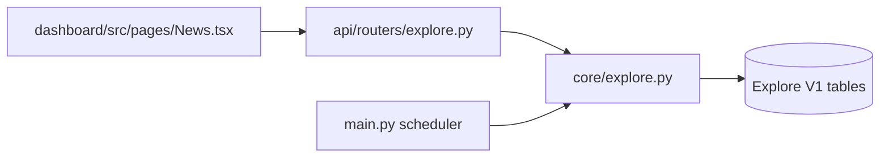
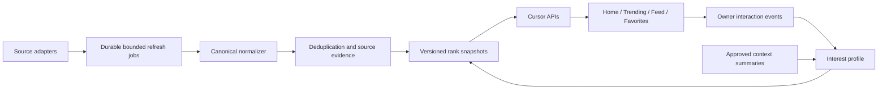
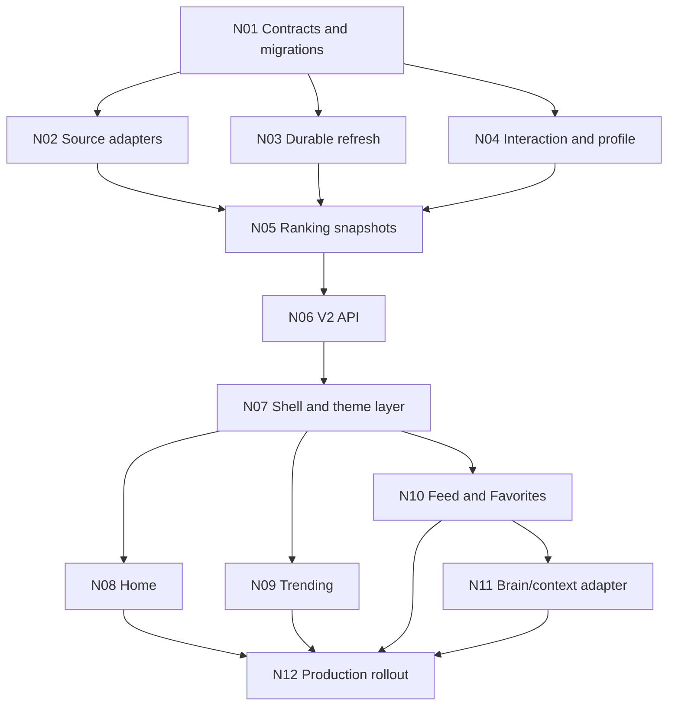

# News Page V2 - Personalized AI Intelligence Dashboard

- **Queue item:** #23
- **Status:** Queued
- **Solo-founder effort:** XXL - 12-18 focused days
- **Dependencies:** Use the accepted #20 Brain V2 service contract; coordinate theme-token work with #13.
**Rollout rule:** Preserve Explore V1 behind `news_v2_enabled` until every production gate passes.

## 1. Mission And Locked Product Decisions

Replace the current Explore page with a fast, personalized intelligence dashboard that helps the owner see trustworthy model updates, discover important AI repositories/tools early, and consume an attractive but diverse AI news and social feed.

| Tab | Primary job | Default behavior |
|---|---|---|
| Home | Model intelligence | General LLM Top 10 plus releases from the last 30 days |
| Trending | Curiosity and FOMO | GitHub week/month/all-time, Tool Discovery, Source Explore |
| News Feed | Personalized reading | `For You`, with `Latest` as a segmented alternative |
| Favorites | Durable owner collection | Saved items and private notes; no automatic refresh |

Locked decisions from the 30-question intake:

- Normalize model rank data across multiple sources. Exclude stale/incomplete models from Top 10, but retain them in Model Explorer.
- Keep specialist image/video models in Explorer filters, not the general LLM Top 10.
- Prefer free and official sources; paid/keyed sources are optional integrations.
- GitHub week/month uses stored star-growth snapshots; all-time uses total stars.
- Tool Discovery covers AI products and developer libraries from GitHub, Hacker News, and Product Hunt when configured.
- Source Explore is a ranked projection of the canonical store, not a separate store.
- Feed defaults to `For You`; comments are private owner notes.
- Dislike hides immediately with exactly 10 seconds to Undo.
- Favorites and noted items are retained indefinitely; untouched items expire after 90 days.
- Cross-module context is transparent, provenance-labelled, and configurable by context class.
- News writes to Brain only through explicit `Save to Brain`.
- Home, Trending, and Feed have separate Daily/Weekly/Monthly schedules. Favorites has no schedule.
- Refresh preserves scroll position and shows an `N new posts` banner.
- Missing media uses a source/provider token fallback, never generated filler.
- Feed pages adapt between 15 and 40 items, bounded by the server.
- Delivery uses production-ready vertical slices rather than one large cutover.

## 2. Current State And Gaps

| Area | Current state | V2 gap |
|---|---|---|
| Frontend | Large Models/Tools/Social page | No four-tab UX, virtualization, Favorites, or personalized feed |
| Backend | `core/explore.py` owns schema, fetch, ranking, refresh, and reads | No typed source boundary or isolated services |
| Ranking | Source weight, recency, engagement, keyword proxy | No normalized evidence, confidence gate, diversity, or explanations |
| Reads | Fixed `LIMIT` lists | No stable cursor or snapshot consistency |
| Refresh | In-process functions and transient SSE | No durable jobs, lease, restart recovery, or owner schedules |
| Learning | No interaction model | No likes, dislikes, notes, opens, dwell, profile, or undo ledger |
| Media | Source URLs rendered directly | No bounded allowlisted cache/proxy |
| Retention | Top-result trimming | No 90-day policy or favorite/note protection |
| Tests | No dedicated Explore V2 suite | Ranking, security, performance, and UX gates are missing |

The stored Graphify index predates the current Explore implementation. Use it only as historical navigation and verify all implementation conclusions against current source and tests.

## 3. Target Architecture And Boundaries

Create `core/news/`; retain `core/explore.py` as a V1 compatibility facade.

| Module | Ownership |
|---|---|
| `contracts.py` | Typed source records, canonical items, interactions, jobs, ranks, cursors |
| `repository.py` | Additive migrations, transactions, retention, snapshot reads |
| `sources/` | One timeout- and record-bounded adapter per external source |
| `normalizer.py` | Canonical URLs, types, timestamps, hashes, dedupe keys |
| `ranking.py` | Versioned model/trending/feed formulas and diversity constraints |
| `personalization.py` | Signal weights, profile recompute, `Why shown` reasons |
| `refresh.py` | Jobs, leases, source checkpoints, retry/cancel/resume |
| `media.py` | Allowlisted fetch, validation, cache, cleanup |
| `service.py` | Use cases consumed by API and scheduler |

No page request may invoke an LLM. Use source summaries or deterministic bounded excerpts.

## 4. Additive Data Model

Keep `explore_sources` and `explore_config` during migration. Add a News V2 migration ledger plus:

| Table | Responsibility |
|---|---|
| `news_items` | Canonical item, URL hash, type, title, excerpt, times, expiry, media key |
| `news_item_sources` | External ID, original URL, payload hash, trust, engagement, observed time |
| `news_interactions` | Current reaction, favorite, note, open/dwell aggregate, optimistic version |
| `news_interaction_events` | Append-only actions, idempotency, undo deadline, reversal link |
| `news_interest_profiles` | Versioned topic/source affinities and provenance |
| `news_rank_snapshots` | Immutable ranked result sets and cursor boundaries |
| `news_refresh_jobs` | Tab, state, lease, source checkpoints, attempts, errors, metrics |
| `news_github_snapshots` | Repository/date/star count for honest growth |
| `news_model_metrics` | Model/category/source/metric/value/confidence/freshness/version |
| `news_model_releases` | Release/update evidence and source URL |
| `news_media_cache` | URL hash, local key, MIME, bytes, dimensions, expiry |
| `news_settings` | Per-tab schedule, enabled sources, context controls |

Required uniqueness/indexes cover canonical URL hashes, source/external IDs, owner/item interactions, rank ordering, refresh leases, expiry/filter fields, and repository/snapshot dates. Copy V1 items/models idempotently and retain their IDs as compatibility references. Never rewrite or delete V1 rows during rollout.

## 5. Source And Evidence Policy

| Domain | Primary sources | Rules |
|---|---|---|
| Model catalog | OpenRouter | Catalog, provider, price, context, capabilities, release and available metrics |
| Independent metrics | Artificial Analysis when configured | Server-side Vault key, caching, attribution, retained index version |
| Preference benchmark | Official Arena datasets | Dataset adapter only; never scrape leaderboard HTML |
| Releases | Official provider news/RSS plus catalog metadata | Source URL and observed timestamp required |
| GitHub | Authenticated REST API | Honor rate headers; use persisted snapshots for growth |
| Tool discovery | GitHub, official HN API, Product Hunt when configured | Normalize into canonical tools and retain source evidence |
| Feed | RSS, HN, Reddit, GDELT, configured news APIs | Treat all content as untrusted evidence |

Official feasibility references:

- [OpenRouter Models API](https://openrouter.ai/docs/api/api-reference/models/get-models)
- [Artificial Analysis Data API](https://artificialanalysis.ai/data-api/docs)
- [Arena official organization](https://huggingface.co/lmarena-ai)
- [GitHub REST rate limits](https://docs.github.com/en/rest/using-the-rest-api/rate-limits-for-the-rest-api)
- [Official Hacker News API](https://github.com/HackerNews/API/blob/master/README.md)

Every adapter defines timeout, maximum records, retry policy, rate-limit behavior, trust class, attribution, and normalized result schema. One failed source produces partial success rather than failing the tab refresh. Never invent missing metrics, growth, release dates, engagement, or media.

## 6. Ranking, Learning, And Context

### Model Strength

Top 10 eligibility requires current general-purpose status, fresh evidence, and at least two independent score families. Normalize within each source before aggregation and persist every component plus formula version.

| Component | Weight |
|---|---:|
| Intelligence and reasoning | 55% |
| Coding | 15% |
| Agentic capability | 10% |
| Arena preference | 10% |
| Speed | 4% |
| Cost efficiency | 3% |
| Context capacity | 3% |

Model Explorer supports Coding, Image, Video, Agent, Reasoning, Speed, and Cost views with source, timestamp, confidence, and formula version.

### Trending And Feed

- GitHub `week`/`month` compares the newest snapshot with the nearest valid snapshot at or before the boundary. Before enough history exists, show `Collecting history`. Never present current stars as growth.
- Feed score: trustworthy base 55% + direct News affinity 25% + novelty/diversity 10% + source engagement 10%.
- Cross-module context changes a score by at most five points; direct News actions take precedence.
- Return no more than three consecutive items from one source and no more than 40% from one topic.
- Each personalized card shows its two strongest deterministic reasons.

| Signal | Weight | Durable behavior |
|---|---:|---|
| Favorite | +5 | Protect item indefinitely |
| Private note | +4 | Protect item indefinitely |
| Like | +3 | Immediate profile signal |
| Meaningful dwell | +1 | Record after threshold |
| Open original | +1 | Append and aggregate |
| Dislike | -5 | Hide immediately; commit after Undo deadline |

Dislike creates a pending event with `undo_until`. Undo records a reversal and prevents negative profile influence. Scheduled durable profile recomputation provides stable learning; a small bounded modifier makes direct actions affect the next page immediately.

Allowed context classes are approved owner interests/preferences, active-project topic summaries, and chat topic aggregates. Each has an owner toggle and provenance. Exclude raw transcripts, private files, tool output, and unapproved memories.

`Save to Brain` calls the accepted Brain V2 service boundary with provenance `news:<item_id>` and deduplication. Do not import or mutate #20 internals.

## 7. API Contract

Add under `/api/explore/v2`:

| Route | Responsibility |
|---|---|
| `GET /home` | Top 10, releases, source health, freshness |
| `GET /models` | Search/category explorer with cursor |
| `GET /trending` | GitHub/tools/source projection by section/window |
| `GET /feed` | `for_you`, `latest`, or `favorites` with cursor/filters |
| `PATCH /items/{id}/interaction` | Like/dislike/undo/favorite with idempotency/version |
| `PUT /items/{id}/note` | Upsert private note |
| `POST /items/{id}/events` | Open and bounded dwell events |
| `POST /items/{id}/save-to-brain` | Explicit Brain promotion |
| `GET|PATCH /settings` | Sources, schedules, context-class controls |
| `POST /refresh` | Start/join durable tab refresh and return `job_id` |
| `GET /refresh/{job_id}` | Durable job/source state |
| `GET /refresh/{job_id}/stream` | Ordered SSE events |
| `POST /refresh/{job_id}/commands` | Cancel or retry failed sources |
| `GET /media/{cache_key}` | Serve validated cached media only |

Use opaque snapshot/rank cursors and clamp `limit` to 15-40. Refresh events carry job ID, sequence, tab, source, stage, progress, retryability, and a redacted error. Mutations require `Idempotency-Key` and optimistic interaction version. Retain all legacy `/api/explore/*` routes for rollback.

## 8. UI And Theme Specification

### Shared shell

- Compact operational header with four tabs, freshness, source health, refresh, schedule, and settings.
- Skeleton, cached, stale, empty, offline, partial-failure, and rate-limited states.
- Refresh never jumps the feed; insert only after the owner activates `N new posts`.

### Home

- First viewport contains two aligned widgets: Model Strength Top 10 and Latest Releases.
- Rows show rank, provider icon, model, relative bar, score, evidence freshness, and source tooltip.
- `Explore models` opens a full-screen searchable/filterable workspace.

Rank styling must reduce in attractiveness from #1 through #3:

| Rank | Treatment |
|---|---|
| #1 | Strongest semantic accent border, trophy badge, luminous bar, emphasized type, subtle Full-motion pulse |
| #2 | Secondary semantic accent, soft static halo, medium emphasis |
| #3 | Tertiary accent edge and restrained surface tint |
| #4+ | Neutral rows |

Use News-scoped variables mapped from active theme tokens. Do not hardcode dark/gold styling. Reduced/Off motion removes animation while preserving badge, border, type, and bar hierarchy. Apply the same rank hierarchy to GitHub and other ordered Top 3 tables.

### Trending

- Compact source/window/schedule/refresh controls.
- GitHub ranking table first, then one featured Tool Discovery item plus alternatives, then Source Explore cards.
- Source Explore reuses canonical item/detail behavior.

### News Feed And Favorites

- Desktop: virtualized feed plus sticky control/metrics rail. Mobile: rail becomes drawer/bottom sheet.
- Feed controls include `For You | Latest`, source filter, freshness, and refresh.
- Cards include source, author, time, verified state, optional media, title, summary, like, dislike, note, favorite, `Why shown`, and Open Original.
- Show an inline 10-second Undo state after dislike.
- Favorites reuses the renderer, filters by source/type/note, supports note editing, never auto-refreshes, and never expires.
- Do not place cards inside cards.

## 9. Performance, Safety, And Operations

- Add `@tanstack/react-virtual`; do not hand-roll variable-height windowing.
- Keep approximately 60 or fewer feed items in the DOM.
- Lazy-load media and reserve measured/aspect-ratio space to avoid layout shift.
- Precompute ranks and profiles in background jobs.
- Allow one active refresh lease per tab; later requests join it.
- Bound each source by records, wall time, attempts, and concurrency; checkpoint each source for restart.
- Nightly retention removes untouched 90-day items, aggregates old events, and cleans orphaned media. Favorites/notes are exempt.
- Media only fetches URLs persisted by enabled adapters. Block private/link-local destinations, revalidate redirects, inspect MIME, cap at 5 MiB and 4096px, strip metadata, and enforce a five-second deadline.
- Sanitize HTML/URLs. Treat source text as untrusted evidence, never instructions.
- Keep keys in Vault and errors redacted. Repeated source failures create one deduplicated Inbox action.

| Performance gate | Target |
|---|---:|
| Cached list API p95 | <300 ms |
| Uncached list API p95 | <700 ms |
| Interaction response | <200 ms |
| Refresh acknowledgement | <500 ms |
| Adaptive batch | 15-40 items |
| Malformed HTML/raw provider errors reaching UI | 0 |
| Fabricated metrics or growth | 0 |

## 10. Implementation DAG

| ID | Worker task | Depends on | Acceptance | Risk |
|---|---|---|---|---|
| N01 | Contracts, additive schema, repository, V1 copy, flag | None | Idempotent; V1 rows unchanged | Medium |
| N02 | Bounded adapters and canonical normalizer | N01 | Partial source failure; evidence retained | High |
| N03 | Jobs, leases, checkpoints, schedules, retention | N01 | Restart-safe; no overlap/duplication | High |
| N04 | Interactions, Undo, profiles, reasons, settings | N01 | Replay-safe; exact Undo behavior | High |
| N05 | Versioned model/GitHub/tool/feed snapshots | N02-N04 | Deterministic, attributed, stable pagination | High |
| N06 | V2 routes, cursors, SSE, compatibility | N05 | API contracts and cursor tests pass | Medium |
| N07 | Split frontend, shell, themes, responsive states | N06 | Every installed theme/motion mode usable | Medium |
| N08 | Home and full-screen Model Explorer | N07 | Top 10/releases always sourced and timed | Medium |
| N09 | GitHub, Tool Discovery, Source Explore | N07 | No fake growth before valid snapshots | Medium |
| N10 | Virtualized Feed/Favorites and interactions | N07 | Stable scroll; bounded batch; durable saves | High |
| N11 | Approved context and explicit Brain promotion | N10, #20 | No automatic write/raw transcript retrieval | High |
| N12 | Security, performance, visual QA, telemetry, docs | N08-N11 | All launch gates pass | Medium |

Worker boundaries:

- N01-N06: `core/news/`, Explore router, scheduler registration, backend tests.
- N07-N10: `dashboard/src/pages/News.tsx`, `dashboard/src/components/news/`, API types, frontend tests.
- N11 consumes #20 through its accepted service/API only.
- N12 updates architecture/operations docs after verified behavior. Preserve `EXPLORE_NEWS_SPEC.md` as V1 history.

## 11. Verification And Launch Gate

- Unit-test normalization, dedupe, evidence, metric normalization, formulas, diversity, signals, Undo, reasons, retention, and cursors.
- Contract-test each adapter for timeout, malformed/empty data, rate limit, missing key, attribution, duplicate IDs, and partial failure.
- Test lease ownership, restart, retry, cancel, duplicate refresh, due schedules, and interrupted retention.
- Test API cursor stability, limit clamps, idempotency, optimistic conflict, SSE sequence, and V1 compatibility.
- Security-test SSRF, redirect rebinding, malicious SVG/HTML, oversized media, script URLs, prompt injection text, arbitrary proxy requests, and secret leakage.
- Performance-test 10,000 items, concurrent read/refresh, 40-item pages, profile recompute, and media cleanup.
- Frontend-test four tabs, feed mode, new-post insertion, 10-second Undo, favorites/notes, settings, partial failure, attribution, responsive rail, and skeleton/empty states.
- Visually test desktop/mobile across current light, dark, and custom themes with Full, Reduced, and Off motion. Reject overlap, clipped menus, layout shift, and dark-only colors.
- Run targeted backend/frontend suites, `npm run build`, and affected Explore/Brain/theme regressions.

Owner review uses a fixed 20-item sample and requires at least 80% trustworthy/correctly attributed, at least 70% relevant or interesting, zero fabricated data, no diversity-rule violations, useful `Why shown` reasons, and successful refresh/restart/interaction/Undo/favorite/note/Save-to-Brain flows.

## 12. Rollout, Rollback, And Conflicts

1. Foundation: shadow schema/adapters/jobs/ranks while V1 remains authoritative.
2. Home: owner-only V2 Home and evidence review.
3. Trending: enable after GitHub history and source-health gates mature.
4. Feed/Favorites: enable interaction learning, virtualization, and retention.
5. Context: enable only after #20 service/auth acceptance.
6. Default: enable `news_v2_enabled` after all gates pass for seven consecutive local refresh runs.

Rollback disables one flag. Keep V2 tables for diagnosis and retain V1 routes/data. Never down-migrate or delete owner interactions during rollback.

| Conflict/risk | Required mitigation |
|---|---|
| #20 Brain V2 still changes | Delay N11; no direct Brain table writes |
| #13 Theme V2 overlaps | Use stable existing tokens and News-scoped rank variables; avoid global theme schema |
| Benchmark license/availability changes | Optional adapter health gate, attribution, no scrape fallback |
| GitHub limits or immature history | Cached/bounded authenticated jobs and honest collecting state |
| Clickbait/repetition | Trust floor, personal boost cap, source/topic diversity, reasons |
| Noisy learning | Event ledger, bounded immediate modifier, scheduled recompute, owner controls |
| Media SSRF | Persisted allowlist, IP/redirect/MIME/size/deadline checks |
| Bundle/scroll regressions | Lazy chunks, proven virtualization, measured performance gate |

## 13. Definition Of Done

#23 is complete only when all four tabs are production-usable; ranking and personalization are evidence-backed; refresh and restart recovery are durable; source usage is visible; security, performance, theme, and owner launch gates pass; and V1 rollback remains available.

Do not mark complete for a visual-only redesign, mocked/fixed data, fake actions, client-only preferences, or a transient refresh loop.
