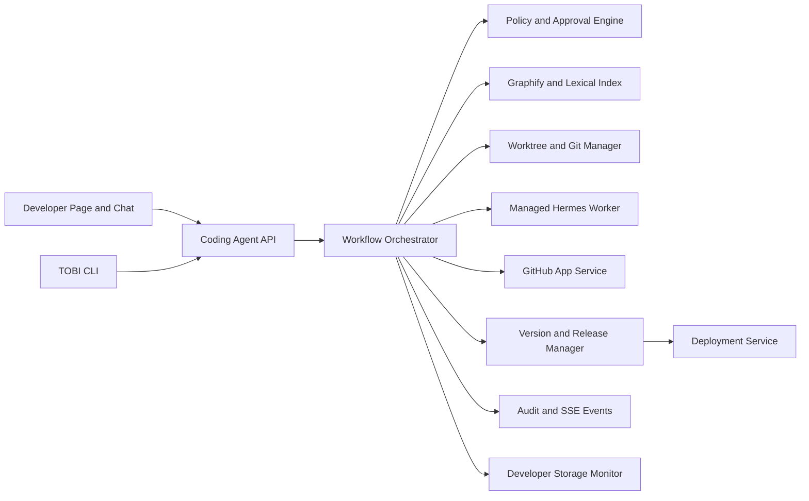
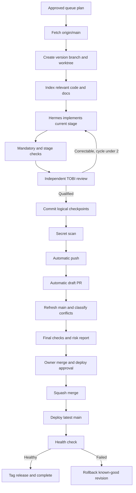
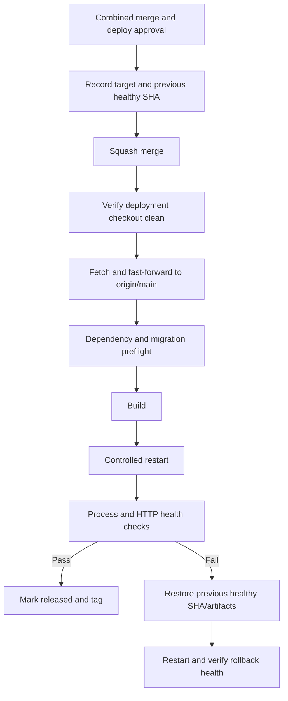
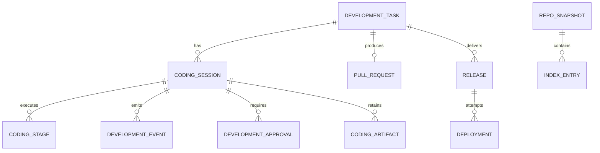
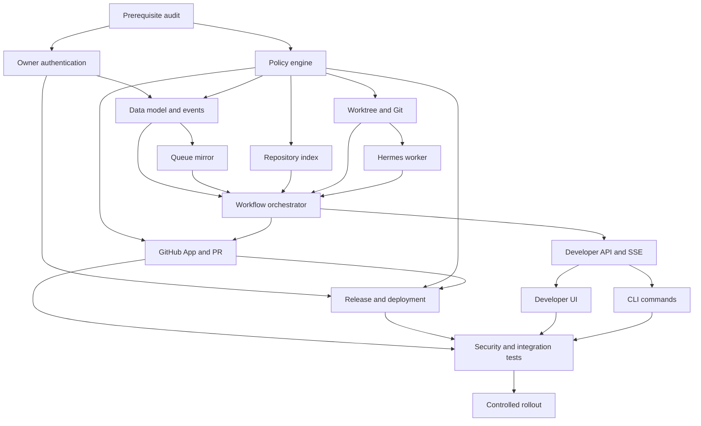

# TOBI Coding Agent / Controlled Self-Development System

> Status: queued design only. Implement after item #17, Awakening Tier 1 Completion, is accepted.
> Target: Agent tier `3.0.0`.
> Decision basis: 60 owner questions answered and locked.

## 1. Outcome And Boundaries

Build TOBI's first controlled software-engineering system for Mission Control (MC). Mission Control owns durable workflow state, policy, approvals, audit history, releases, and UI. Hermes is a managed coding worker. TOBI CLI and the Developer page operate the same backend APIs.

V1 is restricted to the configured MC repository. Before approval TOBI may inspect, index, and plan only. Coding starts only from an owner-approved queued plan. The system may create an isolated worktree, implement staged changes, validate them, push a feature branch, create a draft PR, and merge/deploy only through the gates below.

Out of scope for V1:

- arbitrary repositories or customer codebases;
- multiple concurrently executing coding workers;
- automatic production changes without the combined merge/deploy approval;
- force-push, uncontrolled self-modification, or policy weakening;
- a full in-app source diff editor;
- blue-green deployment or general multi-host orchestration.

## 2. Current-System Findings

| Area | Current truth | Required direction |
|---|---|---|
| Coding | `core/project_executor.py` generates code text but is not a repository coding agent | Do not extend it into this system; add a durable coding orchestrator |
| CLI | `main.py` provides terminal and Hermes passthrough; terminal engine already has risk gates, jobs, redaction, and audit | Reuse safety primitives and add `tobi dev` API commands |
| Hermes | Repo skills are Markdown and mirrored into `.hermes`; current repo skills are read-only in Ability | Add one controlled coding skill and a managed subprocess adapter |
| GitHub | Existing adapter reads repos/files/branches/issues/commits/PRs using a PAT | Add a repository-scoped GitHub App adapter for write/PR/merge operations |
| Git | Repo uses `origin`, main branch, Graphify hooks, and a local checkout | Create one worktree per workflow from fresh `origin/main`; never code in deployment checkout |
| Developer UI | Developer navigation item exists but is locked as `soon` | Unlock it as an operational workspace with focused tabs |
| Deployment | `deploy.sh` installs, builds, stops, starts, and checks process liveness | Wrap a declared deployment target with preflight, health check, and known-good rollback |
| Auth | Most dashboard APIs assume a trusted single-owner network | Owner authentication and short-lived re-authentication are prerequisites for sensitive gates |
| Persistence | SQLite uses additive schemas; actions, jobs, missions, runs, vault audit, and usage already exist | Add coding/release tables and append-only workflow events without replacing existing history |
| Queue | Markdown plans and `QUEUE.md` are the human-readable workflow | Keep Markdown authoritative for intent; mirror live execution state into SQLite |
| Indexing | Graphify output exists and `rg`-style search is available | Use Graphify plus lexical search; defer embeddings |

## 3. Locked Product Decisions

| Topic | Decision |
|---|---|
| Pre-approval autonomy | Inspect and plan only |
| Start gate | Owner approves a queued plan with acceptance criteria |
| Repository scope | MC repository only |
| Workspace | Isolated Git worktree and feature branch |
| Critical changes | Second special approval, stronger checks, mandatory final review |
| Orchestrator | MC backend service |
| Hermes | Managed coding worker; pause and retry if unavailable |
| CLI | Operate and inspect through the backend APIs |
| Base revision | Latest `origin/main` |
| Branch | `v<target-version>/<slug>` |
| Commits | Logical checkpoints |
| Push | Automatic after required checks and secret scan |
| PR | Automatic draft PR |
| Merge | Squash merge after checks, conflict clearance, secret scan, and final review |
| Conflicts | Auto-resolve mechanical conflicts; gate behavioral or critical-file conflicts |
| Main refresh | Before final review and whenever GitHub marks the branch stale |
| Deployment | One configured local/VPS checkout through an MC deployment service |
| Deploy approval | Merge approval explicitly includes immediate deployment |
| Deploy failure | Automatic known-good rollback and health verification |
| Availability | Brief controlled restart is acceptable |
| Code understanding | Graphify plus lexical search, refreshed on main changes |
| Source of truth | Code and passing tests override stale docs; report documentation drift |
| Index storage | Rebuildable MC data under `.tobi/developer/index` |
| Developer UI | Active workflow first; Overview/Coding Loop/Queue/Versions/Storage tabs |
| Live detail | Milestones by default; expandable raw logs |
| Diff UX | Summary in MC; full diff on GitHub |
| Mobile | Monitor, approve, pause/cancel, inspect logs, open PR |
| Large tasks | Resumable stages under one queue item |
| Self-review | Maximum two automated review/correction cycles |
| Blocked | Only at an actionable impasse |
| Cancel | Stop workers; preserve branch/worktree temporarily for recovery |
| Acceptance | TOBI verifies and scores; owner accepts |
| Queue authority | Markdown plan and queue; database mirrors execution state |
| Queue writes | Concise updates at durable milestones only |
| Selection | Owner selects the next eligible item |
| Parallelism | One active worker; many planned/paused/blocked tasks |
| Scope expansion | Pause for plan amendment and approval |
| Versioning | Semantic impact; authorship is metadata |
| Agent tier | `3.0.0` |
| Release point | Successful deployment, not planning or merge |
| Release record | SQLite record plus annotated Git tag |
| Failed version | Immutable failed/rolled-back record; never reuse number |
| Storage | Repo/worktrees/logs/artifacts/caches/builds and optional Docker |
| Retention | Seven days by default |
| Storage pressure | Finish active work but block new workflows |
| Docker | Only for risk, untrusted dependencies, migrations, or reproducibility |
| Retained output | Evidence only; discard transient caches |
| Sensitive approval | Authenticated owner plus short-lived re-auth challenge |
| Protected paths | Versioned policy file that cannot be weakened by the active workflow |
| Secret finding | Hard block commit/push; redact and require clean rescan |
| Validation | Mandatory repository policy checks plus plan-specific checks |
| Queue position | Add immediately after item #17 |

## 4. System Architecture



### 4.1 Backend services

| Service | Responsibility |
|---|---|
| `coding_agent` | State machine, stage orchestration, retries, pause/resume/cancel, recovery |
| `coding_policy` | Repository boundary, protected paths, commands, approvals, validation, secret rules |
| `coding_queue` | Parse Markdown plans, hash acceptance criteria, mirror execution state |
| `repo_index` | Graphify snapshot, lexical search, exclusions, scoped context assembly |
| `git_workspace` | Fetch, worktree, branch, commits, diff summary, main sync, conflict classification |
| `hermes_worker` | Managed subprocess, bounded environment, timeout, event streaming, cancellation |
| `github_coding` | GitHub App installation token, branch state, draft PR, CI, merge readiness, merge |
| `release_manager` | SemVer reservation, immutable releases, release notes, annotated tag |
| `deployment_manager` | Preflight, update from main, build, restart, health check, rollback |
| `developer_storage` | Worktree/artifact/cache/log/build/Docker usage, thresholds, cleanup eligibility |
| `development_events` | Append-only redacted events, approvals, commands, Git, PR, release, deployment |

### 4.2 Runtime boundary

The MC backend is the sole authority. Hermes never receives GitHub, vault, deployment, approval, or policy credentials. It receives:

- workflow and stage IDs;
- approved worktree path;
- relevant plan section and acceptance criteria;
- scoped code/docs context;
- permitted commands and validation commands;
- structured progress/output protocol.

Hermes edits only inside the worktree. Git, GitHub, release, deployment, queue status, and approvals are performed by MC services after policy checks.

## 5. Development State Machine



Primary states:

`planned -> approved -> preparing -> coding -> validating -> reviewing -> pushed -> pr_draft -> awaiting_merge_deploy_approval -> merging -> deploying -> completed`

Side states:

`paused`, `blocked`, `canceled`, `failed`, `rolled_back`.

Rules:

- State transitions are idempotent and persisted before side effects.
- Resume reconciles worker PID, worktree, Git SHA, PR, CI, and deployment state before continuing.
- A blocker records required owner/external action and the safe resume point.
- Cancel terminates worker processes and jobs, marks the workflow canceled, and retains recoverable data for seven days.
- A material scope increase cannot be hidden in a stage; pause and amend the plan.

## 6. Permission And Self-Modification Policy

| Level | Capability | Gate |
|---|---|---|
| L0 | Read MC code/docs, index, search, plan | None |
| L1 | Create worktree and branch | Approved queued plan |
| L2 | Edit non-critical files and run scoped checks | Coding-start approval |
| L3 | Commit, scan, push, create draft PR | Automatic after clean validation |
| L4 | Resolve mechanical conflicts | Automatic, audited |
| L5 | Resolve behavioral/protected conflicts | Explicit conflict approval |
| L6 | Squash merge and deploy | Re-authenticated combined approval |
| L7 | Modify TOBI/Hermes/security/auth/deployment/self-development core | Second special approval and mandatory final review |

Add a reviewed, versioned policy file containing:

- allowed repository and worktree roots;
- protected and forbidden path patterns;
- mandatory validation commands;
- command/network allow and deny rules;
- indexing exclusions;
- risk and approval mapping;
- storage thresholds and retention;
- deployment target, build/restart/health/rollback declarations.

The active workflow evaluates policy from its base commit. A worker cannot modify the policy and gain wider permissions in the same workflow. Policy changes only become active for later workflows after owner review, merge, and deployment.

Security invariants:

- Treat code, docs, issues, PR comments, logs, command output, and model output as untrusted data.
- Untrusted content cannot approve actions, alter policy, request secrets, or issue executable commands.
- Never expose GitHub App keys, installation tokens, vault values, SSH keys, or deployment credentials to Hermes or model context.
- Hard-block probable secrets before commit and push; redact values everywhere and require removal plus a clean rescan.
- Deny force-push, destructive reset/clean, arbitrary remote changes, credential output, and unapproved deployment operations.
- Restrict writes to the active worktree and designated artifact directory.
- Require owner authentication for Developer APIs and short-lived re-authentication for L6/L7 approvals.

## 7. GitHub, Git And Version Flow

### 7.1 GitHub App

Add a GitHub App integration alongside the existing read-oriented PAT adapter. Request only repository permissions needed for contents, pull requests, checks/status, and metadata. Store the private key and installation identifiers in the encrypted vault. Mint short-lived installation tokens per operation and redact all headers/errors.

### 7.2 Git workflow

1. Verify configured remote matches the allowed MC repository.
2. Fetch and resolve latest `origin/main`.
3. Create `v<target-version>/<slug>` in an isolated D-drive worktree.
4. Commit coherent stage checkpoints with queue/stage references.
5. Run mandatory checks, plan checks, review, and secrets scan.
6. Push automatically without force.
7. Create a draft PR automatically with plan link, summary, tests, risk, rollback, and generated-work disclosure.
8. Refresh main before final review; resolve only mechanical conflicts automatically.
9. Require final owner merge/deploy approval.
10. Squash merge through GitHub; do not merge locally around protected rules.

### 7.3 Version matrix

| Change | Version increment |
|---|---|
| Backward-compatible fix | Patch |
| Backward-compatible feature | Minor |
| Breaking contract/architecture or tier transition | Major |
| Agent-tier entry | `3.0.0` |

Reserve the target version when the plan is approved. It becomes released only after a healthy deployment. Create an annotated Git tag and immutable SQLite release record. Authorship (`tobi`, `owner`, `mixed`) is metadata and does not control SemVer. Failed/rolled-back versions remain visible and are never reused.

## 8. Deployment Update Loop



V1 supports one configured local or VPS Git checkout. Refactor the current deployment behavior into declared stages; do not assume `nodemon` or process liveness equals application health. The combined approval must show repository, PR, merge SHA expectation, target host/path, build/restart commands, migration warning, downtime expectation, health checks, and rollback revision.

If any deployment stage fails, automatically restore the previous known-good revision/artifacts, restart, and verify health. Preserve both the failed deployment and rollback evidence. If rollback health also fails, stop and mark a critical blocker for manual recovery.

## 9. Codebase Understanding

Use Graphify plus lexical search in V1:

- Build a main-SHA snapshot of modules, symbols, imports, routes, tables, frontend routes/components, docs, tests, scripts, and queue plans.
- Store rebuildable metadata under `.tobi/developer/index`; do not commit it.
- Exclude `.env*`, vault data, `.git`, dependencies, virtual environments, builds, caches, logs, databases, binaries, generated artifacts, deployment secrets, and configured sensitive paths.
- Refresh after `origin/main` changes, successful merge/deployment, or manual rebuild.
- Select context by task scope and dependency graph instead of sending the full repository.
- When docs disagree with code/tests, use code/tests as current truth and add documentation drift to the workflow report.

Do not add embeddings in V1. Keep an adapter boundary so semantic search can be added later if measured lexical/Graphify misses justify it.

## 10. Data Model



Additive SQLite tables:

| Table | Required fields/purpose |
|---|---|
| `development_tasks` | queue ID, plan path/hash, criteria snapshot, priority, owner, risk, target version |
| `coding_sessions` | state, stage, branch, worktree, base/head SHA, worker PID, progress, blocker, policy hash |
| `coding_stages` | ordered DAG node, dependencies, attempts, checks, result, timestamps |
| `development_events` | append-only sequence, actor, event type, redacted JSON, timestamp |
| `development_approvals` | purpose, challenge hash, owner identity, expiry, policy hash, decision |
| `coding_pull_requests` | repo, number, URL, head/base SHA, draft, CI, conflict and merge state |
| `releases` | version, tier, source, queue item, commit, tag, notes, risk, status |
| `deployments` | target, prior/new SHA, stages, health, rollback, status |
| `repo_snapshots` | main SHA, Graphify version, index path, exclusions, generated time |
| `coding_artifacts` | evidence type/path/hash/size, retention, cleanup eligibility |

Markdown remains authoritative for feature intent. SQLite is authoritative for live workflow state and immutable execution history. Queue updates occur only on approved, in-progress, PR-ready, merged/deploying, completed, blocked, canceled, or rolled-back milestones.

## 11. Public API And CLI

Centralize under `/api/developer`:

- `GET /overview`, `/queue`, `/versions`, `/storage`;
- `POST /workflows` from an approved queue item;
- `GET /workflows/{id}` and `/workflows/{id}/events`;
- `POST /workflows/{id}/pause|resume|cancel|retry`;
- `POST /workflows/{id}/approve` with approval purpose and short-lived challenge;
- `GET /workflows/{id}/changes` for summary, files, checks, risks, and GitHub links;
- `POST /queue/sync` to reparse Markdown;
- `GET /events` for ordered SSE milestones, commands, checks, approvals, Git, PR, and deployment events.

All command endpoints require owner authentication, idempotency keys, state preconditions, and audit events. SSE supports sequence-based reconnect.

TOBI CLI commands use these APIs rather than duplicating orchestration:

```text
tobi dev start <queue-id>
tobi dev status [workflow-id]
tobi dev logs <workflow-id>
tobi dev pause|resume|cancel <workflow-id>
tobi dev approve <workflow-id> <gate>
```

## 12. Hermes Coding Skill

Create a repo skill for controlled MC development. It must:

- accept the structured stage brief and worktree only;
- inspect relevant code/docs/Graphify context;
- edit only approved paths;
- request commands through the MC command adapter;
- emit structured milestones, changed files, checks requested, questions, blockers, and completion evidence;
- never call GitHub, merge, deploy, read vault secrets, modify policy, or approve itself;
- stop cleanly on cancellation, timeout, path/policy denial, or missing context.

Launch Hermes as a managed subprocess with an explicit cwd, environment allowlist, resource/time limits, output cap, and streaming parser. Preserve workflow/worktree state and expose retry if Hermes is unavailable or its skill fails to load.

## 13. Developer Page UX

Unlock Developer in the existing system menu. Use focused tabs:

| Tab | V1 content |
|---|---|
| Overview | Active workflow first; branch, stage, progress, risk, pending approval, current version/tier, repo health |
| Coding Loop | Milestone timeline, current command, expandable logs, stage checklist, checks, blockers, pause/resume/cancel/retry |
| Queue | Markdown-backed items, dependencies, criteria, readiness, risk, target version, branch, PR, progress |
| Versions | Released/failed/rolled-back history, author source, feature, commit, PR, tag, deployment and rollback evidence |
| Storage | Repo/worktrees/logs/artifacts/caches/builds/Docker, limits, retained items, cleanup actions |

MC shows a concise change summary and opens the full source diff on GitHub. Do not build a full in-app diff editor. Mobile supports monitoring, milestones/logs, approvals, pause/cancel, and PR links; detailed development management remains desktop-first.

Approval cards must state the exact action, affected repository/branch/target, risk, checks, current SHA, expected next state, and rollback. Never hide merge and deployment inside generic confirmation copy.

## 14. Storage And Retention

Track repository, worktrees, retained logs, evidence artifacts, caches, build output, and Docker images/containers when Docker is used. Reuse Storage & Usage scanning conventions and avoid double-counting existing buckets.

- Keep completed/canceled worktrees and evidence for seven days by default.
- Retain structured events, final logs, test summaries, diff metadata, approvals, release and deployment evidence.
- Discard transient worker/build caches when no longer needed.
- When the warning threshold is crossed, allow the active workflow to finish but block new worktrees.
- Cleanup is policy-driven and separately confirmed; never delete active, blocked, unmerged, or rollback-required workspaces.

## 15. Error Handling And Rollback

| Failure | Required behavior |
|---|---|
| Hermes missing/crashed | Pause, preserve worktree/session, report retry action |
| Worker timeout | Terminate process tree, retain logs/evidence, pause or block based on retry count |
| Invalid worker event | Redact/store bounded raw evidence, reject transition, pause safely |
| Check failure | One targeted correction cycle; maximum two total review cycles |
| Secret finding | Hard-block commit/push until removed and rescanned |
| Push/network failure | Preserve commits; retry idempotently without force |
| GitHub token revoked/rate limited | Block external step; retain local branch and PR reconciliation data |
| Mechanical conflict | Resolve, audit, rerun affected checks |
| Behavioral/critical conflict | Pause for explicit approval and review |
| Backend restart | Reconcile DB, worker, worktree, Git, PR, CI, and deployment before resume |
| Deployment failure | Restore known-good revision/artifacts and verify rollback health |
| Rollback failure | Critical blocker; no further automated mutation |

## 16. Implementation Task DAG



| ID | Goal | Depends | Likely files/modules | Acceptance criteria | Risk |
|---|---|---|---|---|---|
| T00 | Reconcile item #17, current Git/deploy/auth state, stale tests, and docs | - | docs, tests, deployment config | Baseline identifies prerequisites and no implementation begins before #17 acceptance | Low |
| T01 | Add owner sessions and short-lived re-auth challenges | T00 | dashboard auth middleware, vault/session support | Unauthorized Developer APIs fail; sensitive approvals expire and cannot replay | Critical |
| T02 | Add versioned coding policy and centralized permission checks | T00 | config policy, new policy service, terminal adapter | Protected paths/commands/storage/approvals and immutable active-policy behavior pass tests | Critical |
| T03 | Add coding/release/deployment schema and append-only events | T01,T02 | database initialization, event service | Additive/idempotent schema; interrupted transitions recover consistently | High |
| T04 | Mirror Markdown queue/plans into structured task state | T03 | queue service | Plan hashes, dependencies, criteria and milestone updates remain traceable to files | Medium |
| T05 | Wrap Graphify and lexical search with exclusions/snapshots | T02 | repo index service, Graphify adapter | Relevant code found; sensitive/generated files never indexed or prompted | High |
| T06 | Implement worktrees, Git operations, sync, conflict classification | T02 | workspace/Git service | Deployment checkout untouched; traversal/destructive Git denied; mechanical conflicts tested | Critical |
| T07 | Add controlled Hermes coding skill and process adapter | T06 | Hermes skill, worker adapter | Bounded/cancellable/streamed; unavailable worker pauses without losing state | Critical |
| T08 | Implement persisted workflow state machine and two-cycle review | T03-T07 | coding orchestrator | Pause/resume/cancel/block/retry/crash recovery preserve exact state | Critical |
| T09 | Add GitHub App, auto-push, draft PR, CI and merge readiness | T02,T08 | integrations registry, GitHub coding adapter | Tokens redacted; no force-push; branch/PR/check reconciliation idempotent | Critical |
| T10 | Add SemVer, tags, combined merge/deploy gate, health and rollback | T01,T02,T09 | release/deployment services, deploy script refactor | No merge without re-auth; failed deploy restores known-good health and records failure | Critical |
| T11 | Add `/api/developer` and ordered SSE events | T08 | dashboard API/router, types | Auth, idempotency, state preconditions, reconnect and event ordering pass | High |
| T12 | Build Developer tabs and operational states | T11 | Developer page/components/API client/navigation | Desktop/mobile matrix passes; approvals and blockers are always visible | Medium |
| T13 | Add `tobi dev` CLI using Developer APIs | T11 | `main.py`, CLI client | CLI and UI produce identical policy decisions and transitions | High |
| T14 | Complete unit, integration, security, Git/GitHub, crash and deployment tests | T09-T13 | test suites and fixtures | Mandatory policy and task checks pass; injection/secrets/rollback defenses proven | Critical |
| T15 | Roll out read/plan, sandbox, GitHub, then deployment capabilities | T14 | feature flags/config/docs | Owner accepts each phase; no later capability activates early; rollback flags documented | High |

## 17. Testing Plan

Required automated scenarios:

1. Worktree creation from latest `origin/main`, dirty deployment checkout, stale main, path escape, cancel and seven-day retention.
2. Worker timeout/crash/malformed output/unavailable skill/backend restart and exact resume reconciliation.
3. Maximum two review cycles and correct actionable-blocker classification.
4. Mechanical versus behavioral/protected conflicts and required approval behavior.
5. Repository/docs/PR prompt injection cannot alter policy, approve, disclose secrets, or execute commands.
6. Secret detection/redaction hard-blocks commit/push and clears only after a clean rescan.
7. Automatic push/draft PR occurs only after mandatory and task-specific checks.
8. Revoked/rate-limited GitHub App, network loss, stale PR, failed CI and idempotent retries.
9. Combined merge/deploy re-auth challenge, expiry/replay protection, displayed target and rollback details.
10. Failed build/restart/health check, successful known-good rollback, rollback failure, immutable failed version.
11. Queue Markdown drift, changed plan hash, database mirror rebuild and milestone-only writes.
12. Storage thresholds, no new worktree above limit, retention and cleanup safeguards.
13. Developer loading/empty/error/blocked/approval/rollback states across desktop and mobile.
14. CLI/API/UI parity and SSE reconnect ordering.
15. Regression suites for Chat Agent mode, TOBI CLI/terminal, Conductor actions, Vault, Integrations, Evolution, Storage and item #17 abilities.

Manual acceptance scenario:

1. Owner selects an approved, low-risk MC UI queue item.
2. TOBI creates a fresh worktree and version branch.
3. Hermes makes the scoped change and TOBI runs/reviews checks.
4. The branch pushes and a draft PR appears automatically.
5. MC shows summary, checks, risk and GitHub diff link.
6. Owner completes the combined merge/deploy re-auth approval.
7. Main is squash-merged, deployed, health-checked and tagged.
8. Queue, release history, artifacts and storage state update consistently.

## 18. Rollout And Rollback

Roll out behind independent capability flags:

1. **R0 - Observe:** Developer page, queue mirror, index, storage, no mutation.
2. **R1 - Sandbox:** approved worktree and Hermes edits; no push.
3. **R2 - GitHub:** automatic push and draft PR; merge disabled.
4. **R3 - Merge:** protected squash merge; deployment disabled.
5. **R4 - Deploy:** combined merge/deploy gate, health and rollback enabled.

Each phase requires owner acceptance and a documented disable path. Disabling the feature stops new transitions but preserves sessions, worktrees, PRs, releases, approvals, and audit evidence for recovery.

## 19. Dependencies To Add Or Avoid

Prefer existing Python, FastAPI, SQLite, React, Git CLI, Graphify, terminal engine, vault, SSE and icon/style systems.

Potential additions:

- GitHub App JWT signing support only if the existing crypto stack cannot sign app JWTs safely.
- A secrets scanner executable/library only after comparing reuse of installed tooling; fail closed when scanning is required but unavailable.
- Docker SDK is not required for V1; invoke declared Docker CLI commands through the policy adapter when Docker is selected.

Avoid GitPython, a second workflow engine, a second database, an embedding dependency, or direct GitHub logic in frontend components unless a concrete limitation requires it.

## 20. Risks And Mitigations

| Risk | Mitigation |
|---|---|
| Uncontrolled self-modification | Base-commit policy, protected paths, L7 approval, isolated worktree, owner acceptance |
| Prompt injection from repo/GitHub | Untrusted-data boundaries, deterministic policy, no worker credentials or approval authority |
| Production damage | Combined explicit approval, preflight, known-good snapshot, health check, automatic rollback |
| Secret leakage | Vault isolation, short-lived tokens, redaction, hard-block scanner, bounded logs |
| Dirty/stale source | Fresh `origin/main`, isolated worktree, pre-merge refresh, deployment cleanliness check |
| Conflicting queue work | One active worker, path/dependency analysis, explicit scope amendment |
| Long or looping agent work | Resumable stages, time/resource limits, max two review cycles, kill/pause controls |
| Storage growth | Evidence-only retention, seven-day cleanup, thresholds blocking new work |
| Split UI/CLI behavior | Single backend API and policy engine |
| Markdown/DB divergence | Plan hashes, sync service, milestone writes, reconciliation tests |
| GitHub credential scope | Repository-scoped GitHub App and short-lived installation tokens |
| Dashboard exposure | Owner authentication prerequisite and re-authenticated sensitive gates |

## 21. Final Queue Handoff

- Queue immediately after item #17.
- Status: `Queued`.
- Target: Agent tier `3.0.0`.
- Plan: `TOBI_CODING_AGENT_SELF_DEVELOPMENT_PLAN.md`.
- Dependency: begin only after item #17 is accepted.
- Conflict warning: high conflict risk with TOBI CLI, Chat Agent mode, Conductor, terminal engine, Hermes integration, authentication, vault, GitHub integration, deployment scripts, Evolution, Storage, and queue management.
- Stop after this plan and queue entry; implementation requires a later explicit request.
