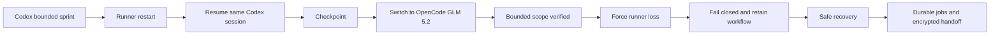

# TOBI Coding Agent V2 Acceptance - 2026-07-17

> Queue: #22
> Result: Historical V1 acceptance evidence. Superseded as the current closure gate by [TOBI_CODING_AGENT_V2_COMPLETION_ACCEPTANCE_2026-07-22.md](TOBI_CODING_AGENT_V2_COMPLETION_ACCEPTANCE_2026-07-22.md).

## Acceptance Graph

## Evidence

| Gate | Result | Evidence |
|---|---|---|
| Codex authentication and execution | Pass | Real Codex CLI using ChatGPT login completed an isolated bounded sprint |
| OpenCode and GLM execution | Pass | Real OpenCode CLI using `zai-coding-plan/glm-5.2` completed an isolated bounded sprint |
| Supervised runner | Pass | Both external workers executed through durable queued service jobs |
| Restart and resume | Pass | Runner stopped, restarted, and resumed the same Codex external session |
| Worker switching | Pass | Workflow checkpoint switched from Codex to OpenCode without changing workflow ownership |
| Scope control | Pass | Only the three expected marker files changed inside the isolated repository |
| Runner-loss handling | Pass | Forced runner termination produced durable `runner_lost` state and retained the workflow |
| Recovery | Pass | Restarted service completed a safe recovery job |
| Credential handling | Pass | OpenCode credential handoff was encrypted; no plaintext profile credential was stored in the runner job |
| Coding Agent v2 tests | Pass | 46/46 |
| Coding Agent regression | Pass | 41/41 |
| Production invariants | Pass | 14/14 |
| Developer recovery | Pass | Full focused suite |
| Python compilation | Pass | Touched runtime modules |

## Defects Closed

- Updated the seeded OpenCode model from removed `glm-4.6` to available `glm-5.2`.
- Added an additive migration that changes only the untouched legacy default and preserves owner-selected models.
- Added a Windows service-safe external CLI bridge with Base64 argument transport.
- Made the bridge explicitly enter the requested worktree before invoking Codex or OpenCode.
- Added a shell-stable bounded-sprint prompt contract.
- Added the missing Codex resume trust flag.
- Added regression coverage for Windows paths, working-directory inheritance, model migration, and resume arguments.

## Remaining Deployment Gate

The following evidence requires elapsed time and a deployed target host. It is not claimed by this local acceptance run:

- 24-hour VPS soak;
- 72-hour VPS soak;
- forced runner crash/restart on the target VPS;
- live GitHub mutation, merge, or deployment.

These checks remain required before calling the deployed continuous loop production-proven. They do not block queue #20 source development.

## Handoff To Queue #20

1. Pull or rebase onto the #22 closure commit from `origin/main`.
2. Keep #20 work isolated from any VPS soak checkout.
3. Preserve the Coding Agent v2 contracts for checkpoints, worker profiles, runner jobs, and encrypted credential envelopes.
4. Re-run the focused Coding Agent suites if #20 changes shared Developer persistence, policy, API, or runtime code.
