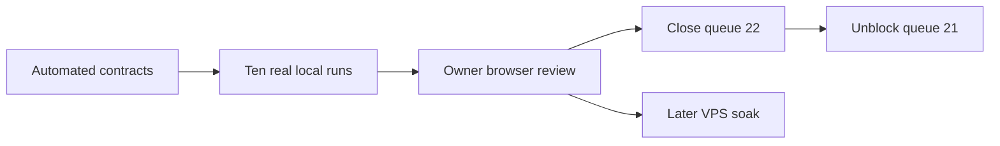

# TOBI Coding Agent V2 Completion Acceptance - 2026-07-22

> Queue: #22
> State: Implementation complete; local live-run and owner browser acceptance pending.
> Dependency: #21 remains blocked until every local gate below passes.

## Acceptance Graph



## Automated Evidence

| Gate | Result | Evidence |
|---|---|---|
| Python compilation | Pass | Completion runtime, persistence, tools, workers, loop, and API modules compile under Python 3.11. |
| Focused backend suite | Pass | 14 tests passed across completion, production, V2, tools, Process, Queue, and recovery coverage. |
| Dashboard type/build gate | Pass | `npm run build` completed; TypeScript and Vite production build succeeded. |
| Patch hygiene | Pass | `git diff --check` completed without whitespace errors. |
| Goal execution removal | Pass | Tests verify Goals do not create synthetic tasks or coding sprints. |
| Strict readiness | Pass | Tests verify disabled or unhealthy agents are blocked before session creation and alternatives are returned. |
| Same-run retry | Pass | Tests verify stale recovery keeps the workflow identity and records a restart event. |
| Evidence qualification | Pass | Tests verify Goal qualification is derived from linked criterion evidence. |
| Queue conflict protection | Pass | Tests verify canonical queue insertion and hash-conflict rejection. |

## Ten-Run Local Matrix

Record the workflow ID, Queue item, agent, evidence, result, and defect link for every run. A run is not a pass when it requires direct database repair or an undocumented manual workaround.

| # | Scenario | State | Required proof |
|---:|---|---|---|
| 1 | MC Native happy path | Pending | Ready Queue item reaches verified completion with criterion evidence and scorecard. |
| 2 | Codex happy path | **Partial 2026-07-28** | Authorized Codex session completes on one durable run and draft delivery is owner-gated. |
| 3 | OpenCode happy path | Pending | Authorized OpenCode session completes with selected provider/model shown consistently. |
| 4 | Protected-path approval | **Passed 2026-07-28** | Preflight blocks Start, approval is explicit, and the approved scope is audited. |
| 5 | Invalid agent preflight | **Passed 2026-07-28** | Disabled or unauthorized agent creates no run and healthy alternatives are offered. |
| 6 | Fallback agent switch | Pending | Mid-run failure pauses; owner switches agent at the same checkpoint without duplicate effects. |
| 7 | Backend restart resume | Pending | Restart reconciles Git, process, checkpoint, and side effects and safely resumes the same run. |
| 8 | Hung worker recovery | Pending | Heartbeat/no-output thresholds produce a structured recovery state and preserve evidence. |
| 9 | Main drift or conflict | Pending | Repository drift produces a safe owner action; no branch or Queue content is silently overwritten. |
| 10 | Auto classification | **Passed 2026-07-28** | Item blocker permits independent eligible work; system failure stops Auto. |

## Owner Browser Acceptance

- Overview has a true idle launchpad and never substitutes a historical workflow for an active run.
- Work presents Goals as outcomes/evidence and Queue items as executable work with one clear create/edit path.
- Preflight explains blockers and healthy agent alternatives before creating a run.
- Process prioritizes raw output, verified gates, pinned approval/recovery actions, copy log, and one foreground run.
- Agents clearly show priority, enabled state, health, authorization, tool, provider/model, last success, and configuration.
- History can replay logs, checkpoints, diffs, evidence, scorecard, and outcome without mutating the run.
- System contains Storage, Learning, and Version with advanced details behind progressive disclosure.
- Idle, active, approval, failed, recovery, completed, and history states remain understandable without reading raw payloads.

## Closure Rule

1. Complete and record all ten real local runs.
2. Complete the owner browser checklist.
3. Fix every blocker or document a consciously accepted non-blocking limitation.
4. Change #22 to Done and change #21 from Blocked to Queued.
5. Keep the 24-hour and 72-hour VPS soak as deployment gates before calling the continuous loop production-proven.

## Rollback

- Disable the Coding Agent V2 completion feature flag and retain additive Goal links, readiness snapshots, attempts, evidence, scorecards, and historical runs.
- Continue serving legacy workflow routes through compatibility adapters.
- Do not delete historical synthetic Goal tasks; keep them hidden from active Work.

## Run Log

### Run 1 — MC Native happy path — 2026-07-25 — BLOCKED (not attempted, no run created)

No workflow was created, so there is no workflow ID to record. The run was stopped by
preflight, which is the correct behavior: this is live confirmation of the "Strict
readiness" automated gate, not a defect in it. Nothing was mutated to work around the
blockers — the Closure Rule states a run is not a pass when it needs direct database
repair or an undocumented manual workaround, and that applies equally to manufacturing
the preconditions.

Authoritative preflight output (`completion.preflight(queue_id, active_probe=False)`
against the live DB):

| Queue item | Resolved agent | Ready | Blockers |
|---|---|---|---|
| #24 `testing` | `codex-chatgpt` (default fallback) | **False** | `reviewer_unavailable` |
| #22 (self) | `mc-native` | **False** | `reviewer_unavailable`, `agent_disabled`, `scope_too_large`, `protected_scope_approval` |

**Root blocker — `reviewer-default` is disabled.** `coding_completion.py` treats a
reviewer as unavailable when the profile is missing, `enabled` is falsy, or its adapter
is not `model_review`. This profile has `adapter=model_review` and `health=ready`; only
`enabled` is 0. **Every one of the ten scenarios requires an independent reviewer, so no
run can reach verified completion until this flag is on.**

Profile state, ordered by `updated_at`:

| Slug | enabled | health | updated_at |
|---|---:|---|---|
| `reviewer-default` | 0 | ready | 2026-07-18T18:15:21Z |
| `opencode-glm` | 0 | ready | 2026-07-18T18:15:22Z |
| `mc-native` | 0 | needs_auth | 2026-07-18T18:15:24Z |
| `codex-chatgpt` | 1 | ready | (live probe) |
| `hermes-legacy` | 1 | disabled | (live probe) |

Three profiles were disabled inside a **3-second window on 2026-07-18**, which reads as
programmatic rather than hand-edited. That is **four days before this acceptance matrix
was written**, so the ten runs have been unrunnable since before the matrix existed —
which explains 0/10 recorded runs against a system that has otherwise been exercised
(7 coding sessions, 22 worker sessions, 24 checkpoints, 555 development events).
**Worth diagnosing before re-enabling**: if a health-probe or policy path disabled them,
flipping the flags by hand will regress.

Additional blockers for run 1 specifically:

1. **Vault locked.** `/api/vault/status` reports `unlocked: false`; every
   `/api/developer/*` route returns `401 "Unlock the Mission Control vault to use
   Developer."` Requires the owner's master password in the browser.
2. **`mc-native` is disabled and `needs_auth`** — "codex is installed but its native
   login is not authorized." Run 1 is by definition the MC Native path, so the fallback
   to `codex-chatgpt` does not satisfy it; that is run 2.
3. **No Ready-scoped Queue item.** Statuses are 18 completed / 8 planned / 2 approved,
   with no Ready item. #24 is the only small candidate; the system judges #22 itself
   `scope_too_large` for one continuous session.

**Owner unblock sequence** (each step is owner-only — credentials or live config):

1. Unlock the Mission Control vault.
2. Diagnose *why* the three profiles were disabled on 2026-07-18, then enable
   `reviewer-default`. This alone unblocks all ten scenarios.
3. Authorize the codex native login and enable `mc-native` (run 1 needs it; `codex-chatgpt`
   is already enabled and ready, which is run 2's agent).
4. Provide or scope a Ready Queue item small enough for one continuous session.

After steps 1–4 the run can be re-attempted with no code change.

#### Run 1 — blockers resolved 2026-07-26, armed and awaiting Start

Owner unlocked the vault and authorized the Codex CLI. `mc-native` re-probed from
`needs_auth` to **`health=ready`** ("Executable and configured authentication source are
available"), so the authorization reached it — no further auth work needed.

**The "Coding worker must reference an available reviewer profile" toast was correct
behavior, not a defect.** `api/developer.py:569` applies that guard only when
`adapter != "model_review"`, so it never blocks the reviewer itself — it fired because a
*coding worker* was saved while the reviewer was still off. It is an ordering
requirement: **the reviewer must be enabled first.**

Enabled in that order — `reviewer-default`, then `mc-native` — through the same three
guards and the same `store.upsert_worker_profile()` call `save_worker` uses, with only
`enabled` changed and every other field round-tripped. Not a column flip behind the
validation, which the Closure Rule would have invalidated.

**Root-cause finding on the 2026-07-18 disable:** `upsert_worker_profile` has exactly one
caller in the entire codebase — `api/developer.py:584`, the save endpoint. Every other
`disabled` reference is a read-side check that *raises*, never a write. There is no
auto-disable path, so the three profiles were switched off through the UI or a scripted
API call, and **re-enabling will hold** — nothing will silently revert it.

Preflight after the fix:

| Queue item | Agent | Ready | Blockers |
|---|---|---|---|
| #24 `testing` | `mc-native` | **True** | none |
| #24 `testing` | `codex-chatgpt` | **True** | none |
| #22 (self) | `mc-native` | False | `scope_too_large`, `protected_scope_approval` (correct — it is an epic) |

Run 1 is armed: item #24 pinned to `worker=mc-native`, `reviewer=reviewer-default`,
`owner_state=Ready`, readiness snapshot **id=8** (`status=ready`), validation commands
`compileall core api` / `tests/test_coding_agent.py` / `npm run build --prefix dashboard`.

**Start deliberately left to the MC UI.** `start_background()` runs the agent on a daemon
thread inside the *calling* process, so launching it from a short-lived script would kill
the run on exit, and a mid-run timeout would leave a half-finished workflow indistinguishable
from a hung worker — corrupting both this run and scenario 8's evidence. The long-lived
server must own the run, and pressing Start in the browser also produces the Owner Browser
Acceptance evidence this document requires.

Still disabled: `opencode-glm` (`health=ready`, `auth_mode=vault_env`,
`credential_env=ZAI_API_KEY`) — that is **scenario 3's** agent, not run 1's, and it is left
off pending an owner decision on the vault-backed credential.

### Coding run #8 — queue #24 — `codex-chatgpt` — 2026-07-26 — NOT A PASS (`no_changes`)

First real run ever executed. Started from the MC UI, which ran its own preflight
(readiness snapshot **10**) with its own selected agent — that superseded the `mc-native`
pin on snapshot 8, so this run is **scenario 2 (Codex happy path)** evidence, not
scenario 1.

| | |
|---|---|
| Workflow / run ID | **8** |
| Queue item | #24 `testing` (`docs/feature-idea-queue/TESTING_PLAN.md`) |
| Agent / reviewer | `codex-chatgpt` / `reviewer-default` |
| Branch / worktree | `v3.24.0/testing` · `.tobi/developer/worktrees/8-testing` |
| Duration | 06:35:24 → 06:42:41 (~7 min) |
| Outcome | `state=paused`, `error_code=no_changes`, progress 20% |
| Result | **FAIL** — did not reach verified completion |

**Why it is not a pass.** Scenario 2 requires the session to complete on one durable run
with owner-gated draft delivery. The worker session completed, but the workflow paused at
the `code` stage: `stage_completed {"stage":"code","result":{"changed_files":[],
"event_count":175}}` → `workflow_paused {"error_code":"no_changes"}`. No scorecard was
produced (`coding_run_scorecards` is still 0) and 8 of the 11 stages remain `pending`.

**Root cause is the input, not the runtime.** Queue #24's plan is a stub — its entire
objective is "testing developer feature" and its only criterion is "Must all process of
developer worked". There is nothing implementable in it, so the worker ran for seven
minutes, emitted 175 adapter events, and correctly changed zero files. `no_changes` is the
right verdict for that input. **The ten-run matrix needs a queue item with concrete,
implementable scope; #24 cannot produce a happy-path pass no matter which agent runs it.**

**What this run does prove** — substantial machinery validated end to end for the first
time:

- `prepare` → `index` → `code` stages all completed; branch and isolated worktree created.
- Codex adapter started, ran, and reported completion with an external session id.
- **`coding_evidence_records` went 0 → 3** and `coding_stage_attempts` 0 → 3. The evidence
  path works; it had never been exercised before today.
- Worker artifact retained (3.7 MB) via `artifact_retained`.
- **Two checkpoints** written, each carrying a `next_action`.
- Failure handling is clean and structured: paused with a specific `error_code` and an
  actionable owner message rather than crashing or hanging.
- **Repository safety confirmed**: `base_sha == head_sha == 36fa8a5`, `main` clean, the
  worktree clean. A failed run left no residue.
- The paused run correctly stopped blocking afterwards — #24 now preflights `ready=True`
  for both `mc-native` and `codex-chatgpt`, so no manual recovery was required.
- While it was running, a second Start attempt was correctly refused with `run_active`
  ("Coding run #8 is already active") — duplicate-run protection works.

**Next**: point a run at an item with real scope. A good candidate already exists in this
repo's own findings — the `test_news_v2_ranking` race (`after == before + 1` asserted
immediately after `run_job`, documented in REFACTORING_PLAN.md round 4). It is one file,
one subsystem, has a deterministic pass criterion, and fits the sprint budget
(`max_files=5`, `max_changed_lines=450`, `max_subsystems=1`).

### Coding run #9 — queue #25 — `codex-chatgpt` — 2026-07-26 — cancelled by owner at ~80%

| | |
|---|---|
| Run ID | **9** |
| Queue item | #25 Awakening external read requires verified test evidence |
| Branch / worktree | `v3.25.0/awakening-external-read-requires-verified-test-e` (retained) |
| Outcome | `state=canceled`, `error_code=owner_paused`, `completed_at` set |
| Work produced | `core/awakening.py` **+24 / −28**, compiles clean, still in the worktree |

Not a pass, but a large step up from run #8. The worker correctly located the defect in
`_connector_states`, found the right evidence model (`vault_secrets.test_status == "ok"`
plus a fresh `last_tested_at`), reused the existing `_connector_test_fresh` helper, kept
env/vault presence for the `partial` vs `setup_needed` distinction, handled GitHub's
app-credential trio alongside `GITHUB_TOKEN`, and rewrote the docstring that stated the
old rule. It was about to run `compileall` and both awakening suites when it was stopped.

**`coding_run_scorecards` moved off zero for the first time** — two rows now, sessions 8
and 9 — but both record `state: "canceled"`. A happy-path scorecard remains unproven.

## Defects found during acceptance

Recorded per the Closure Rule (fix, or consciously accept as non-blocking).

**D1 — a cancelled Queue item cannot be returned to the Queue.** Cancelling leaves the
task at `status=approved, owner_state=Canceled`, which the Work list hides. Both
`restore_task()` and `remove_task()` begin with `if task["status"] != "completed": raise`,
so neither accepts a cancelled item — the "push back to queue" action cannot reach it.
The item is not deleted and no data is lost, but it is unreachable from the UI. Owner
expectation: **cancel should return the item to the Queue; only an explicit delete should
remove it.** Worked around for #25 by re-running the agent-level preflight, which calls
`configure_task(..., owner_state="Ready")` — a supported path, but not a discoverable one.

**D2 — Pause is persisted as Cancel.** The owner pressed Pause. The run recorded
`cancel_requested=1`, wrote a scorecard with `state: "canceled"`, and set `completed_at`,
while the blocker text still read "Paused by owner. Resume when ready." A run that says it
is resumable but is persisted as terminal will block scenarios 6 and 7.

**D3 — the Process log renders every command twice.** Each command appears once for
`item.started` and again for `item.completed`, so a healthy run looks like it is looping on
the same three commands. Confirmed against `development_events`: `item_60`/`item_61` have
one `started` and one `completed` each — the commands execute once. Display only, but it
directly undermines the browser-acceptance requirement that run states be understandable
without reading raw payloads.

**D4 — the Agents page overwrites server state with stale local state.** Enabling a profile
outside an open Agents tab is silently reverted when that tab saves; there is no version or
conflict check. Evidence: `reviewer-default` had `last_probed_at=08:56:38` but
`updated_at=08:56:45`, and `set_worker_health()` only ever writes health columns — so a
second write hit `enabled`, and `upsert_worker_profile` (the save endpoint) is its only
caller. This is also the most likely explanation for the 2026-07-18 disable recorded above.

**D5 — agent health is stored globally but computed from the probing process's
environment.** `mc-native` uses `auth_mode=native_login`; the probe shells out to the codex
CLI, which resolves its login through `CODEX_HOME`. That variable is set in the owner's
shell but not in the MC server process, and `.env` does not define it, so the server reports
`needs_auth` while a CLI probe reports `ready`. Whichever probed last wins the stored value,
making the badge appear to flicker. Proven by probing the same profile twice in one process,
with and without the variable. Fix is environmental: give the server
`CODEX_HOME=<repo>/.codex-home` and restart.

**D6 — worker environment friction on Windows (non-blocking, costs run time).** Two issues
cost run #9 roughly four of its nine minutes: the bracketed repository path
(`[PERSONAL PROJECT FILES]`) prevented the worker's `workdir` from applying until it
switched every command to `Set-Location -LiteralPath`; and its file reads go through
PowerShell `Get-Content`, which defaults to the ANSI codepage, so the UTF-8 punctuation in
`core/awakening.py` comments arrived corrupted and its patch anchors repeatedly missed —
briefly leaving an unreachable placeholder in the file. The file itself is valid UTF-8 with
zero mojibake; the corruption is in the reader, not the repository.

### Coding run #10 — queue #26 — `codex-chatgpt` — 2026-07-26 — work COMPLETE, blocked by the harness

The furthest any run has reached. The worker finished its sprint correctly and the
Code stage completed; the run then died inside Mission Control's own validation.

| | |
|---|---|
| Run ID | **10** |
| Queue item | #26 Regression suite for the chat task classifier |
| Branch / worktree | `v3.26.0/regression-suite-for-the-chat-task-classifier` (retained) |
| Outcome | `state=paused`, `stage=validate`, `error_code=external_step_failed` |
| Blocker | `[WinError 2] The system cannot find the file specified` |

**The delivered work satisfies every acceptance criterion.** `tests/test_task_classifier.py`,
61 lines, **21/21 checks green** when run directly: one ASCII-only case per classifier
outcome, the 59/60-character smalltalk boundary, and the coding-outranks-project precedence
case. It even asserts its own fixtures are ASCII-only. `git status --untracked-files=all` in
the worktree reports exactly one entry — the new file — so "every existing file stays
byte-identical" holds. Stage evidence: `prepare`, `index` and `code` all completed, artifact
retained, five checkpoints written.

**D7 — the third mandatory check cannot pass on Windows, for two independent reasons.**
This is the wall that has kept every run from completing, and neither reason is the
worker's fault.

1. **`npm` is never resolved to its Windows shim.** Every check runs through
   `resolve_runtime_command` (`core/coding_tools.py:19`), whose entire body maps `python`
   to `sys.executable` and returns everything else untouched. On Windows `npm` exists only
   as `npm.cmd`, so `subprocess.run(["npm", ...])` without `shell=True` raises
   `FileNotFoundError [WinError 2]`. Checks 1 and 2 are `python` commands and both passed —
   `tests/test_coding_agent.py` returned all 45 checks green. Check 3 is the only non-Python
   entry and it is unrunnable. The repository already contains the fix:
   `_platform_cli_command()` in `core/coding_workers.py`, documented as "Launch executable
   aliases and .cmd shims reliably from Windows services" — it is simply not applied to
   validation commands. The worker itself hit this and worked around it by calling
   `npm.cmd`; the harness does not.
2. **`dashboard/node_modules` does not exist in the worktree.** It is present in the main
   checkout but git worktrees do not carry ignored directories, so even with `npm` resolved
   the build has no local `tsc` or `vite`. A full dashboard build is also pure waste for a
   Python-only item like #26.

**D8 — a missing executable is raised, not recorded as a failed check.** The validate loop
calls `subprocess.run` unguarded, so a missing binary propagates as an exception and pauses
the workflow with a bare `external_step_failed`. No `check_completed` row is written for the
offending command, so neither the Process log nor the event trace says which check died —
identifying it required reading `coding_agent.py` and the policy file. Contrast the two
checks that did run, both of which recorded full `argv`, `exit_code` and output.

Retried three times from the UI with identical results, which is correct behaviour for a
deterministic environment fault, but it means Retry can never clear this class of blocker.

#### Run #10 after the D7/D8 fix — 7/11 gates, stopped at the GitHub boundary

Mission Control was restarted with the fix and the Validate stage was retried. The wall
cleared and the run advanced four more stages in fourteen seconds:

```
Stage Completed Validate → Review → Commit → Scan
Local branch is validated. Enable the GitHub capability in reviewed policy
to push and create a draft PR.
```

| | |
|---|---|
| State | `paused`, `stage=push`, `progress=78`, `error_code=github_disabled` |
| Gates | **7 of 11**, each with evidence saved |
| Commit | `base_sha 1078ade` → **`head_sha e2cb314`** — the work is committed to the branch |
| Evidence | 6 records, 7 checkpoints, 11 stage attempts for this session |

This is a deliberate policy stop, not a fault: `capabilities.github`, `merge` and `deploy`
are all `false`. Every local stage the policy permits has now passed, and the acceptance
criteria render as met in the UI.

**D9 — "verified completion" is not reachable by a local run.** `state="completed"` is
assigned in exactly one place, at the end of the `health` stage, and
`completion.build_scorecard()` is called only there. Reaching it requires the full chain:
`push` → `pull_request` → owner re-authentication → `merge_deploy` → deploy → tag. Each
link is capability-gated, and even with `merge` enabled a disabled `deploy` pauses at
health with "Merge completed; deployment is disabled by reviewed policy."

So with the reviewed policy as shipped, the furthest any run can go is the 7/11 boundary
reached here. **The ten-run matrix asks for "verified completion with criterion evidence
and scorecard", but completion as implemented means merged to main, deployed and tagged —
which is not a local operation.** The matrix and the code disagree about what finishing
means, and that has to be resolved before any of the ten scenarios can be marked Pass.

The code already contains a name for the weaker, local bar. The sibling branch of the same
gate pauses sandbox-autonomy goals with "**Goal met the local acceptance standard.** Sandbox
autonomy stops before GitHub mutation." That phrasing implies the designers intended a local
run to be *finished* at this point — but it is still persisted as `paused`, and no scorecard
is written, so nothing distinguishes it from a failure in the data.

Options for the owner, none of which are code defects:
1. Redefine local completion as this boundary, and have the workflow write a scorecard and
   a terminal non-failure state when it stops here. Keeps the ten runs genuinely local.
2. Enable `capabilities.github` so runs reach push and a draft PR (9/11), leaving merge
   owner-gated. Note this changes `policy_hash`, and `_run_to_gate` refuses to resume any
   workflow whose stored hash no longer matches — run #10 would be unresumable and #26
   would need a fresh run.
3. Enable github + merge + deploy and accept that each acceptance run merges to main and
   deploys. Faithful to the matrix as written, and a large blast radius for ten test items.

### Run 10, second retry — the first recorded non-failure completion

Owner chose option 1. `_local_complete()` was added and both push-gate branches now use it
instead of `_pause`. Retrying #26 from the paused push gate reached it, because retry does
not reset stages when the error code is `github_disabled`, and `policy_hash` was untouched
(the change was code, not policy). The run therefore walked the seven completed stages and
re-entered the gate directly, with no worker re-run.

Result, read from `coding_sessions` / `coding_run_scorecards`:

- `state='locally_complete'`, `completed_at` set, `head_sha=e2cb314`
- a scorecard exists with `"outcome":"locally_complete"`, 11 attempts, 4 retries, 0 tool
  failures, and the real check output (compileall clean, `test_coding_agent.py` 45 PASS)
- 6 stage evidence records

The two scorecards that existed before this one both read `"state":"canceled"`. **This is
the first run in the system's history to be persisted as finished without having failed.**

#### D10 — a terminal state that only half the UI knew about

`components/developer/DeveloperProcess.tsx` keeps its own `TERMINAL` set and `processTone`
map, separate from `pages/developer/format.tsx`. Only `format.tsx` was updated, so this
component saw an unknown state and fell through to `cooking`: the card animated, the stop
control stayed armed, the stream read Live, and the push gate — whose `node_id` equals
`workflow.stage` — rendered "In progress" indefinitely. The run had finished 9 minutes
earlier. Fixed, along with a fourth inlined copy of the same set in the `remove` guard in
`coding_agent.py` that would have refused to archive a locally-complete workflow.

The lesson is the same one the `brain_memory_v2` DDL guard exists for: a constant duplicated
across modules will drift, and here the drift was invisible because the failure mode was a
plausible-looking "still running" rather than an error.

#### D11 — progress and completion answered different questions

With #26 recorded as the first non-failure completion, the card still read 78%. Both numbers
were correct and that was the problem: the badge reported completion against what the policy
permits, the bar reported position in the eleven-gate DAG, and nothing said which was which.

Progress is now measured against the permitted gates and gated on delivery — it reaches 100
only when the run has produced something the owner can open. #26 moves 78 → 100 with a
Delivery section carrying its branch, commit and diff. Full write-up in
`docs/REFACTORING_PLAN.md` Round 5.

Two acceptance consequences worth recording. First, the storage-cleanup queries never matched
`locally_complete`, so every run that finishes at this boundary would have retained its
worktree and artifacts indefinitely — the ten-run matrix would have accumulated ten
unreclaimable worktrees against the 10 GB gate. Second, `/overview` served the finished run
as `active_workflow`, which would have blocked a clean read of "no run is active" between
acceptance scenarios.

#### D12 — the durable checkpoint made the run unresumable (Windows)

Run #11 (item #25) did its work, passed all 50 validate checks, and was correctly rejected by
the acceptance review — a normal, recoverable outcome. Every retry then died two seconds in
with `[WinError 206] The filename or extension is too long`, five times identically.

The prompt was passed as a command-line argument. Windows caps a command line at 32,767
characters and `_platform_cli_command` inflates it ~3.7× (base64 → UTF-16LE → base64), so any
brief over roughly 8,800 characters could not launch a process. The checkpoint handoff pushed
it over: 43,612 characters, of which **41,318 were `recent_events`** — almost all heartbeat
lines. The mechanism that exists to make a run resumable was the reason resuming was
impossible.

This was never specific to #25. The first code stage always succeeds because no checkpoint
exists yet; every retry after the first checkpoint is a deterministic failure. **No item could
ever survive a failed review**, which explains the shape of the whole run log to date.

Fixed in two places: the Codex adapter sends the prompt on stdin (`codex exec -`), making the
launch command a fixed ~1,400 characters regardless of brief size; and the handoff given to
the agent is trimmed to what it can act on (44,387 → 285 characters on the real checkpoint).
The stored checkpoint is unchanged. Adapters that cannot use stdin now fail with the real
reason and the numbers rather than a Windows error code.

**Acceptance consequence:** the correction-pass path has never actually been exercised on this
host. Scenario coverage that assumed a retry after `review_failed` was reachable should be
re-run rather than carried forward.

**D16 — an acceptance criterion could demand evidence the run was never going to produce.**
Criteria are authored from the plan; validation commands come from `policy.mandatory_checks()`.
Nothing reconciled the two. Session 14's third criterion — *"Must leave `tests/test_awakening.py`
fully green"* — was judged against a run whose commands were `compileall`, `tests/test_coding_agent.py`,
and `npm run build`. The named test was never executed, so the reviewer was asked to qualify the
work against evidence that could not exist. Its verdict says exactly that: the patch *"correctly
ties verified status to a fresh successful connection test, satisfying the first two acceptance
criteria. However, no evidence is provided that the test suite tests/test_awakening.py remains
green."* The code was right; the item was unpassable from authoring.

Replaying the derivation over the stored `criteria_snapshot_json` of every run shows this is
systemic, not one item: **runs 9, 10, 11, 12, 13, and 14 all name a test the run never ran.**
Run 10 (#26) carried the identical gap and its reviewer passed it anyway — so the single recorded
non-failure completion rests on an inconsistent verdict, not on evidence.

Fixed in `core/coding_criteria.py`, called from `CodingCompletionService.preflight`:

- **Named checks become commands.** A criterion naming a test path adds that test to the run's
  validation commands, so the checks artifact the reviewer reads contains the result the
  criterion asks about. Replay confirms all six historical runs are corrected, with no duplicates
  where the check was already configured.
- **Unprovable items are refused before a run is spent.** A named check that no permitted command
  can run — outside the repository, or denied by policy — blocks Start with
  `criterion_not_verifiable`, the same shape as `scope_too_large`. Zero agent time.
- **An item whose deliverable is the test is still allowed to start.** Run 10's criteria named a
  file that did not exist yet because creating it *was* the work. That case warns
  (`criterion_check_pending`) instead of blocking, and the check failing until the file exists is
  the feedback the run needs.

**Acceptance consequence:** every run recorded before this fix was judged against an incomplete
evidence set. Run 10's pass should not be carried forward as scenario coverage.

**D17 — a passing check killed the run that produced it.** Run 15 (#25) was the first run to
execute the check its criteria named, and it passed: `python tests/test_awakening.py` exited 0
with `ALL 73 CHECKS PASSED`. The workflow then died with `internal_error: TypeError`.

The console locale on this host is cp1258. `subprocess.run(text=True)` decodes a child's output
with it, and `tests/test_awakening.py` ends with an emoji whose UTF-8 bytes cp1258 cannot decode.
The reader thread raised `UnicodeDecodeError` and died, leaving `completed.stdout` as `None`;
`(None + "")` is the TypeError. A character in a success message was fatal.

The same unpinned decode sat under `GitWorkspace._run`, so any diff, filename, or commit message
carrying a non-Latin byte would have ended a run identically. Fixed by pinning
`encoding="utf-8", errors="replace"` in the agent's check runner, the worker's check runner, and
every git call, and by treating a lost stream as empty rather than concatenating `None`.

Two defects found alongside it, both from the same run's trace:

- **Every changed path lost its first character.** `git status --porcelain=v1 -z` emits
  `"XY PATH"`; an unstaged edit -- what a worktree always holds after an agent writes -- has
  status `" M"`, and `_run` returned `stdout.strip()`, so the first record's leading space was
  eaten. Run 15 recorded `ore/awakening.py`. This is not cosmetic: `changed_files()` feeds
  `CodingQualityGate.evaluate`, which passes those paths to `assert_write_paths`, so a truncated
  `core/coding_agent.py` no longer matches the protected entry that guards it. `changed_files`
  now requests the unstripped output.
- **`internal_error` discarded the traceback.** The handler reported only
  `type(exc).__name__`, so the owner and the next session saw the word "TypeError" and nothing
  else; locating it cost this run. The traceback is now kept as an event and an artifact, and
  the blocker text carries the message.

**Acceptance consequence:** run 15 is the first run whose criteria-named check actually
executed, and it passed. The failure was in the harness reading the result, not in the work.

### Run 15 — #25 via Codex — 2026-07-28 — first end-to-end local completion

The first run in this acceptance to execute the check its own acceptance criteria named, and
the first to pass every policy-permitted gate. Seven of eleven gates are permitted while
`github`, `merge`, and `deploy` are all false; all seven completed, and the run stopped at
`push` with `github_disabled`, which is the designed sandbox boundary rather than a failure.

What makes it different from run 10: the criteria named `tests/test_awakening.py`, the
preflight derived `python tests/test_awakening.py` into the run's validation commands, the
check ran and exited 0, and the reviewer qualified the run **citing that evidence** — "leaves
the existing test suite (tests/test_awakening.py) fully passing". Run 10 passed the same
reviewer without that evidence existing, which is why it was not counted.

Verified independently of the run's own reporting, against the worktree and the merged main:

- `git show 8fa0a54` — one file, `core/awakening.py`, +13/-11; worktree clean.
- `tests/test_awakening.py` re-run by hand: 73 checks green. `test_awakening_route`,
  `test_coding_agent` green.
- A four-case probe of `_connector_states` through the real `vault.list_secrets` and
  `integrations.get_integration` seams: token untested → `partial`, fresh successful test →
  `verified`, stale test → `partial`, failed test → `partial`.
- `changed_files` reported `core/awakening.py`, confirming the D17 porcelain-truncation fix in
  a live run.

Merged to main as `e4f1c4a` after the suites passed on the merge result.

**Scenario coverage.** This is evidence for scenario 2 (Codex happy path), not scenario 1: the
implementer was `codex-chatgpt`. It covers the whole scenario except draft delivery, which
cannot occur while `github` is false. Recorded as a partial pass; the draft-PR half needs the
GitHub capability enabled and a re-run.

**Closure-rule note.** The merge was performed by the owner's agent at the owner's instruction
rather than by the run's own `merge_deploy` gate. That is not the manual workaround the closure
rule forbids — it is the documented consequence of a sandbox policy, and `_local_complete` says
so in the message it returns. Scenario 2 still needs a run with `github: true` before the
delivery path itself can be called proven.

### Scenarios 4, 5, and 10 — 2026-07-28 — passed without an agent run

`tests/test_acceptance_scenarios.py`, 25 assertions. These three scenarios test decisions the
system makes *before* any agent starts, so they can be driven directly rather than by observing
a run. That is not a shortcut around the matrix; it is the three entries that never needed an
agent, and proving them this way costs nothing and is repeatable on every commit.

**Scenario 4 — protected-path approval.** A plan naming `core/coding_agent.py` blocks preflight
with `protected_scope_approval`, creates no session, and persists a `blocked` readiness snapshot.
Re-running with `protected_paths_approved=True` becomes ready, downgrades the blocker to a
`protected_scope` warning, and the approved path is still named in the stored snapshot — approval
widens the gate without hiding what was approved. A *forbidden* path (`.tobi/developer/**`) stays
blocked even with approval, which is the distinction that matters: protected asks the owner,
forbidden does not ask.

**Scenario 5 — invalid agent preflight.** A disabled implementer blocks with `agent_disabled`
and creates no run. The half never previously asserted is the alternatives list: a blocked run
must name an agent that would work, must not offer the one that failed, and must not offer the
reviewer as an implementer. A dead end with no exit is how the owner ends up repairing the
database by hand, which the closure rule forbids as a pass. Also covers enabled-but-unreachable
(`agent_unhealthy`, carrying the probe's own reason) and an unavailable reviewer.

**Scenario 10 — auto classification.** The rule is that a blocker belonging to *this item* — its
scope, dependencies, protected paths, unverifiable criteria — says nothing about the next item, so
Auto skips and continues; a blocker belonging to *the system* — no healthy agent, no reviewer, a
plan that changed underneath — will reject every item identically, so Auto stops and disables
itself rather than walking the queue reproducing one failure. All seven system blockers and eight
item blockers are asserted, plus precedence when both are present, plus the owner's Auto switch
gating everything below it. A source assertion pins the test's copy of the system-blocker set to
`CodingAgent.start_next_queued`, so the two cannot drift apart silently.

**Guard verification.** Three regressions were injected into `core/coding_agent.py` and
`core/coding_completion.py` — dropping `reviewer_unhealthy` from the system-blocker set, removing
the protected-path gate, and removing the alternatives list. Each produced exactly one failure,
one per scenario. A guard that cannot fail is not a guard.

**Matrix now:** 2 partial (Codex, local half), 4/5/10 passed, six scenarios remaining. The six
that remain all need a live worker and a real failure condition — mid-run agent switch, backend
restart, hung worker, repository drift — and cannot be honestly proven this way.

### Why the GitHub capability is still off — 2026-07-28

Enabling `capabilities.github` was the intended next step to convert scenario 2 from partial to
a full pass. Checking the prerequisite first showed that flipping it would have made things
worse, so it stays off and the gap is now enforced instead.

`push` and `pull_request` sit behind one flag but rest on two different credentials. `push` runs
`git push` and rides the repository's own git auth. `create_draft_pr` needs a **GitHub App** —
`GITHUB_APP_ID`, `GITHUB_APP_INSTALLATION_ID`, `GITHUB_APP_PRIVATE_KEY`. The vault holds a
personal access token (`GITHUB_TOKEN`) and none of the three App credentials, and the App fields
in Integrations are empty.

So enabling the capability today produces the worst available ordering: the branch lands on
`binhvu284/tobi`, and *then* `_jwt()` raises `GitHubCodingError("GitHub App credentials are not
configured")`, which `_run_to_gate` converts to `external_step_failed`. The run dead-ends having
already mutated the real repository. A run that stops cleanly at `locally_complete` is strictly
better than one that pushes and then fails.

Preflight now blocks this with `github_app_unconfigured` whenever the capability is on and the
App is not configured — a presence check on the credentials, no network and no token minted. It
is classified as a *system* blocker, so Auto stops rather than walking the queue reproducing the
same failure on every item. `tests/test_acceptance_scenarios.py` covers both directions and
asserts the shipped policy still has all three of github/merge/deploy false.

**To finish scenario 2, the owner needs to:** create or install a GitHub App on
`binhvu284/tobi` with contents and pull-request write, save the three credentials in
Integrations, then set `capabilities.github` to true. Preflight will confirm the prerequisite
before the next run starts. Until then the local path is the honest one, and scenario 2 stays
recorded as partial.
