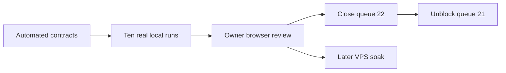

# TOBI Coding Agent V2 Completion Acceptance - 2026-07-22

> Queue: #22
> State: Implementation complete; local live-run and owner browser acceptance pending.
> Dependency: #21 remains blocked until every local gate below passes.

## Acceptance Graph

## Automated Evidence

| Gate | Result | Evidence |
|---|---|---|
| Python compilation | Pass | Completion runtime, persistence, tools, workers, loop, and API modules compile under Python 3.11. |
| Focused backend suite | Pass | 14 tests passed across completion, production, V2, tools, Process, Queue, and recovery coverage. |
| Dashboard type/build gate | Pass | `npm run build` completed; TypeScript and Vite production build succeeded. |
| Patch hygiene | Pass | `git diff --check` completed without whitespace errors. |
| Goal execution removal | Pass | Tests verify Goals do not create synthetic tasks or coding sprints. |
| Strict readiness | Pass | Tests verify disabled or unhealthy agents are blocked before session creation and alternatives are returned. |
| Same-run retry | Pass | Tests verify stale recovery keeps the workflow identity and records a restart event. |
| Evidence qualification | Pass | Tests verify Goal qualification is derived from linked criterion evidence. |
| Queue conflict protection | Pass | Tests verify canonical queue insertion and hash-conflict rejection. |

## Ten-Run Local Matrix

Record the workflow ID, Queue item, agent, evidence, result, and defect link for every run. A run is not a pass when it requires direct database repair or an undocumented manual workaround.

| # | Scenario | State | Required proof |
|---:|---|---|---|
| 1 | MC Native happy path | Pending | Ready Queue item reaches verified completion with criterion evidence and scorecard. |
| 2 | Codex happy path | Pending | Authorized Codex session completes on one durable run and draft delivery is owner-gated. |
| 3 | OpenCode happy path | Pending | Authorized OpenCode session completes with selected provider/model shown consistently. |
| 4 | Protected-path approval | Pending | Preflight blocks Start, approval is explicit, and the approved scope is audited. |
| 5 | Invalid agent preflight | Pending | Disabled or unauthorized agent creates no run and healthy alternatives are offered. |
| 6 | Fallback agent switch | Pending | Mid-run failure pauses; owner switches agent at the same checkpoint without duplicate effects. |
| 7 | Backend restart resume | Pending | Restart reconciles Git, process, checkpoint, and side effects and safely resumes the same run. |
| 8 | Hung worker recovery | Pending | Heartbeat/no-output thresholds produce a structured recovery state and preserve evidence. |
| 9 | Main drift or conflict | Pending | Repository drift produces a safe owner action; no branch or Queue content is silently overwritten. |
| 10 | Auto classification | Pending | Item blocker permits independent eligible work; system failure stops Auto. |

## Owner Browser Acceptance

- Overview has a true idle launchpad and never substitutes a historical workflow for an active run.
- Work presents Goals as outcomes/evidence and Queue items as executable work with one clear create/edit path.
- Preflight explains blockers and healthy agent alternatives before creating a run.
- Process prioritizes raw output, verified gates, pinned approval/recovery actions, copy log, and one foreground run.
- Agents clearly show priority, enabled state, health, authorization, tool, provider/model, last success, and configuration.
- History can replay logs, checkpoints, diffs, evidence, scorecard, and outcome without mutating the run.
- System contains Storage, Learning, and Version with advanced details behind progressive disclosure.
- Idle, active, approval, failed, recovery, completed, and history states remain understandable without reading raw payloads.

## Closure Rule

1. Complete and record all ten real local runs.
2. Complete the owner browser checklist.
3. Fix every blocker or document a consciously accepted non-blocking limitation.
4. Change #22 to Done and change #21 from Blocked to Queued.
5. Keep the 24-hour and 72-hour VPS soak as deployment gates before calling the continuous loop production-proven.

## Rollback

- Disable the Coding Agent V2 completion feature flag and retain additive Goal links, readiness snapshots, attempts, evidence, scorecards, and historical runs.
- Continue serving legacy workflow routes through compatibility adapters.
- Do not delete historical synthetic Goal tasks; keep them hidden from active Work.

## Run Log

### Run 1 — MC Native happy path — 2026-07-25 — BLOCKED (not attempted, no run created)

No workflow was created, so there is no workflow ID to record. The run was stopped by
preflight, which is the correct behavior: this is live confirmation of the "Strict
readiness" automated gate, not a defect in it. Nothing was mutated to work around the
blockers — the Closure Rule states a run is not a pass when it needs direct database
repair or an undocumented manual workaround, and that applies equally to manufacturing
the preconditions.

Authoritative preflight output (`completion.preflight(queue_id, active_probe=False)`
against the live DB):

| Queue item | Resolved agent | Ready | Blockers |
|---|---|---|---|
| #24 `testing` | `codex-chatgpt` (default fallback) | **False** | `reviewer_unavailable` |
| #22 (self) | `mc-native` | **False** | `reviewer_unavailable`, `agent_disabled`, `scope_too_large`, `protected_scope_approval` |

**Root blocker — `reviewer-default` is disabled.** `coding_completion.py` treats a
reviewer as unavailable when the profile is missing, `enabled` is falsy, or its adapter
is not `model_review`. This profile has `adapter=model_review` and `health=ready`; only
`enabled` is 0. **Every one of the ten scenarios requires an independent reviewer, so no
run can reach verified completion until this flag is on.**

Profile state, ordered by `updated_at`:

| Slug | enabled | health | updated_at |
|---|---:|---|---|
| `reviewer-default` | 0 | ready | 2026-07-18T18:15:21Z |
| `opencode-glm` | 0 | ready | 2026-07-18T18:15:22Z |
| `mc-native` | 0 | needs_auth | 2026-07-18T18:15:24Z |
| `codex-chatgpt` | 1 | ready | (live probe) |
| `hermes-legacy` | 1 | disabled | (live probe) |

Three profiles were disabled inside a **3-second window on 2026-07-18**, which reads as
programmatic rather than hand-edited. That is **four days before this acceptance matrix
was written**, so the ten runs have been unrunnable since before the matrix existed —
which explains 0/10 recorded runs against a system that has otherwise been exercised
(7 coding sessions, 22 worker sessions, 24 checkpoints, 555 development events).
**Worth diagnosing before re-enabling**: if a health-probe or policy path disabled them,
flipping the flags by hand will regress.

Additional blockers for run 1 specifically:

1. **Vault locked.** `/api/vault/status` reports `unlocked: false`; every
   `/api/developer/*` route returns `401 "Unlock the Mission Control vault to use
   Developer."` Requires the owner's master password in the browser.
2. **`mc-native` is disabled and `needs_auth`** — "codex is installed but its native
   login is not authorized." Run 1 is by definition the MC Native path, so the fallback
   to `codex-chatgpt` does not satisfy it; that is run 2.
3. **No Ready-scoped Queue item.** Statuses are 18 completed / 8 planned / 2 approved,
   with no Ready item. #24 is the only small candidate; the system judges #22 itself
   `scope_too_large` for one continuous session.

**Owner unblock sequence** (each step is owner-only — credentials or live config):

1. Unlock the Mission Control vault.
2. Diagnose *why* the three profiles were disabled on 2026-07-18, then enable
   `reviewer-default`. This alone unblocks all ten scenarios.
3. Authorize the codex native login and enable `mc-native` (run 1 needs it; `codex-chatgpt`
   is already enabled and ready, which is run 2's agent).
4. Provide or scope a Ready Queue item small enough for one continuous session.

After steps 1–4 the run can be re-attempted with no code change.

#### Run 1 — blockers resolved 2026-07-26, armed and awaiting Start

Owner unlocked the vault and authorized the Codex CLI. `mc-native` re-probed from
`needs_auth` to **`health=ready`** ("Executable and configured authentication source are
available"), so the authorization reached it — no further auth work needed.

**The "Coding worker must reference an available reviewer profile" toast was correct
behavior, not a defect.** `api/developer.py:569` applies that guard only when
`adapter != "model_review"`, so it never blocks the reviewer itself — it fired because a
*coding worker* was saved while the reviewer was still off. It is an ordering
requirement: **the reviewer must be enabled first.**

Enabled in that order — `reviewer-default`, then `mc-native` — through the same three
guards and the same `store.upsert_worker_profile()` call `save_worker` uses, with only
`enabled` changed and every other field round-tripped. Not a column flip behind the
validation, which the Closure Rule would have invalidated.

**Root-cause finding on the 2026-07-18 disable:** `upsert_worker_profile` has exactly one
caller in the entire codebase — `api/developer.py:584`, the save endpoint. Every other
`disabled` reference is a read-side check that *raises*, never a write. There is no
auto-disable path, so the three profiles were switched off through the UI or a scripted
API call, and **re-enabling will hold** — nothing will silently revert it.

Preflight after the fix:

| Queue item | Agent | Ready | Blockers |
|---|---|---|---|
| #24 `testing` | `mc-native` | **True** | none |
| #24 `testing` | `codex-chatgpt` | **True** | none |
| #22 (self) | `mc-native` | False | `scope_too_large`, `protected_scope_approval` (correct — it is an epic) |

Run 1 is armed: item #24 pinned to `worker=mc-native`, `reviewer=reviewer-default`,
`owner_state=Ready`, readiness snapshot **id=8** (`status=ready`), validation commands
`compileall core api` / `tests/test_coding_agent.py` / `npm run build --prefix dashboard`.

**Start deliberately left to the MC UI.** `start_background()` runs the agent on a daemon
thread inside the *calling* process, so launching it from a short-lived script would kill
the run on exit, and a mid-run timeout would leave a half-finished workflow indistinguishable
from a hung worker — corrupting both this run and scenario 8's evidence. The long-lived
server must own the run, and pressing Start in the browser also produces the Owner Browser
Acceptance evidence this document requires.

Still disabled: `opencode-glm` (`health=ready`, `auth_mode=vault_env`,
`credential_env=ZAI_API_KEY`) — that is **scenario 3's** agent, not run 1's, and it is left
off pending an owner decision on the vault-backed credential.

### Coding run #8 — queue #24 — `codex-chatgpt` — 2026-07-26 — NOT A PASS (`no_changes`)

First real run ever executed. Started from the MC UI, which ran its own preflight
(readiness snapshot **10**) with its own selected agent — that superseded the `mc-native`
pin on snapshot 8, so this run is **scenario 2 (Codex happy path)** evidence, not
scenario 1.

| | |
|---|---|
| Workflow / run ID | **8** |
| Queue item | #24 `testing` (`docs/feature-idea-queue/TESTING_PLAN.md`) |
| Agent / reviewer | `codex-chatgpt` / `reviewer-default` |
| Branch / worktree | `v3.24.0/testing` · `.tobi/developer/worktrees/8-testing` |
| Duration | 06:35:24 → 06:42:41 (~7 min) |
| Outcome | `state=paused`, `error_code=no_changes`, progress 20% |
| Result | **FAIL** — did not reach verified completion |

**Why it is not a pass.** Scenario 2 requires the session to complete on one durable run
with owner-gated draft delivery. The worker session completed, but the workflow paused at
the `code` stage: `stage_completed {"stage":"code","result":{"changed_files":[],
"event_count":175}}` → `workflow_paused {"error_code":"no_changes"}`. No scorecard was
produced (`coding_run_scorecards` is still 0) and 8 of the 11 stages remain `pending`.

**Root cause is the input, not the runtime.** Queue #24's plan is a stub — its entire
objective is "testing developer feature" and its only criterion is "Must all process of
developer worked". There is nothing implementable in it, so the worker ran for seven
minutes, emitted 175 adapter events, and correctly changed zero files. `no_changes` is the
right verdict for that input. **The ten-run matrix needs a queue item with concrete,
implementable scope; #24 cannot produce a happy-path pass no matter which agent runs it.**

**What this run does prove** — substantial machinery validated end to end for the first
time:

- `prepare` → `index` → `code` stages all completed; branch and isolated worktree created.
- Codex adapter started, ran, and reported completion with an external session id.
- **`coding_evidence_records` went 0 → 3** and `coding_stage_attempts` 0 → 3. The evidence
  path works; it had never been exercised before today.
- Worker artifact retained (3.7 MB) via `artifact_retained`.
- **Two checkpoints** written, each carrying a `next_action`.
- Failure handling is clean and structured: paused with a specific `error_code` and an
  actionable owner message rather than crashing or hanging.
- **Repository safety confirmed**: `base_sha == head_sha == 36fa8a5`, `main` clean, the
  worktree clean. A failed run left no residue.
- The paused run correctly stopped blocking afterwards — #24 now preflights `ready=True`
  for both `mc-native` and `codex-chatgpt`, so no manual recovery was required.
- While it was running, a second Start attempt was correctly refused with `run_active`
  ("Coding run #8 is already active") — duplicate-run protection works.

**Next**: point a run at an item with real scope. A good candidate already exists in this
repo's own findings — the `test_news_v2_ranking` race (`after == before + 1` asserted
immediately after `run_job`, documented in REFACTORING_PLAN.md round 4). It is one file,
one subsystem, has a deterministic pass criterion, and fits the sprint budget
(`max_files=5`, `max_changed_lines=450`, `max_subsystems=1`).

### Coding run #9 — queue #25 — `codex-chatgpt` — 2026-07-26 — cancelled by owner at ~80%

| | |
|---|---|
| Run ID | **9** |
| Queue item | #25 Awakening external read requires verified test evidence |
| Branch / worktree | `v3.25.0/awakening-external-read-requires-verified-test-e` (retained) |
| Outcome | `state=canceled`, `error_code=owner_paused`, `completed_at` set |
| Work produced | `core/awakening.py` **+24 / −28**, compiles clean, still in the worktree |

Not a pass, but a large step up from run #8. The worker correctly located the defect in
`_connector_states`, found the right evidence model (`vault_secrets.test_status == "ok"`
plus a fresh `last_tested_at`), reused the existing `_connector_test_fresh` helper, kept
env/vault presence for the `partial` vs `setup_needed` distinction, handled GitHub's
app-credential trio alongside `GITHUB_TOKEN`, and rewrote the docstring that stated the
old rule. It was about to run `compileall` and both awakening suites when it was stopped.

**`coding_run_scorecards` moved off zero for the first time** — two rows now, sessions 8
and 9 — but both record `state: "canceled"`. A happy-path scorecard remains unproven.

## Defects found during acceptance

Recorded per the Closure Rule (fix, or consciously accept as non-blocking).

**D1 — a cancelled Queue item cannot be returned to the Queue.** Cancelling leaves the
task at `status=approved, owner_state=Canceled`, which the Work list hides. Both
`restore_task()` and `remove_task()` begin with `if task["status"] != "completed": raise`,
so neither accepts a cancelled item — the "push back to queue" action cannot reach it.
The item is not deleted and no data is lost, but it is unreachable from the UI. Owner
expectation: **cancel should return the item to the Queue; only an explicit delete should
remove it.** Worked around for #25 by re-running the agent-level preflight, which calls
`configure_task(..., owner_state="Ready")` — a supported path, but not a discoverable one.

**D2 — Pause is persisted as Cancel.** The owner pressed Pause. The run recorded
`cancel_requested=1`, wrote a scorecard with `state: "canceled"`, and set `completed_at`,
while the blocker text still read "Paused by owner. Resume when ready." A run that says it
is resumable but is persisted as terminal will block scenarios 6 and 7.

**D3 — the Process log renders every command twice.** Each command appears once for
`item.started` and again for `item.completed`, so a healthy run looks like it is looping on
the same three commands. Confirmed against `development_events`: `item_60`/`item_61` have
one `started` and one `completed` each — the commands execute once. Display only, but it
directly undermines the browser-acceptance requirement that run states be understandable
without reading raw payloads.

**D4 — the Agents page overwrites server state with stale local state.** Enabling a profile
outside an open Agents tab is silently reverted when that tab saves; there is no version or
conflict check. Evidence: `reviewer-default` had `last_probed_at=08:56:38` but
`updated_at=08:56:45`, and `set_worker_health()` only ever writes health columns — so a
second write hit `enabled`, and `upsert_worker_profile` (the save endpoint) is its only
caller. This is also the most likely explanation for the 2026-07-18 disable recorded above.

**D5 — agent health is stored globally but computed from the probing process's
environment.** `mc-native` uses `auth_mode=native_login`; the probe shells out to the codex
CLI, which resolves its login through `CODEX_HOME`. That variable is set in the owner's
shell but not in the MC server process, and `.env` does not define it, so the server reports
`needs_auth` while a CLI probe reports `ready`. Whichever probed last wins the stored value,
making the badge appear to flicker. Proven by probing the same profile twice in one process,
with and without the variable. Fix is environmental: give the server
`CODEX_HOME=<repo>/.codex-home` and restart.

**D6 — worker environment friction on Windows (non-blocking, costs run time).** Two issues
cost run #9 roughly four of its nine minutes: the bracketed repository path
(`[PERSONAL PROJECT FILES]`) prevented the worker's `workdir` from applying until it
switched every command to `Set-Location -LiteralPath`; and its file reads go through
PowerShell `Get-Content`, which defaults to the ANSI codepage, so the UTF-8 punctuation in
`core/awakening.py` comments arrived corrupted and its patch anchors repeatedly missed —
briefly leaving an unreachable placeholder in the file. The file itself is valid UTF-8 with
zero mojibake; the corruption is in the reader, not the repository.
