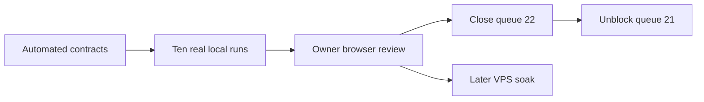

# TOBI Coding Agent V2 Completion Acceptance - 2026-07-22

> Queue: #22
> State: Implementation complete; local live-run and owner browser acceptance pending.
> Dependency: #21 remains blocked until every local gate below passes.

## Acceptance Graph

## Automated Evidence

| Gate | Result | Evidence |
|---|---|---|
| Python compilation | Pass | Completion runtime, persistence, tools, workers, loop, and API modules compile under Python 3.11. |
| Focused backend suite | Pass | 14 tests passed across completion, production, V2, tools, Process, Queue, and recovery coverage. |
| Dashboard type/build gate | Pass | `npm run build` completed; TypeScript and Vite production build succeeded. |
| Patch hygiene | Pass | `git diff --check` completed without whitespace errors. |
| Goal execution removal | Pass | Tests verify Goals do not create synthetic tasks or coding sprints. |
| Strict readiness | Pass | Tests verify disabled or unhealthy agents are blocked before session creation and alternatives are returned. |
| Same-run retry | Pass | Tests verify stale recovery keeps the workflow identity and records a restart event. |
| Evidence qualification | Pass | Tests verify Goal qualification is derived from linked criterion evidence. |
| Queue conflict protection | Pass | Tests verify canonical queue insertion and hash-conflict rejection. |

## Ten-Run Local Matrix

Record the workflow ID, Queue item, agent, evidence, result, and defect link for every run. A run is not a pass when it requires direct database repair or an undocumented manual workaround.

| # | Scenario | State | Required proof |
|---:|---|---|---|
| 1 | MC Native happy path | Pending | Ready Queue item reaches verified completion with criterion evidence and scorecard. |
| 2 | Codex happy path | Pending | Authorized Codex session completes on one durable run and draft delivery is owner-gated. |
| 3 | OpenCode happy path | Pending | Authorized OpenCode session completes with selected provider/model shown consistently. |
| 4 | Protected-path approval | Pending | Preflight blocks Start, approval is explicit, and the approved scope is audited. |
| 5 | Invalid agent preflight | Pending | Disabled or unauthorized agent creates no run and healthy alternatives are offered. |
| 6 | Fallback agent switch | Pending | Mid-run failure pauses; owner switches agent at the same checkpoint without duplicate effects. |
| 7 | Backend restart resume | Pending | Restart reconciles Git, process, checkpoint, and side effects and safely resumes the same run. |
| 8 | Hung worker recovery | Pending | Heartbeat/no-output thresholds produce a structured recovery state and preserve evidence. |
| 9 | Main drift or conflict | Pending | Repository drift produces a safe owner action; no branch or Queue content is silently overwritten. |
| 10 | Auto classification | Pending | Item blocker permits independent eligible work; system failure stops Auto. |

## Owner Browser Acceptance

- Overview has a true idle launchpad and never substitutes a historical workflow for an active run.
- Work presents Goals as outcomes/evidence and Queue items as executable work with one clear create/edit path.
- Preflight explains blockers and healthy agent alternatives before creating a run.
- Process prioritizes raw output, verified gates, pinned approval/recovery actions, copy log, and one foreground run.
- Agents clearly show priority, enabled state, health, authorization, tool, provider/model, last success, and configuration.
- History can replay logs, checkpoints, diffs, evidence, scorecard, and outcome without mutating the run.
- System contains Storage, Learning, and Version with advanced details behind progressive disclosure.
- Idle, active, approval, failed, recovery, completed, and history states remain understandable without reading raw payloads.

## Closure Rule

1. Complete and record all ten real local runs.
2. Complete the owner browser checklist.
3. Fix every blocker or document a consciously accepted non-blocking limitation.
4. Change #22 to Done and change #21 from Blocked to Queued.
5. Keep the 24-hour and 72-hour VPS soak as deployment gates before calling the continuous loop production-proven.

## Rollback

- Disable the Coding Agent V2 completion feature flag and retain additive Goal links, readiness snapshots, attempts, evidence, scorecards, and historical runs.
- Continue serving legacy workflow routes through compatibility adapters.
- Do not delete historical synthetic Goal tasks; keep them hidden from active Work.
