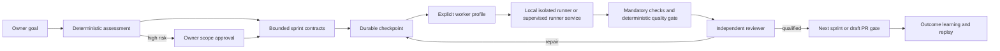
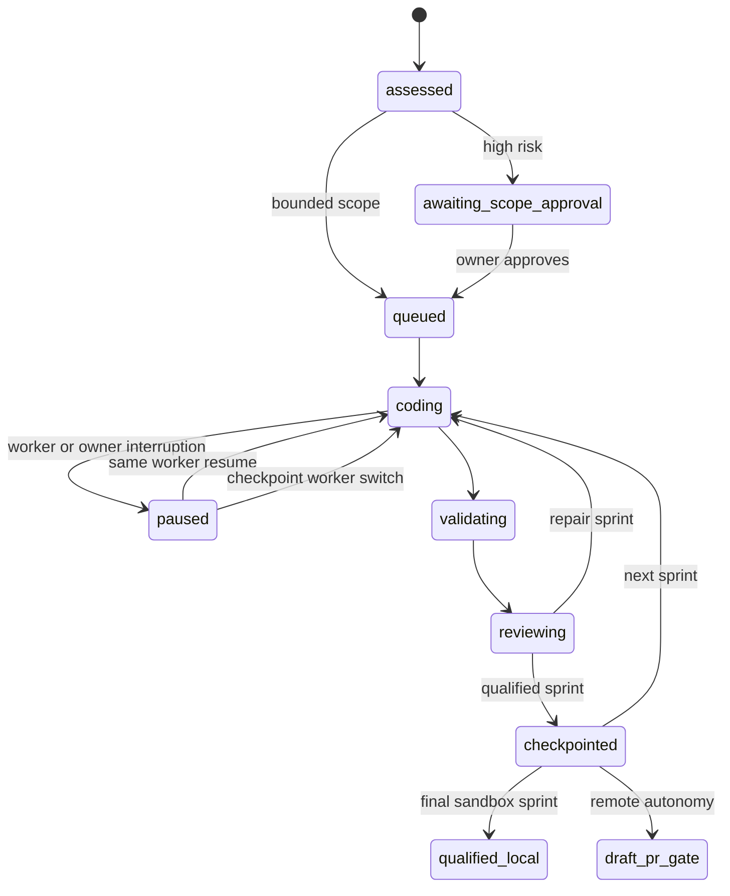

# TOBI Coding Agent V2 - Checkpointed Multi-Worker Runtime

> Status: Development gate closed on 2026-07-17. Live local Codex/OpenCode, supervised runner, restart/resume, worker switching, and runner-loss recovery are accepted. The 24h/72h VPS soak remains a deployment gate and does not block queue #20 development.
> Extends: [TOBI_CODING_AGENT_SELF_DEVELOPMENT_PLAN.md](TOBI_CODING_AGENT_SELF_DEVELOPMENT_PLAN.md)
> Queue: #22

## 1. Outcome

Upgrade the v1 continuous coding loop into a model-independent MC control plane. Stronger models may improve speed, but deterministic infrastructure must preserve scope, safety, evidence, recovery, and result quality for local or lower-cost workers.



## 2. Delivered Architecture

| Node | Responsibility | Main implementation |
|---|---|---|
| V2-A | Typed contracts for profiles, assessments, sprints, budgets, and handoffs | `core/coding_contracts.py` |
| V2-B | Risk and capability assessment with bounded sprint decomposition | `core/coding_assessment.py` |
| V2-C | Explicit native, Codex, OpenCode, legacy Hermes, and reviewer profiles | `core/coding_workers.py` |
| V2-D | Portable checkpoints and external worker session resume | `core/coding_agent.py`, `core/development_store.py` |
| V2-E | Local process isolation plus durable supervised job queue | `core/coding_runner.py`, `core/coding_runner_service.py` |
| V2-F | Deterministic file, line, subsystem, check, path, and secret gates | `core/coding_quality.py` |
| V2-G | Evidence-backed outcomes, playbook candidates, and replay promotion | `core/coding_learning.py` |
| V2-H | Owner APIs and Developer Goals, Coding Loop, Workers, and Learning UI | `api/developer.py`, `dashboard/src/pages/Developer.tsx` |
| V2-I | VPS systemd process boundary and deployment restart integration | `scripts/systemd/`, `deploy.sh`, `setup-vps.sh` |

## 3. Worker Contract

| Profile | Adapter | Authentication | Resume behavior | Authority |
|---|---|---|---|---|
| `mc-native` | MC typed model worker | Models configuration | Latest MC checkpoint | Typed broker tools only |
| `codex-chatgpt` | `codex exec` | Native Codex login | `codex exec resume <session>` | Current isolated worktree |
| `opencode-glm` | `opencode run` | Vault env reference | `--session <id>` | Current isolated worktree |
| `hermes-legacy` | Hermes CLI | Existing configuration | Legacy behavior | Disabled by default |
| `reviewer-default` | Model review route | Models configuration | Stateless evidence review | Read/review only |

Rules:

- One coding worker is selected explicitly per sprint.
- Worker switching is allowed only at a paused durable checkpoint.
- The worker never receives Vault inventory. A `vault_env` profile receives only its selected environment value.
- Service-mode credential handoff is AES-GCM encrypted in SQLite using a separate D-side runner envelope key.
- No adapter may push, merge, deploy, change credentials, or edit outside the isolated worktree.
- Codex starts with `workspace-write`; OpenCode relies on the same supervised OS/container boundary and reviewed repository policy.

## 4. Durable Runtime



Persisted additions:

- worker profiles and health;
- worker sessions and native session IDs;
- checkpoints with changed files, SHA, checks, receipts, sprint, and next action;
- assessments and bounded development sprints;
- runner jobs, runner events, and runner node heartbeats;
- learning outcomes and versioned playbooks.

Restart behavior:

- MC reconstructs work from SQLite, Git SHA, worktree, and the latest checkpoint;
- external sessions resume only when the same profile remains selected;
- expired runner jobs fail closed as `runner_lost` and do not auto-repeat side effects;
- a replacement worker receives a portable handoff, not hidden model reasoning.

## 5. Quality And Learning

| Gate | Deterministic evidence |
|---|---|
| Scope | assessed risk, protected paths, relevant files, sprint criteria |
| Change budget | maximum files, changed lines, subsystems, minutes, worker steps |
| Validation | mandatory command receipts with pass/fail state |
| Security | path policy, secret scan, scrubbed environment, bounded output |
| Review | independent reviewer profile after deterministic gates pass |
| Recovery | exact checkpoint, failed stage, error code, next action |
| Learning | outcome signature plus evidence; candidate after repeated evidence |
| Promotion | only prompt/routing/repair playbooks; at least 3 replay cases and 90% pass |

Learning cannot modify policy, permissions, deployment gates, protected paths, or credentials.

## 6. Owner API And UI

Added API surfaces:

- `POST /api/developer/goals/assess`
- worker/reviewer selection on goal creation;
- `approve_scope` goal command;
- `POST /api/developer/workflows/{id}/switch-worker`
- `GET /api/developer/workflows/{id}/checkpoints`
- `GET|PUT|POST /api/developer/workers...`
- `GET /api/developer/learning`
- `POST /api/developer/learning/replay`

Developer UI:

- Goals: assessment, risk, bounded sprints, budgets, worker, reviewer, scope approval;
- Coding Loop: active profile/session/sprint, checkpoint-safe switch, expandable checkpoints;
- Workers: profile editor, model/auth reference, health probe, login instructions, runner boundary;
- Learning: outcomes, candidate/active playbooks, replay evaluation.

## 7. Production Runner

Production mode:

```text
TOBI_CODING_RUNNER_MODE=service
python -m core.coding_runner_service
```

The supplied systemd unit:

- runs separately from FastAPI;
- restarts automatically;
- kills the entire worker control group on stop;
- writes only to `.tobi`, runner auth/config locations, and private temp space;
- reports runner and executable health to MC;
- streams bounded persisted worker events back to the Coding Loop UI.

Install:

```bash
bash scripts/install_coding_runner_service.sh /path/to/tobi
```

## 8. Task DAG And Status

| ID | Task | Depends on | Status | Acceptance |
|---|---|---|---|---|
| T01 | Typed contracts and migration v3/v4 | v1 | Done | Additive schema; old sessions readable |
| T02 | Task assessment and sprint decomposition | T01 | Done | High-risk owner gate; bounded budgets |
| T03 | Explicit worker/reviewer profiles | T01 | Done | Profile validation and MC management |
| T04 | Codex/OpenCode adapters and resume | T03 | Done | Installed CLI contracts verified |
| T05 | Portable checkpoints and switching | T01,T03 | Done | Same run/worktree; switch only at checkpoint |
| T06 | Local isolation and output bounds | T04 | Done | Array argv, scrubbed env, deadline, cancel, output cap |
| T07 | Durable supervised runner service | T05,T06 | Done | Queue, lease, heartbeat, live events, restart failure state |
| T08 | Encrypted Vault credential envelope | T07 | Done | No plaintext profile credential in runner job |
| T09 | Deterministic quality gates | T02,T05 | Done | Budget, checks, path, and secret enforcement |
| T10 | Learning/replay system | T09 | Done | Evidence threshold and safe promotion |
| T11 | API and Developer UI | T02-T10 | Done | Owner-controlled profiles, trace, switch, learning |
| T12 | Local provider/service acceptance | T01-T11 | Done | Live Codex and OpenCode/GLM, restart/resume, checkpoint switch, forced runner loss, safe recovery |
| T13 | VPS deployment soak | T12 | Deployment gate | 24h/72h target-host evidence; not a source-development dependency |

## 9. Verification

Local automated evidence:

- `tests/test_coding_agent_v2.py`: 46/46;
- `tests/test_coding_agent.py`: 41/41;
- `tests/test_coding_agent_production.py`: 14/14;
- `tests/test_developer_recovery.py`: pass;
- touched Python modules compile: pass;
- `git diff --check`: pass;
- installed Codex and OpenCode help contracts: verified;
- supervised Codex sprint: pass;
- Codex session resume after runner restart: pass;
- checkpoint switch to OpenCode with `zai-coding-plan/glm-5.2`: pass;
- bounded repository scope: pass;
- forced runner loss and fail-closed reconciliation: pass;
- safe recovery after runner loss: pass;
- durable runner jobs and encrypted credential handoff: pass.

Not claimed as completed:

- 24-hour and 72-hour VPS soak;
- forced runner crash/restart on the target VPS;
- live GitHub mutation, merge, deployment, Supabase, or Vercel action.

Detailed evidence: [TOBI_CODING_AGENT_V2_ACCEPTANCE_2026-07-17.md](TOBI_CODING_AGENT_V2_ACCEPTANCE_2026-07-17.md).

## 10. VPS Acceptance Matrix

1. Install the systemd runner and set `TOBI_CODING_RUNNER_MODE=service`.
2. In Developer > Workers, confirm the supervised boundary and healthy heartbeat.
3. Authenticate Codex as the service user; run one harmless two-sprint sandbox goal.
4. Configure `ZAI_API_KEY` through MC Vault; run the same goal through OpenCode + GLM.
5. Pause, restart MC, resume, switch worker at a checkpoint, and verify no duplicate change.
6. Kill the runner during a sprint; verify `runner_lost`, retained worktree, and safe resume.
7. Inject failed checks, malformed output, timeout, cancellation, and oversized output.
8. Run at least five sandbox goals for 24 hours, then a 72-hour continuous soak.
9. Keep GitHub, merge, and deploy capabilities false until separately owner-approved.

## 11. Rollback

- Set `TOBI_CODING_RUNNER_MODE=local` to bypass the service queue.
- Disable Codex/OpenCode profiles; `mc-native` remains available.
- Stop/disable `tobi-coding-runner.service`; queued jobs fail closed after startup timeout.
- Schema changes are additive; existing v1 goals, sessions, events, releases, and worktrees remain readable.
- Do not delete checkpoint, runner, learning, or sprint tables during rollback.

## 12. Parallel Work Warning

Queue #20 may continue after integrating the #22 closure commit. The remaining VPS soak should run against a deployed acceptance environment and must not mutate the same checkout used by an active #20 coding session. Queue #21 remains sequenced after #20.

## 13. Completion Pass - 2026-07-22

The July 22 completion pass reopens #22 because the earlier V1 acceptance proved isolated adapters and runner recovery, but did not prove the owner's canonical Goal-to-Queue workflow.

Implemented:

- Goals store outcomes, criteria, qualification, evidence, gaps, and Queue links; they no longer execute or create synthetic `900000000+` work.
- Queue items are the only executable source and use strict persisted readiness checks before run creation.
- Workflow retries retain the same run, worktree, logs, checkpoint, completed effects, and stage identity while incrementing attempts.
- Stage attempts, heartbeats, evidence records, scorecards, and terminal outcomes are persisted additively.
- A guarded worktree shell extends the typed worker tools without allowing shell wrappers or host-global package changes.
- Developer now exposes Overview, Work, Process, Agents, History, and System around one canonical work/run API.
- Queue authoring uses locked, hash-checked file updates and rejects stale external edits with `409 Conflict`.

Automated gate:

- focused Coding Agent and Developer suites: pass;
- Python compilation: pass;
- dashboard TypeScript and production build: pass;
- `git diff --check`: pass.

Closure gate:

- #22 remains In Progress until all ten live runs and owner browser acceptance in [TOBI_CODING_AGENT_V2_COMPLETION_ACCEPTANCE_2026-07-22.md](TOBI_CODING_AGENT_V2_COMPLETION_ACCEPTANCE_2026-07-22.md) pass.
- #21 remains blocked until that gate closes.
- The 24-hour and 72-hour VPS soaks remain deployment gates and do not block #21 after local closure.
